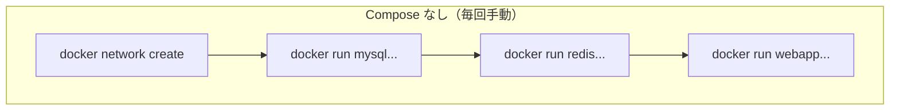
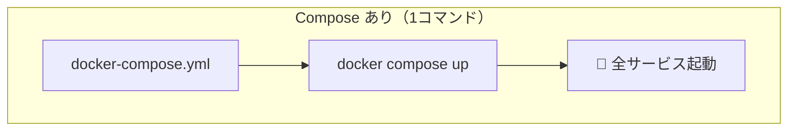

# Phase 5-1: Docker Compose 入門 ～ 複数コンテナを一括管理 ～

## 学習目標

この単元を終えると、以下ができるようになります：

- `docker-compose.yml` の基本構文を理解できる
- 複数のコンテナを1つのコマンドで起動・停止できる
- サービス間の依存関係を定義できる
- 環境変数を適切に管理できる

## 概念解説

### Docker Compose とは？





**Docker Compose** = 複数コンテナをまとめて定義・管理するツール

### AWS で例えると...

| Docker Compose | AWS | 説明 |
|----------------|-----|------|
| docker-compose.yml | CloudFormation テンプレート | 構成を宣言的に定義 |
| サービス | ECS Task Definition | コンテナの設定 |
| `docker compose up` | スタック作成 | 一括デプロイ |
| `docker compose down` | スタック削除 | 一括削除 |

### docker-compose.yml の構造

```yaml
version: '3.8'  # Compose ファイルのバージョン

services:       # コンテナの定義
  web:          # サービス名（自由につけられる）
    image: nginx
    ports:
      - "8080:80"
    
  db:           # 別のサービス
    image: mysql
    environment:
      MYSQL_ROOT_PASSWORD: secret

volumes:        # ボリューム定義（オプション）
  db-data:

networks:       # ネットワーク定義（オプション）
  app-network:
```

## 基本コマンド

```bash
docker compose up         # 起動（フォアグラウンド）
docker compose up -d      # 起動（バックグラウンド）
docker compose down       # 停止＆削除
docker compose ps         # 状態確認
docker compose logs       # ログ表示
docker compose logs -f    # ログをリアルタイム追従
docker compose exec サービス名 コマンド  # サービス内でコマンド実行
docker compose build      # イメージをビルド
docker compose pull       # イメージを取得
```

## ハンズオン

### 演習1: 最初の docker-compose.yml

```bash
mkdir -p ~/docker-practice/compose-intro
cd ~/docker-practice/compose-intro

# docker-compose.yml を作成
cat << 'EOF' > docker-compose.yml
version: '3.8'

services:
  web:
    image: nginx
    ports:
      - "8080:80"
EOF

# 起動
docker compose up -d

# 確認
docker compose ps

# アクセス
curl http://localhost:8080

# ログ確認
docker compose logs

# 停止＆削除
docker compose down
```

### 演習2: 複数サービスの構成

```bash
mkdir -p ~/docker-practice/multi-service
cd ~/docker-practice/multi-service

cat << 'EOF' > docker-compose.yml
version: '3.8'

services:
  web:
    image: nginx
    ports:
      - "8080:80"
    depends_on:
      - api
      - cache
  
  api:
    image: python:3.11-slim
    command: python -m http.server 8000
    ports:
      - "8000:8000"
  
  cache:
    image: redis:alpine
    ports:
      - "6379:6379"
EOF

# 起動
docker compose up -d

# 全サービスの状態確認
docker compose ps

# 各サービスにアクセス
curl http://localhost:8080
curl http://localhost:8000
docker exec -it multi-service-cache-1 redis-cli PING
# PONG

# ログを見る
docker compose logs

# 特定サービスのログ
docker compose logs api

# 停止
docker compose down
```

### 演習3: 環境変数の管理

```bash
mkdir -p ~/docker-practice/env-demo
cd ~/docker-practice/env-demo

# .env ファイル（自動で読み込まれる）
cat << 'EOF' > .env
MYSQL_ROOT_PASSWORD=supersecret
MYSQL_DATABASE=myapp
MYSQL_PORT=3306
EOF

cat << 'EOF' > docker-compose.yml
version: '3.8'

services:
  db:
    image: mysql:8
    environment:
      MYSQL_ROOT_PASSWORD: ${MYSQL_ROOT_PASSWORD}
      MYSQL_DATABASE: ${MYSQL_DATABASE}
    ports:
      - "${MYSQL_PORT}:3306"
    
  adminer:
    image: adminer
    ports:
      - "8080:8080"
    depends_on:
      - db
EOF

# 起動
docker compose up -d

# 設定が反映されているか確認
docker compose exec db env | grep MYSQL

# .env ファイルのおかげで docker-compose.yml に直接パスワードを書かなくて済む

# 停止
docker compose down -v  # -v で Volume も削除
```

### 演習4: カスタムビルド

```bash
mkdir -p ~/docker-practice/compose-build
cd ~/docker-practice/compose-build

# アプリケーション
cat << 'EOF' > app.py
from flask import Flask
import os

app = Flask(__name__)

@app.route('/')
def hello():
    return f"Hello from {os.getenv('APP_NAME', 'Flask')}!"

if __name__ == '__main__':
    app.run(host='0.0.0.0', port=5000)
EOF

cat << 'EOF' > requirements.txt
flask==3.0.0
EOF

cat << 'EOF' > Dockerfile
FROM python:3.11-slim
WORKDIR /app
COPY requirements.txt .
RUN pip install --no-cache-dir -r requirements.txt
COPY app.py .
CMD ["python", "app.py"]
EOF

cat << 'EOF' > docker-compose.yml
version: '3.8'

services:
  web:
    build: .                    # カレントディレクトリの Dockerfile を使用
    ports:
      - "5000:5000"
    environment:
      APP_NAME: "Docker Compose App"
    volumes:
      - .:/app                  # 開発用にソースをマウント
EOF

# ビルド＆起動
docker compose up -d --build

# 確認
curl http://localhost:5000
# Hello from Docker Compose App!

# コードを変更してみる
# Flask の debug モードではないので再起動が必要
docker compose restart web

# 停止
docker compose down
```

### 演習5: Web + DB の本格構成

```bash
mkdir -p ~/docker-practice/webapp-compose
cd ~/docker-practice/webapp-compose

# Python アプリ
cat << 'EOF' > app.py
from flask import Flask, jsonify
import mysql.connector
import os
import time

app = Flask(__name__)

def get_db_connection():
    for i in range(30):  # リトライ
        try:
            return mysql.connector.connect(
                host=os.getenv('DB_HOST', 'db'),
                user=os.getenv('DB_USER', 'root'),
                password=os.getenv('DB_PASSWORD', 'secret'),
                database=os.getenv('DB_NAME', 'myapp')
            )
        except mysql.connector.Error:
            print(f"Waiting for database... ({i+1}/30)")
            time.sleep(2)
    raise Exception("Database connection failed")

@app.route('/')
def index():
    return "Welcome! Try /users"

@app.route('/users')
def users():
    conn = get_db_connection()
    cursor = conn.cursor(dictionary=True)
    cursor.execute("SELECT * FROM users")
    users = cursor.fetchall()
    conn.close()
    return jsonify(users)

@app.route('/init')
def init():
    conn = get_db_connection()
    cursor = conn.cursor()
    cursor.execute("""
        CREATE TABLE IF NOT EXISTS users (
            id INT AUTO_INCREMENT PRIMARY KEY,
            name VARCHAR(100),
            email VARCHAR(100)
        )
    """)
    cursor.execute("DELETE FROM users")
    cursor.execute("INSERT INTO users (name, email) VALUES ('Alice', 'alice@example.com')")
    cursor.execute("INSERT INTO users (name, email) VALUES ('Bob', 'bob@example.com')")
    conn.commit()
    conn.close()
    return "Database initialized!"

if __name__ == '__main__':
    app.run(host='0.0.0.0', port=5000, debug=True)
EOF

cat << 'EOF' > requirements.txt
flask==3.0.0
mysql-connector-python==8.2.0
EOF

cat << 'EOF' > Dockerfile
FROM python:3.11-slim
WORKDIR /app
COPY requirements.txt .
RUN pip install --no-cache-dir -r requirements.txt
COPY app.py .
EXPOSE 5000
CMD ["python", "app.py"]
EOF

cat << 'EOF' > docker-compose.yml
version: '3.8'

services:
  web:
    build: .
    ports:
      - "5000:5000"
    environment:
      DB_HOST: db
      DB_USER: root
      DB_PASSWORD: secret
      DB_NAME: myapp
    depends_on:
      - db
    restart: unless-stopped

  db:
    image: mysql:8
    environment:
      MYSQL_ROOT_PASSWORD: secret
      MYSQL_DATABASE: myapp
    volumes:
      - db-data:/var/lib/mysql
    restart: unless-stopped

volumes:
  db-data:
EOF

# 起動
docker compose up -d

# ログを確認（DB の起動を待つ）
docker compose logs -f web

# 別ターミナルで初期化
curl http://localhost:5000/init
# Database initialized!

# ユーザー取得
curl http://localhost:5000/users
# [{"email":"alice@example.com","id":1,"name":"Alice"},{"email":"bob@example.com","id":2,"name":"Bob"}]

# 停止（データは Volume に保存）
docker compose down

# 再起動（データは残っている）
docker compose up -d
curl http://localhost:5000/users
# データが残っている！

# 完全削除（Volume も）
docker compose down -v
```

### 演習6: 開発用と本番用の設定分離

```bash
mkdir -p ~/docker-practice/multi-env
cd ~/docker-practice/multi-env

# ベース設定
cat << 'EOF' > docker-compose.yml
version: '3.8'

services:
  web:
    image: nginx
    
  db:
    image: mysql:8
    environment:
      MYSQL_ROOT_PASSWORD: ${MYSQL_PASSWORD:-default}
EOF

# 開発用オーバーライド
cat << 'EOF' > docker-compose.override.yml
version: '3.8'

services:
  web:
    ports:
      - "8080:80"
    volumes:
      - ./html:/usr/share/nginx/html

  db:
    ports:
      - "3306:3306"
EOF

# 本番用オーバーライド
cat << 'EOF' > docker-compose.prod.yml
version: '3.8'

services:
  web:
    ports:
      - "80:80"
    # Volume なし（イメージに含める）

  db:
    # ポートを外部公開しない（セキュリティ）
    volumes:
      - db-data:/var/lib/mysql

volumes:
  db-data:
EOF

# テスト用 HTML
mkdir -p html
echo "<h1>Development Mode</h1>" > html/index.html

# 開発モード（docker-compose.override.yml が自動適用）
docker compose up -d
curl http://localhost:8080
# Development Mode

docker compose down

# 本番モード
docker compose -f docker-compose.yml -f docker-compose.prod.yml up -d
docker compose ps
# ポート 80 で起動

docker compose -f docker-compose.yml -f docker-compose.prod.yml down
```

## 現場でよくある落とし穴

### 1. depends_on は起動順序だけ

```yaml
# ❌ depends_on は「起動順序」だけで「準備完了」は待たない
services:
  web:
    depends_on:
      - db  # db コンテナが起動しただけ（MySQL が Ready とは限らない）
  db:
    image: mysql

# ✅ アプリ側でリトライするか、healthcheck を使う
services:
  web:
    depends_on:
      db:
        condition: service_healthy
  db:
    image: mysql
    healthcheck:
      test: ["CMD", "mysqladmin", "ping", "-h", "localhost"]
      interval: 10s
      timeout: 5s
      retries: 5
```

### 2. コンテナ名の命名規則

```bash
# プロジェクト名がプレフィックスになる
cd myproject
docker compose up
# myproject-web-1, myproject-db-1 というコンテナ名

# コンテナ名を固定したい場合
services:
  db:
    container_name: my-mysql  # 明示的に指定
```

### 3. Volume のデータが消えない

```bash
# down だけでは Volume は消えない
docker compose down

# Volume も消す
docker compose down -v

# イメージも消す
docker compose down --rmi all
```

## 理解度確認

### 問題

Docker Compose で `depends_on` を使用した場合の動作として、正しいものはどれか。

```yaml
services:
  web:
    image: myapp
    depends_on:
      - db
  db:
    image: mysql
```

**A.** web サービスは db サービスが完全に起動するまで待機する

**B.** web サービスは db サービスのコンテナが起動した後に起動する

**C.** web サービスと db サービスが同時に起動する

**D.** db サービスは web サービスの後に起動する

---

### 解答・解説

**正解: B**

- **A.** 誤り。`depends_on` は起動**順序**を制御するだけで、MySQL が完全に準備できるまで待つわけではありません。
- **B.** 正解。`depends_on` は db コンテナが起動した後に web コンテナを起動するという順序を保証します。
- **C.** 誤り。同時起動ではなく、順序が制御されます。
- **D.** 誤り。`depends_on` の定義により、db が先に起動します。

**実務での対策**: アプリケーション側で接続リトライを実装するか、`healthcheck` と `condition: service_healthy` を組み合わせて使用します。

---

## まとめ

| コマンド | 説明 |
|---------|------|
| `docker compose up -d` | バックグラウンドで起動 |
| `docker compose down` | 停止＆削除 |
| `docker compose down -v` | Volume も削除 |
| `docker compose ps` | 状態確認 |
| `docker compose logs -f` | ログ追従 |
| `docker compose exec` | コンテナ内でコマンド実行 |
| `docker compose build` | イメージビルド |

## 次のステップ

Docker Compose の基本がわかりました！次はより複雑なマルチコンテナ構成を学びましょう。

**次の単元**: [Phase 5-2: マルチコンテナ構成 ～ 実践的なアプリケーション構築 ～](./02_マルチコンテナ構成.md)
