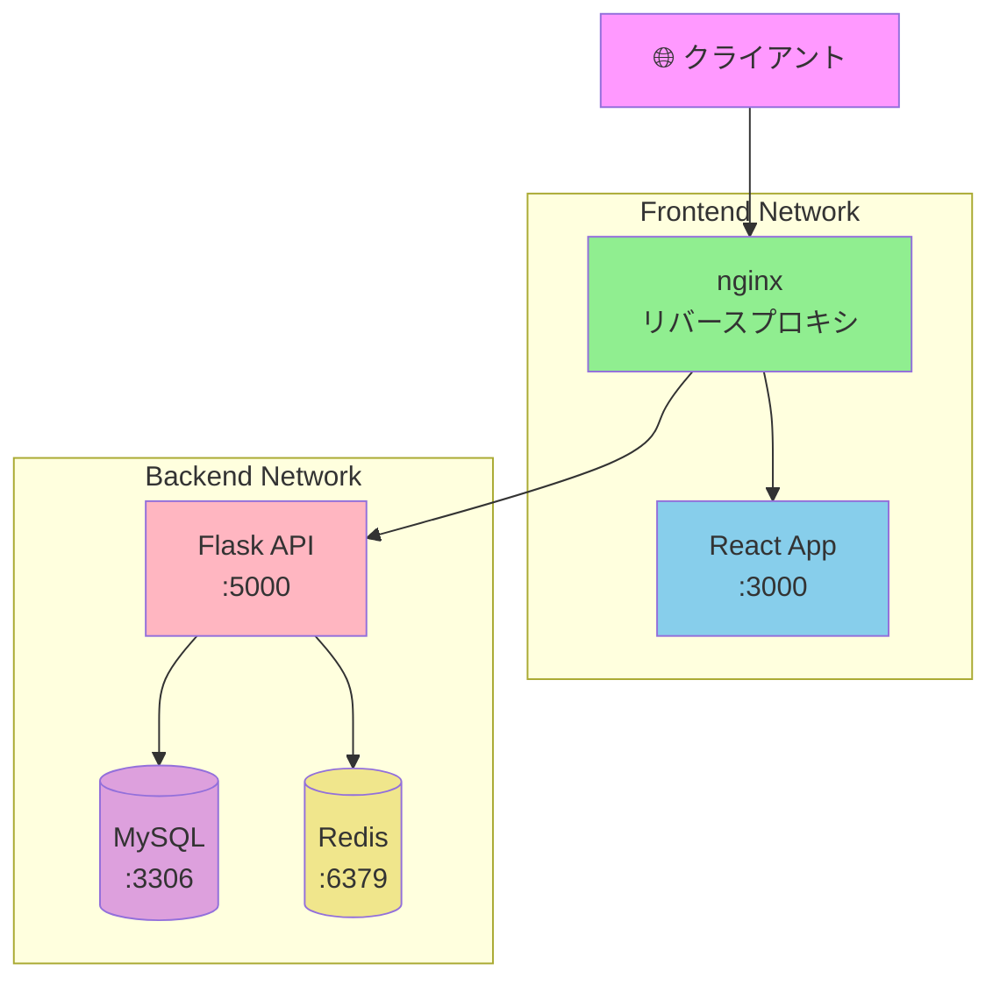

# Phase 5-2: マルチコンテナ構成 ～ 実践的なアプリケーション構築 ～

## 学習目標

この単元を終えると、以下ができるようになります：

- 実践的な Web アプリ構成（Frontend + Backend + DB + Cache）を構築できる
- ヘルスチェックを設定して信頼性を向上できる
- ネットワークを分離してセキュリティを高められる
- ログ管理やリソース制限を設定できる

## 概念解説

### 実践的なマルチコンテナ構成



### AWS で例えると...

| Compose 構成 | AWS 構成 |
|-------------|---------|
| nginx リバースプロキシ | ALB (Application Load Balancer) |
| Frontend コンテナ | S3 + CloudFront |
| API コンテナ | ECS / Lambda |
| MySQL | RDS |
| Redis | ElastiCache |

## ハンズオン

### 演習1: 完全な Web アプリ構成

```bash
mkdir -p ~/docker-practice/fullstack-app
cd ~/docker-practice/fullstack-app

# ディレクトリ構成
mkdir -p frontend backend nginx
```

**Backend (Flask API):**

```bash
cat << 'EOF' > backend/app.py
from flask import Flask, jsonify, request
from flask_cors import CORS
import redis
import mysql.connector
import os
import time
import json

app = Flask(__name__)
CORS(app)

# Redis 接続
def get_redis():
    return redis.Redis(host='redis', port=6379, decode_responses=True)

# MySQL 接続
def get_db():
    for i in range(30):
        try:
            return mysql.connector.connect(
                host='db',
                user='root',
                password=os.getenv('MYSQL_ROOT_PASSWORD', 'secret'),
                database='myapp'
            )
        except:
            time.sleep(2)
    raise Exception("DB connection failed")

@app.route('/api/health')
def health():
    return jsonify({"status": "healthy"})

@app.route('/api/items', methods=['GET'])
def get_items():
    r = get_redis()
    
    # キャッシュ確認
    cached = r.get('items')
    if cached:
        return jsonify({"source": "cache", "items": json.loads(cached)})
    
    # DB から取得
    conn = get_db()
    cursor = conn.cursor(dictionary=True)
    cursor.execute("SELECT * FROM items")
    items = cursor.fetchall()
    conn.close()
    
    # キャッシュに保存（60秒）
    r.setex('items', 60, json.dumps(items))
    
    return jsonify({"source": "database", "items": items})

@app.route('/api/items', methods=['POST'])
def create_item():
    data = request.json
    conn = get_db()
    cursor = conn.cursor()
    cursor.execute("INSERT INTO items (name, price) VALUES (%s, %s)", 
                   (data['name'], data['price']))
    conn.commit()
    conn.close()
    
    # キャッシュを無効化
    get_redis().delete('items')
    
    return jsonify({"message": "Created"}), 201

@app.route('/api/init')
def init_db():
    conn = get_db()
    cursor = conn.cursor()
    cursor.execute("""
        CREATE TABLE IF NOT EXISTS items (
            id INT AUTO_INCREMENT PRIMARY KEY,
            name VARCHAR(100),
            price INT
        )
    """)
    cursor.execute("DELETE FROM items")
    cursor.execute("INSERT INTO items (name, price) VALUES ('Apple', 100)")
    cursor.execute("INSERT INTO items (name, price) VALUES ('Banana', 80)")
    cursor.execute("INSERT INTO items (name, price) VALUES ('Orange', 120)")
    conn.commit()
    conn.close()
    get_redis().delete('items')
    return jsonify({"message": "Initialized"})

if __name__ == '__main__':
    app.run(host='0.0.0.0', port=5000, debug=True)
EOF

cat << 'EOF' > backend/requirements.txt
flask==3.0.0
flask-cors==4.0.0
redis==5.0.1
mysql-connector-python==8.2.0
EOF

cat << 'EOF' > backend/Dockerfile
FROM python:3.11-slim
WORKDIR /app
COPY requirements.txt .
RUN pip install --no-cache-dir -r requirements.txt
COPY app.py .
EXPOSE 5000
CMD ["python", "app.py"]
EOF
```

**Frontend (シンプルな HTML/JS):**

```bash
cat << 'EOF' > frontend/index.html
<!DOCTYPE html>
<html>
<head>
    <title>Docker Fullstack App</title>
    <style>
        body { font-family: Arial, sans-serif; max-width: 800px; margin: 50px auto; padding: 20px; }
        .item { padding: 10px; margin: 5px 0; background: #f0f0f0; border-radius: 5px; }
        .source { color: #666; font-size: 12px; }
        button { padding: 10px 20px; margin: 5px; cursor: pointer; }
        input { padding: 8px; margin: 5px; }
    </style>
</head>
<body>
    <h1>🐳 Docker Fullstack App</h1>
    
    <div>
        <button onclick="initDB()">Initialize DB</button>
        <button onclick="loadItems()">Load Items</button>
    </div>
    
    <h2>Add Item</h2>
    <input type="text" id="name" placeholder="Name">
    <input type="number" id="price" placeholder="Price">
    <button onclick="addItem()">Add</button>
    
    <h2>Items</h2>
    <div id="source" class="source"></div>
    <div id="items"></div>
    
    <script>
        const API = '/api';
        
        async function loadItems() {
            const res = await fetch(`${API}/items`);
            const data = await res.json();
            document.getElementById('source').textContent = `Source: ${data.source}`;
            document.getElementById('items').innerHTML = data.items
                .map(i => `<div class="item">${i.name}: ¥${i.price}</div>`)
                .join('');
        }
        
        async function addItem() {
            const name = document.getElementById('name').value;
            const price = parseInt(document.getElementById('price').value);
            await fetch(`${API}/items`, {
                method: 'POST',
                headers: {'Content-Type': 'application/json'},
                body: JSON.stringify({name, price})
            });
            loadItems();
        }
        
        async function initDB() {
            await fetch(`${API}/init`);
            loadItems();
        }
        
        loadItems();
    </script>
</body>
</html>
EOF

cat << 'EOF' > frontend/Dockerfile
FROM nginx:alpine
COPY index.html /usr/share/nginx/html/
EOF
```

**Nginx (リバースプロキシ):**

```bash
cat << 'EOF' > nginx/nginx.conf
events {
    worker_connections 1024;
}

http {
    upstream frontend {
        server frontend:80;
    }
    
    upstream backend {
        server backend:5000;
    }
    
    server {
        listen 80;
        
        # Frontend
        location / {
            proxy_pass http://frontend;
        }
        
        # Backend API
        location /api {
            proxy_pass http://backend;
            proxy_set_header Host $host;
            proxy_set_header X-Real-IP $remote_addr;
        }
    }
}
EOF

cat << 'EOF' > nginx/Dockerfile
FROM nginx:alpine
COPY nginx.conf /etc/nginx/nginx.conf
EOF
```

**Docker Compose:**

```bash
cat << 'EOF' > docker-compose.yml
version: '3.8'

services:
  nginx:
    build: ./nginx
    ports:
      - "8080:80"
    depends_on:
      - frontend
      - backend
    networks:
      - frontend-net
      - backend-net
    restart: unless-stopped

  frontend:
    build: ./frontend
    networks:
      - frontend-net
    restart: unless-stopped

  backend:
    build: ./backend
    environment:
      MYSQL_ROOT_PASSWORD: secret
    depends_on:
      db:
        condition: service_healthy
      redis:
        condition: service_started
    networks:
      - backend-net
    restart: unless-stopped

  db:
    image: mysql:8
    environment:
      MYSQL_ROOT_PASSWORD: secret
      MYSQL_DATABASE: myapp
    volumes:
      - db-data:/var/lib/mysql
    networks:
      - backend-net
    healthcheck:
      test: ["CMD", "mysqladmin", "ping", "-h", "localhost"]
      interval: 10s
      timeout: 5s
      retries: 5
    restart: unless-stopped

  redis:
    image: redis:alpine
    networks:
      - backend-net
    restart: unless-stopped

networks:
  frontend-net:
  backend-net:

volumes:
  db-data:
EOF

# 起動
docker compose up -d --build

# ログを確認
docker compose logs -f

# ブラウザでアクセス
# http://localhost:8080

# Initialize DB ボタンをクリック
# Load Items ボタンをクリック（1回目: database、2回目: cache）

# 停止
docker compose down -v
```

### 演習2: ヘルスチェックとリソース制限

```bash
mkdir -p ~/docker-practice/healthcheck
cd ~/docker-practice/healthcheck

cat << 'EOF' > docker-compose.yml
version: '3.8'

services:
  web:
    image: nginx
    ports:
      - "8080:80"
    healthcheck:
      test: ["CMD", "curl", "-f", "http://localhost"]
      interval: 30s
      timeout: 10s
      retries: 3
      start_period: 10s
    deploy:
      resources:
        limits:
          cpus: '0.5'
          memory: 256M
        reservations:
          cpus: '0.25'
          memory: 128M
    restart: unless-stopped

  db:
    image: mysql:8
    environment:
      MYSQL_ROOT_PASSWORD: secret
    healthcheck:
      test: ["CMD", "mysqladmin", "ping", "-h", "localhost"]
      interval: 10s
      timeout: 5s
      retries: 5
    deploy:
      resources:
        limits:
          cpus: '1'
          memory: 512M
    restart: unless-stopped
EOF

# 起動
docker compose up -d

# ヘルスステータス確認
docker compose ps
# STATUS に (healthy) と表示される

# 詳細確認
docker inspect healthcheck-web-1 --format='{{json .State.Health}}' | python3 -m json.tool

# リソース使用状況
docker stats --no-stream

# 停止
docker compose down
```

### 演習3: ログ管理

```bash
mkdir -p ~/docker-practice/logging
cd ~/docker-practice/logging

cat << 'EOF' > docker-compose.yml
version: '3.8'

services:
  web:
    image: nginx
    ports:
      - "8080:80"
    logging:
      driver: json-file
      options:
        max-size: "10m"    # ログファイル最大サイズ
        max-file: "3"      # 保持するファイル数

  app:
    image: python:3.11-slim
    command: python -c "import time; import sys; [print(f'Log {i}', flush=True) or time.sleep(1) for i in range(1000)]"
    logging:
      driver: json-file
      options:
        max-size: "5m"
        max-file: "2"
EOF

# 起動
docker compose up -d

# ログを確認
docker compose logs -f app

# 最新100行
docker compose logs --tail 100 app

# タイムスタンプ付き
docker compose logs -t app

# 停止
docker compose down
```

### 演習4: 開発/本番環境の切り替え

```bash
mkdir -p ~/docker-practice/multi-stage-env
cd ~/docker-practice/multi-stage-env

# 共通設定
cat << 'EOF' > docker-compose.yml
version: '3.8'

services:
  web:
    image: nginx
    
  db:
    image: mysql:8
    environment:
      MYSQL_ROOT_PASSWORD: ${DB_PASSWORD:-default}
      MYSQL_DATABASE: ${DB_NAME:-myapp}
    volumes:
      - db-data:/var/lib/mysql

volumes:
  db-data:
EOF

# 開発用オーバーライド
cat << 'EOF' > docker-compose.dev.yml
version: '3.8'

services:
  web:
    ports:
      - "8080:80"
    volumes:
      - ./html:/usr/share/nginx/html
    environment:
      - DEBUG=true

  db:
    ports:
      - "3306:3306"  # 開発時はポート公開

  adminer:
    image: adminer
    ports:
      - "9000:8080"
    depends_on:
      - db
EOF

# 本番用オーバーライド
cat << 'EOF' > docker-compose.prod.yml
version: '3.8'

services:
  web:
    ports:
      - "80:80"
    restart: always
    deploy:
      resources:
        limits:
          memory: 256M

  db:
    restart: always
    deploy:
      resources:
        limits:
          memory: 1G
    # ポートは公開しない（セキュリティ）
EOF

# 開発環境変数
cat << 'EOF' > .env.dev
DB_PASSWORD=dev_password
DB_NAME=dev_db
EOF

# 本番環境変数
cat << 'EOF' > .env.prod
DB_PASSWORD=super_secure_password_123
DB_NAME=production_db
EOF

mkdir -p html
echo "<h1>Development</h1>" > html/index.html

# 開発モードで起動
docker compose --env-file .env.dev -f docker-compose.yml -f docker-compose.dev.yml up -d
docker compose ps
curl http://localhost:8080
# http://localhost:9000 で Adminer にもアクセス可能

docker compose down

# 本番モードで起動
docker compose --env-file .env.prod -f docker-compose.yml -f docker-compose.prod.yml up -d
docker compose ps
curl http://localhost:80

docker compose down -v
```

## 現場でよくある落とし穴

### 1. コンテナ間通信でホスト名を間違える

```yaml
# ❌ localhost は各コンテナ自身を指す
DATABASE_URL: mysql://localhost:3306/myapp

# ✅ サービス名を使う
DATABASE_URL: mysql://db:3306/myapp
```

### 2. 起動順序の問題

```yaml
# ❌ depends_on だけでは不十分
depends_on:
  - db

# ✅ ヘルスチェックを組み合わせる
depends_on:
  db:
    condition: service_healthy
```

### 3. ボリュームのパーミッション

```yaml
# ❌ ホストとコンテナでユーザーが異なる
volumes:
  - ./data:/app/data

# ✅ ユーザーを指定するか、権限を調整
user: "1000:1000"
# または Dockerfile で適切なユーザーを設定
```

## 理解度確認

### 問題

以下の docker-compose.yml で、web サービスから db サービスに接続する際の正しいホスト名はどれか。

```yaml
services:
  web:
    image: myapp
    depends_on:
      - db
  db:
    image: mysql:8
    container_name: mysql-server
```

**A.** localhost

**B.** mysql-server

**C.** db

**D.** 172.17.0.2

---

### 解答・解説

**正解: C**

Docker Compose の同一ネットワーク内では、**サービス名**がホスト名として機能します。

- **A.** 誤り。localhost は各コンテナ自身を指します。
- **B.** 誤り。container_name は Docker CLI での識別名であり、DNS 名とは異なります。サービス名が優先されます。
- **C.** 正解。サービス名「db」で他のコンテナから接続できます。
- **D.** 誤り。IP アドレスは動的に変わる可能性があり、ハードコードすべきではありません。

---

## まとめ

| 概念 | 説明 |
|------|------|
| マルチコンテナ | 役割ごとにコンテナを分離 |
| ネットワーク分離 | frontend-net / backend-net |
| ヘルスチェック | 起動完了を確認 |
| リソース制限 | CPU/メモリを制御 |
| 環境分離 | dev/prod で設定を切り替え |

## 次のステップ

実践的なマルチコンテナ構成ができるようになりました！次は Dockerfile の最適化を学びましょう。

**次の単元**: [Phase 6-1: Dockerfile 最適化 ～ 本番品質のイメージを作る ～](../phase6/01_Dockerfile最適化.md)
