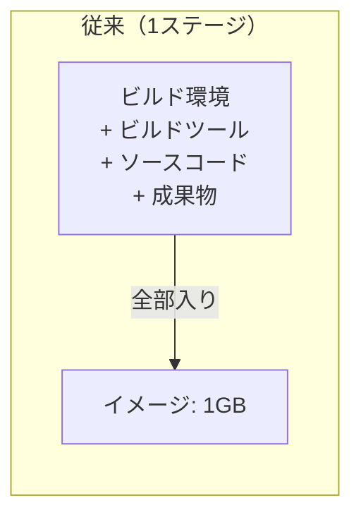
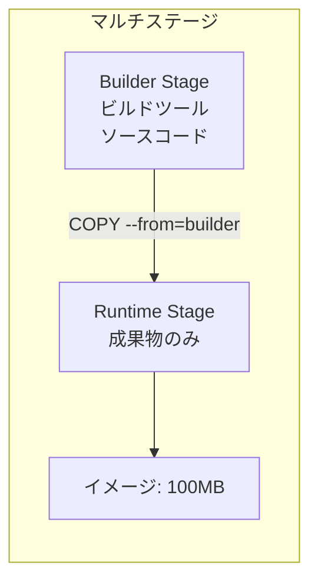

# Phase 6-1: Dockerfile 最適化 ～ 本番品質のイメージを作る ～

## 学習目標

この単元を終えると、以下ができるようになります：

- マルチステージビルドでイメージサイズを削減できる
- レイヤーキャッシュを最大限活用できる
- セキュリティを考慮した Dockerfile を書ける
- 本番環境で使えるイメージを作成できる

## 概念解説

### なぜ最適化が必要か？

| 問題 | 影響 |
|------|------|
| イメージが大きい | pull/push が遅い、ディスク圧迫、コスト増 |
| ビルドが遅い | CI/CD の待ち時間増加、開発効率低下 |
| セキュリティホール | 脆弱性スキャンで警告、攻撃リスク |
| root で実行 | コンテナエスケープ時のリスク増大 |

### AWS で例えると...

| 最適化 | AWS での同様の考え方 |
|--------|---------------------|
| イメージサイズ削減 | Lambda のパッケージサイズ制限 |
| マルチステージビルド | CodeBuild でビルド成果物だけデプロイ |
| 非 root ユーザー | IAM で最小権限の原則 |
| セキュリティスキャン | ECR の脆弱性スキャン |

### マルチステージビルドとは





## ハンズオン

### 演習1: マルチステージビルド - Go アプリ

```bash
mkdir -p ~/docker-practice/multistage-go
cd ~/docker-practice/multistage-go

# Go アプリ
cat << 'EOF' > main.go
package main

import (
    "fmt"
    "net/http"
)

func main() {
    http.HandleFunc("/", func(w http.ResponseWriter, r *http.Request) {
        fmt.Fprintf(w, "Hello from optimized Docker image!")
    })
    fmt.Println("Server starting on :8080")
    http.ListenAndServe(":8080", nil)
}
EOF

cat << 'EOF' > go.mod
module myapp
go 1.21
EOF

# 従来の Dockerfile（大きい）
cat << 'EOF' > Dockerfile.bad
FROM golang:1.21
WORKDIR /app
COPY . .
RUN go build -o server main.go
EXPOSE 8080
CMD ["./server"]
EOF

# マルチステージ Dockerfile（小さい）
cat << 'EOF' > Dockerfile.good
# Build stage
FROM golang:1.21-alpine AS builder
WORKDIR /app
COPY . .
RUN CGO_ENABLED=0 GOOS=linux go build -a -installsuffix cgo -o server main.go

# Runtime stage
FROM alpine:latest
RUN apk --no-cache add ca-certificates
WORKDIR /root/
COPY --from=builder /app/server .
EXPOSE 8080
CMD ["./server"]
EOF

# 両方ビルドしてサイズ比較
docker build -f Dockerfile.bad -t go-app:bad .
docker build -f Dockerfile.good -t go-app:good .

docker images | grep go-app
# go-app    bad     xxx   1.1GB
# go-app    good    xxx   12MB  ← 100倍小さい！

# 動作確認
docker run -d -p 8080:8080 --name go-test go-app:good
curl http://localhost:8080
docker rm -f go-test
```

### 演習2: マルチステージビルド - Python アプリ

```bash
mkdir -p ~/docker-practice/multistage-python
cd ~/docker-practice/multistage-python

cat << 'EOF' > app.py
from flask import Flask
app = Flask(__name__)

@app.route('/')
def hello():
    return 'Hello from optimized Python app!'

if __name__ == '__main__':
    app.run(host='0.0.0.0', port=5000)
EOF

cat << 'EOF' > requirements.txt
flask==3.0.0
gunicorn==21.2.0
EOF

# 従来の Dockerfile
cat << 'EOF' > Dockerfile.bad
FROM python:3.11
WORKDIR /app
COPY requirements.txt .
RUN pip install -r requirements.txt
COPY app.py .
EXPOSE 5000
CMD ["python", "app.py"]
EOF

# 最適化された Dockerfile
cat << 'EOF' > Dockerfile.good
# Build stage（依存関係のインストール）
FROM python:3.11-slim AS builder
WORKDIR /app
RUN python -m venv /opt/venv
ENV PATH="/opt/venv/bin:$PATH"
COPY requirements.txt .
RUN pip install --no-cache-dir -r requirements.txt

# Runtime stage
FROM python:3.11-slim
WORKDIR /app

# 非 root ユーザー作成
RUN useradd -m -r appuser && chown appuser /app
USER appuser

# venv をコピー
COPY --from=builder /opt/venv /opt/venv
ENV PATH="/opt/venv/bin:$PATH"

COPY --chown=appuser app.py .
EXPOSE 5000
CMD ["gunicorn", "-b", "0.0.0.0:5000", "app:app"]
EOF

# ビルド＆比較
docker build -f Dockerfile.bad -t py-app:bad .
docker build -f Dockerfile.good -t py-app:good .

docker images | grep py-app
# py-app    bad     1.01GB
# py-app    good    178MB

# 動作確認
docker run -d -p 5000:5000 --name py-test py-app:good
curl http://localhost:5000
docker rm -f py-test
```

### 演習3: レイヤーキャッシュの最適化

```bash
mkdir -p ~/docker-practice/cache-optimize
cd ~/docker-practice/cache-optimize

cat << 'EOF' > app.py
print("Version 1")
EOF

cat << 'EOF' > requirements.txt
flask==3.0.0
requests==2.31.0
EOF

# 悪い例（毎回 pip install が走る）
cat << 'EOF' > Dockerfile.bad
FROM python:3.11-slim
WORKDIR /app
COPY . .
RUN pip install -r requirements.txt
CMD ["python", "app.py"]
EOF

# 良い例（requirements.txt が変わらなければキャッシュ利用）
cat << 'EOF' > Dockerfile.good
FROM python:3.11-slim
WORKDIR /app
# 先に requirements.txt だけコピー
COPY requirements.txt .
RUN pip install --no-cache-dir -r requirements.txt
# その後にアプリコード
COPY app.py .
CMD ["python", "app.py"]
EOF

# 1回目のビルド
time docker build -f Dockerfile.good -t cache-test:v1 .

# app.py を変更
echo 'print("Version 2")' > app.py

# 2回目のビルド（pip install はキャッシュされる）
time docker build -f Dockerfile.good -t cache-test:v2 .
# "Using cache" と表示され、高速
```

### 演習4: RUN 命令の最適化

```bash
mkdir -p ~/docker-practice/run-optimize
cd ~/docker-practice/run-optimize

# 悪い例（レイヤーが多い、キャッシュが無駄）
cat << 'EOF' > Dockerfile.bad
FROM ubuntu:22.04
RUN apt-get update
RUN apt-get install -y curl
RUN apt-get install -y vim
RUN apt-get install -y git
RUN apt-get clean
EOF

# 良い例（1つの RUN でまとめる）
cat << 'EOF' > Dockerfile.good
FROM ubuntu:22.04
RUN apt-get update && \
    apt-get install -y --no-install-recommends \
        curl \
        vim \
        git && \
    apt-get clean && \
    rm -rf /var/lib/apt/lists/*
EOF

# ビルド＆比較
docker build -f Dockerfile.bad -t run-bad .
docker build -f Dockerfile.good -t run-good .

docker images | grep run-
# レイヤー数とサイズが異なる

# レイヤー数確認
docker history run-bad | wc -l
docker history run-good | wc -l
```

### 演習5: セキュリティ強化

```bash
mkdir -p ~/docker-practice/security
cd ~/docker-practice/security

cat << 'EOF' > app.py
import os
print(f"Running as user: {os.getuid()}")
print("Hello from secure container!")
EOF

# セキュアな Dockerfile
cat << 'EOF' > Dockerfile
FROM python:3.11-slim

# セキュリティアップデート
RUN apt-get update && \
    apt-get upgrade -y && \
    apt-get clean && \
    rm -rf /var/lib/apt/lists/*

WORKDIR /app

# 非 root ユーザー作成
RUN groupadd -r appgroup && \
    useradd -r -g appgroup appuser && \
    chown -R appuser:appgroup /app

# 不要な権限を削除
RUN chmod 755 /app

# ユーザー切り替え（以降の命令は appuser で実行）
USER appuser

COPY --chown=appuser:appgroup app.py .

# HEALTHCHECK 追加
HEALTHCHECK --interval=30s --timeout=3s \
    CMD python -c "print('healthy')" || exit 1

CMD ["python", "app.py"]
EOF

docker build -t secure-app .
docker run --rm secure-app
# Running as user: 1000（root の 0 ではない）
```

### 演習6: .dockerignore の活用

```bash
mkdir -p ~/docker-practice/dockerignore
cd ~/docker-practice/dockerignore

# 様々なファイルを作成
echo "app code" > app.py
echo "flask" > requirements.txt
echo "secret=password" > .env
mkdir -p .git node_modules __pycache__ .vscode
echo "git data" > .git/config
echo "big file" > node_modules/big.js
echo "cache" > __pycache__/cache.pyc
echo "README" > README.md

# .dockerignore なしでビルド
cat << 'EOF' > Dockerfile
FROM python:3.11-slim
WORKDIR /app
COPY . .
RUN ls -la
CMD ["python", "app.py"]
EOF

docker build -t no-ignore .
# 全ファイルがコピーされる

# .dockerignore を追加
cat << 'EOF' > .dockerignore
.git
.gitignore
.env
.vscode
__pycache__
*.pyc
node_modules
*.md
Dockerfile
.dockerignore
EOF

docker build -t with-ignore .
# 必要なファイルだけコピーされる

# コンテナ内を確認
docker run --rm with-ignore ls -la
# .env や .git がないことを確認
```

### 演習7: ビルドキットの活用

```bash
mkdir -p ~/docker-practice/buildkit
cd ~/docker-practice/buildkit

cat << 'EOF' > Dockerfile
# syntax=docker/dockerfile:1

FROM python:3.11-slim

WORKDIR /app

# キャッシュマウントを使用（pip キャッシュを再利用）
RUN --mount=type=cache,target=/root/.cache/pip \
    pip install flask requests numpy pandas

COPY app.py .
CMD ["python", "app.py"]
EOF

echo 'print("BuildKit test")' > app.py

# BuildKit を有効にしてビルド
DOCKER_BUILDKIT=1 docker build -t buildkit-test .

# 2回目（キャッシュが効く）
DOCKER_BUILDKIT=1 docker build -t buildkit-test .
```

## 最適化チェックリスト

```markdown
## Dockerfile 最適化チェックリスト

### サイズ削減
- [ ] Alpine または slim ベースイメージを使用
- [ ] マルチステージビルドを使用
- [ ] 不要なファイルを削除（apt clean, rm -rf /var/lib/apt/lists/*）
- [ ] .dockerignore を設定

### ビルド高速化
- [ ] 変更頻度の低いものを先に COPY
- [ ] RUN を適切にまとめる
- [ ] BuildKit のキャッシュマウントを活用

### セキュリティ
- [ ] 非 root ユーザーで実行
- [ ] 最小権限の原則
- [ ] セキュリティアップデートを適用
- [ ] 秘密情報を含めない

### 運用性
- [ ] HEALTHCHECK を設定
- [ ] 適切なラベルを付与
- [ ] 固定バージョンを使用（latest を避ける）
```

## 理解度確認

### 問題

以下の Dockerfile でイメージサイズを削減するための最も効果的な方法はどれか。

```dockerfile
FROM golang:1.21
WORKDIR /app
COPY . .
RUN go build -o server main.go
EXPOSE 8080
CMD ["./server"]
```

**A.** `RUN go build` の後に `rm -rf /app/*` を追加する

**B.** マルチステージビルドを使用し、ビルド成果物のみを軽量なベースイメージにコピーする

**C.** `FROM golang:1.21-alpine` に変更する

**D.** `.dockerignore` ファイルを作成する

---

### 解答・解説

**正解: B**

- **A.** 誤り。RUN の後に rm しても、前のレイヤーにビルド成果物以外のファイルが残ります。
- **B.** 正解。Go はコンパイル言語なので、ビルドには Go ツールチェーン（約800MB）が必要ですが、実行には不要です。マルチステージビルドでビルド成果物（数MB）だけを alpine（約5MB）にコピーすれば、最終イメージは約10MBになります。
- **C.** 部分的に正しい。alpine を使うとサイズは小さくなりますが、Go ツールチェーンが含まれたままです。
- **D.** 効果はありますが、ビルドツールチェーンがイメージに含まれる問題は解決しません。

---

## まとめ

| テクニック | 効果 |
|-----------|------|
| マルチステージビルド | サイズ大幅削減（特にコンパイル言語） |
| Alpine/slim ベース | ベースイメージサイズ削減 |
| レイヤー順序最適化 | ビルド時間短縮 |
| RUN まとめ | レイヤー数削減 |
| 非 root ユーザー | セキュリティ向上 |
| .dockerignore | 不要ファイル除外 |

## 次のステップ

Docker の最適化手法を学びました！最後に総仕上げとして実践プロジェクトに取り組みましょう。

**次の単元**: [Phase 6-2: 総仕上げ ～ 実践プロジェクトとチェックリスト ～](./02_総仕上げ.md)
