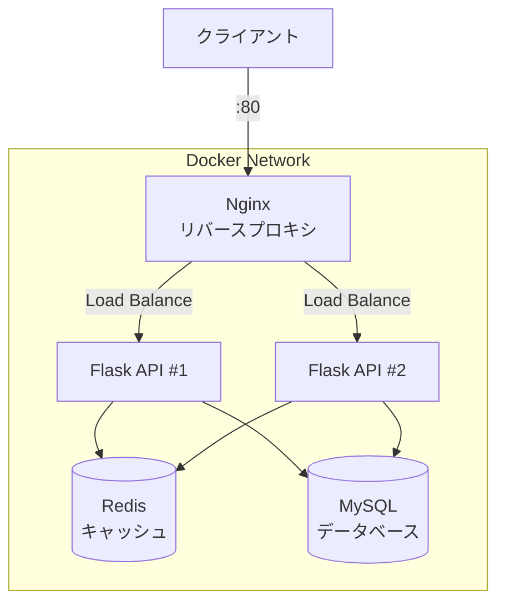

# Phase 6-2: 総仕上げ ～ 実践プロジェクトとチェックリスト ～

## 学習目標

この単元を終えると、以下ができるようになります：

- 実践的な Docker プロジェクトを一から構築できる
- Docker の知識を体系的に整理・確認できる
- 本番運用を意識したベストプラクティスを適用できる
- トラブルシューティングを自力で行える

## 実践プロジェクト: マイクロブログ API

### プロジェクト概要

本格的なマイクロブログ API を Docker で構築します。



### ハンズオン: プロジェクト構築

```bash
mkdir -p ~/docker-practice/microblog/{api,nginx,mysql}
cd ~/docker-practice/microblog
```

#### 1. API アプリケーション

```bash
# requirements.txt
cat << 'EOF' > api/requirements.txt
flask==3.0.0
gunicorn==21.2.0
mysql-connector-python==8.2.0
redis==5.0.1
python-dotenv==1.0.0
EOF

# app.py
cat << 'EOF' > api/app.py
import os
import json
import time
from datetime import datetime
from flask import Flask, request, jsonify
import mysql.connector
import redis

app = Flask(__name__)

# 環境変数から設定を読み込み
MYSQL_HOST = os.getenv('MYSQL_HOST', 'mysql')
MYSQL_USER = os.getenv('MYSQL_USER', 'bloguser')
MYSQL_PASSWORD = os.getenv('MYSQL_PASSWORD', 'blogpass')
MYSQL_DATABASE = os.getenv('MYSQL_DATABASE', 'microblog')
REDIS_HOST = os.getenv('REDIS_HOST', 'redis')

def get_db():
    """データベース接続を取得"""
    for attempt in range(10):
        try:
            conn = mysql.connector.connect(
                host=MYSQL_HOST,
                user=MYSQL_USER,
                password=MYSQL_PASSWORD,
                database=MYSQL_DATABASE
            )
            return conn
        except mysql.connector.Error as e:
            print(f"DB connection attempt {attempt + 1} failed: {e}")
            time.sleep(2)
    raise Exception("Could not connect to database")

def get_redis():
    """Redis 接続を取得"""
    return redis.Redis(host=REDIS_HOST, port=6379, decode_responses=True)

@app.route('/health')
def health():
    """ヘルスチェック"""
    return jsonify({'status': 'healthy', 'timestamp': datetime.now().isoformat()})

@app.route('/api/posts', methods=['GET'])
def get_posts():
    """投稿一覧を取得（キャッシュ付き）"""
    r = get_redis()
    cache_key = 'posts:all'
    
    # キャッシュをチェック
    cached = r.get(cache_key)
    if cached:
        return jsonify({'source': 'cache', 'posts': json.loads(cached)})
    
    # DB から取得
    conn = get_db()
    cursor = conn.cursor(dictionary=True)
    cursor.execute('SELECT * FROM posts ORDER BY created_at DESC LIMIT 50')
    posts = cursor.fetchall()
    cursor.close()
    conn.close()
    
    # 日付をシリアライズ可能に
    for post in posts:
        if post.get('created_at'):
            post['created_at'] = post['created_at'].isoformat()
    
    # キャッシュに保存（60秒）
    r.setex(cache_key, 60, json.dumps(posts))
    
    return jsonify({'source': 'database', 'posts': posts})

@app.route('/api/posts', methods=['POST'])
def create_post():
    """新規投稿を作成"""
    data = request.get_json()
    if not data or 'content' not in data:
        return jsonify({'error': 'Content is required'}), 400
    
    author = data.get('author', 'Anonymous')
    content = data['content']
    
    conn = get_db()
    cursor = conn.cursor()
    cursor.execute(
        'INSERT INTO posts (author, content) VALUES (%s, %s)',
        (author, content)
    )
    conn.commit()
    post_id = cursor.lastrowid
    cursor.close()
    conn.close()
    
    # キャッシュをクリア
    r = get_redis()
    r.delete('posts:all')
    
    return jsonify({'id': post_id, 'author': author, 'content': content}), 201

@app.route('/api/posts/<int:post_id>', methods=['DELETE'])
def delete_post(post_id):
    """投稿を削除"""
    conn = get_db()
    cursor = conn.cursor()
    cursor.execute('DELETE FROM posts WHERE id = %s', (post_id,))
    affected = cursor.rowcount
    conn.commit()
    cursor.close()
    conn.close()
    
    if affected == 0:
        return jsonify({'error': 'Post not found'}), 404
    
    # キャッシュをクリア
    r = get_redis()
    r.delete('posts:all')
    
    return jsonify({'message': 'Deleted'}), 200

if __name__ == '__main__':
    app.run(host='0.0.0.0', port=5000)
EOF

# Dockerfile（最適化版）
cat << 'EOF' > api/Dockerfile
# Build stage
FROM python:3.11-slim AS builder
WORKDIR /app
RUN python -m venv /opt/venv
ENV PATH="/opt/venv/bin:$PATH"
COPY requirements.txt .
RUN pip install --no-cache-dir -r requirements.txt

# Runtime stage
FROM python:3.11-slim
WORKDIR /app

# セキュリティ: 非 root ユーザー
RUN groupadd -r api && \
    useradd -r -g api apiuser && \
    chown -R apiuser:api /app

# Python 環境をコピー
COPY --from=builder /opt/venv /opt/venv
ENV PATH="/opt/venv/bin:$PATH"

USER apiuser
COPY --chown=apiuser:api app.py .

EXPOSE 5000

HEALTHCHECK --interval=30s --timeout=5s --start-period=10s \
    CMD python -c "import urllib.request; urllib.request.urlopen('http://localhost:5000/health')" || exit 1

CMD ["gunicorn", "-w", "2", "-b", "0.0.0.0:5000", "app:app"]
EOF
```

#### 2. MySQL 初期化

```bash
cat << 'EOF' > mysql/init.sql
CREATE DATABASE IF NOT EXISTS microblog;
USE microblog;

CREATE TABLE IF NOT EXISTS posts (
    id INT AUTO_INCREMENT PRIMARY KEY,
    author VARCHAR(100) NOT NULL DEFAULT 'Anonymous',
    content TEXT NOT NULL,
    created_at TIMESTAMP DEFAULT CURRENT_TIMESTAMP,
    INDEX idx_created_at (created_at)
) ENGINE=InnoDB DEFAULT CHARSET=utf8mb4 COLLATE=utf8mb4_unicode_ci;

-- サンプルデータ
INSERT INTO posts (author, content) VALUES
    ('Admin', 'Welcome to Microblog!'),
    ('System', 'This is a sample post.');
EOF
```

#### 3. Nginx 設定

```bash
cat << 'EOF' > nginx/nginx.conf
upstream api_servers {
    least_conn;
    server api1:5000 weight=1;
    server api2:5000 weight=1;
}

server {
    listen 80;
    server_name localhost;

    location /health {
        access_log off;
        return 200 'OK';
        add_header Content-Type text/plain;
    }

    location / {
        proxy_pass http://api_servers;
        proxy_http_version 1.1;
        proxy_set_header Host $host;
        proxy_set_header X-Real-IP $remote_addr;
        proxy_set_header X-Forwarded-For $proxy_add_x_forwarded_for;
        proxy_set_header X-Forwarded-Proto $scheme;
        proxy_connect_timeout 30s;
        proxy_read_timeout 60s;
    }
}
EOF

cat << 'EOF' > nginx/Dockerfile
FROM nginx:alpine
RUN rm /etc/nginx/conf.d/default.conf
COPY nginx.conf /etc/nginx/conf.d/
HEALTHCHECK --interval=30s --timeout=3s \
    CMD wget --quiet --tries=1 --spider http://localhost/health || exit 1
EOF
```

#### 4. Docker Compose

```bash
cat << 'EOF' > docker-compose.yml
version: '3.8'

services:
  nginx:
    build: ./nginx
    ports:
      - "80:80"
    depends_on:
      api1:
        condition: service_healthy
      api2:
        condition: service_healthy
    networks:
      - frontend
    restart: unless-stopped

  api1:
    build: ./api
    environment:
      - MYSQL_HOST=mysql
      - MYSQL_USER=bloguser
      - MYSQL_PASSWORD=blogpass
      - MYSQL_DATABASE=microblog
      - REDIS_HOST=redis
    depends_on:
      mysql:
        condition: service_healthy
      redis:
        condition: service_healthy
    networks:
      - frontend
      - backend
    restart: unless-stopped

  api2:
    build: ./api
    environment:
      - MYSQL_HOST=mysql
      - MYSQL_USER=bloguser
      - MYSQL_PASSWORD=blogpass
      - MYSQL_DATABASE=microblog
      - REDIS_HOST=redis
    depends_on:
      mysql:
        condition: service_healthy
      redis:
        condition: service_healthy
    networks:
      - frontend
      - backend
    restart: unless-stopped

  mysql:
    image: mysql:8.0
    environment:
      MYSQL_ROOT_PASSWORD: rootpass
      MYSQL_DATABASE: microblog
      MYSQL_USER: bloguser
      MYSQL_PASSWORD: blogpass
    volumes:
      - mysql_data:/var/lib/mysql
      - ./mysql/init.sql:/docker-entrypoint-initdb.d/init.sql:ro
    networks:
      - backend
    healthcheck:
      test: ["CMD", "mysqladmin", "ping", "-h", "localhost"]
      interval: 10s
      timeout: 5s
      retries: 5
    restart: unless-stopped

  redis:
    image: redis:7-alpine
    volumes:
      - redis_data:/data
    networks:
      - backend
    healthcheck:
      test: ["CMD", "redis-cli", "ping"]
      interval: 10s
      timeout: 5s
      retries: 5
    restart: unless-stopped

networks:
  frontend:
    driver: bridge
  backend:
    driver: bridge

volumes:
  mysql_data:
  redis_data:
EOF
```

#### 5. 起動と動作確認

```bash
# ビルドと起動
docker compose up -d --build

# ログ確認
docker compose logs -f

# 状態確認（別ターミナル）
docker compose ps

# API テスト
# ヘルスチェック
curl http://localhost/health

# 投稿一覧取得
curl http://localhost/api/posts

# 新規投稿
curl -X POST http://localhost/api/posts \
  -H "Content-Type: application/json" \
  -d '{"author": "Test User", "content": "My first post!"}'

# 再度取得（キャッシュ確認）
curl http://localhost/api/posts

# ロードバランシング確認（複数回実行）
for i in {1..10}; do
  curl -s http://localhost/api/posts | jq -r '.source'
done

# 停止
docker compose down
```

## Docker 総合チェックリスト

### 基本操作

| カテゴリ | 項目 | チェック |
|---------|------|---------|
| コンテナ | `docker run` でコンテナを起動できる | ☐ |
| コンテナ | `docker ps` で稼働中コンテナを確認できる | ☐ |
| コンテナ | `docker logs` でログを確認できる | ☐ |
| コンテナ | `docker exec` でコンテナ内に入れる | ☐ |
| イメージ | `docker build` でイメージを作成できる | ☐ |
| イメージ | `docker pull/push` でイメージを取得/送信できる | ☐ |

### Dockerfile

| 項目 | チェック |
|------|---------|
| FROM, RUN, COPY, CMD の役割を説明できる | ☐ |
| EXPOSE, ENV, WORKDIR を適切に使える | ☐ |
| マルチステージビルドを実装できる | ☐ |
| レイヤーキャッシュを考慮した順序で記述できる | ☐ |
| 非 root ユーザーでの実行を設定できる | ☐ |

### ボリュームとネットワーク

| 項目 | チェック |
|------|---------|
| Volume と Bind mount の違いを説明できる | ☐ |
| 永続化が必要なデータを正しくマウントできる | ☐ |
| カスタムネットワークを作成できる | ☐ |
| コンテナ間通信をサービス名で行える | ☐ |

### Docker Compose

| 項目 | チェック |
|------|---------|
| docker-compose.yml を書ける | ☐ |
| 複数サービスの依存関係を設定できる | ☐ |
| 環境変数を外部化できる | ☐ |
| ヘルスチェックと depends_on を組み合わせられる | ☐ |

## トラブルシューティング早見表

```bash
# コンテナが起動しない
docker logs <container_name>         # ログ確認
docker inspect <container_name>      # 詳細情報

# ネットワーク問題
docker network ls                    # ネットワーク一覧
docker network inspect <network>     # 接続確認
docker exec <container> ping <target> # 疎通確認

# ディスク容量問題
docker system df                     # 使用量確認
docker system prune -a               # 全削除（注意！）
docker image prune                   # 未使用イメージ削除
docker volume prune                  # 未使用ボリューム削除

# パフォーマンス問題
docker stats                         # リソース使用状況
docker top <container>               # プロセス確認

# ビルドが失敗
docker build --no-cache .            # キャッシュなしでビルド
docker build --progress=plain .      # 詳細出力
```

## よく使うワンライナー集

```bash
# 停止中のコンテナを全削除
docker rm $(docker ps -aq -f status=exited)

# タグなしイメージを削除
docker rmi $(docker images -f "dangling=true" -q)

# 全コンテナ停止
docker stop $(docker ps -q)

# 特定イメージのコンテナを見つける
docker ps -a --filter ancestor=nginx

# コンテナのIPアドレスを取得
docker inspect -f '{{range.NetworkSettings.Networks}}{{.IPAddress}}{{end}}' <container>

# ログを tail -f のように見る
docker logs -f --tail 100 <container>

# 複数コンテナの一括実行
docker compose exec api1 python -c "print('Hello')"
```

## 理解度確認

### 問題

以下の docker-compose.yml で、api サービスが mysql より先に起動してしまい、接続エラーになる問題を解決する最も適切な方法はどれか。

```yaml
services:
  api:
    build: ./api
    depends_on:
      - mysql
  mysql:
    image: mysql:8.0
```

**A.** `depends_on` を削除する

**B.** api サービスに `restart: always` を追加する

**C.** mysql サービスにヘルスチェックを追加し、`depends_on` を `condition: service_healthy` に変更する

**D.** api サービスの Dockerfile に `RUN sleep 30` を追加する

---

### 解答・解説

**正解: C**

- **A.** 誤り。依存関係を削除すると、起動順序がさらに不定になります。
- **B.** 部分的に正しいですが、根本解決ではありません。何度も再起動を繰り返すのは非効率です。
- **C.** 正解。ヘルスチェックで mysql が実際に接続可能になるまで api の起動を待てます。

```yaml
services:
  api:
    depends_on:
      mysql:
        condition: service_healthy
  mysql:
    healthcheck:
      test: ["CMD", "mysqladmin", "ping", "-h", "localhost"]
      interval: 5s
      timeout: 3s
      retries: 5
```

- **D.** 誤り。固定時間のスリープは環境によって不足/過剰になります。

---

## 次のステップ

🎉 **おめでとうございます！Docker入門カリキュラムを完了しました！**

### 学習の総まとめ

| Phase | 学んだこと |
|-------|-----------|
| 0 | 環境構築、Docker Desktop のインストール |
| 1 | コンテナの概念、VM との違い |
| 2 | コンテナの基本操作、ポートマッピング |
| 3 | イメージの仕組み、Dockerfile の基本 |
| 4 | ボリューム、ネットワーク |
| 5 | Docker Compose、マルチコンテナ |
| 6 | 最適化、ベストプラクティス |

### 次に学ぶべきカリキュラム

Docker の知識を活かして、以下のカリキュラムに進みましょう：

1. **Kubernetes入門** - コンテナオーケストレーションで本番運用
2. **CI/CD パイプライン** - Docker イメージの自動ビルド・デプロイ
3. **データベース基礎** - MySQL/PostgreSQL の本格活用

### 継続的な学習のために

```bash
# Docker の公式ドキュメント
open https://docs.docker.com/

# Docker Hub で公式イメージを探す
open https://hub.docker.com/

# Play with Docker（無料のオンライン環境）
open https://labs.play-with-docker.com/
```

---

**お疲れ様でした！🐳**
