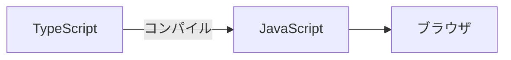

# Phase 1-1: TypeScript 基礎

## 学習目標

この単元を終えると、以下ができるようになります：

- TypeScript の利点を説明できる
- 基本的な型を使える
- Python との違いを理解できる

## 概念解説

### TypeScript とは



**TypeScript** = JavaScript + 静的型付け

### Python との比較

| Python | TypeScript |
|--------|------------|
| 動的型付け | 静的型付け |
| 実行時にエラー | コンパイル時にエラー |
| `def func():` | `function func() {}` |
| インデント | `{}` でブロック |
| `None` | `null`, `undefined` |

## 環境構築

```bash
# Node.js インストール
# https://nodejs.org/

# プロジェクト作成
mkdir ts-practice && cd ts-practice
npm init -y
npm install typescript ts-node @types/node -D

# 設定ファイル
npx tsc --init
```

## 基本の型

### プリミティブ型

```typescript
// 型注釈
let name: string = "Alice";
let age: number = 25;
let isActive: boolean = true;

// 型推論（明示しなくても推論される）
let city = "Tokyo";  // string と推論

// Python との比較
// Python: name = "Alice"  # 型ヒント: name: str = "Alice"
// TS:     let name: string = "Alice";
```

### 配列

```typescript
// 配列
let numbers: number[] = [1, 2, 3];
let names: string[] = ["Alice", "Bob"];

// 別の書き方
let scores: Array<number> = [90, 85, 92];

// Python との比較
// Python: numbers: list[int] = [1, 2, 3]
// TS:     let numbers: number[] = [1, 2, 3]
```

### オブジェクト

```typescript
// オブジェクト型
let user: { name: string; age: number } = {
    name: "Alice",
    age: 25
};

// Python の辞書に相当
// Python: user: dict = {"name": "Alice", "age": 25}
```

### 関数

```typescript
// 関数の型
function greet(name: string): string {
    return `Hello, ${name}!`;
}

// アロー関数
const add = (a: number, b: number): number => {
    return a + b;
};

// 省略形
const multiply = (a: number, b: number): number => a * b;

// Python との比較
// def greet(name: str) -> str:
//     return f"Hello, {name}!"
```

### Union 型

```typescript
// 複数の型を許容
let id: string | number;
id = "abc";
id = 123;

// Python の Union
// from typing import Union
// id: Union[str, int]
```

### Null と Undefined

```typescript
// null: 意図的に「値がない」
// undefined: 未定義

let name: string | null = null;
let age: number | undefined = undefined;

// オプショナル
function greet(name?: string): string {
    return name ? `Hello, ${name}!` : "Hello!";
}
```

## ハンズオン

### 演習1: 型注釈

```typescript
// exercise1.ts
// TODO: 適切な型注釈を追加

let productName = "iPhone";
let price = 99800;
let inStock = true;
let tags = ["電子機器", "Apple"];

function calculateTax(price, taxRate) {
    return price * taxRate;
}
```

<details>
<summary>解答</summary>

```typescript
let productName: string = "iPhone";
let price: number = 99800;
let inStock: boolean = true;
let tags: string[] = ["電子機器", "Apple"];

function calculateTax(price: number, taxRate: number): number {
    return price * taxRate;
}
```
</details>

### 演習2: 関数

```typescript
// exercise2.ts
// TODO: 関数を実装

// 2つの数値を受け取り、大きい方を返す
function max(a, b) {
    // 実装
}

// 文字列の配列を受け取り、カンマ区切りで連結
function join(items) {
    // 実装
}

// 数値を受け取り、偶数なら true を返す
function isEven(n) {
    // 実装
}
```

<details>
<summary>解答</summary>

```typescript
function max(a: number, b: number): number {
    return a > b ? a : b;
}

function join(items: string[]): string {
    return items.join(", ");
}

function isEven(n: number): boolean {
    return n % 2 === 0;
}
```
</details>

### 演習3: オブジェクト

```typescript
// exercise3.ts
// ユーザー情報を扱う

// ユーザーを表すオブジェクト型
type User = {
    id: number;
    name: string;
    email: string;
    isAdmin: boolean;
};

// ユーザーの表示名を返す
function getDisplayName(user: User): string {
    return user.isAdmin ? `[Admin] ${user.name}` : user.name;
}

// テスト
const user: User = {
    id: 1,
    name: "Alice",
    email: "alice@example.com",
    isAdmin: false
};

console.log(getDisplayName(user));
```

## 理解度確認

### 問題

以下のコードでコンパイルエラーになるのはどれか。

```typescript
let name: string = "Alice";
```

**A.** `name = "Bob";`

**B.** `name = 123;`

**C.** `name = null;`

**D.** `name = name.toUpperCase();`

---

### 解答・解説

**正解: B, C**

- **A**: 文字列なのでOK
- **B**: 数値は代入不可 ❌
- **C**: null は代入不可（`string | null` が必要）❌
- **D**: 文字列メソッドなのでOK

---

## 次のステップ

TypeScript 基礎を学びました。次は高度な型を学びましょう。

**次の単元**: [Phase 1-2: TypeScript 実践](./02_TypeScript実践.md)
