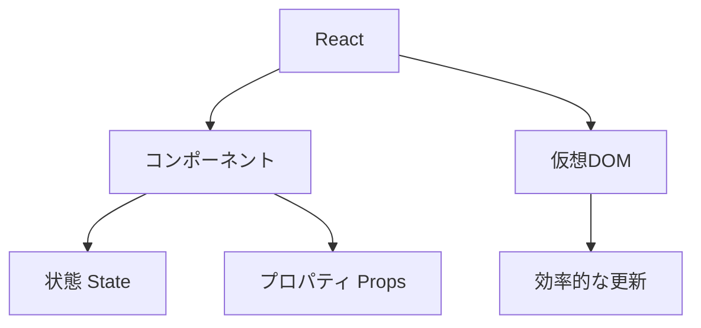
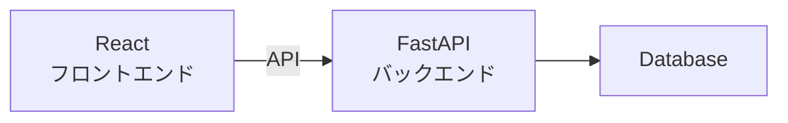

# Phase 2-1: React 入門

## 学習目標

この単元を終えると、以下ができるようになります：

- React の基本概念を説明できる
- コンポーネントを作成できる
- プロジェクトを作成できる

## 概念解説

### React とは



**React** = UI を構築するための JavaScript ライブラリ

### なぜ React か

| 特徴 | 説明 |
|------|------|
| コンポーネント | UI を部品として再利用 |
| 宣言的 | 「どう見せたいか」を書く |
| 仮想 DOM | 効率的な画面更新 |
| エコシステム | 豊富なライブラリ |

### バックエンドとの関係



あなたが作る FastAPI と連携する部分です。

## 環境構築

```bash
# Vite で React + TypeScript プロジェクト作成
npm create vite@latest my-app -- --template react-ts

cd my-app
npm install
npm run dev

# http://localhost:5173 で確認
```

### プロジェクト構成

```
my-app/
├── src/
│   ├── App.tsx         # メインコンポーネント
│   ├── main.tsx        # エントリーポイント
│   ├── App.css
│   └── index.css
├── index.html
├── package.json
├── tsconfig.json
└── vite.config.ts
```

## コンポーネント

### 関数コンポーネント

```tsx
// 最もシンプルなコンポーネント
function Hello() {
    return <h1>Hello, World!</h1>;
}

// アロー関数でも OK
const Hello = () => {
    return <h1>Hello, World!</h1>;
};

// 使用
function App() {
    return (
        <div>
            <Hello />
        </div>
    );
}
```

### JSX

```tsx
// JSX = JavaScript + XML
// HTML のように書けるが JavaScript

function Profile() {
    const name = "Alice";
    const age = 25;
    
    return (
        <div>
            <h1>{name}</h1>           {/* 変数を埋め込み */}
            <p>年齢: {age}歳</p>
            <p>来年: {age + 1}歳</p>  {/* 式も書ける */}
        </div>
    );
}
```

### JSX のルール

```tsx
// 1. 単一のルート要素が必要
// ❌ NG
function Bad() {
    return (
        <h1>Title</h1>
        <p>Content</p>
    );
}

// ✅ OK: div でラップ
function Good() {
    return (
        <div>
            <h1>Title</h1>
            <p>Content</p>
        </div>
    );
}

// ✅ OK: Fragment を使う（DOMに追加されない）
function Better() {
    return (
        <>
            <h1>Title</h1>
            <p>Content</p>
        </>
    );
}
```

```tsx
// 2. class ではなく className
<div className="container">

// 3. 閉じタグ必須

<input type="text" />

// 4. camelCase
<button onClick={handleClick}>   // onclick ではない
<label htmlFor="email">          // for ではない
```

### 条件付きレンダリング

```tsx
function Greeting({ isLoggedIn }: { isLoggedIn: boolean }) {
    // 三項演算子
    return (
        <div>
            {isLoggedIn ? (
                <p>ようこそ！</p>
            ) : (
                <p>ログインしてください</p>
            )}
        </div>
    );
}

// && を使う（条件が true の時だけ表示）
function Notification({ count }: { count: number }) {
    return (
        <div>
            {count > 0 && <span>通知: {count}件</span>}
        </div>
    );
}
```

### リストのレンダリング

```tsx
function UserList() {
    const users = [
        { id: 1, name: "Alice" },
        { id: 2, name: "Bob" },
        { id: 3, name: "Charlie" },
    ];
    
    return (
        <ul>
            {users.map(user => (
                <li key={user.id}>{user.name}</li>
            ))}
        </ul>
    );
}
```

**注意**: `key` は必須！React が要素を識別するために使います。

## ハンズオン

### 演習1: プロジェクト作成

```bash
npm create vite@latest react-practice -- --template react-ts
cd react-practice
npm install
npm run dev
```

### 演習2: 最初のコンポーネント

```tsx
// src/components/Welcome.tsx
function Welcome() {
    const currentDate = new Date().toLocaleDateString();
    
    return (
        <div style={{ textAlign: 'center', padding: '20px' }}>
            <h1>Welcome to React!</h1>
            <p>今日の日付: {currentDate}</p>
        </div>
    );
}

export default Welcome;
```

```tsx
// src/App.tsx
import Welcome from './components/Welcome';

function App() {
    return (
        <div>
            <Welcome />
        </div>
    );
}

export default App;
```

### 演習3: ユーザーカード

```tsx
// src/components/UserCard.tsx
interface User {
    name: string;
    email: string;
    role: string;
}

function UserCard() {
    const user: User = {
        name: "田中太郎",
        email: "tanaka@example.com",
        role: "エンジニア"
    };
    
    return (
        <div style={{
            border: '1px solid #ccc',
            borderRadius: '8px',
            padding: '16px',
            maxWidth: '300px'
        }}>
            <h2>{user.name}</h2>
            <p>📧 {user.email}</p>
            <p>💼 {user.role}</p>
        </div>
    );
}

export default UserCard;
```

### 演習4: ユーザーリスト

```tsx
// src/components/UserList.tsx
interface User {
    id: number;
    name: string;
    email: string;
}

function UserList() {
    const users: User[] = [
        { id: 1, name: "Alice", email: "alice@example.com" },
        { id: 2, name: "Bob", email: "bob@example.com" },
        { id: 3, name: "Charlie", email: "charlie@example.com" },
    ];
    
    return (
        <div>
            <h2>ユーザー一覧</h2>
            <table style={{ borderCollapse: 'collapse', width: '100%' }}>
                <thead>
                    <tr>
                        <th style={{ border: '1px solid #ccc', padding: '8px' }}>ID</th>
                        <th style={{ border: '1px solid #ccc', padding: '8px' }}>名前</th>
                        <th style={{ border: '1px solid #ccc', padding: '8px' }}>メール</th>
                    </tr>
                </thead>
                <tbody>
                    {users.map(user => (
                        <tr key={user.id}>
                            <td style={{ border: '1px solid #ccc', padding: '8px' }}>{user.id}</td>
                            <td style={{ border: '1px solid #ccc', padding: '8px' }}>{user.name}</td>
                            <td style={{ border: '1px solid #ccc', padding: '8px' }}>{user.email}</td>
                        </tr>
                    ))}
                </tbody>
            </table>
        </div>
    );
}

export default UserList;
```

## 理解度確認

### 問題

React でリストをレンダリングする際に必要なものはどれか。

**A.** id 属性

**B.** key 属性

**C.** index 属性

**D.** ref 属性

---

### 解答・解説

**正解: B**

```tsx
{items.map(item => (
    <li key={item.id}>{item.name}</li>
))}
```

`key` は React が要素を効率的に更新するために必要です。

---

## 次のステップ

React 入門を学びました。次は Props を学びましょう。

**次の単元**: [Phase 2-2: JSX と Props](./02_JSX_Props.md)
