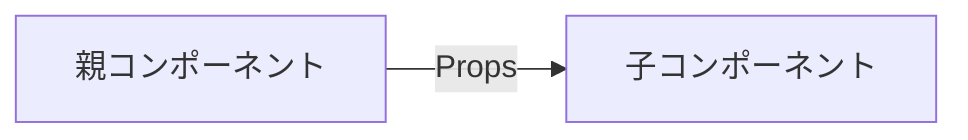

# Phase 2-2: JSX と Props

## 学習目標

この単元を終えると、以下ができるようになります：

- Props でデータを渡せる
- 再利用可能なコンポーネントを作れる
- children を使える

## Props とは



**Props** = 親から子に渡すデータ（関数の引数のようなもの）

## 基本的な Props

### Props を受け取る

```tsx
// 型定義
interface GreetingProps {
    name: string;
}

// Props を受け取る
function Greeting({ name }: GreetingProps) {
    return <h1>Hello, {name}!</h1>;
}

// 使用
function App() {
    return (
        <div>
            <Greeting name="Alice" />
            <Greeting name="Bob" />
        </div>
    );
}
```

### 複数の Props

```tsx
interface UserCardProps {
    name: string;
    email: string;
    age: number;
    isAdmin: boolean;
}

function UserCard({ name, email, age, isAdmin }: UserCardProps) {
    return (
        <div className="card">
            <h2>{name}</h2>
            <p>Email: {email}</p>
            <p>Age: {age}</p>
            {isAdmin && <span className="badge">Admin</span>}
        </div>
    );
}

// 使用
<UserCard 
    name="Alice" 
    email="alice@example.com" 
    age={25} 
    isAdmin={true} 
/>
```

### オプショナル Props

```tsx
interface ButtonProps {
    label: string;
    variant?: "primary" | "secondary";  // オプショナル
    disabled?: boolean;
}

function Button({ label, variant = "primary", disabled = false }: ButtonProps) {
    return (
        <button 
            className={`btn btn-${variant}`}
            disabled={disabled}
        >
            {label}
        </button>
    );
}

// 使用
<Button label="Submit" />
<Button label="Cancel" variant="secondary" />
<Button label="Save" disabled />
```

## children Props

```tsx
interface CardProps {
    title: string;
    children: React.ReactNode;  // 子要素
}

function Card({ title, children }: CardProps) {
    return (
        <div className="card">
            <h2>{title}</h2>
            <div className="card-body">
                {children}
            </div>
        </div>
    );
}

// 使用
<Card title="ユーザー情報">
    <p>名前: Alice</p>
    <p>Email: alice@example.com</p>
</Card>
```

## 関数を Props で渡す

```tsx
interface ButtonProps {
    label: string;
    onClick: () => void;  // 関数の型
}

function Button({ label, onClick }: ButtonProps) {
    return (
        <button onClick={onClick}>
            {label}
        </button>
    );
}

// 使用
function App() {
    const handleClick = () => {
        alert("Clicked!");
    };
    
    return <Button label="Click me" onClick={handleClick} />;
}
```

### 引数付きの関数

```tsx
interface UserItemProps {
    user: { id: number; name: string };
    onDelete: (id: number) => void;
}

function UserItem({ user, onDelete }: UserItemProps) {
    return (
        <li>
            {user.name}
            <button onClick={() => onDelete(user.id)}>
                削除
            </button>
        </li>
    );
}

// 使用
function UserList() {
    const users = [
        { id: 1, name: "Alice" },
        { id: 2, name: "Bob" },
    ];
    
    const handleDelete = (id: number) => {
        console.log(`Delete user ${id}`);
    };
    
    return (
        <ul>
            {users.map(user => (
                <UserItem 
                    key={user.id} 
                    user={user} 
                    onDelete={handleDelete} 
                />
            ))}
        </ul>
    );
}
```

## ハンズオン

### 演習1: 再利用可能なボタン

```tsx
// src/components/Button.tsx
interface ButtonProps {
    children: React.ReactNode;
    variant?: "primary" | "secondary" | "danger";
    size?: "small" | "medium" | "large";
    onClick?: () => void;
}

function Button({ 
    children, 
    variant = "primary", 
    size = "medium",
    onClick 
}: ButtonProps) {
    const baseStyles = {
        border: 'none',
        borderRadius: '4px',
        cursor: 'pointer',
    };
    
    const sizeStyles = {
        small: { padding: '4px 8px', fontSize: '12px' },
        medium: { padding: '8px 16px', fontSize: '14px' },
        large: { padding: '12px 24px', fontSize: '16px' },
    };
    
    const variantStyles = {
        primary: { backgroundColor: '#007bff', color: 'white' },
        secondary: { backgroundColor: '#6c757d', color: 'white' },
        danger: { backgroundColor: '#dc3545', color: 'white' },
    };
    
    return (
        <button 
            style={{ ...baseStyles, ...sizeStyles[size], ...variantStyles[variant] }}
            onClick={onClick}
        >
            {children}
        </button>
    );
}

export default Button;
```

```tsx
// App.tsx での使用
import Button from './components/Button';

function App() {
    return (
        <div style={{ display: 'flex', gap: '8px', padding: '20px' }}>
            <Button>Primary</Button>
            <Button variant="secondary">Secondary</Button>
            <Button variant="danger" size="large">Delete</Button>
            <Button size="small" onClick={() => alert('Clicked!')}>
                Small Button
            </Button>
        </div>
    );
}
```

### 演習2: カードコンポーネント

```tsx
// src/components/Card.tsx
interface CardProps {
    title: string;
    subtitle?: string;
    children: React.ReactNode;
    footer?: React.ReactNode;
}

function Card({ title, subtitle, children, footer }: CardProps) {
    return (
        <div style={{
            border: '1px solid #ddd',
            borderRadius: '8px',
            overflow: 'hidden',
            boxShadow: '0 2px 4px rgba(0,0,0,0.1)'
        }}>
            <div style={{ padding: '16px', borderBottom: '1px solid #ddd' }}>
                <h3 style={{ margin: 0 }}>{title}</h3>
                {subtitle && (
                    <p style={{ margin: '4px 0 0', color: '#666' }}>{subtitle}</p>
                )}
            </div>
            <div style={{ padding: '16px' }}>
                {children}
            </div>
            {footer && (
                <div style={{ padding: '16px', backgroundColor: '#f8f9fa' }}>
                    {footer}
                </div>
            )}
        </div>
    );
}

export default Card;
```

### 演習3: 商品カード

```tsx
// src/components/ProductCard.tsx
interface Product {
    id: number;
    name: string;
    price: number;
    image: string;
    inStock: boolean;
}

interface ProductCardProps {
    product: Product;
    onAddToCart: (product: Product) => void;
}

function ProductCard({ product, onAddToCart }: ProductCardProps) {
    return (
        <div style={{
            border: '1px solid #ddd',
            borderRadius: '8px',
            padding: '16px',
            width: '200px'
        }}>
            
            <h3>{product.name}</h3>
            <p style={{ fontSize: '18px', fontWeight: 'bold' }}>
                ¥{product.price.toLocaleString()}
            </p>
            <button
                onClick={() => onAddToCart(product)}
                disabled={!product.inStock}
                style={{
                    width: '100%',
                    padding: '8px',
                    backgroundColor: product.inStock ? '#007bff' : '#ccc',
                    color: 'white',
                    border: 'none',
                    borderRadius: '4px',
                    cursor: product.inStock ? 'pointer' : 'not-allowed'
                }}
            >
                {product.inStock ? 'カートに追加' : '在庫切れ'}
            </button>
        </div>
    );
}

export default ProductCard;
```

## 理解度確認

### 問題

以下のコンポーネントで、`onClick` が呼ばれるのはどのタイミングか。

```tsx
<Button onClick={() => console.log('clicked')}>
    Click
</Button>
```

**A.** コンポーネントがレンダリングされた時

**B.** ボタンがクリックされた時

**C.** Props が変更された時

**D.** コンポーネントがアンマウントされた時

---

### 解答・解説

**正解: B**

`onClick` はイベントハンドラです。ボタンがクリックされた時に実行されます。

レンダリング時に実行したい場合は：
```tsx
<Button onClick={console.log('clicked')}>  // これはNG（即座に実行される）
```

---

## 次のステップ

Props を学びました。次は State を学びましょう。

**次の単元**: [Phase 3-1: State 管理](../phase3/01_State管理.md)
