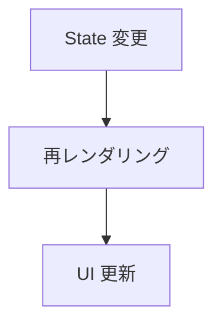

# Phase 3-1: State 管理

## 学習目標

この単元を終えると、以下ができるようになります：

- useState で状態を管理できる
- イベントハンドリングができる
- 状態に基づいて UI を更新できる

## State とは



**State** = コンポーネントが持つ「変化するデータ」

### Props vs State

| 項目 | Props | State |
|------|-------|-------|
| 変更者 | 親 | 自身 |
| 読み取り専用 | Yes | No |
| 用途 | データを渡す | データを管理する |

## useState

### 基本

```tsx
import { useState } from 'react';

function Counter() {
    // [現在の値, 更新関数] = useState(初期値)
    const [count, setCount] = useState(0);
    
    return (
        <div>
            <p>Count: {count}</p>
            <button onClick={() => setCount(count + 1)}>
                Increment
            </button>
        </div>
    );
}
```

### 型付き useState

```tsx
// 明示的に型を指定
const [count, setCount] = useState<number>(0);
const [name, setName] = useState<string>("");
const [isOpen, setIsOpen] = useState<boolean>(false);

// オブジェクト
interface User {
    name: string;
    email: string;
}
const [user, setUser] = useState<User | null>(null);

// 配列
const [items, setItems] = useState<string[]>([]);
```

## イベントハンドリング

### クリックイベント

```tsx
function Button() {
    const handleClick = () => {
        console.log('Clicked!');
    };
    
    // または直接書く
    return (
        <button onClick={handleClick}>
            Click me
        </button>
    );
}
```

### イベントオブジェクト

```tsx
function Button() {
    const handleClick = (event: React.MouseEvent<HTMLButtonElement>) => {
        console.log(event.target);
        event.preventDefault();  // デフォルト動作を防ぐ
    };
    
    return <button onClick={handleClick}>Click</button>;
}
```

### 入力イベント

```tsx
function Input() {
    const [value, setValue] = useState("");
    
    const handleChange = (event: React.ChangeEvent<HTMLInputElement>) => {
        setValue(event.target.value);
    };
    
    return (
        <input 
            type="text" 
            value={value} 
            onChange={handleChange} 
        />
    );
}
```

## ハンズオン

### 演習1: カウンター

```tsx
// src/components/Counter.tsx
import { useState } from 'react';

function Counter() {
    const [count, setCount] = useState(0);
    
    const increment = () => setCount(count + 1);
    const decrement = () => setCount(count - 1);
    const reset = () => setCount(0);
    
    return (
        <div style={{ textAlign: 'center', padding: '20px' }}>
            <h2>カウンター</h2>
            <p style={{ fontSize: '48px', margin: '20px' }}>{count}</p>
            <div style={{ display: 'flex', gap: '8px', justifyContent: 'center' }}>
                <button onClick={decrement}>-</button>
                <button onClick={reset}>Reset</button>
                <button onClick={increment}>+</button>
            </div>
        </div>
    );
}

export default Counter;
```

### 演習2: トグルスイッチ

```tsx
// src/components/Toggle.tsx
import { useState } from 'react';

function Toggle() {
    const [isOn, setIsOn] = useState(false);
    
    return (
        <div style={{ padding: '20px' }}>
            <button
                onClick={() => setIsOn(!isOn)}
                style={{
                    padding: '10px 20px',
                    backgroundColor: isOn ? '#28a745' : '#dc3545',
                    color: 'white',
                    border: 'none',
                    borderRadius: '20px',
                    cursor: 'pointer',
                    minWidth: '80px'
                }}
            >
                {isOn ? 'ON' : 'OFF'}
            </button>
        </div>
    );
}

export default Toggle;
```

### 演習3: 文字数カウンター

```tsx
// src/components/CharacterCounter.tsx
import { useState } from 'react';

function CharacterCounter() {
    const [text, setText] = useState("");
    const maxLength = 100;
    
    const handleChange = (e: React.ChangeEvent<HTMLTextAreaElement>) => {
        if (e.target.value.length <= maxLength) {
            setText(e.target.value);
        }
    };
    
    const remaining = maxLength - text.length;
    
    return (
        <div style={{ padding: '20px' }}>
            <h3>メッセージ入力</h3>
            <textarea
                value={text}
                onChange={handleChange}
                rows={4}
                style={{ width: '100%', padding: '8px' }}
                placeholder="メッセージを入力..."
            />
            <p style={{ 
                color: remaining < 20 ? 'red' : 'gray',
                textAlign: 'right'
            }}>
                残り {remaining} 文字
            </p>
        </div>
    );
}

export default CharacterCounter;
```

### 演習4: TODO リスト

```tsx
// src/components/TodoList.tsx
import { useState } from 'react';

interface Todo {
    id: number;
    text: string;
    completed: boolean;
}

function TodoList() {
    const [todos, setTodos] = useState<Todo[]>([]);
    const [input, setInput] = useState("");
    
    const addTodo = () => {
        if (!input.trim()) return;
        
        const newTodo: Todo = {
            id: Date.now(),
            text: input,
            completed: false
        };
        
        setTodos([...todos, newTodo]);
        setInput("");
    };
    
    const toggleTodo = (id: number) => {
        setTodos(todos.map(todo => 
            todo.id === id 
                ? { ...todo, completed: !todo.completed }
                : todo
        ));
    };
    
    const deleteTodo = (id: number) => {
        setTodos(todos.filter(todo => todo.id !== id));
    };
    
    return (
        <div style={{ padding: '20px', maxWidth: '400px' }}>
            <h2>TODO リスト</h2>
            
            <div style={{ display: 'flex', gap: '8px', marginBottom: '16px' }}>
                <input
                    type="text"
                    value={input}
                    onChange={(e) => setInput(e.target.value)}
                    onKeyDown={(e) => e.key === 'Enter' && addTodo()}
                    placeholder="新しいタスク..."
                    style={{ flex: 1, padding: '8px' }}
                />
                <button onClick={addTodo}>追加</button>
            </div>
            
            <ul style={{ listStyle: 'none', padding: 0 }}>
                {todos.map(todo => (
                    <li 
                        key={todo.id}
                        style={{
                            display: 'flex',
                            alignItems: 'center',
                            gap: '8px',
                            padding: '8px',
                            borderBottom: '1px solid #eee'
                        }}
                    >
                        <input
                            type="checkbox"
                            checked={todo.completed}
                            onChange={() => toggleTodo(todo.id)}
                        />
                        <span style={{
                            flex: 1,
                            textDecoration: todo.completed ? 'line-through' : 'none',
                            color: todo.completed ? '#999' : 'inherit'
                        }}>
                            {todo.text}
                        </span>
                        <button 
                            onClick={() => deleteTodo(todo.id)}
                            style={{ color: 'red' }}
                        >
                            ✕
                        </button>
                    </li>
                ))}
            </ul>
            
            {todos.length > 0 && (
                <p style={{ color: '#666', fontSize: '14px' }}>
                    {todos.filter(t => !t.completed).length} 件の未完了タスク
                </p>
            )}
        </div>
    );
}

export default TodoList;
```

## State 更新の注意点

### 直接変更しない

```tsx
// ❌ NG: 直接変更
const [items, setItems] = useState([1, 2, 3]);
items.push(4);  // これはダメ

// ✅ OK: 新しい配列を作る
setItems([...items, 4]);
```

### オブジェクトも同様

```tsx
const [user, setUser] = useState({ name: "Alice", age: 25 });

// ❌ NG
user.age = 26;

// ✅ OK
setUser({ ...user, age: 26 });
```

## 理解度確認

### 問題

useState で配列に要素を追加する正しい方法はどれか。

```tsx
const [items, setItems] = useState<string[]>([]);
```

**A.** `items.push("new")`

**B.** `setItems(items.push("new"))`

**C.** `setItems([...items, "new"])`

**D.** `setItems(items + "new")`

---

### 解答・解説

**正解: C**

State は直接変更せず、新しい配列/オブジェクトを渡します。

```tsx
setItems([...items, "new"]);  // スプレッド演算子で展開
```

---

## 次のステップ

State 管理を学びました。次は useEffect を学びましょう。

**次の単元**: [Phase 3-2: 副作用](./02_副作用.md)
