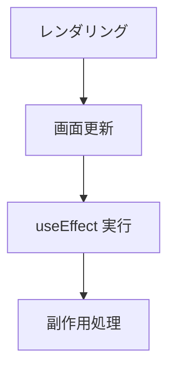

# Phase 3-2: 副作用（useEffect）

## 学習目標

この単元を終えると、以下ができるようになります：

- useEffect で副作用を扱える
- API からデータを取得できる
- クリーンアップを実装できる

## useEffect とは



**useEffect** = レンダリング後に実行される処理

### 副作用とは

| 副作用 | 例 |
|--------|-----|
| データ取得 | API 呼び出し |
| DOM 操作 | タイトル変更 |
| 購読 | イベントリスナー |
| タイマー | setInterval |

## 基本的な使い方

### 毎回実行

```tsx
import { useEffect, useState } from 'react';

function Component() {
    const [count, setCount] = useState(0);
    
    // 毎回のレンダリング後に実行
    useEffect(() => {
        console.log('Rendered!');
        document.title = `Count: ${count}`;
    });
    
    return <button onClick={() => setCount(count + 1)}>{count}</button>;
}
```

### マウント時のみ（初回のみ）

```tsx
useEffect(() => {
    console.log('Mounted!');
    // 初期データ取得など
}, []);  // 空の依存配列
```

### 特定の値が変わった時

```tsx
useEffect(() => {
    console.log(`Count changed to ${count}`);
}, [count]);  // count が変わった時のみ実行
```

### クリーンアップ

```tsx
useEffect(() => {
    const timer = setInterval(() => {
        console.log('tick');
    }, 1000);
    
    // クリーンアップ関数（アンマウント時に実行）
    return () => {
        clearInterval(timer);
    };
}, []);
```

## API 連携

### 基本的なデータ取得

```tsx
import { useState, useEffect } from 'react';

interface User {
    id: number;
    name: string;
    email: string;
}

function UserList() {
    const [users, setUsers] = useState<User[]>([]);
    const [loading, setLoading] = useState(true);
    const [error, setError] = useState<string | null>(null);
    
    useEffect(() => {
        const fetchUsers = async () => {
            try {
                const response = await fetch('/api/users');
                if (!response.ok) throw new Error('Failed to fetch');
                const data = await response.json();
                setUsers(data);
            } catch (e) {
                setError(e instanceof Error ? e.message : 'Unknown error');
            } finally {
                setLoading(false);
            }
        };
        
        fetchUsers();
    }, []);  // マウント時のみ
    
    if (loading) return <p>Loading...</p>;
    if (error) return <p>Error: {error}</p>;
    
    return (
        <ul>
            {users.map(user => (
                <li key={user.id}>{user.name}</li>
            ))}
        </ul>
    );
}
```

## ハンズオン

### 演習1: ドキュメントタイトル

```tsx
// src/components/TitleChanger.tsx
import { useState, useEffect } from 'react';

function TitleChanger() {
    const [title, setTitle] = useState("My App");
    
    useEffect(() => {
        document.title = title;
    }, [title]);
    
    return (
        <div style={{ padding: '20px' }}>
            <h3>ページタイトル変更</h3>
            <input
                type="text"
                value={title}
                onChange={(e) => setTitle(e.target.value)}
                style={{ padding: '8px', width: '300px' }}
            />
            <p style={{ color: '#666' }}>現在のタイトル: {title}</p>
        </div>
    );
}

export default TitleChanger;
```

### 演習2: 現在時刻

```tsx
// src/components/Clock.tsx
import { useState, useEffect } from 'react';

function Clock() {
    const [time, setTime] = useState(new Date());
    
    useEffect(() => {
        const timer = setInterval(() => {
            setTime(new Date());
        }, 1000);
        
        return () => clearInterval(timer);
    }, []);
    
    return (
        <div style={{ 
            padding: '20px', 
            fontSize: '48px', 
            fontFamily: 'monospace',
            textAlign: 'center'
        }}>
            {time.toLocaleTimeString('ja-JP')}
        </div>
    );
}

export default Clock;
```

### 演習3: API からデータ取得

```tsx
// src/components/Posts.tsx
import { useState, useEffect } from 'react';

interface Post {
    id: number;
    title: string;
    body: string;
}

function Posts() {
    const [posts, setPosts] = useState<Post[]>([]);
    const [loading, setLoading] = useState(true);
    const [error, setError] = useState<string | null>(null);
    
    useEffect(() => {
        const fetchPosts = async () => {
            try {
                const response = await fetch(
                    'https://jsonplaceholder.typicode.com/posts?_limit=5'
                );
                if (!response.ok) throw new Error('Failed to fetch');
                const data = await response.json();
                setPosts(data);
            } catch (e) {
                setError(e instanceof Error ? e.message : 'Unknown error');
            } finally {
                setLoading(false);
            }
        };
        
        fetchPosts();
    }, []);
    
    if (loading) {
        return <div style={{ padding: '20px' }}>Loading...</div>;
    }
    
    if (error) {
        return <div style={{ padding: '20px', color: 'red' }}>Error: {error}</div>;
    }
    
    return (
        <div style={{ padding: '20px' }}>
            <h2>Posts</h2>
            {posts.map(post => (
                <div 
                    key={post.id} 
                    style={{ 
                        border: '1px solid #ddd', 
                        padding: '16px', 
                        marginBottom: '8px',
                        borderRadius: '4px'
                    }}
                >
                    <h3>{post.title}</h3>
                    <p>{post.body}</p>
                </div>
            ))}
        </div>
    );
}

export default Posts;
```

### 演習4: 検索機能

```tsx
// src/components/UserSearch.tsx
import { useState, useEffect } from 'react';

interface User {
    id: number;
    name: string;
    email: string;
}

function UserSearch() {
    const [query, setQuery] = useState("");
    const [users, setUsers] = useState<User[]>([]);
    const [loading, setLoading] = useState(false);
    
    useEffect(() => {
        if (!query) {
            setUsers([]);
            return;
        }
        
        // デバウンス
        const timer = setTimeout(async () => {
            setLoading(true);
            try {
                const response = await fetch(
                    `https://jsonplaceholder.typicode.com/users?name_like=${query}`
                );
                const data = await response.json();
                setUsers(data);
            } finally {
                setLoading(false);
            }
        }, 300);
        
        return () => clearTimeout(timer);
    }, [query]);
    
    return (
        <div style={{ padding: '20px' }}>
            <h2>ユーザー検索</h2>
            <input
                type="text"
                value={query}
                onChange={(e) => setQuery(e.target.value)}
                placeholder="名前で検索..."
                style={{ padding: '8px', width: '300px' }}
            />
            
            {loading && <p>検索中...</p>}
            
            <ul style={{ listStyle: 'none', padding: 0 }}>
                {users.map(user => (
                    <li 
                        key={user.id}
                        style={{ 
                            padding: '8px', 
                            borderBottom: '1px solid #eee' 
                        }}
                    >
                        <strong>{user.name}</strong>
                        <br />
                        <small>{user.email}</small>
                    </li>
                ))}
            </ul>
        </div>
    );
}

export default UserSearch;
```

## よくある間違い

### 無限ループ

```tsx
// ❌ 無限ループになる
useEffect(() => {
    setCount(count + 1);  // State 更新 → 再レンダリング → useEffect → ...
});

// ✅ 依存配列を指定
useEffect(() => {
    // 初回のみ
}, []);
```

### 依存配列の不足

```tsx
// ❌ userId が変わっても再取得されない
useEffect(() => {
    fetchUser(userId);
}, []);

// ✅ userId を依存配列に追加
useEffect(() => {
    fetchUser(userId);
}, [userId]);
```

## 理解度確認

### 問題

useEffect のクリーンアップ関数が実行されるタイミングはどれか。

**A.** コンポーネントがマウントされた時

**B.** useEffect が実行される前

**C.** コンポーネントがアンマウントされる時

**D.** State が更新された時

---

### 解答・解説

**正解: C（+ B も正しい）**

クリーンアップ関数は：
1. コンポーネントがアンマウントされる時
2. 次の useEffect が実行される前（依存値が変わった時）

に実行されます。

```tsx
useEffect(() => {
    // 副作用
    return () => {
        // クリーンアップ
    };
}, [dependency]);
```

---

## 次のステップ

副作用を学びました。次はフォームを学びましょう。

**次の単元**: [Phase 4-1: フォーム](../phase4/01_フォーム.md)
