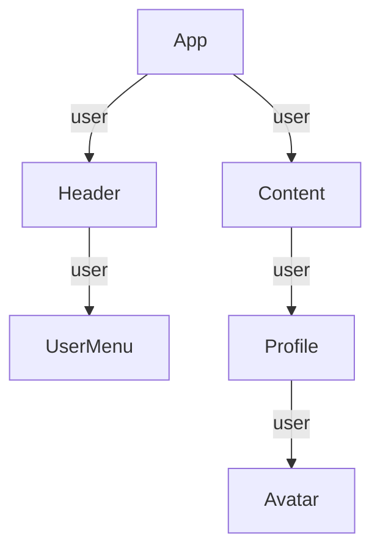

# Phase 5-1: 状態管理

## 学習目標

この単元を終えると、以下ができるようになります：

- Context で状態を共有できる
- Zustand で状態管理できる
- 適切な状態管理を選択できる

## Props drilling の問題



深い階層に Props を渡すのは大変...

## Context API

### 基本

```tsx
// src/contexts/AuthContext.tsx
import { createContext, useContext, useState, ReactNode } from 'react';

interface User {
    id: number;
    name: string;
    email: string;
}

interface AuthContextType {
    user: User | null;
    login: (email: string, password: string) => Promise<void>;
    logout: () => void;
    isAuthenticated: boolean;
}

const AuthContext = createContext<AuthContextType | null>(null);

export function AuthProvider({ children }: { children: ReactNode }) {
    const [user, setUser] = useState<User | null>(null);
    
    const login = async (email: string, password: string) => {
        // API 呼び出し
        const response = await fetch('/api/login', {
            method: 'POST',
            body: JSON.stringify({ email, password })
        });
        const userData = await response.json();
        setUser(userData);
    };
    
    const logout = () => {
        setUser(null);
    };
    
    return (
        <AuthContext.Provider value={{
            user,
            login,
            logout,
            isAuthenticated: !!user
        }}>
            {children}
        </AuthContext.Provider>
    );
}

export function useAuth() {
    const context = useContext(AuthContext);
    if (!context) {
        throw new Error('useAuth must be used within AuthProvider');
    }
    return context;
}
```

```tsx
// main.tsx
import { AuthProvider } from './contexts/AuthContext';

ReactDOM.createRoot(document.getElementById('root')!).render(
    <AuthProvider>
        <App />
    </AuthProvider>
);
```

```tsx
// どこからでも使える
function UserMenu() {
    const { user, logout, isAuthenticated } = useAuth();
    
    if (!isAuthenticated) {
        return <Link to="/login">ログイン</Link>;
    }
    
    return (
        <div>
            <span>{user?.name}</span>
            <button onClick={logout}>ログアウト</button>
        </div>
    );
}
```

## Zustand

軽量で使いやすい状態管理ライブラリ

```bash
npm install zustand
```

### 基本

```tsx
// src/stores/useCounterStore.ts
import { create } from 'zustand';

interface CounterState {
    count: number;
    increment: () => void;
    decrement: () => void;
    reset: () => void;
}

const useCounterStore = create<CounterState>((set) => ({
    count: 0,
    increment: () => set((state) => ({ count: state.count + 1 })),
    decrement: () => set((state) => ({ count: state.count - 1 })),
    reset: () => set({ count: 0 }),
}));

export default useCounterStore;
```

```tsx
// 使用
import useCounterStore from './stores/useCounterStore';

function Counter() {
    const { count, increment, decrement } = useCounterStore();
    
    return (
        <div>
            <p>{count}</p>
            <button onClick={decrement}>-</button>
            <button onClick={increment}>+</button>
        </div>
    );
}
```

### ショッピングカート

```tsx
// src/stores/useCartStore.ts
import { create } from 'zustand';
import { persist } from 'zustand/middleware';

interface CartItem {
    id: number;
    name: string;
    price: number;
    quantity: number;
}

interface CartState {
    items: CartItem[];
    addItem: (item: Omit<CartItem, 'quantity'>) => void;
    removeItem: (id: number) => void;
    updateQuantity: (id: number, quantity: number) => void;
    clearCart: () => void;
    total: () => number;
}

const useCartStore = create<CartState>()(
    persist(
        (set, get) => ({
            items: [],
            
            addItem: (item) => set((state) => {
                const existing = state.items.find(i => i.id === item.id);
                if (existing) {
                    return {
                        items: state.items.map(i =>
                            i.id === item.id
                                ? { ...i, quantity: i.quantity + 1 }
                                : i
                        )
                    };
                }
                return { items: [...state.items, { ...item, quantity: 1 }] };
            }),
            
            removeItem: (id) => set((state) => ({
                items: state.items.filter(i => i.id !== id)
            })),
            
            updateQuantity: (id, quantity) => set((state) => ({
                items: state.items.map(i =>
                    i.id === id ? { ...i, quantity } : i
                )
            })),
            
            clearCart: () => set({ items: [] }),
            
            total: () => {
                return get().items.reduce(
                    (sum, item) => sum + item.price * item.quantity,
                    0
                );
            }
        }),
        {
            name: 'cart-storage',  // localStorage のキー
        }
    )
);

export default useCartStore;
```

```tsx
// src/components/Cart.tsx
import useCartStore from '../stores/useCartStore';

function Cart() {
    const { items, removeItem, updateQuantity, total, clearCart } = useCartStore();
    
    if (items.length === 0) {
        return <p>カートは空です</p>;
    }
    
    return (
        <div style={{ padding: '20px' }}>
            <h2>🛒 カート</h2>
            {items.map(item => (
                <div 
                    key={item.id}
                    style={{
                        display: 'flex',
                        alignItems: 'center',
                        gap: '16px',
                        padding: '12px',
                        borderBottom: '1px solid #eee'
                    }}
                >
                    <span style={{ flex: 1 }}>{item.name}</span>
                    <span>¥{item.price.toLocaleString()}</span>
                    <input
                        type="number"
                        value={item.quantity}
                        onChange={(e) => updateQuantity(item.id, Number(e.target.value))}
                        min={1}
                        style={{ width: '60px', padding: '4px' }}
                    />
                    <button onClick={() => removeItem(item.id)}>削除</button>
                </div>
            ))}
            <div style={{ marginTop: '20px', textAlign: 'right' }}>
                <p style={{ fontSize: '24px', fontWeight: 'bold' }}>
                    合計: ¥{total().toLocaleString()}
                </p>
                <button onClick={clearCart}>カートを空にする</button>
            </div>
        </div>
    );
}

export default Cart;
```

## 状態管理の選択

| 状態の種類 | 推奨 |
|-----------|------|
| ローカル（1コンポーネント） | useState |
| 共有（親子間） | Props |
| グローバル（認証など） | Context or Zustand |
| 複雑なグローバル | Zustand |
| サーバー状態 | TanStack Query |

## 理解度確認

### 問題

Zustand で状態を更新する正しい方法はどれか。

```tsx
const useStore = create((set) => ({
    count: 0,
    // どう書く？
}));
```

**A.** `increment: () => count++`

**B.** `increment: () => set({ count: count + 1 })`

**C.** `increment: () => set((state) => ({ count: state.count + 1 }))`

**D.** `increment: () => this.count++`

---

### 解答・解説

**正解: C**

```tsx
increment: () => set((state) => ({ count: state.count + 1 }))
```

`set` 関数に更新関数を渡すことで、現在の状態を基に新しい状態を作成します。

---

## 次のステップ

状態管理を学びました。次はデータフェッチを学びましょう。

**次の単元**: [Phase 5-2: データフェッチ](./02_データフェッチ.md)
