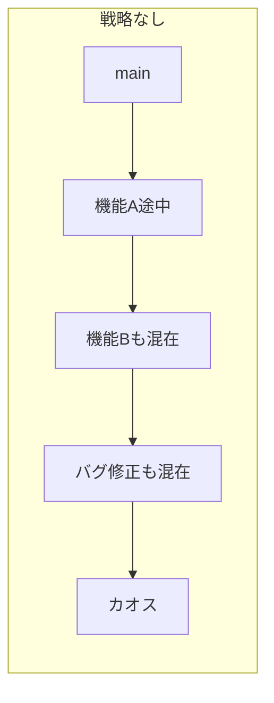
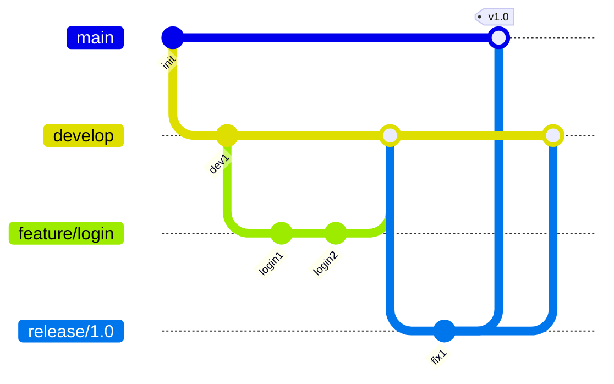
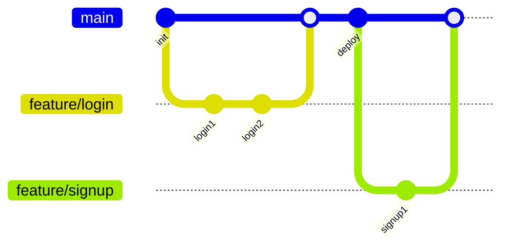

# Phase 1-1: ブランチ戦略 ～ チーム開発の基盤 ～

## 学習目標

この単元を終えると、以下ができるようになります：

- Git Flow と GitHub Flow の違いを説明できる
- プロジェクトに適したブランチ戦略を選択できる
- ブランチ命名規則を理解・実践できる

## 概念解説

### なぜブランチ戦略が必要か？



| 問題 | 影響 |
|------|------|
| 本番に未完成コードが入る | 障害発生 |
| 誰が何を作業中か不明 | 作業の衝突 |
| リリース範囲が不明確 | デプロイ失敗 |

### Git Flow



| ブランチ | 役割 |
|---------|------|
| main | 本番リリース済み |
| develop | 開発統合 |
| feature/* | 機能開発 |
| release/* | リリース準備 |
| hotfix/* | 本番緊急修正 |

**向いているプロジェクト**: 明確なリリースサイクルがある、バージョン管理が必要

### GitHub Flow



| ルール | 内容 |
|--------|------|
| main は常にデプロイ可能 | テスト済みコードのみ |
| 機能ブランチから PR | レビュー必須 |
| マージ後すぐデプロイ | 継続的デリバリー |

**向いているプロジェクト**: 継続的デプロイ、SaaS、小〜中規模チーム

## ハンズオン

### 演習1: Git Flow の実践

```bash
mkdir -p ~/git-practice/gitflow-demo
cd ~/git-practice/gitflow-demo
git init

# main ブランチ
echo "# My App" > README.md
git add . && git commit -m "Initial commit"

# develop ブランチ作成
git checkout -b develop
echo "Development branch" >> README.md
git add . && git commit -m "Setup develop branch"

# feature ブランチで機能開発
git checkout -b feature/user-auth
echo "User authentication module" > auth.py
git add . && git commit -m "feat: add user authentication"

echo "def login(): pass" >> auth.py
git add . && git commit -m "feat: implement login function"

# develop にマージ
git checkout develop
git merge --no-ff feature/user-auth -m "Merge feature/user-auth"

# feature ブランチ削除
git branch -d feature/user-auth

# release ブランチ
git checkout -b release/1.0
echo "version = '1.0.0'" > version.py
git add . && git commit -m "chore: bump version to 1.0.0"

# main にマージしてタグ付け
git checkout main
git merge --no-ff release/1.0 -m "Release 1.0.0"
git tag -a v1.0.0 -m "Version 1.0.0"

# develop にもマージ
git checkout develop
git merge --no-ff release/1.0 -m "Merge release/1.0 into develop"

git branch -d release/1.0

# 履歴確認
git log --oneline --graph --all
```

### 演習2: GitHub Flow の実践

```bash
mkdir -p ~/git-practice/ghflow-demo
cd ~/git-practice/ghflow-demo
git init

echo "# API Server" > README.md
git add . && git commit -m "Initial commit"

# 機能ブランチで開発
git checkout -b feature/add-health-endpoint
echo "from flask import Flask
app = Flask(__name__)

@app.route('/health')
def health():
    return {'status': 'ok'}" > app.py
git add . && git commit -m "feat: add health check endpoint"

# main にマージ（実際は PR 経由）
git checkout main
git merge --no-ff feature/add-health-endpoint -m "Merge PR #1: Add health endpoint"
git branch -d feature/add-health-endpoint

# 別の機能
git checkout -b fix/improve-health-response
echo "from flask import Flask, jsonify
app = Flask(__name__)

@app.route('/health')
def health():
    return jsonify({'status': 'ok', 'version': '1.0'})" > app.py
git add . && git commit -m "fix: improve health response format"

git checkout main
git merge --no-ff fix/improve-health-response -m "Merge PR #2: Improve health response"
git branch -d fix/improve-health-response

git log --oneline --graph
```

### 演習3: ブランチ命名規則

```bash
cd ~/git-practice/ghflow-demo

# 良い命名例
git checkout -b feature/user-registration    # 機能追加
git checkout main
git checkout -b fix/login-error-handling     # バグ修正
git checkout main
git checkout -b docs/update-readme           # ドキュメント
git checkout main
git checkout -b refactor/extract-auth-module # リファクタリング
git checkout main
git checkout -b chore/update-dependencies    # 雑務
git checkout main

# Issue 番号を含める場合
git checkout -b feature/123-user-registration
git checkout main
git checkout -b fix/456-null-pointer-exception
git checkout main

# ブランチ一覧
git branch

# 不要なブランチ削除
git branch -D feature/user-registration fix/login-error-handling docs/update-readme refactor/extract-auth-module chore/update-dependencies feature/123-user-registration fix/456-null-pointer-exception
```

## ブランチ戦略比較

| 観点 | Git Flow | GitHub Flow |
|------|----------|-------------|
| 複雑さ | 高 | 低 |
| リリース頻度 | 定期的 | 継続的 |
| ブランチ数 | 多い | 少ない |
| 向いている規模 | 大規模 | 小〜中規模 |

## 理解度確認

### 問題

SaaS プロダクトで「1日に複数回デプロイし、機能は PR ベースでレビューする」チームに最適なブランチ戦略はどれか。

**A.** Git Flow（develop, release ブランチを使用）

**B.** GitHub Flow（main + feature ブランチのみ）

**C.** trunk-based development（main のみ）

**D.** 各自自由にブランチを作成

---

### 解答・解説

**正解: B**

- **A.** Git Flow は定期リリースに向いており、頻繁なデプロイには複雑すぎる。
- **B.** 正解。シンプルで継続的デプロイに最適、PR レビューも組み込まれている。
- **C.** 非常に成熟したチームには良いが、レビュープロセスが別途必要。
- **D.** 混乱を招き、品質管理ができない。

---

## まとめ

| 戦略 | 特徴 |
|------|------|
| Git Flow | 定期リリース、バージョン管理 |
| GitHub Flow | シンプル、継続的デプロイ |
| 命名規則 | feature/, fix/, docs/ など |

## 次のステップ

ブランチ戦略を学びました。次はマージとリベースについて学びましょう。

**次の単元**: [Phase 1-2: マージ戦略](./02_マージ戦略.md)
