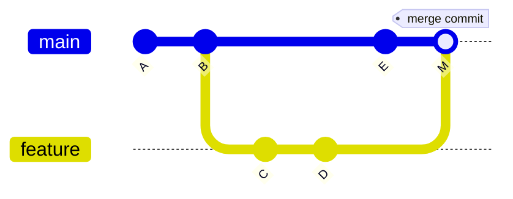
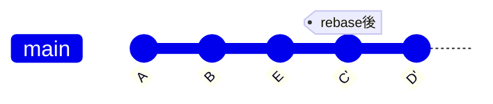
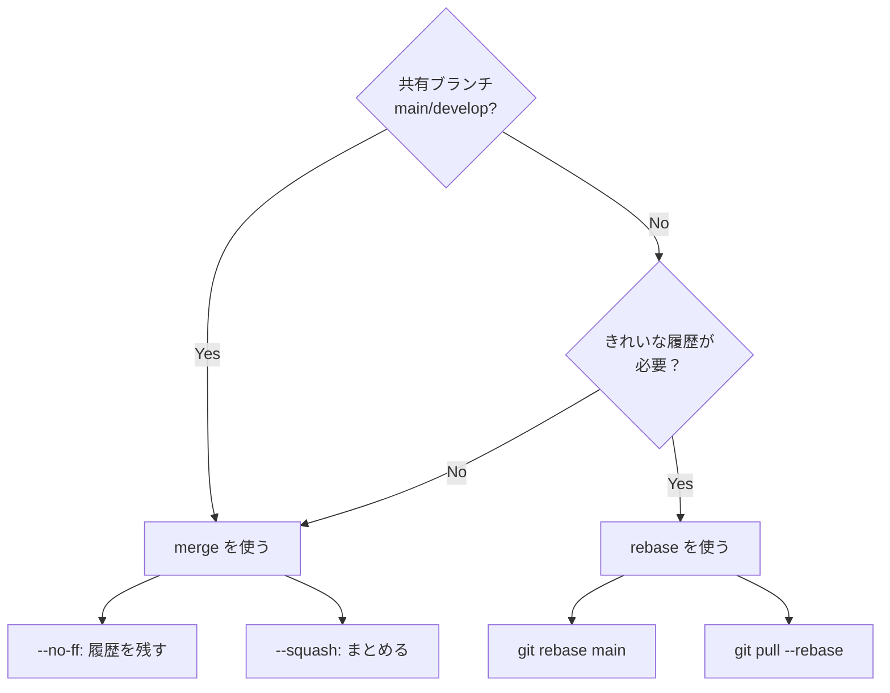

# Phase 1-2: マージ戦略 ～ merge vs rebase ～

## 学習目標

この単元を終えると、以下ができるようになります：

- merge と rebase の違いを説明できる
- 状況に応じて適切な戦略を選択できる
- Fast-forward と Non-fast-forward を使い分けられる

## 概念解説

### Merge（マージ）



**特徴**: 履歴を保持、マージコミットが作成される

### Rebase（リベース）



**特徴**: 直線的な履歴、コミットが「付け替え」られる

### 比較

| 観点 | merge | rebase |
|------|-------|--------|
| 履歴 | 分岐が残る | 直線的 |
| 安全性 | 高（元を変えない） | 注意必要 |
| コンフリクト | 1回で解決 | コミットごとに発生の可能性 |
| 共有ブランチ | ✅ 安全 | ⚠️ 危険 |

## ハンズオン

### 演習1: 基本的な Merge

```bash
mkdir -p ~/git-practice/merge-demo
cd ~/git-practice/merge-demo
git init

echo "line 1" > file.txt
git add . && git commit -m "Initial commit"

# feature ブランチで作業
git checkout -b feature/add-lines
echo "line 2" >> file.txt
git add . && git commit -m "Add line 2"
echo "line 3" >> file.txt
git add . && git commit -m "Add line 3"

# main でも変更
git checkout main
echo "main line" >> main.txt
git add . && git commit -m "Add main.txt"

# merge（マージコミット作成）
git merge --no-ff feature/add-lines -m "Merge feature/add-lines"

git log --oneline --graph
```

### 演習2: Fast-forward Merge

```bash
cd ~/git-practice/merge-demo

# main が進んでいない状態で feature をマージ
git checkout -b feature/quick-fix
echo "quick fix" >> quick.txt
git add . && git commit -m "Quick fix"

git checkout main
git merge feature/quick-fix  # --ff（デフォルト）

git log --oneline --graph
# マージコミットなし、直線的

# 明示的に Fast-forward
git checkout -b feature/another
echo "another" >> another.txt
git add . && git commit -m "Another feature"

git checkout main
git merge --ff-only feature/another
```

### 演習3: Rebase の基本

```bash
mkdir -p ~/git-practice/rebase-demo
cd ~/git-practice/rebase-demo
git init

echo "base" > file.txt
git add . && git commit -m "Initial"

# main で変更
echo "main change" >> file.txt
git add . && git commit -m "Main change"

# feature ブランチ（古い main から分岐）
git checkout HEAD~1
git checkout -b feature/new
echo "feature" > feature.txt
git add . && git commit -m "Feature 1"
echo "feature 2" >> feature.txt
git add . && git commit -m "Feature 2"

# 現在の状態確認
git log --oneline --graph --all

# rebase で main の最新に付け替え
git rebase main

git log --oneline --graph --all
# feature のコミットが main の後に移動

# main にマージ（Fast-forward）
git checkout main
git merge feature/new

git log --oneline --graph
```

### 演習4: pull --rebase

```bash
mkdir -p ~/git-practice/pull-rebase
cd ~/git-practice/pull-rebase
git init --bare remote.git

# クローン1
git clone remote.git user1
cd user1
echo "initial" > file.txt
git add . && git commit -m "Initial"
git push origin main
cd ..

# クローン2
git clone remote.git user2
cd user2

# user1 が先に push
cd ../user1
echo "user1 change" >> file.txt
git add . && git commit -m "User1 change"
git push
cd ../user2

# user2 がローカルでコミット
echo "user2 change" > user2.txt
git add . && git commit -m "User2 change"

# 通常の pull（merge）
# git pull  # マージコミットが作成される

# pull --rebase（履歴がきれい）
git pull --rebase origin main

git log --oneline --graph
# User2 のコミットが User1 の後に

git push
```

### 演習5: 安全な Rebase のルール

```bash
cd ~/git-practice/rebase-demo

# ★ 重要：push 済みのコミットを rebase しない！
# 
# ❌ やってはいけない
# git checkout main
# git rebase feature  # main は共有ブランチ
#
# ✅ OK
# git checkout feature  # ローカルのみの feature ブランチ
# git rebase main       # main の最新を取り込む

# push 済みを確認する方法
git log origin/main..main --oneline
# 何も表示されない = 全て push 済み
```

### 演習6: Squash Merge

```bash
mkdir -p ~/git-practice/squash-demo
cd ~/git-practice/squash-demo
git init

echo "base" > file.txt
git add . && git commit -m "Initial"

git checkout -b feature/many-commits
echo "1" >> file.txt && git add . && git commit -m "WIP 1"
echo "2" >> file.txt && git add . && git commit -m "WIP 2"
echo "3" >> file.txt && git add . && git commit -m "Fix typo"
echo "4" >> file.txt && git add . && git commit -m "Done"

# 通常のマージ：4つのコミットが履歴に残る
# git checkout main && git merge feature/many-commits

# Squash merge：1つのコミットにまとめる
git checkout main
git merge --squash feature/many-commits
git commit -m "feat: add numbers feature"

git log --oneline
# 1つのコミットだけ
```

## マージ戦略の選択



## 理解度確認

### 問題

feature ブランチで作業中、main に他のメンバーの変更がマージされた。feature ブランチに main の最新を取り込む方法として、履歴が最もきれいになるのはどれか。（feature ブランチはまだ push していない）

**A.** `git checkout feature && git merge main`

**B.** `git checkout feature && git rebase main`

**C.** `git checkout main && git merge feature`

**D.** `git checkout main && git rebase feature`

---

### 解答・解説

**正解: B**

- **A.** merge だとマージコミットが作成され、履歴が複雑になる。
- **B.** 正解。push 前の feature を rebase すれば、main の最新の後に feature のコミットが直線的に並ぶ。
- **C.** これは feature を main に取り込む操作で、質問と逆。
- **D.** main は共有ブランチなので rebase してはいけない。

---

## まとめ

| 操作 | 用途 |
|------|------|
| merge --no-ff | 履歴を残してマージ |
| merge --ff | 直線的にマージ（分岐なし時） |
| merge --squash | 複数コミットを1つに |
| rebase | ブランチの付け替え |
| pull --rebase | pull 時に rebase |

## 次のステップ

マージ戦略を学びました。次はコンフリクトの解決方法を学びましょう。

**次の単元**: [Phase 2-1: コンフリクト解決](../phase2/01_コンフリクト解決.md)
