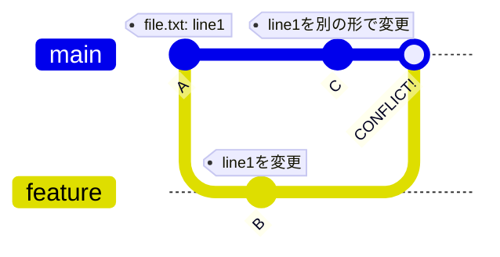

# Phase 2-1: コンフリクト解決 ～ 競合を恐れない ～

## 学習目標

この単元を終えると、以下ができるようになります：

- コンフリクトが発生する原因を理解できる
- コンフリクトを手動で解決できる
- VS Code でコンフリクトを解決できる
- コンフリクトを予防する方法を実践できる

## 概念解説

### コンフリクトとは



**同じ行を異なる方法で変更した時に発生**

### コンフリクトマーカー

```
<<<<<<< HEAD
main での変更内容
=======
feature での変更内容
>>>>>>> feature/branch-name
```

## ハンズオン

### 演習1: コンフリクトを発生させる

```bash
mkdir -p ~/git-practice/conflict-demo
cd ~/git-practice/conflict-demo
git init

# 初期ファイル
cat << 'EOF' > greeting.py
def greet(name):
    return f"Hello, {name}!"

def main():
    print(greet("World"))

if __name__ == "__main__":
    main()
EOF
git add . && git commit -m "Initial: greeting.py"

# feature ブランチで変更
git checkout -b feature/japanese
cat << 'EOF' > greeting.py
def greet(name):
    return f"こんにちは、{name}さん！"

def main():
    print(greet("世界"))

if __name__ == "__main__":
    main()
EOF
git add . && git commit -m "feat: Japanese greeting"

# main で別の変更
git checkout main
cat << 'EOF' > greeting.py
def greet(name):
    return f"Hi there, {name}!"

def main():
    print(greet("World"))
    print("Welcome!")

if __name__ == "__main__":
    main()
EOF
git add . && git commit -m "feat: casual greeting"

# マージを試みる
git merge feature/japanese
# CONFLICT!
```

### 演習2: 手動でコンフリクト解決

```bash
# コンフリクトの状態を確認
git status

# ファイルの中身を確認
cat greeting.py
# コンフリクトマーカーが見える

# 手動で編集（両方の変更を活かす）
cat << 'EOF' > greeting.py
def greet(name, lang="en"):
    if lang == "ja":
        return f"こんにちは、{name}さん！"
    return f"Hi there, {name}!"

def main():
    print(greet("World"))
    print(greet("世界", "ja"))
    print("Welcome!")

if __name__ == "__main__":
    main()
EOF

# 解決をマーク
git add greeting.py

# コミット
git commit -m "Merge feature/japanese with conflict resolution"

git log --oneline --graph
```

### 演習3: VS Code でコンフリクト解決

```bash
mkdir -p ~/git-practice/vscode-conflict
cd ~/git-practice/vscode-conflict
git init

cat << 'EOF' > config.json
{
  "app": {
    "name": "MyApp",
    "version": "1.0.0",
    "debug": false
  }
}
EOF
git add . && git commit -m "Initial config"

# feature ブランチ
git checkout -b feature/dev-mode
cat << 'EOF' > config.json
{
  "app": {
    "name": "MyApp",
    "version": "1.0.0",
    "debug": true,
    "logLevel": "debug"
  }
}
EOF
git add . && git commit -m "Enable debug mode"

# main で変更
git checkout main
cat << 'EOF' > config.json
{
  "app": {
    "name": "MyApp",
    "version": "1.1.0",
    "debug": false,
    "apiUrl": "https://api.example.com"
  }
}
EOF
git add . && git commit -m "Update version and add API URL"

# コンフリクト発生
git merge feature/dev-mode

# VS Code で開く
code .
# Source Control パネルでコンフリクトを確認
# "Accept Both Changes" などのボタンで解決
```

### 演習4: rebase 時のコンフリクト

```bash
mkdir -p ~/git-practice/rebase-conflict
cd ~/git-practice/rebase-conflict
git init

echo "base content" > file.txt
git add . && git commit -m "Initial"

# main で変更
echo "main change 1" >> file.txt
git add . && git commit -m "Main change 1"

# feature ブランチ（古い状態から）
git checkout HEAD~1
git checkout -b feature/changes
echo "feature change" >> file.txt
git add . && git commit -m "Feature change"

# rebase でコンフリクト
git rebase main

# コンフリクト解決
cat file.txt  # マーカー確認
cat << 'EOF' > file.txt
base content
main change 1
feature change
EOF

git add file.txt
git rebase --continue

git log --oneline --graph
```

### 演習5: コンフリクトの中断

```bash
cd ~/git-practice/rebase-conflict
git checkout main

git checkout -b feature/test
echo "test" > test.txt
git add . && git commit -m "Test"

git checkout main
echo "main test" > test.txt
git add . && git commit -m "Main test"

# マージ開始
git merge feature/test

# やっぱりやめたい
git merge --abort

git status
# clean な状態に戻る
```

### 演習6: コンフリクト予防

```bash
# 1. こまめに main を取り込む
git checkout feature/my-branch
git fetch origin
git rebase origin/main  # または git merge origin/main

# 2. 小さなコミットを心がける
# 大きな変更 = コンフリクト範囲が大きい

# 3. 同じファイルを同時に編集しない
# コミュニケーションで調整

# 4. .gitattributes で自動マージ設定
echo "package-lock.json merge=ours" >> .gitattributes
```

## コンフリクト解決のベストプラクティス

```markdown
## 解決の流れ
1. git status で競合ファイルを確認
2. ファイルを開いてマーカーを確認
3. 両方の変更の意図を理解
4. 適切に編集（両方活かす/片方選ぶ/新しく書く）
5. git add でステージング
6. git commit（merge）または git rebase --continue

## やってはいけないこと
- マーカーを残したままコミット
- 理解せずに片方を選ぶ
- テストせずにコミット
```

## 理解度確認

### 問題

以下のコンフリクトを解決する際、最も適切な対応はどれか。

```
<<<<<<< HEAD
const timeout = 5000;
=======
const timeout = 10000;
>>>>>>> feature/increase-timeout
```

**A.** HEAD（5000）を選択する

**B.** feature（10000）を選択する

**C.** 両方の変更の意図を確認し、適切な値を決める

**D.** マーカーを残したままコミットする

---

### 解答・解説

**正解: C**

コンフリクトは「どちらが正しいか」ではなく「何が必要か」を考えて解決します。

- なぜ 5000 だったのか？
- なぜ 10000 に変更したのか？
- 本当に必要な値は何か？

機械的に選ぶのではなく、コードの意図を理解することが重要です。

---

## まとめ

| 状況 | コマンド |
|------|---------|
| コンフリクト確認 | git status |
| マージ中断 | git merge --abort |
| rebase 中断 | git rebase --abort |
| 解決後 | git add + git commit |
| rebase 解決後 | git add + git rebase --continue |

## 次のステップ

コンフリクト解決を学びました。次は履歴の書き換えについて学びましょう。

**次の単元**: [Phase 2-2: 履歴の書き換え](./02_履歴の書き換え.md)
