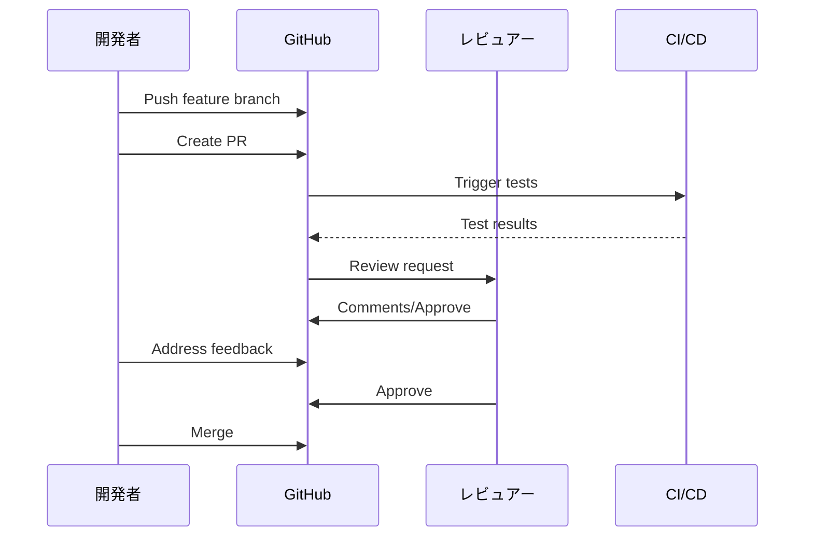

# Phase 3-1: PR 運用 ～ チーム開発の要 ～

## 学習目標

この単元を終えると、以下ができるようになります：

- 効果的な PR を作成できる
- コードレビューのポイントを理解できる
- CI/CD との連携を設定できる
- PR テンプレートを活用できる

## 概念解説

### PR (Pull Request) とは



### 良い PR の条件

| 観点 | 良い例 | 悪い例 |
|------|--------|--------|
| サイズ | 200-400行の変更 | 2000行以上の変更 |
| スコープ | 1つの機能/修正 | 複数の無関係な変更 |
| タイトル | "feat: ユーザー登録機能追加" | "修正" |
| 説明 | 背景・変更内容・テスト方法 | 空 |

## ハンズオン

### 演習1: PR テンプレートの作成

```bash
mkdir -p ~/git-practice/pr-demo/.github
cd ~/git-practice/pr-demo
git init

# PR テンプレート作成
cat << 'EOF' > .github/pull_request_template.md
## 概要
<!-- この PR で何を実現するか -->


## 変更内容
<!-- 主な変更点をリストアップ -->
- 

## 関連 Issue
<!-- 関連する Issue があれば -->
Closes #

## 確認事項
<!-- レビュアーに確認してほしいポイント -->
- 

## テスト
<!-- どのようにテストしたか -->
- [ ] ユニットテスト追加
- [ ] 手動テスト実施
- [ ] 既存テストが通ることを確認

## スクリーンショット
<!-- UI 変更がある場合 -->

## チェックリスト
- [ ] コードスタイルに従っている
- [ ] ドキュメントを更新した
- [ ] 破壊的変更がある場合、その旨を記載した
EOF

git add . && git commit -m "Add PR template"
```

### 演習2: 良い PR の書き方

```bash
cd ~/git-practice/pr-demo

# 機能開発
git checkout -b feature/user-registration

cat << 'EOF' > user.py
class User:
    def __init__(self, email: str, password: str):
        self.email = email
        self.password_hash = self._hash_password(password)
    
    def _hash_password(self, password: str) -> str:
        import hashlib
        return hashlib.sha256(password.encode()).hexdigest()
    
    def validate_email(self) -> bool:
        return '@' in self.email and '.' in self.email
EOF

cat << 'EOF' > test_user.py
from user import User

def test_user_creation():
    user = User("test@example.com", "password123")
    assert user.email == "test@example.com"
    assert user.password_hash != "password123"

def test_email_validation():
    user = User("test@example.com", "pass")
    assert user.validate_email() == True
    
    invalid_user = User("invalid", "pass")
    assert invalid_user.validate_email() == False
EOF

git add . && git commit -m "feat: add User class with registration"

# PR 作成時の説明文例
cat << 'EOF'
## 概要
ユーザー登録機能の基盤となる User クラスを追加します。

## 変更内容
- User クラスの追加
  - メールアドレスとパスワードでのインスタンス化
  - パスワードの SHA256 ハッシュ化
  - メールアドレスのバリデーション
- ユニットテストの追加

## 関連 Issue
Closes #123

## テスト
- [x] ユニットテスト追加（test_user.py）
- [x] 手動テスト実施

## チェックリスト
- [x] コードスタイルに従っている
- [x] 型ヒントを追加した
EOF
```

### 演習3: コードレビューのポイント

```markdown
## レビューで確認すること

### 機能面
- [ ] 要件を満たしているか
- [ ] エッジケースの処理
- [ ] エラーハンドリング

### コード品質
- [ ] 命名は適切か
- [ ] 複雑すぎないか
- [ ] 重複はないか

### セキュリティ
- [ ] 入力値のバリデーション
- [ ] 機密情報のハードコード
- [ ] SQL インジェクション等

### パフォーマンス
- [ ] N+1 クエリ
- [ ] 不要なループ
- [ ] メモリ使用量

### テスト
- [ ] 十分なカバレッジ
- [ ] 境界値のテスト
```

### 演習4: レビューコメントの書き方

```markdown
## 良いコメントの例

### 質問形式
> この処理を別メソッドに切り出す意図がありますか？
> 再利用性のためであれば、もう少し汎用的にしても良いかもしれません。

### 提案形式
> ```suggestion
> if user is None:
>     raise ValueError("User not found")
> ```
> 早期リターンにすると、ネストが浅くなり読みやすくなります。

### 褒める
> この部分の設計、とても良いですね！

### 重要度を明示
> [nit] 変数名 `tmp` より `user_count` の方が意図が伝わりそうです
> [must] ここは SQL インジェクションの可能性があります

## 悪いコメントの例
- "これはダメ" （理由がない）
- "全部書き直して" （具体性がない）
- "なんでこうしたの？" （攻撃的）
```

### 演習5: GitHub Actions との連携

```bash
cd ~/git-practice/pr-demo
mkdir -p .github/workflows

cat << 'EOF' > .github/workflows/pr-check.yml
name: PR Check

on:
  pull_request:
    branches: [main]

jobs:
  test:
    runs-on: ubuntu-latest
    steps:
      - uses: actions/checkout@v4
      
      - name: Set up Python
        uses: actions/setup-python@v5
        with:
          python-version: '3.11'
      
      - name: Install dependencies
        run: pip install pytest
      
      - name: Run tests
        run: pytest

  lint:
    runs-on: ubuntu-latest
    steps:
      - uses: actions/checkout@v4
      
      - name: Set up Python
        uses: actions/setup-python@v5
        with:
          python-version: '3.11'
      
      - name: Install linter
        run: pip install flake8
      
      - name: Run linter
        run: flake8 . --max-line-length=100
EOF

git add . && git commit -m "Add PR check workflow"
```

### 演習6: ブランチ保護ルール

```markdown
## GitHub での設定手順

1. リポジトリ Settings → Branches
2. Add branch protection rule
3. Branch name pattern: `main`

## 推奨設定
- [x] Require a pull request before merging
  - [x] Require approvals: 1
  - [x] Dismiss stale pull request approvals
- [x] Require status checks to pass before merging
  - [x] Require branches to be up to date
  - 追加: test, lint
- [x] Require conversation resolution before merging
- [ ] Include administrators（管理者も対象にする場合）
```

## PR 運用のベストプラクティス

```markdown
## 作成者として
1. 小さな PR を心がける（レビューしやすい）
2. セルフレビューを先に行う
3. テストが通ることを確認してから作成
4. 説明文を丁寧に書く
5. レビューコメントには真摯に対応

## レビュアーとして
1. 24時間以内にレビュー開始
2. 建設的なコメントを心がける
3. 良い点も指摘する
4. 重要度を明示する（nit/should/must）
5. 承認は責任を持って
```

## 理解度確認

### 問題

PR のレビューで「このメソッド、テストがないですね」というコメントを受けた。最も適切な対応はどれか。

**A.** 反論する：「時間がなかったので」

**B.** 無視して Merge する

**C.** テストを追加してコミットし、レビュアーに再確認を依頼

**D.** 「後で対応します」とコメントして Merge する

---

### 解答・解説

**正解: C**

- **A.** 言い訳は問題解決にならない。
- **B.** レビューの指摘を無視するのは信頼を損なう。
- **C.** 正解。指摘を受けて改善し、確認を依頼するのが適切。
- **D.** 「後で」は往々にして「永遠に」になる。

---

## まとめ

| 項目 | ポイント |
|------|---------|
| PR サイズ | 小さく、焦点を絞る |
| 説明文 | 背景・変更内容・テスト方法 |
| レビュー | 建設的に、重要度を明示 |
| CI/CD | 自動テスト・リント |
| ブランチ保護 | レビュー必須化 |

## 次のステップ

PR 運用を学びました。次は GitHub の便利な機能を活用する方法を学びましょう。

**次の単元**: [Phase 3-2: GitHub 機能活用](./02_GitHub機能活用.md)
