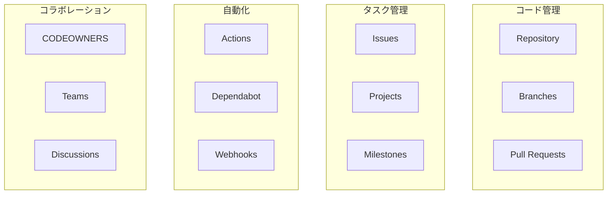

# Phase 3-2: GitHub 機能活用 ～ Issues, Projects, Actions ～

## 学習目標

この単元を終えると、以下ができるようになります：

- Issues でタスク管理ができる
- Projects でプロジェクト管理ができる
- GitHub Actions で自動化ができる
- コードオーナーを設定できる

## ハンズオン

### 演習1: Issue テンプレート

```bash
mkdir -p ~/git-practice/github-features/.github/ISSUE_TEMPLATE
cd ~/git-practice/github-features
git init

# バグ報告テンプレート
cat << 'EOF' > .github/ISSUE_TEMPLATE/bug_report.md
---
name: バグ報告
about: 不具合を報告する
title: '[BUG] '
labels: bug
assignees: ''
---

## バグの概要
<!-- 発生している問題を簡潔に -->

## 再現手順
1. 
2. 
3. 

## 期待される動作
<!-- 本来どうなるべきか -->

## 実際の動作
<!-- 実際に何が起きたか -->

## 環境
- OS: 
- ブラウザ: 
- バージョン: 

## スクリーンショット
<!-- あれば添付 -->

## 追加情報
<!-- 関連する情報 -->
EOF

# 機能リクエストテンプレート
cat << 'EOF' > .github/ISSUE_TEMPLATE/feature_request.md
---
name: 機能リクエスト
about: 新機能の提案
title: '[FEATURE] '
labels: enhancement
assignees: ''
---

## 機能の概要
<!-- どんな機能が欲しいか -->

## 背景・動機
<!-- なぜこの機能が必要か -->

## 提案する解決策
<!-- どう実現するか -->

## 代替案
<!-- 他に検討した方法があれば -->

## 追加情報
<!-- 参考リンクなど -->
EOF

git add . && git commit -m "Add issue templates"
```

### 演習2: GitHub Actions ワークフロー

```bash
mkdir -p .github/workflows

# CI ワークフロー
cat << 'EOF' > .github/workflows/ci.yml
name: CI

on:
  push:
    branches: [main, develop]
  pull_request:
    branches: [main]

jobs:
  build:
    runs-on: ubuntu-latest
    
    strategy:
      matrix:
        python-version: ['3.10', '3.11', '3.12']
    
    steps:
      - uses: actions/checkout@v4
      
      - name: Set up Python ${{ matrix.python-version }}
        uses: actions/setup-python@v5
        with:
          python-version: ${{ matrix.python-version }}
      
      - name: Cache pip
        uses: actions/cache@v4
        with:
          path: ~/.cache/pip
          key: ${{ runner.os }}-pip-${{ hashFiles('requirements.txt') }}
      
      - name: Install dependencies
        run: |
          pip install -r requirements.txt
          pip install pytest pytest-cov
      
      - name: Run tests with coverage
        run: pytest --cov=. --cov-report=xml
      
      - name: Upload coverage
        uses: codecov/codecov-action@v3
        with:
          file: ./coverage.xml
EOF

# 自動ラベル付け
cat << 'EOF' > .github/workflows/labeler.yml
name: Labeler

on:
  pull_request:
    types: [opened]

jobs:
  label:
    runs-on: ubuntu-latest
    steps:
      - uses: actions/labeler@v5
        with:
          repo-token: "${{ secrets.GITHUB_TOKEN }}"
EOF

cat << 'EOF' > .github/labeler.yml
documentation:
  - '**/*.md'
  - 'docs/**'

tests:
  - 'tests/**'
  - '**/*_test.py'

frontend:
  - 'src/frontend/**'
  - '**/*.tsx'
  - '**/*.css'

backend:
  - 'src/backend/**'
  - '**/*.py'
EOF

git add . && git commit -m "Add GitHub Actions workflows"
```

### 演習3: CODEOWNERS

```bash
# コードオーナー設定
cat << 'EOF' > .github/CODEOWNERS
# デフォルトオーナー
* @default-owner

# フロントエンド
/src/frontend/ @frontend-team
*.tsx @frontend-team
*.css @frontend-team

# バックエンド
/src/backend/ @backend-team
*.py @backend-team

# インフラ
/terraform/ @infra-team
/docker/ @infra-team
Dockerfile @infra-team

# ドキュメント
*.md @docs-team
/docs/ @docs-team

# セキュリティ関連は必ずセキュリティチームがレビュー
/auth/ @security-team
**/security/** @security-team
EOF

git add . && git commit -m "Add CODEOWNERS"
```

### 演習4: 自動リリース

```bash
cat << 'EOF' > .github/workflows/release.yml
name: Release

on:
  push:
    tags:
      - 'v*'

jobs:
  release:
    runs-on: ubuntu-latest
    
    steps:
      - uses: actions/checkout@v4
        with:
          fetch-depth: 0
      
      - name: Generate changelog
        id: changelog
        uses: metcalfc/changelog-generator@v4
        with:
          myToken: ${{ secrets.GITHUB_TOKEN }}
      
      - name: Create Release
        uses: actions/create-release@v1
        env:
          GITHUB_TOKEN: ${{ secrets.GITHUB_TOKEN }}
        with:
          tag_name: ${{ github.ref_name }}
          release_name: Release ${{ github.ref_name }}
          body: ${{ steps.changelog.outputs.changelog }}
          draft: false
          prerelease: false
EOF

git add . && git commit -m "Add release workflow"
```

### 演習5: Dependabot 設定

```bash
cat << 'EOF' > .github/dependabot.yml
version: 2
updates:
  # Python 依存関係
  - package-ecosystem: "pip"
    directory: "/"
    schedule:
      interval: "weekly"
    open-pull-requests-limit: 5
    labels:
      - "dependencies"
      - "python"
  
  # GitHub Actions
  - package-ecosystem: "github-actions"
    directory: "/"
    schedule:
      interval: "weekly"
    labels:
      - "dependencies"
      - "ci"
  
  # npm（フロントエンド）
  - package-ecosystem: "npm"
    directory: "/frontend"
    schedule:
      interval: "weekly"
    labels:
      - "dependencies"
      - "frontend"
EOF

git add . && git commit -m "Add Dependabot config"
```

### 演習6: GitHub Projects（概念）

```markdown
## GitHub Projects の活用

### ボード構成例
| カラム | 説明 |
|--------|------|
| Backlog | 未着手のタスク |
| Ready | 着手可能 |
| In Progress | 作業中 |
| In Review | レビュー中 |
| Done | 完了 |

### 自動化ルール
- Issue 作成 → Backlog に追加
- PR 作成 → In Progress に移動
- PR レビュー依頼 → In Review に移動
- PR マージ → Done に移動

### ラベル運用
| ラベル | 色 | 説明 |
|--------|-----|------|
| bug | red | バグ |
| enhancement | blue | 機能追加 |
| documentation | green | ドキュメント |
| good first issue | purple | 初心者向け |
| help wanted | yellow | 助けが必要 |
| priority: high | orange | 優先度高 |
```

### 演習7: セキュリティ設定

```bash
# セキュリティポリシー
cat << 'EOF' > .github/SECURITY.md
# セキュリティポリシー

## サポートバージョン

| バージョン | サポート状況 |
|-----------|-------------|
| 2.x       | ✅ サポート中 |
| 1.x       | ⚠️ セキュリティ修正のみ |
| < 1.0     | ❌ サポート終了 |

## 脆弱性の報告

セキュリティ上の問題を発見した場合：

1. **公開 Issue を作成しないでください**
2. security@example.com にメールでご報告ください
3. 以下の情報をお含めください：
   - 脆弱性の説明
   - 再現手順
   - 影響範囲
   - 可能であれば修正案

## 対応プロセス

1. 報告受領後、3営業日以内に確認の連絡
2. 問題の調査・修正
3. 修正版のリリース
4. 報告者へのクレジット（希望する場合）
EOF

git add . && git commit -m "Add security policy"
```

## GitHub 機能まとめ



## 理解度確認

### 問題

チームで開発中、フロントエンドのコードが変更された PR は必ずフロントエンドチームがレビューするようにしたい。最も適切な方法はどれか。

**A.** PR 作成時に手動でレビュアーを指定する

**B.** CODEOWNERS ファイルでフロントエンドファイルのオーナーを設定

**C.** GitHub Actions でフロントエンドチームに Slack 通知

**D.** ブランチ保護ルールで全員の承認を必須にする

---

### 解答・解説

**正解: B**

- **A.** 手動だと忘れる可能性がある。
- **B.** 正解。CODEOWNERS でパスとオーナーを紐づけると、自動でレビュアーに追加される。
- **C.** 通知はできるが、レビュー必須にはならない。
- **D.** 全員の承認は過剰、関係ない人も巻き込む。

---

## まとめ

| 機能 | 用途 |
|------|------|
| Issue Templates | 報告フォーマット統一 |
| CODEOWNERS | 自動レビュアー割り当て |
| GitHub Actions | CI/CD 自動化 |
| Dependabot | 依存関係の自動更新 |
| Projects | プロジェクト管理 |

## 次のステップ

GitHub の機能を学びました。最後に総仕上げとしてチーム開発をシミュレーションしましょう。

**次の単元**: [Phase 4: 総仕上げ](../phase4/01_総仕上げ.md)
