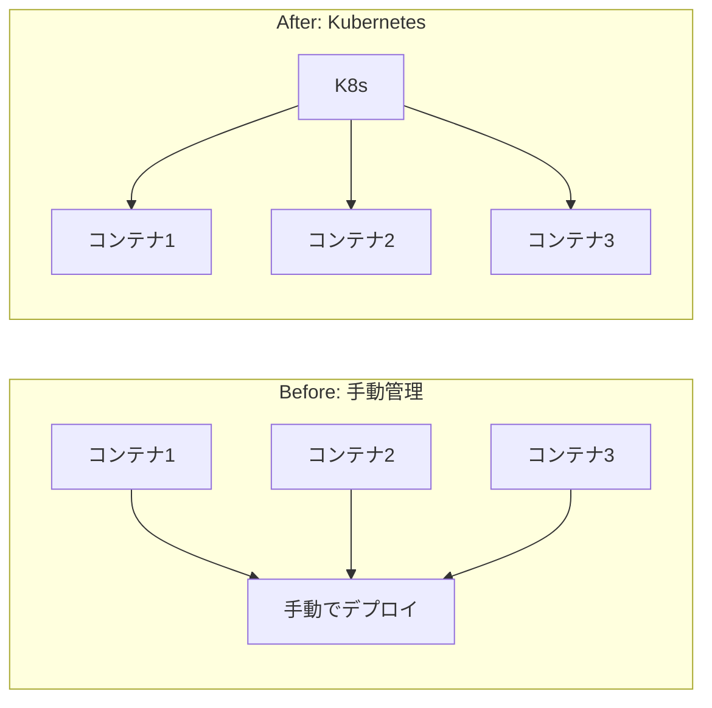
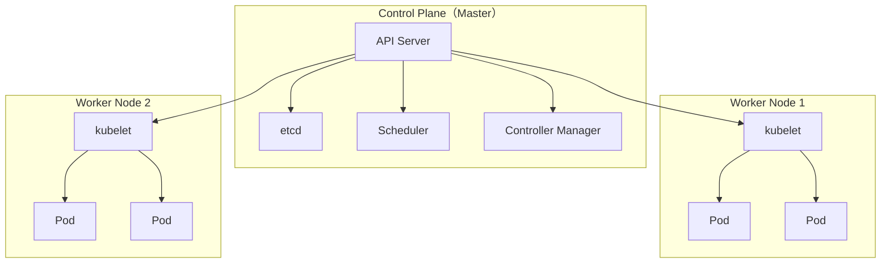
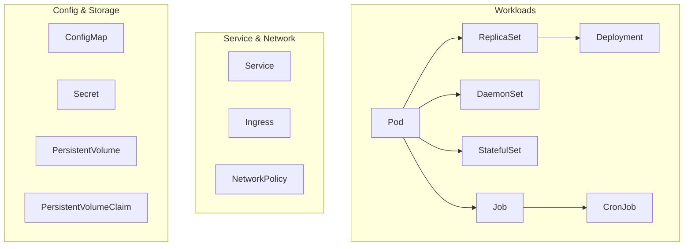

# Phase 1-1: Kubernetes とは

## 学習目標

この単元を終えると、以下ができるようになります：

- Kubernetes の目的と利点を説明できる
- 主要なコンポーネントを説明できる
- Pod、Node、Cluster の関係を理解できる

## 概念解説

### なぜ Kubernetes が必要か



### Kubernetes が解決する課題

| 課題 | Kubernetes の解決策 |
|------|---------------------|
| スケーリング | 自動でPodを増減 |
| 障害復旧 | 自動で再起動・再配置 |
| ロードバランシング | Service による負荷分散 |
| ローリングアップデート | ダウンタイムなしでデプロイ |
| 設定管理 | ConfigMap / Secret |
| ストレージ | PersistentVolume |

### アーキテクチャ



### 主要コンポーネント

| コンポーネント | 役割 |
|---------------|------|
| API Server | 全ての操作の入口 |
| etcd | クラスタの状態を保存するDB |
| Scheduler | Pod を適切な Node に配置 |
| Controller Manager | リソースの状態を監視・調整 |
| kubelet | Node 上で Pod を管理 |
| kube-proxy | ネットワークルーティング |

## ハンズオン

### 演習1: クラスタ情報の確認

```bash
# クラスタ情報
kubectl cluster-info

# ノード一覧
kubectl get nodes

# ノードの詳細
kubectl describe node minikube
```

### 演習2: 名前空間

```bash
# 名前空間一覧
kubectl get namespaces

# 名前空間の作成
kubectl create namespace dev

# 名前空間を指定してリソース作成
kubectl run nginx --image=nginx -n dev

# 確認
kubectl get pods -n dev

# 名前空間削除（中のリソースも削除）
kubectl delete namespace dev
```

### 演習3: リソースの基本構造（YAML）

```yaml
# pod.yaml
apiVersion: v1        # APIバージョン
kind: Pod             # リソースタイプ
metadata:             # メタデータ
  name: my-nginx
  labels:
    app: nginx
spec:                 # 仕様
  containers:
  - name: nginx
    image: nginx:1.25
    ports:
    - containerPort: 80
```

```bash
# YAML からリソース作成
kubectl apply -f pod.yaml

# 確認
kubectl get pods

# 削除
kubectl delete -f pod.yaml
```

### 演習4: 宣言的 vs 命令的

```bash
# 命令的（Imperative）- その場でリソース作成
kubectl run nginx --image=nginx
kubectl create deployment web --image=nginx

# 宣言的（Declarative）- YAML で定義して適用
kubectl apply -f deployment.yaml
```

**推奨**: 本番環境では**宣言的**アプローチ（YAML管理）を使用

### AWS との比較

| Kubernetes | AWS ECS/EKS | 説明 |
|-----------|-------------|------|
| Cluster | ECS Cluster | コンテナ実行環境 |
| Node | EC2 Instance | コンテナを動かすサーバー |
| Pod | Task | コンテナの実行単位 |
| Deployment | Service | 複数のタスクを管理 |
| Service | Load Balancer | 負荷分散 |
| Namespace | - | 論理的な分離 |

## 主要なリソースタイプ



| カテゴリ | リソース | 用途 |
|---------|---------|------|
| Workload | Pod | 最小のデプロイ単位 |
| | Deployment | ステートレスアプリ |
| | StatefulSet | ステートフルアプリ |
| | DaemonSet | 全ノードで1つずつ |
| | Job/CronJob | バッチ処理 |
| Network | Service | 内部ロードバランサ |
| | Ingress | 外部公開 |
| Config | ConfigMap | 設定データ |
| | Secret | 機密データ |
| Storage | PV/PVC | 永続ストレージ |

## 理解度確認

### 問題

Kubernetes で「Pod をどの Node に配置するか」を決定するコンポーネントはどれか。

**A.** API Server

**B.** etcd

**C.** Scheduler

**D.** kubelet

---

### 解答・解説

**正解: C**

- **Scheduler** は Pod の配置先を決定
- リソース要求、アフィニティ、テイント/トレラントを考慮
- 決定後、API Server 経由で kubelet に通知

```
新しいPod → API Server → Scheduler（配置決定）→ kubelet（実行）
```

---

## 次のステップ

Kubernetes の基本概念を学びました。次は Pod について詳しく学びましょう。

**次の単元**: [Phase 2-1: Pod 基礎](../phase2/01_Pod基礎.md)
