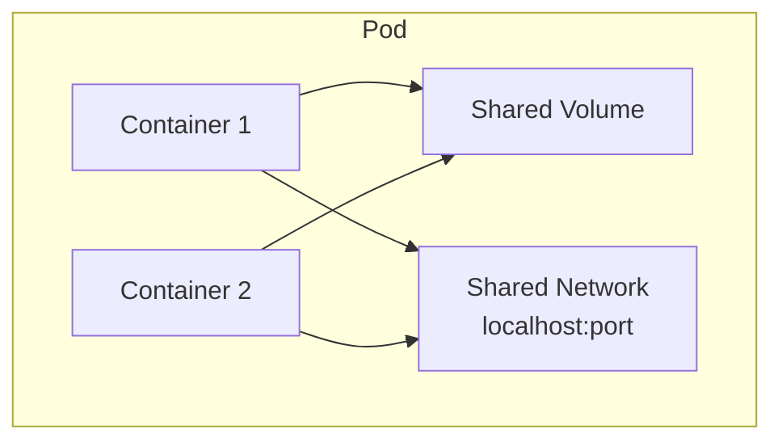
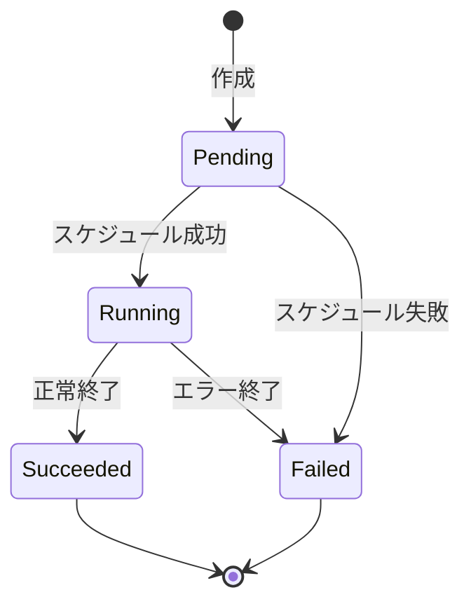

# Phase 2-1: Pod 基礎

## 学習目標

この単元を終えると、以下ができるようになります：

- Pod の概念を説明できる
- YAML で Pod を定義・作成できる
- Pod のライフサイクルを理解できる

## 概念解説

### Pod とは



- **Pod** = 1つ以上のコンテナをまとめた最小デプロイ単位
- 同じ Pod 内のコンテナは：
  - 同じ IP アドレスを共有
  - localhost で通信可能
  - Volume を共有可能

### Pod のライフサイクル



| 状態 | 説明 |
|------|------|
| Pending | Pod作成中、イメージ取得中 |
| Running | 少なくとも1コンテナが実行中 |
| Succeeded | 全コンテナが正常終了 |
| Failed | コンテナがエラー終了 |
| Unknown | Node と通信不能 |

## ハンズオン

### 演習1: シンプルな Pod

```yaml
# simple-pod.yaml
apiVersion: v1
kind: Pod
metadata:
  name: nginx-pod
  labels:
    app: nginx
spec:
  containers:
  - name: nginx
    image: nginx:1.25
    ports:
    - containerPort: 80
```

```bash
# Pod 作成
kubectl apply -f simple-pod.yaml

# 確認
kubectl get pods

# 詳細確認
kubectl describe pod nginx-pod

# ログ確認
kubectl logs nginx-pod

# Pod に入る
kubectl exec -it nginx-pod -- bash

# 内部で確認
curl localhost
exit

# 削除
kubectl delete pod nginx-pod
```

### 演習2: マルチコンテナ Pod

```yaml
# multi-container-pod.yaml
apiVersion: v1
kind: Pod
metadata:
  name: web-with-sidecar
spec:
  containers:
  # メインコンテナ
  - name: nginx
    image: nginx:1.25
    ports:
    - containerPort: 80
    volumeMounts:
    - name: shared-logs
      mountPath: /var/log/nginx
  
  # サイドカーコンテナ（ログ転送）
  - name: log-shipper
    image: busybox
    command: ['sh', '-c', 'tail -f /logs/access.log']
    volumeMounts:
    - name: shared-logs
      mountPath: /logs
  
  volumes:
  - name: shared-logs
    emptyDir: {}
```

```bash
kubectl apply -f multi-container-pod.yaml

# 各コンテナのログを確認
kubectl logs web-with-sidecar -c nginx
kubectl logs web-with-sidecar -c log-shipper

# 特定のコンテナに入る
kubectl exec -it web-with-sidecar -c nginx -- bash
```

### 演習3: リソース制限

```yaml
# resource-pod.yaml
apiVersion: v1
kind: Pod
metadata:
  name: resource-limited-pod
spec:
  containers:
  - name: app
    image: nginx:1.25
    resources:
      requests:           # 最低保証
        memory: "64Mi"
        cpu: "250m"       # 0.25 CPU
      limits:             # 上限
        memory: "128Mi"
        cpu: "500m"       # 0.5 CPU
```

```bash
kubectl apply -f resource-pod.yaml
kubectl describe pod resource-limited-pod
```

### 演習4: ヘルスチェック

```yaml
# health-check-pod.yaml
apiVersion: v1
kind: Pod
metadata:
  name: health-check-pod
spec:
  containers:
  - name: app
    image: nginx:1.25
    ports:
    - containerPort: 80
    
    # 起動確認（成功するまで他のProbeは実行されない）
    startupProbe:
      httpGet:
        path: /
        port: 80
      failureThreshold: 30
      periodSeconds: 10
    
    # 生存確認（失敗するとコンテナ再起動）
    livenessProbe:
      httpGet:
        path: /
        port: 80
      initialDelaySeconds: 5
      periodSeconds: 10
    
    # 準備完了確認（失敗するとServiceから除外）
    readinessProbe:
      httpGet:
        path: /
        port: 80
      initialDelaySeconds: 5
      periodSeconds: 5
```

| Probe | 失敗時の動作 | 用途 |
|-------|-------------|------|
| startupProbe | 起動待ち | 起動が遅いアプリ |
| livenessProbe | コンテナ再起動 | デッドロック検出 |
| readinessProbe | トラフィック除外 | ウォームアップ待ち |

### 演習5: 環境変数

```yaml
# env-pod.yaml
apiVersion: v1
kind: Pod
metadata:
  name: env-pod
spec:
  containers:
  - name: app
    image: busybox
    command: ['sh', '-c', 'echo $APP_ENV $DB_HOST && sleep 3600']
    env:
    - name: APP_ENV
      value: "production"
    - name: DB_HOST
      value: "mysql.default.svc.cluster.local"
    - name: POD_NAME
      valueFrom:
        fieldRef:
          fieldPath: metadata.name
    - name: POD_IP
      valueFrom:
        fieldRef:
          fieldPath: status.podIP
```

```bash
kubectl apply -f env-pod.yaml
kubectl logs env-pod
```

### 演習6: Init コンテナ

```yaml
# init-container-pod.yaml
apiVersion: v1
kind: Pod
metadata:
  name: init-demo
spec:
  initContainers:
  # DBの起動を待つ
  - name: wait-for-db
    image: busybox
    command: ['sh', '-c', 'echo Waiting for DB... && sleep 5']
  
  # 設定ファイルをダウンロード
  - name: download-config
    image: busybox
    command: ['sh', '-c', 'echo Downloading config... && sleep 2']
  
  containers:
  - name: app
    image: nginx:1.25
```

```bash
kubectl apply -f init-container-pod.yaml

# Init コンテナの進行状況を確認
kubectl get pod init-demo -w

# 全コンテナの状態確認
kubectl describe pod init-demo
```

## Pod の制限

| ❌ Pod 単体ではできないこと | ✅ 解決策 |
|---------------------------|-----------|
| Pod が死んだら自動復旧しない | ReplicaSet / Deployment |
| スケールアウトできない | ReplicaSet / Deployment |
| ローリングアップデート | Deployment |
| 固定 IP でアクセスできない | Service |

## 理解度確認

### 問題

Pod 内のコンテナがデッドロックを起こした場合に自動でコンテナを再起動させるには、どの Probe を設定すべきか。

**A.** startupProbe

**B.** livenessProbe

**C.** readinessProbe

**D.** healthProbe

---

### 解答・解説

**正解: B**

- **livenessProbe** が失敗すると、kubelet がコンテナを再起動
- デッドロックやメモリリークで応答不能になった場合に有効
- readinessProbe は Service から除外するだけで再起動はしない

---

## 次のステップ

Pod の基礎を学びました。次は ReplicaSet と Deployment を学びましょう。

**次の単元**: [Phase 2-2: ReplicaSet と Deployment](./02_ReplicaSet_Deployment.md)
