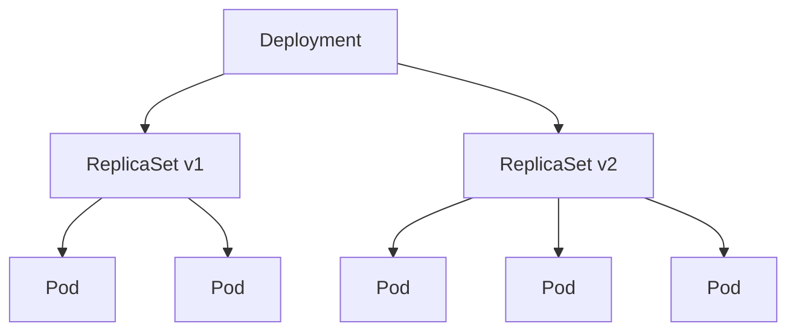

# Phase 2-2: ReplicaSet と Deployment

## 学習目標

この単元を終えると、以下ができるようになります：

- ReplicaSet で Pod のレプリカ数を管理できる
- Deployment でローリングアップデートができる
- スケーリング戦略を理解できる

## 概念解説

### リソースの関係



| リソース | 役割 |
|---------|------|
| Pod | コンテナの実行単位 |
| ReplicaSet | 指定数の Pod を維持 |
| Deployment | ReplicaSet を管理、更新戦略を制御 |

## ハンズオン

### 演習1: ReplicaSet

```yaml
# replicaset.yaml
apiVersion: apps/v1
kind: ReplicaSet
metadata:
  name: nginx-rs
spec:
  replicas: 3
  selector:
    matchLabels:
      app: nginx
  template:
    metadata:
      labels:
        app: nginx
    spec:
      containers:
      - name: nginx
        image: nginx:1.25
        ports:
        - containerPort: 80
```

```bash
# 作成
kubectl apply -f replicaset.yaml

# 確認
kubectl get replicaset
kubectl get pods -l app=nginx

# Pod を1つ削除（自動復旧を確認）
kubectl delete pod <pod-name>
kubectl get pods -l app=nginx  # 新しい Pod が作成される

# スケール
kubectl scale replicaset nginx-rs --replicas=5
kubectl get pods -l app=nginx

# 削除
kubectl delete replicaset nginx-rs
```

### 演習2: Deployment の基本

```yaml
# deployment.yaml
apiVersion: apps/v1
kind: Deployment
metadata:
  name: nginx-deployment
spec:
  replicas: 3
  selector:
    matchLabels:
      app: nginx
  template:
    metadata:
      labels:
        app: nginx
    spec:
      containers:
      - name: nginx
        image: nginx:1.24  # 古いバージョン
        ports:
        - containerPort: 80
```

```bash
# 作成
kubectl apply -f deployment.yaml

# 確認
kubectl get deployments
kubectl get replicasets
kubectl get pods

# 詳細
kubectl describe deployment nginx-deployment
```

### 演習3: ローリングアップデート

```bash
# イメージを更新（ローリングアップデート開始）
kubectl set image deployment/nginx-deployment nginx=nginx:1.25

# 更新状況を監視
kubectl rollout status deployment/nginx-deployment

# Pod が順次入れ替わる様子を確認
kubectl get pods -w

# 履歴確認
kubectl rollout history deployment/nginx-deployment

# ロールバック
kubectl rollout undo deployment/nginx-deployment

# 特定のリビジョンにロールバック
kubectl rollout undo deployment/nginx-deployment --to-revision=1
```

### 演習4: 更新戦略

```yaml
# rolling-update-deployment.yaml
apiVersion: apps/v1
kind: Deployment
metadata:
  name: web-app
spec:
  replicas: 4
  strategy:
    type: RollingUpdate
    rollingUpdate:
      maxSurge: 1        # 最大で +1 Pod まで許可
      maxUnavailable: 1  # 最大で -1 Pod まで許可
  selector:
    matchLabels:
      app: web
  template:
    metadata:
      labels:
        app: web
    spec:
      containers:
      - name: web
        image: nginx:1.24
        ports:
        - containerPort: 80
        readinessProbe:
          httpGet:
            path: /
            port: 80
          initialDelaySeconds: 5
          periodSeconds: 5
```

| 戦略 | 説明 |
|------|------|
| RollingUpdate | 段階的に更新（デフォルト） |
| Recreate | 全 Pod を停止してから作成 |

| パラメータ | 説明 | 例（replicas=4） |
|-----------|------|-----------------|
| maxSurge | 追加で作成できる Pod 数 | 1 → 最大5 Pod |
| maxUnavailable | 停止できる Pod 数 | 1 → 最低3 Pod は維持 |

```yaml
# Recreate 戦略
apiVersion: apps/v1
kind: Deployment
metadata:
  name: legacy-app
spec:
  replicas: 3
  strategy:
    type: Recreate  # 全停止→全起動
  selector:
    matchLabels:
      app: legacy
  template:
    # ...
```

### 演習5: スケーリング

```bash
# 手動スケール
kubectl scale deployment nginx-deployment --replicas=5

# YAML を編集してスケール
kubectl edit deployment nginx-deployment

# HPA（水平Pod自動スケーリング）
kubectl autoscale deployment nginx-deployment --min=2 --max=10 --cpu-percent=50

# HPA 確認
kubectl get hpa
```

```yaml
# hpa.yaml
apiVersion: autoscaling/v2
kind: HorizontalPodAutoscaler
metadata:
  name: nginx-hpa
spec:
  scaleTargetRef:
    apiVersion: apps/v1
    kind: Deployment
    name: nginx-deployment
  minReplicas: 2
  maxReplicas: 10
  metrics:
  - type: Resource
    resource:
      name: cpu
      target:
        type: Utilization
        averageUtilization: 50
```

### 演習6: 宣言的な更新

```yaml
# deployment-v2.yaml
apiVersion: apps/v1
kind: Deployment
metadata:
  name: nginx-deployment
  annotations:
    kubernetes.io/change-cause: "Update to nginx 1.25"
spec:
  replicas: 3
  selector:
    matchLabels:
      app: nginx
  template:
    metadata:
      labels:
        app: nginx
    spec:
      containers:
      - name: nginx
        image: nginx:1.25  # バージョンアップ
        ports:
        - containerPort: 80
```

```bash
# 適用
kubectl apply -f deployment-v2.yaml

# 履歴確認（change-cause が表示される）
kubectl rollout history deployment/nginx-deployment
```

## Deployment 操作まとめ

| コマンド | 説明 |
|---------|------|
| `kubectl apply -f` | 作成/更新 |
| `kubectl rollout status` | 更新状況確認 |
| `kubectl rollout history` | 履歴表示 |
| `kubectl rollout undo` | ロールバック |
| `kubectl rollout pause` | 更新一時停止 |
| `kubectl rollout resume` | 更新再開 |
| `kubectl scale` | スケール |

## 理解度確認

### 問題

Deployment で 4 Pod から新しいバージョンに更新する際、常に 3 Pod 以上がリクエストを受けられる状態を維持したい。maxUnavailable の設定値として適切なのはどれか。

**A.** 0

**B.** 1

**C.** 2

**D.** 4

---

### 解答・解説

**正解: B**

- 4 Pod 中、最低 3 Pod を維持 = 停止できるのは最大 1 Pod
- `maxUnavailable: 1` を設定
- `maxUnavailable: 0` だと更新が進まない可能性あり

```yaml
strategy:
  type: RollingUpdate
  rollingUpdate:
    maxUnavailable: 1
    maxSurge: 1
```

---

## 次のステップ

ReplicaSet と Deployment を学びました。次は Service を学びましょう。

**次の単元**: [Phase 3-1: Service](../phase3/01_Service.md)
