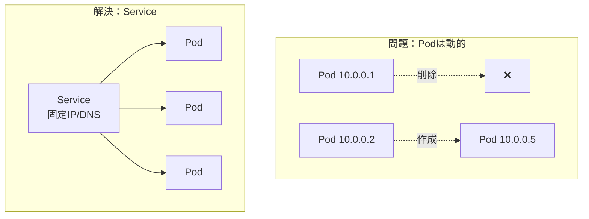
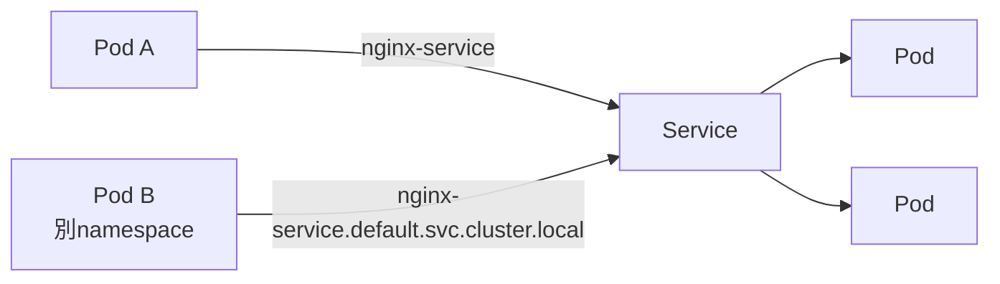
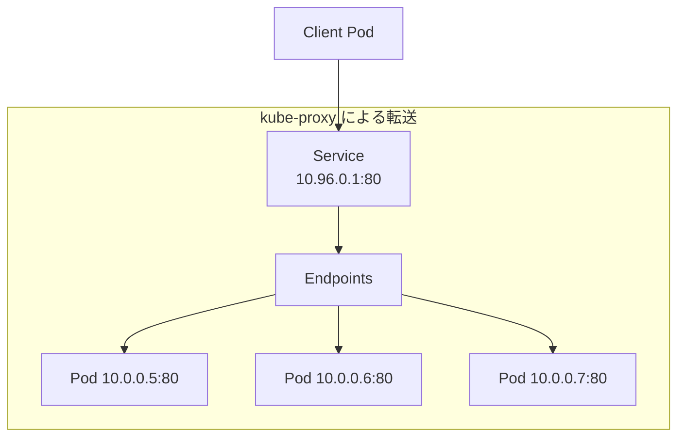

# Phase 3-1: Service

## 学習目標

この単元を終えると、以下ができるようになります：

- Service の種類と用途を説明できる
- ClusterIP、NodePort、LoadBalancer を使い分けられる
- DNS による Service 発見を理解できる

## 概念解説

### なぜ Service が必要か



- Pod の IP は動的（再起動で変わる）
- Service は**固定の仮想 IP** と **DNS 名**を提供
- ラベルセレクタで対象 Pod を選択
- ロードバランシングを提供

### Service の種類

| タイプ | 用途 | アクセス元 |
|-------|------|-----------|
| ClusterIP | クラスタ内通信 | クラスタ内のみ |
| NodePort | 開発・テスト | ノードのIP:ポート |
| LoadBalancer | 本番公開 | 外部（クラウドLB） |
| ExternalName | 外部サービス参照 | - |

## ハンズオン

### 準備: Deployment を作成

```yaml
# nginx-deployment.yaml
apiVersion: apps/v1
kind: Deployment
metadata:
  name: nginx
spec:
  replicas: 3
  selector:
    matchLabels:
      app: nginx
  template:
    metadata:
      labels:
        app: nginx
    spec:
      containers:
      - name: nginx
        image: nginx:1.25
        ports:
        - containerPort: 80
```

```bash
kubectl apply -f nginx-deployment.yaml
```

### 演習1: ClusterIP Service

```yaml
# clusterip-service.yaml
apiVersion: v1
kind: Service
metadata:
  name: nginx-service
spec:
  type: ClusterIP  # デフォルト
  selector:
    app: nginx     # このラベルを持つPodにルーティング
  ports:
  - port: 80       # Service のポート
    targetPort: 80 # Pod のポート
```

```bash
kubectl apply -f clusterip-service.yaml

# 確認
kubectl get services
kubectl describe service nginx-service

# エンドポイント（接続先Pod）確認
kubectl get endpoints nginx-service

# クラスタ内からアクセステスト
kubectl run test-pod --image=busybox --rm -it -- wget -qO- nginx-service
```

### 演習2: DNS による Service 発見

```bash
# 同じ名前空間内
# nginx-service

# 別の名前空間から
# nginx-service.default.svc.cluster.local

# DNS 確認
kubectl run test --image=busybox --rm -it -- nslookup nginx-service
```



### 演習3: NodePort Service

```yaml
# nodeport-service.yaml
apiVersion: v1
kind: Service
metadata:
  name: nginx-nodeport
spec:
  type: NodePort
  selector:
    app: nginx
  ports:
  - port: 80
    targetPort: 80
    nodePort: 30080  # 30000-32767 の範囲
```

```bash
kubectl apply -f nodeport-service.yaml

# 確認
kubectl get service nginx-nodeport

# minikube でアクセス
minikube service nginx-nodeport --url
# または
curl $(minikube ip):30080
```

### 演習4: LoadBalancer Service

```yaml
# loadbalancer-service.yaml
apiVersion: v1
kind: Service
metadata:
  name: nginx-lb
spec:
  type: LoadBalancer
  selector:
    app: nginx
  ports:
  - port: 80
    targetPort: 80
```

```bash
kubectl apply -f loadbalancer-service.yaml

# 確認（minikubeでは EXTERNAL-IP が <pending> のまま）
kubectl get service nginx-lb

# minikube で LoadBalancer を使う
minikube tunnel  # 別ターミナルで実行

# 再確認（EXTERNAL-IP が付与される）
kubectl get service nginx-lb
```

### 演習5: 複数ポートの Service

```yaml
# multi-port-service.yaml
apiVersion: v1
kind: Service
metadata:
  name: web-service
spec:
  selector:
    app: web
  ports:
  - name: http
    port: 80
    targetPort: 8080
  - name: https
    port: 443
    targetPort: 8443
  - name: metrics
    port: 9090
    targetPort: 9090
```

### 演習6: ExternalName（外部サービス参照）

```yaml
# external-service.yaml
apiVersion: v1
kind: Service
metadata:
  name: external-db
spec:
  type: ExternalName
  externalName: db.example.com
```

```bash
kubectl apply -f external-service.yaml

# クラスタ内から external-db で db.example.com にアクセス可能
```

## Service の仕組み



## AWS との比較

| K8s Service | AWS | 説明 |
|-------------|-----|------|
| ClusterIP | VPC内通信 | 内部専用 |
| NodePort | EC2 Security Group | ポート直接公開 |
| LoadBalancer | ALB/NLB | クラウドLB連携 |

## 理解度確認

### 問題

マイクロサービス構成で、backend サービスが frontend サービスと通信する場合、最も適切な Service タイプはどれか。

**A.** NodePort

**B.** LoadBalancer

**C.** ClusterIP

**D.** ExternalName

---

### 解答・解説

**正解: C**

- **ClusterIP** はクラスタ内通信に最適
- 外部公開不要なマイクロサービス間通信に使用
- frontend から `http://backend-service:8080` でアクセス

```yaml
# backend-service.yaml
apiVersion: v1
kind: Service
metadata:
  name: backend-service
spec:
  type: ClusterIP
  selector:
    app: backend
  ports:
  - port: 8080
```

---

## 次のステップ

Service を学びました。次は Ingress で外部公開を学びましょう。

**次の単元**: [Phase 3-2: Ingress](./02_Ingress.md)
