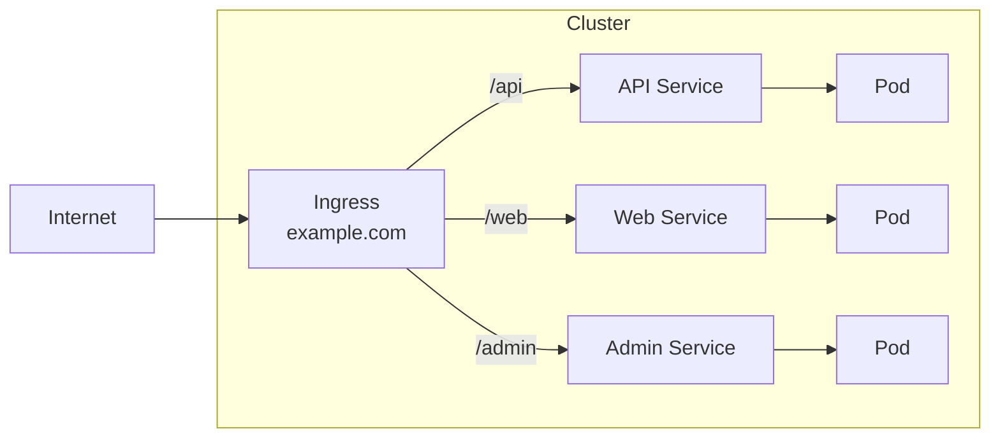

# Phase 3-2: Ingress

## 学習目標

この単元を終えると、以下ができるようになります：

- Ingress の役割を説明できる
- パスベース・ホストベースルーティングを設定できる
- TLS 終端を設定できる

## 概念解説

### Ingress とは



- **Ingress** = L7（HTTP/HTTPS）ロードバランサ
- 1つの IP で複数サービスを公開
- パス・ホスト名でルーティング
- TLS 終端

### Service との違い

| 項目 | Service (LoadBalancer) | Ingress |
|-----|----------------------|---------|
| レイヤー | L4 (TCP/UDP) | L7 (HTTP/HTTPS) |
| IP | サービスごとに1つ | 複数サービスで共有 |
| ルーティング | ポートのみ | パス/ホスト名 |
| TLS | 各サービスで | 一元管理 |
| コスト | LB数 × 料金 | 1つ分 |

## ハンズオン

### 演習1: Ingress Controller のセットアップ

```bash
# minikube で Ingress アドオンを有効化
minikube addons enable ingress

# 確認
kubectl get pods -n ingress-nginx
```

### 演習2: 準備（アプリケーション）

```yaml
# apps.yaml
---
# Web アプリ
apiVersion: apps/v1
kind: Deployment
metadata:
  name: web
spec:
  replicas: 2
  selector:
    matchLabels:
      app: web
  template:
    metadata:
      labels:
        app: web
    spec:
      containers:
      - name: web
        image: nginx:1.25
        ports:
        - containerPort: 80
---
apiVersion: v1
kind: Service
metadata:
  name: web-service
spec:
  selector:
    app: web
  ports:
  - port: 80
---
# API アプリ
apiVersion: apps/v1
kind: Deployment
metadata:
  name: api
spec:
  replicas: 2
  selector:
    matchLabels:
      app: api
  template:
    metadata:
      labels:
        app: api
    spec:
      containers:
      - name: api
        image: hashicorp/http-echo
        args:
        - "-text=API Response"
        ports:
        - containerPort: 5678
---
apiVersion: v1
kind: Service
metadata:
  name: api-service
spec:
  selector:
    app: api
  ports:
  - port: 80
    targetPort: 5678
```

```bash
kubectl apply -f apps.yaml
```

### 演習3: パスベースルーティング

```yaml
# path-ingress.yaml
apiVersion: networking.k8s.io/v1
kind: Ingress
metadata:
  name: path-ingress
  annotations:
    nginx.ingress.kubernetes.io/rewrite-target: /
spec:
  ingressClassName: nginx
  rules:
  - http:
      paths:
      - path: /web
        pathType: Prefix
        backend:
          service:
            name: web-service
            port:
              number: 80
      - path: /api
        pathType: Prefix
        backend:
          service:
            name: api-service
            port:
              number: 80
```

```bash
kubectl apply -f path-ingress.yaml

# 確認
kubectl get ingress
kubectl describe ingress path-ingress

# minikube IP を取得
minikube ip

# アクセステスト
curl $(minikube ip)/web
curl $(minikube ip)/api
```

### 演習4: ホストベースルーティング

```yaml
# host-ingress.yaml
apiVersion: networking.k8s.io/v1
kind: Ingress
metadata:
  name: host-ingress
spec:
  ingressClassName: nginx
  rules:
  - host: web.example.com
    http:
      paths:
      - path: /
        pathType: Prefix
        backend:
          service:
            name: web-service
            port:
              number: 80
  - host: api.example.com
    http:
      paths:
      - path: /
        pathType: Prefix
        backend:
          service:
            name: api-service
            port:
              number: 80
```

```bash
kubectl apply -f host-ingress.yaml

# /etc/hosts に追加（Mac/Linux）
echo "$(minikube ip) web.example.com api.example.com" | sudo tee -a /etc/hosts

# アクセステスト
curl web.example.com
curl api.example.com
```

### 演習5: TLS 設定

```bash
# 自己署名証明書を作成
openssl req -x509 -nodes -days 365 -newkey rsa:2048 \
  -keyout tls.key -out tls.crt \
  -subj "/CN=example.com"

# Secret を作成
kubectl create secret tls example-tls --key tls.key --cert tls.crt

# 確認
kubectl get secret example-tls
```

```yaml
# tls-ingress.yaml
apiVersion: networking.k8s.io/v1
kind: Ingress
metadata:
  name: tls-ingress
spec:
  ingressClassName: nginx
  tls:
  - hosts:
    - web.example.com
    secretName: example-tls
  rules:
  - host: web.example.com
    http:
      paths:
      - path: /
        pathType: Prefix
        backend:
          service:
            name: web-service
            port:
              number: 80
```

```bash
kubectl apply -f tls-ingress.yaml

# HTTPS でアクセス
curl -k https://web.example.com
```

### 演習6: アノテーション

```yaml
# annotated-ingress.yaml
apiVersion: networking.k8s.io/v1
kind: Ingress
metadata:
  name: annotated-ingress
  annotations:
    # リダイレクト
    nginx.ingress.kubernetes.io/ssl-redirect: "true"
    # タイムアウト
    nginx.ingress.kubernetes.io/proxy-read-timeout: "120"
    # レートリミット
    nginx.ingress.kubernetes.io/limit-rps: "10"
    # 認証
    nginx.ingress.kubernetes.io/auth-type: basic
    nginx.ingress.kubernetes.io/auth-secret: basic-auth
spec:
  ingressClassName: nginx
  rules:
  - host: secure.example.com
    http:
      paths:
      - path: /
        pathType: Prefix
        backend:
          service:
            name: web-service
            port:
              number: 80
```

## よく使うアノテーション

| アノテーション | 説明 |
|--------------|------|
| ssl-redirect | HTTP→HTTPS リダイレクト |
| rewrite-target | パスの書き換え |
| proxy-body-size | リクエストボディサイズ上限 |
| proxy-read-timeout | タイムアウト設定 |
| whitelist-source-range | IPホワイトリスト |
| limit-rps | レートリミット |

## AWS ALB との比較

| 機能 | K8s Ingress | AWS ALB |
|-----|-------------|---------|
| パスルーティング | ✅ | ✅ |
| ホストルーティング | ✅ | ✅ |
| TLS終端 | ✅ | ✅ |
| 認証 | Basic/OAuth | Cognito連携 |
| WAF | 要別途設定 | AWS WAF統合 |

## 理解度確認

### 問題

複数のマイクロサービス（users, orders, products）を1つのドメインで公開し、`/api/users`, `/api/orders`, `/api/products` でアクセスさせたい。最も適切な設定はどれか。

**A.** 3つの LoadBalancer Service

**B.** 1つの Ingress でパスベースルーティング

**C.** 3つの NodePort Service

**D.** 3つの Ingress

---

### 解答・解説

**正解: B**

1つの Ingress でパスベースルーティングが最適です：
- IP/証明書が1つで済む
- コスト効率が良い
- 一元管理できる

```yaml
spec:
  rules:
  - host: api.example.com
    http:
      paths:
      - path: /api/users
        backend:
          service:
            name: users-service
      - path: /api/orders
        backend:
          service:
            name: orders-service
      - path: /api/products
        backend:
          service:
            name: products-service
```

---

## 次のステップ

Ingress を学びました。次は ConfigMap と Secret を学びましょう。

**次の単元**: [Phase 4-1: ConfigMap と Secret](../phase4/01_ConfigMap_Secret.md)
