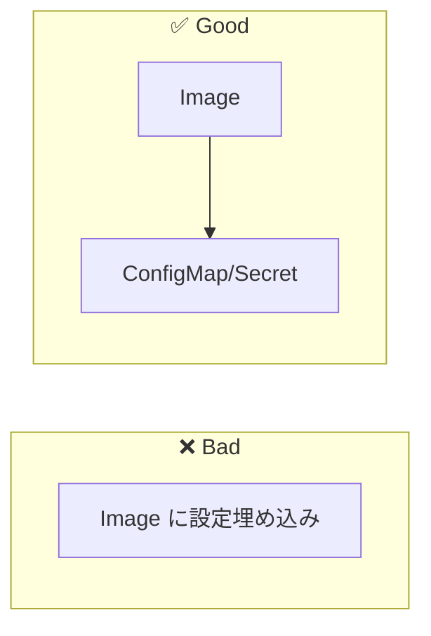

# Phase 4-1: ConfigMap と Secret

## 学習目標

この単元を終えると、以下ができるようになります：

- ConfigMap で設定を外部化できる
- Secret で機密情報を管理できる
- 環境変数・ファイルマウントで設定を渡せる

## 概念解説

### なぜ設定を外部化するか



- 環境ごとに異なる設定（dev/stg/prod）
- 機密情報をコードから分離
- 設定変更でイメージ再ビルド不要

### ConfigMap vs Secret

| 項目 | ConfigMap | Secret |
|-----|-----------|--------|
| 用途 | 一般設定 | 機密情報 |
| 保存形式 | 平文 | Base64 |
| 例 | DB_HOST, LOG_LEVEL | DB_PASSWORD, API_KEY |

## ハンズオン

### 演習1: ConfigMap 作成

```bash
# コマンドで作成
kubectl create configmap app-config \
  --from-literal=APP_ENV=production \
  --from-literal=LOG_LEVEL=info

# 確認
kubectl get configmap app-config
kubectl describe configmap app-config
kubectl get configmap app-config -o yaml
```

```yaml
# configmap.yaml
apiVersion: v1
kind: ConfigMap
metadata:
  name: app-config
data:
  APP_ENV: "production"
  LOG_LEVEL: "info"
  DATABASE_HOST: "mysql.default.svc.cluster.local"
```

```bash
kubectl apply -f configmap.yaml
```

### 演習2: ConfigMap から環境変数

```yaml
# pod-with-configmap.yaml
apiVersion: v1
kind: Pod
metadata:
  name: config-env-pod
spec:
  containers:
  - name: app
    image: busybox
    command: ['sh', '-c', 'env | grep APP && sleep 3600']
    
    # 個別の環境変数
    env:
    - name: APP_ENV
      valueFrom:
        configMapKeyRef:
          name: app-config
          key: APP_ENV
    
    # ConfigMap 全体を環境変数として
    envFrom:
    - configMapRef:
        name: app-config
```

```bash
kubectl apply -f pod-with-configmap.yaml
kubectl logs config-env-pod
```

### 演習3: ConfigMap をファイルとしてマウント

```yaml
# nginx-config.yaml
apiVersion: v1
kind: ConfigMap
metadata:
  name: nginx-config
data:
  nginx.conf: |
    server {
        listen 80;
        server_name localhost;
        
        location / {
            root /usr/share/nginx/html;
            index index.html;
        }
        
        location /health {
            return 200 'OK';
        }
    }
  index.html: |
    <!DOCTYPE html>
    <html>
    <head><title>Hello K8s</title></head>
    <body><h1>Hello from ConfigMap!</h1></body>
    </html>
```

```yaml
# nginx-pod.yaml
apiVersion: v1
kind: Pod
metadata:
  name: nginx-config-pod
spec:
  containers:
  - name: nginx
    image: nginx:1.25
    ports:
    - containerPort: 80
    volumeMounts:
    - name: config-volume
      mountPath: /etc/nginx/conf.d/default.conf
      subPath: nginx.conf
    - name: config-volume
      mountPath: /usr/share/nginx/html/index.html
      subPath: index.html
  
  volumes:
  - name: config-volume
    configMap:
      name: nginx-config
```

```bash
kubectl apply -f nginx-config.yaml
kubectl apply -f nginx-pod.yaml

# 確認
kubectl exec nginx-config-pod -- cat /etc/nginx/conf.d/default.conf
kubectl exec nginx-config-pod -- curl localhost
kubectl exec nginx-config-pod -- curl localhost/health
```

### 演習4: Secret 作成

```bash
# コマンドで作成
kubectl create secret generic db-secret \
  --from-literal=DB_USER=admin \
  --from-literal=DB_PASSWORD=supersecret123

# 確認（Base64エンコードされている）
kubectl get secret db-secret -o yaml
```

```yaml
# secret.yaml
apiVersion: v1
kind: Secret
metadata:
  name: db-secret
type: Opaque
data:
  # echo -n 'admin' | base64
  DB_USER: YWRtaW4=
  # echo -n 'supersecret123' | base64
  DB_PASSWORD: c3VwZXJzZWNyZXQxMjM=
```

```yaml
# stringData を使うと平文で書ける
apiVersion: v1
kind: Secret
metadata:
  name: db-secret
type: Opaque
stringData:
  DB_USER: admin
  DB_PASSWORD: supersecret123
```

### 演習5: Secret から環境変数

```yaml
# pod-with-secret.yaml
apiVersion: v1
kind: Pod
metadata:
  name: secret-env-pod
spec:
  containers:
  - name: app
    image: busybox
    command: ['sh', '-c', 'echo $DB_USER && sleep 3600']
    env:
    - name: DB_USER
      valueFrom:
        secretKeyRef:
          name: db-secret
          key: DB_USER
    - name: DB_PASSWORD
      valueFrom:
        secretKeyRef:
          name: db-secret
          key: DB_PASSWORD
```

### 演習6: TLS Secret

```bash
# 証明書を Secret として保存
kubectl create secret tls my-tls-secret \
  --cert=tls.crt \
  --key=tls.key

# 確認
kubectl get secret my-tls-secret
```

### 演習7: Docker Registry Secret

```bash
# Docker Hub の認証情報
kubectl create secret docker-registry dockerhub-secret \
  --docker-server=https://index.docker.io/v1/ \
  --docker-username=myuser \
  --docker-password=mypassword \
  --docker-email=myemail@example.com

# Pod で使用
```

```yaml
apiVersion: v1
kind: Pod
metadata:
  name: private-image-pod
spec:
  containers:
  - name: app
    image: myuser/private-image:latest
  imagePullSecrets:
  - name: dockerhub-secret
```

## ベストプラクティス

### ConfigMap

```yaml
# ✅ 環境ごとに分ける
---
apiVersion: v1
kind: ConfigMap
metadata:
  name: app-config
  namespace: dev
data:
  API_URL: "http://api.dev.example.com"
---
apiVersion: v1
kind: ConfigMap
metadata:
  name: app-config
  namespace: prod
data:
  API_URL: "http://api.example.com"
```

### Secret

```bash
# ❌ Git に Secret の YAML を commit しない
# ✅ Sealed Secrets や External Secrets を使う
# ✅ CI/CD で動的に作成
```

## AWS との比較

| K8s | AWS | 用途 |
|-----|-----|------|
| ConfigMap | Parameter Store | 設定値 |
| Secret | Secrets Manager | 機密情報 |
| - | KMS | 暗号化 |

## 理解度確認

### 問題

DB のパスワードを Pod に渡す方法として最も適切なのはどれか。

**A.** ConfigMap の環境変数

**B.** Secret の環境変数

**C.** Dockerfile の ENV

**D.** Pod の spec に直接記述

---

### 解答・解説

**正解: B**

- **Secret** は機密情報用（Base64エンコード、アクセス制限可能）
- ConfigMap は平文なので機密情報には不適切
- Dockerfile や spec への直接記述はセキュリティリスク

```yaml
env:
- name: DB_PASSWORD
  valueFrom:
    secretKeyRef:
      name: db-secret
      key: DB_PASSWORD
```

---

## 次のステップ

ConfigMap と Secret を学びました。次は Volume を学びましょう。

**次の単元**: [Phase 4-2: Volume](./02_Volume.md)
