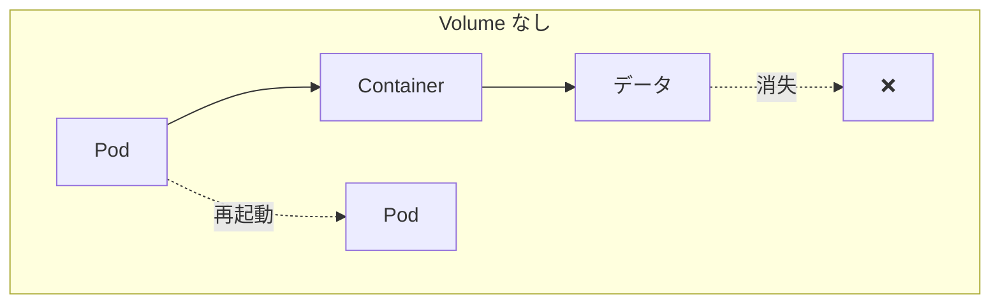
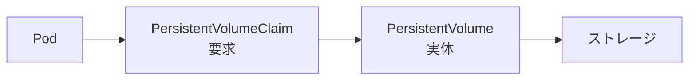

# Phase 4-2: Volume と永続化

## 学習目標

この単元を終えると、以下ができるようになります：

- Volume の種類と用途を説明できる
- PersistentVolume と PersistentVolumeClaim を使える
- StatefulSet でステートフルなアプリを動かせる

## 概念解説

### なぜ Volume が必要か



- コンテナのファイルシステムは一時的
- Pod 再起動でデータが消える
- **Volume** でデータを永続化

### Volume の種類

| タイプ | 寿命 | 用途 |
|-------|------|------|
| emptyDir | Pod と同じ | 一時ファイル共有 |
| hostPath | Node と同じ | 開発用 |
| PersistentVolume | 独立 | 本番データ永続化 |
| configMap/secret | ConfigMap/Secret と同じ | 設定ファイル |

## ハンズオン

### 演習1: emptyDir

```yaml
# emptydir-pod.yaml
apiVersion: v1
kind: Pod
metadata:
  name: emptydir-pod
spec:
  containers:
  - name: writer
    image: busybox
    command: ['sh', '-c', 'echo "Hello" > /data/message.txt && sleep 3600']
    volumeMounts:
    - name: shared-data
      mountPath: /data
  
  - name: reader
    image: busybox
    command: ['sh', '-c', 'cat /data/message.txt && sleep 3600']
    volumeMounts:
    - name: shared-data
      mountPath: /data
  
  volumes:
  - name: shared-data
    emptyDir: {}
```

```bash
kubectl apply -f emptydir-pod.yaml
kubectl logs emptydir-pod -c reader  # "Hello"
```

### 演習2: PersistentVolume と PersistentVolumeClaim



```yaml
# pv-pvc.yaml
---
# PersistentVolume（管理者が作成）
apiVersion: v1
kind: PersistentVolume
metadata:
  name: my-pv
spec:
  capacity:
    storage: 1Gi
  accessModes:
    - ReadWriteOnce
  persistentVolumeReclaimPolicy: Retain
  hostPath:
    path: /tmp/k8s-pv
---
# PersistentVolumeClaim（開発者が要求）
apiVersion: v1
kind: PersistentVolumeClaim
metadata:
  name: my-pvc
spec:
  accessModes:
    - ReadWriteOnce
  resources:
    requests:
      storage: 500Mi
```

```bash
kubectl apply -f pv-pvc.yaml

# 確認
kubectl get pv
kubectl get pvc
```

### アクセスモード

| モード | 略称 | 説明 |
|-------|------|------|
| ReadWriteOnce | RWO | 1つのNodeから読み書き |
| ReadOnlyMany | ROX | 複数Nodeから読み取り |
| ReadWriteMany | RWX | 複数Nodeから読み書き |

### 演習3: Pod で PVC を使用

```yaml
# pod-with-pvc.yaml
apiVersion: v1
kind: Pod
metadata:
  name: pvc-pod
spec:
  containers:
  - name: app
    image: nginx:1.25
    volumeMounts:
    - name: data
      mountPath: /usr/share/nginx/html
  
  volumes:
  - name: data
    persistentVolumeClaim:
      claimName: my-pvc
```

```bash
kubectl apply -f pod-with-pvc.yaml

# データを書き込み
kubectl exec pvc-pod -- sh -c 'echo "Persistent!" > /usr/share/nginx/html/index.html'

# Pod を削除して再作成
kubectl delete pod pvc-pod
kubectl apply -f pod-with-pvc.yaml

# データが残っていることを確認
kubectl exec pvc-pod -- cat /usr/share/nginx/html/index.html
```

### 演習4: StorageClass（動的プロビジョニング）

```yaml
# storageclass.yaml
apiVersion: storage.k8s.io/v1
kind: StorageClass
metadata:
  name: fast
provisioner: k8s.io/minikube-hostpath  # minikube用
reclaimPolicy: Delete
volumeBindingMode: Immediate
```

```yaml
# dynamic-pvc.yaml
apiVersion: v1
kind: PersistentVolumeClaim
metadata:
  name: dynamic-pvc
spec:
  storageClassName: fast
  accessModes:
    - ReadWriteOnce
  resources:
    requests:
      storage: 1Gi
```

```bash
kubectl apply -f storageclass.yaml
kubectl apply -f dynamic-pvc.yaml

# PV が自動作成される
kubectl get pv
kubectl get pvc
```

### 演習5: StatefulSet

```yaml
# statefulset.yaml
apiVersion: apps/v1
kind: StatefulSet
metadata:
  name: mysql
spec:
  serviceName: mysql
  replicas: 1
  selector:
    matchLabels:
      app: mysql
  template:
    metadata:
      labels:
        app: mysql
    spec:
      containers:
      - name: mysql
        image: mysql:8.0
        env:
        - name: MYSQL_ROOT_PASSWORD
          value: "password"
        ports:
        - containerPort: 3306
        volumeMounts:
        - name: data
          mountPath: /var/lib/mysql
  
  # 各Podに専用のPVCを作成
  volumeClaimTemplates:
  - metadata:
      name: data
    spec:
      accessModes: ["ReadWriteOnce"]
      resources:
        requests:
          storage: 1Gi
---
# Headless Service（StatefulSet用）
apiVersion: v1
kind: Service
metadata:
  name: mysql
spec:
  clusterIP: None  # Headless
  selector:
    app: mysql
  ports:
  - port: 3306
```

```bash
kubectl apply -f statefulset.yaml

# 確認
kubectl get statefulset
kubectl get pods
kubectl get pvc

# StatefulSet の Pod 名は固定（mysql-0, mysql-1, ...）
# DNS: mysql-0.mysql.default.svc.cluster.local
```

### Deployment vs StatefulSet

| 項目 | Deployment | StatefulSet |
|------|-----------|-------------|
| Pod 名 | ランダム | 固定（-0, -1, ...） |
| 起動順序 | 同時 | 順番に |
| PVC | 共有 | 個別 |
| 用途 | ステートレス | ステートフル |

## AWS との比較

| K8s | AWS | 説明 |
|-----|-----|------|
| emptyDir | ECS ephemeral storage | 一時ストレージ |
| PersistentVolume | EBS | ブロックストレージ |
| StorageClass | EBS タイプ（gp2, io1） | ストレージ種別 |

## 理解度確認

### 問題

MySQL のようなデータベースを Kubernetes で運用する場合、最も適切なリソースはどれか。

**A.** Deployment + emptyDir

**B.** Deployment + PersistentVolumeClaim

**C.** StatefulSet + volumeClaimTemplates

**D.** DaemonSet + hostPath

---

### 解答・解説

**正解: C**

StatefulSet が適切な理由：
- Pod に固定の名前が付く
- 順番に起動/停止
- 各 Pod に専用の PVC
- データベースのレプリケーションに対応

```yaml
apiVersion: apps/v1
kind: StatefulSet
spec:
  volumeClaimTemplates:  # 各Podに個別のPVC
  - metadata:
      name: data
    spec:
      resources:
        requests:
          storage: 10Gi
```

---

## 次のステップ

Volume を学びました。次は実践的なアプリケーションデプロイを学びましょう。

**次の単元**: [Phase 5-1: 実践デプロイ](../phase5/01_実践デプロイ.md)
