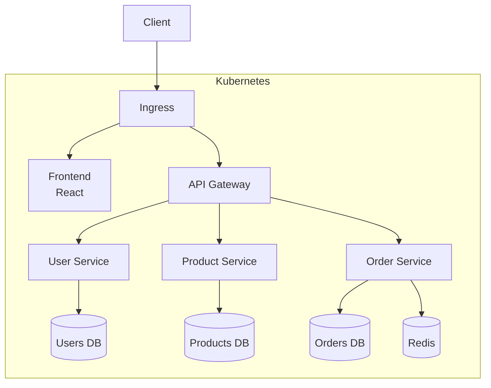

# Phase 6-1: 総仕上げ ～ マイクロサービス構築 ～

## 学習目標

この単元を終えると、以下ができるようになります：

- マイクロサービスアーキテクチャを Kubernetes で構築できる
- サービス間通信を設計できる
- 監視・ログ収集の基礎を理解できる

## 総合演習: E コマースマイクロサービス

### システム構成



### ディレクトリ構成

```
ecommerce/
├── k8s/
│   ├── namespace.yaml
│   ├── ingress.yaml
│   ├── frontend/
│   ├── api-gateway/
│   ├── user-service/
│   ├── product-service/
│   ├── order-service/
│   └── redis/
└── services/
    ├── frontend/
    ├── api-gateway/
    ├── user-service/
    ├── product-service/
    └── order-service/
```

### 演習1: Namespace とリソース制限

```yaml
# k8s/namespace.yaml
apiVersion: v1
kind: Namespace
metadata:
  name: ecommerce
---
apiVersion: v1
kind: ResourceQuota
metadata:
  name: resource-quota
  namespace: ecommerce
spec:
  hard:
    requests.cpu: "4"
    requests.memory: 8Gi
    limits.cpu: "8"
    limits.memory: 16Gi
    pods: "20"
---
apiVersion: v1
kind: LimitRange
metadata:
  name: limit-range
  namespace: ecommerce
spec:
  limits:
  - default:
      cpu: 200m
      memory: 256Mi
    defaultRequest:
      cpu: 100m
      memory: 128Mi
    type: Container
```

### 演習2: API Gateway

```yaml
# k8s/api-gateway/deployment.yaml
apiVersion: apps/v1
kind: Deployment
metadata:
  name: api-gateway
  namespace: ecommerce
spec:
  replicas: 2
  selector:
    matchLabels:
      app: api-gateway
  template:
    metadata:
      labels:
        app: api-gateway
    spec:
      containers:
      - name: gateway
        image: nginx:1.25
        ports:
        - containerPort: 80
        volumeMounts:
        - name: config
          mountPath: /etc/nginx/conf.d
        livenessProbe:
          httpGet:
            path: /health
            port: 80
        readinessProbe:
          httpGet:
            path: /health
            port: 80
      volumes:
      - name: config
        configMap:
          name: api-gateway-config
---
apiVersion: v1
kind: ConfigMap
metadata:
  name: api-gateway-config
  namespace: ecommerce
data:
  default.conf: |
    upstream user-service {
        server user-service:8080;
    }
    upstream product-service {
        server product-service:8080;
    }
    upstream order-service {
        server order-service:8080;
    }
    
    server {
        listen 80;
        
        location /health {
            return 200 'OK';
        }
        
        location /api/users {
            proxy_pass http://user-service;
        }
        
        location /api/products {
            proxy_pass http://product-service;
        }
        
        location /api/orders {
            proxy_pass http://order-service;
        }
    }
---
apiVersion: v1
kind: Service
metadata:
  name: api-gateway
  namespace: ecommerce
spec:
  selector:
    app: api-gateway
  ports:
  - port: 80
```

### 演習3: User Service

```yaml
# k8s/user-service/deployment.yaml
apiVersion: apps/v1
kind: Deployment
metadata:
  name: user-service
  namespace: ecommerce
spec:
  replicas: 2
  selector:
    matchLabels:
      app: user-service
  template:
    metadata:
      labels:
        app: user-service
    spec:
      containers:
      - name: app
        image: hashicorp/http-echo
        args:
        - "-text={\"service\": \"user-service\", \"status\": \"ok\"}"
        - "-listen=:8080"
        ports:
        - containerPort: 8080
        resources:
          requests:
            cpu: 100m
            memory: 128Mi
          limits:
            cpu: 200m
            memory: 256Mi
---
apiVersion: v1
kind: Service
metadata:
  name: user-service
  namespace: ecommerce
spec:
  selector:
    app: user-service
  ports:
  - port: 8080
```

### 演習4: Product Service

```yaml
# k8s/product-service/deployment.yaml
apiVersion: apps/v1
kind: Deployment
metadata:
  name: product-service
  namespace: ecommerce
spec:
  replicas: 2
  selector:
    matchLabels:
      app: product-service
  template:
    metadata:
      labels:
        app: product-service
    spec:
      containers:
      - name: app
        image: hashicorp/http-echo
        args:
        - "-text={\"service\": \"product-service\", \"products\": []}"
        - "-listen=:8080"
        ports:
        - containerPort: 8080
---
apiVersion: v1
kind: Service
metadata:
  name: product-service
  namespace: ecommerce
spec:
  selector:
    app: product-service
  ports:
  - port: 8080
```

### 演習5: Order Service + Redis

```yaml
# k8s/redis/deployment.yaml
apiVersion: apps/v1
kind: Deployment
metadata:
  name: redis
  namespace: ecommerce
spec:
  replicas: 1
  selector:
    matchLabels:
      app: redis
  template:
    metadata:
      labels:
        app: redis
    spec:
      containers:
      - name: redis
        image: redis:7
        ports:
        - containerPort: 6379
        resources:
          limits:
            cpu: 200m
            memory: 256Mi
---
apiVersion: v1
kind: Service
metadata:
  name: redis
  namespace: ecommerce
spec:
  selector:
    app: redis
  ports:
  - port: 6379
```

```yaml
# k8s/order-service/deployment.yaml
apiVersion: apps/v1
kind: Deployment
metadata:
  name: order-service
  namespace: ecommerce
spec:
  replicas: 2
  selector:
    matchLabels:
      app: order-service
  template:
    metadata:
      labels:
        app: order-service
    spec:
      containers:
      - name: app
        image: hashicorp/http-echo
        args:
        - "-text={\"service\": \"order-service\", \"orders\": []}"
        - "-listen=:8080"
        ports:
        - containerPort: 8080
        env:
        - name: REDIS_HOST
          value: "redis.ecommerce.svc.cluster.local"
---
apiVersion: v1
kind: Service
metadata:
  name: order-service
  namespace: ecommerce
spec:
  selector:
    app: order-service
  ports:
  - port: 8080
```

### 演習6: Ingress

```yaml
# k8s/ingress.yaml
apiVersion: networking.k8s.io/v1
kind: Ingress
metadata:
  name: ecommerce-ingress
  namespace: ecommerce
  annotations:
    nginx.ingress.kubernetes.io/proxy-read-timeout: "120"
spec:
  ingressClassName: nginx
  rules:
  - host: ecommerce.local
    http:
      paths:
      - path: /api
        pathType: Prefix
        backend:
          service:
            name: api-gateway
            port:
              number: 80
```

### 演習7: 水平自動スケーリング

```yaml
# k8s/hpa.yaml
apiVersion: autoscaling/v2
kind: HorizontalPodAutoscaler
metadata:
  name: product-service-hpa
  namespace: ecommerce
spec:
  scaleTargetRef:
    apiVersion: apps/v1
    kind: Deployment
    name: product-service
  minReplicas: 2
  maxReplicas: 10
  metrics:
  - type: Resource
    resource:
      name: cpu
      target:
        type: Utilization
        averageUtilization: 70
```

### 演習8: デプロイと確認

```bash
# 全リソースをデプロイ
kubectl apply -f k8s/namespace.yaml
kubectl apply -f k8s/redis/
kubectl apply -f k8s/user-service/
kubectl apply -f k8s/product-service/
kubectl apply -f k8s/order-service/
kubectl apply -f k8s/api-gateway/
kubectl apply -f k8s/ingress.yaml
kubectl apply -f k8s/hpa.yaml

# 確認
kubectl get all -n ecommerce

# ホスト設定
echo "$(minikube ip) ecommerce.local" | sudo tee -a /etc/hosts

# アクセス
curl http://ecommerce.local/api/users
curl http://ecommerce.local/api/products
curl http://ecommerce.local/api/orders

# HPA 確認
kubectl get hpa -n ecommerce
```

## 監視の基礎

```bash
# メトリクスサーバーのインストール
minikube addons enable metrics-server

# リソース使用量確認
kubectl top nodes
kubectl top pods -n ecommerce

# ログ確認
kubectl logs -l app=api-gateway -n ecommerce
kubectl logs -l app=api-gateway -n ecommerce --follow
```

## チェックリスト

```markdown
## マイクロサービス設計
- [ ] 各サービスが独立してデプロイ可能
- [ ] サービス間は API で通信
- [ ] データベースはサービスごとに分離

## Kubernetes 設定
- [ ] Namespace で環境を分離
- [ ] ResourceQuota でリソース制限
- [ ] HPA で自動スケーリング
- [ ] ヘルスチェック設定済み

## 運用
- [ ] ログ収集の仕組み
- [ ] メトリクス監視
- [ ] アラート設定
```

## カリキュラム完了！

おめでとうございます！Kubernetes 入門カリキュラムを完了しました。

### 学んだこと

1. **Kubernetes の基本概念** - Pod, Node, Cluster
2. **Workload リソース** - Pod, ReplicaSet, Deployment
3. **ネットワーク** - Service, Ingress
4. **設定管理** - ConfigMap, Secret
5. **永続化** - Volume, PVC, StatefulSet
6. **実践** - アプリケーションデプロイ, マイクロサービス

### 次のステップ

- **Helm** - パッケージマネージャー
- **Kustomize** - マニフェスト管理
- **Prometheus/Grafana** - 監視
- **Istio** - サービスメッシュ
- **ArgoCD** - GitOps
