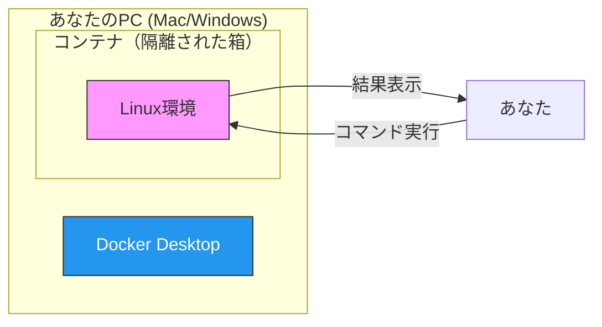
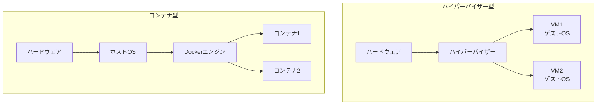

# Phase 0: 学習環境を手に入れろ！ ～ Linux砂場の作り方 ～

## 学習目標

この単元を終えると、以下ができるようになります：

- Docker を使ってローカルに Linux 環境を構築できる
- コンテナの起動・停止・削除が自在にできる
- AWS CloudShell をバックアップ環境として使える
- 「壊しても大丈夫」という安心感を持って学習を始められる

## 概念解説

### なぜ学習環境が必要？

Linuxを学ぶには、実際にコマンドを打って試行錯誤することが不可欠です。しかし...

- 会社のサーバーで実験？ → 怖すぎる
- 自分のPCにLinuxをインストール？ → ハードル高い
- 仮想マシン（VirtualBox）？ → 重い、設定が面倒

そこで登場するのが **Docker** です。

### Docker = 使い捨てできるLinux



**Windowsで例えると：**
- Docker = 「プログラムの追加と削除」で一発アンインストールできるアプリ
- コンテナ = サンドボックス（砂場）で遊ぶようなもの。散らかしても、砂場の外には影響なし

**3つの安心ポイント：**
1. **壊しても平気** → コンテナを消して作り直せば元通り
2. **PCに影響なし** → コンテナ内で何をしてもホストPCは無傷
3. **どこでも同じ環境** → 設定ファイル（Dockerfile）があれば再現可能

## Docker環境のセットアップ

### Step 1: Docker Desktop のインストール

#### Mac の場合
```bash
# Homebrew を使う場合（推奨）
brew install --cask docker

# または公式サイトからダウンロード
# https://www.docker.com/products/docker-desktop/
```

#### Windows の場合
1. [Docker Desktop for Windows](https://www.docker.com/products/docker-desktop/) をダウンロード
2. インストーラーを実行
3. WSL 2 を有効にするか聞かれたら「Yes」
4. PCを再起動

### Step 2: Docker が動くか確認

```bash
# バージョン確認
docker --version
# 出力例: Docker version 24.0.6, build ed223bc

# 動作テスト（Hello World）
docker run hello-world
```

成功すると「Hello from Docker!」というメッセージが表示されます。

### Step 3: 学習用Linuxコンテナの準備

本プロジェクト用の `Dockerfile` を作成します。

```bash
# 学習用ディレクトリを作成
mkdir -p ~/linuc-study
cd ~/linuc-study
```

以下の内容で `Dockerfile` を作成：

```dockerfile
# Dockerfile
FROM ubuntu:22.04

# 日本語環境とよく使うツールをインストール
RUN apt-get update && apt-get install -y \
    locales \
    vim \
    less \
    tree \
    curl \
    wget \
    net-tools \
    iputils-ping \
    iproute2 \
    procps \
    sudo \
    man-db \
    && rm -rf /var/lib/apt/lists/*

# 日本語ロケール設定
RUN locale-gen ja_JP.UTF-8
ENV LANG=ja_JP.UTF-8
ENV LC_ALL=ja_JP.UTF-8

# 学習用ユーザーを作成（sudo権限付き）
RUN useradd -m -s /bin/bash student \
    && echo "student:student" | chpasswd \
    && usermod -aG sudo student

# 作業ディレクトリ
WORKDIR /home/student

# student ユーザーで起動
USER student

CMD ["/bin/bash"]
```

### Step 4: コンテナのビルドと起動

```bash
# イメージをビルド（初回は数分かかります）
docker build -t linuc-study .

# コンテナを起動してログイン
docker run -it --name mylinux linuc-study

# プロンプトが変わったら成功！
# student@コンテナID:~$
```

## ハンズオン

### 演習1: コンテナの基本操作をマスター

実際にコンテナを操作してみましょう。

```bash
# 1. コンテナから抜ける（終了せずに）
# Ctrl + P, Ctrl + Q を順番に押す

# 2. 動いているコンテナを確認
docker ps

# 3. コンテナに再接続
docker attach mylinux

# 4. コンテナを終了して抜ける
exit

# 5. 停止中のコンテナを確認
docker ps -a

# 6. コンテナを再起動して接続
docker start mylinux
docker attach mylinux
```

### 演習2: 「壊して復活」を体験

Dockerの真価は「壊しても復活できる」こと。実際に体験しましょう。

```bash
# コンテナ内で実行

# 1. 重要そうなファイルを確認
ls /etc/passwd

# 2. わざと壊す（本番環境では絶対ダメ！）
sudo rm /etc/passwd
# パスワードは「student」

# 3. 壊れたことを確認
ls /etc/passwd
# ls: cannot access '/etc/passwd': No such file or directory

# 4. コンテナから出る
exit

# 5. 壊れたコンテナを削除
docker rm mylinux

# 6. 新しいコンテナを作成
docker run -it --name mylinux linuc-study

# 7. 復活を確認！
ls /etc/passwd
# /etc/passwd が存在する！
```

この「壊して復活」ができるからこそ、恐れずに実験できます。

### 演習3: よく使うDockerコマンド一覧

| やりたいこと | コマンド |
|-------------|---------|
| コンテナ起動（新規） | `docker run -it --name 名前 イメージ` |
| コンテナ一覧（実行中） | `docker ps` |
| コンテナ一覧（全部） | `docker ps -a` |
| コンテナ停止 | `docker stop 名前` |
| コンテナ再開 | `docker start 名前` |
| コンテナ接続 | `docker attach 名前` |
| コンテナ削除 | `docker rm 名前` |
| イメージ一覧 | `docker images` |
| イメージ削除 | `docker rmi イメージ名` |

## AWS CloudShell（サブ環境）

外出先やサクッと確認したいときのために、AWS CloudShell も使えるようにしておきましょう。

### CloudShell のメリット・デメリット

| メリット | デメリット |
|---------|----------|
| ブラウザだけで使える | AWSアカウントが必要 |
| インストール不要 | セッションタイムアウトあり（20分） |
| 無料 | 一部コマンドに制限あり |
| 1GBのストレージ永続化 | sudo 権限なし |

### 使い方

1. [AWS Console](https://console.aws.amazon.com/) にログイン
2. 画面右上の CloudShell アイコン（`>_`）をクリック
3. 数秒でターミナルが起動

```bash
# CloudShell で動作確認
whoami
# cloudshell-user

pwd
# /home/cloudshell-user

# Amazon Linux ベース
cat /etc/os-release
```

### 注意点

- root 権限がないので、システム設定の変更やパッケージインストールは制限される
- 本格的な学習は Docker、ちょっとした確認は CloudShell という使い分けがおすすめ

## 試験のツボ

Phase 0 は環境構築なので、直接的な試験出題は少ないですが、関連知識として：

- **仮想化の種類**: コンテナ型（Docker）vs ハイパーバイザー型（VMware, VirtualBox）の違いは出題されやすい
- **Dockerの基本概念**: イメージとコンテナの違い（イメージ＝設計図、コンテナ＝実体）
- **クラウド環境**: LinuC は仮想環境・クラウドを意識した出題が多い



**ポイント**: コンテナ型はゲストOSが不要な分、軽量で起動が速い

## 理解度確認

### 問題

Docker のコンテナとイメージの関係について、正しい説明はどれか。

**A.** イメージはコンテナを圧縮したものである

**B.** 1つのイメージから複数のコンテナを作成できる

**C.** コンテナを削除するとイメージも削除される

**D.** イメージは実行中のみ存在する

---

### 解答・解説

**正解: B**

- **A. 誤り** - 逆です。イメージは「テンプレート（設計図）」であり、コンテナはそれを元に作られた「実体」です。
- **B. 正解** - 1つのイメージから何個でもコンテナを作成できます。クッキーの型（イメージ）から複数のクッキー（コンテナ）を作るイメージです。
- **C. 誤り** - コンテナを削除してもイメージは残ります。だから「壊して復活」ができるのです。
- **D. 誤り** - イメージはファイルとして永続化されています。実行中かどうかに関係なく存在します。

---

## 次のステップ

環境が整ったら、いよいよ Linux の世界へ！

**次の単元**: [Phase 1: ファイル操作の基本 ～ Linuxは全てがファイル ～](../phase1/01_ファイル操作基本.md)

---

## トラブルシューティング

### Docker Desktop が起動しない（Windows）

```
WSL 2 installation is incomplete
```

→ [WSL 2 Linux カーネル更新プログラム](https://aka.ms/wsl2kernel) をインストール

### docker: permission denied（Mac/Linux）

```bash
# ユーザーを docker グループに追加
sudo usermod -aG docker $USER
# その後、ログアウト→ログイン
```

### コンテナに入れない

```bash
# コンテナが停止している場合
docker start mylinux
docker attach mylinux

# コンテナが存在しない場合
docker run -it --name mylinux linuc-study
```
