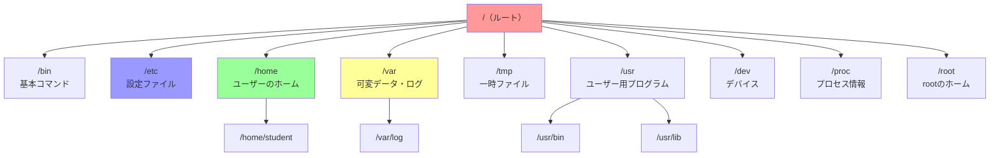
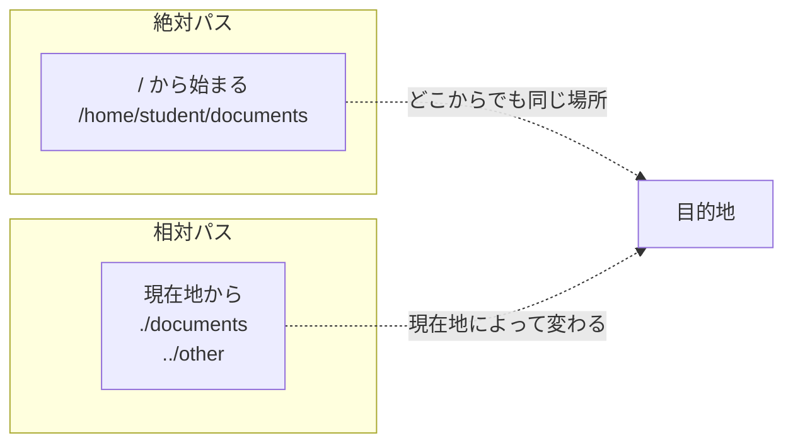

# Phase 1-1: Linuxは全てがファイル ～ ディレクトリ構造を征服せよ ～

## 学習目標

この単元を終えると、以下ができるようになります：

- Linux のディレクトリ構造（FHS）を理解し、目的のファイルがどこにあるか推測できる
- 絶対パスと相対パスを使い分けてファイルを指定できる
- `ls`, `cd`, `pwd` を使って自在に移動・探索できる
- 隠しファイルの存在を知り、表示できる

## 概念解説

### 「Linuxは全てがファイル」とは？

Linux の設計思想で最も重要なのが **「Everything is a file」** です。

- 普通のファイル（テキスト、画像など）→ ファイル
- ディレクトリ → 特殊なファイル
- キーボードやマウス → デバイスファイル（`/dev/`以下）
- 実行中のプロセス情報 → 擬似ファイル（`/proc/`以下）

**Windowsで例えると：**
- Windows：デバイスマネージャー、タスクマネージャー、エクスプローラーは別々のツール
- Linux：全部ファイルとして同じ方法（`cat`, `ls` など）でアクセス可能

### ディレクトリ構造（FHS: Filesystem Hierarchy Standard）



### 主要ディレクトリの覚え方

| ディレクトリ | 役割 | 覚え方 |
|-------------|------|--------|
| `/` | ルート（最上位） | 木の根っこ（root） |
| `/home` | ユーザーの個人フォルダ | 「お家」 |
| `/etc` | 設定ファイル置き場 | "Editable Text Configuration" |
| `/var` | ログなど変化するデータ | "Variable"（変化する） |
| `/tmp` | 一時ファイル | "Temporary"（再起動で消える） |
| `/bin` | 基本コマンド | "Binary"（実行ファイル） |
| `/usr` | 追加プログラム | "User System Resources" |
| `/dev` | デバイスファイル | "Device" |
| `/proc` | プロセス・システム情報 | "Process" |

**実務でよく触るのは：** `/home`, `/etc`, `/var/log`, `/tmp`

### 絶対パス vs 相対パス



| 種類 | 特徴 | 例 |
|------|------|-----|
| 絶対パス | `/` から始まる完全な住所 | `/home/student/file.txt` |
| 相対パス | 現在地からの道順 | `./file.txt`, `../other/` |

**特殊な記号：**
- `.` → 現在のディレクトリ
- `..` → 1つ上のディレクトリ
- `~` → ホームディレクトリ（`/home/ユーザー名`）
- `-` → 直前にいたディレクトリ

## 基本コマンド

### pwd (Print Working Directory)
現在地を表示

```bash
pwd
# /home/student
```

### cd (Change Directory)
ディレクトリを移動

```bash
cd /etc           # 絶対パスで移動
cd ..             # 1つ上へ
cd ~              # ホームへ戻る
cd -              # 直前の場所へ
cd                # ホームへ戻る（引数なし）
```

### ls (List)
ファイル一覧を表示

```bash
ls                # 現在地の一覧
ls -l             # 詳細表示（Long）
ls -a             # 隠しファイルも表示（All）
ls -la            # 両方組み合わせ
ls -lh            # サイズを人間が読みやすく（Human-readable）
ls /etc           # 指定ディレクトリの一覧
```

**ls -l の読み方：**
```
-rw-r--r-- 1 student student 1234 Jan 18 10:00 file.txt
│          │ │       │       │    │            │
│          │ │       │       │    日時         ファイル名
│          │ │       │       サイズ（バイト）
│          │ │       グループ
│          │ 所有者
│          リンク数
ファイルタイプ + パーミッション
```

## ハンズオン

### 演習1: ディレクトリ構造を探検

```bash
# 1. 現在地を確認
pwd

# 2. ルートディレクトリへ移動
cd /

# 3. ルート直下のディレクトリを確認
ls -l

# 4. 各ディレクトリを覗いてみる
ls /bin | head -10      # 基本コマンドたち
ls /etc | head -10      # 設定ファイルたち
ls /home                # ユーザーのホーム

# 5. ホームに戻る
cd ~
pwd
```

### 演習2: パスの使い分けを体験

```bash
# ホームディレクトリからスタート
cd ~

# 1. 練習場に移動（相対パス）
cd 練習場

# 2. 現在地を確認
pwd
# /home/student/練習場

# 3. documentsに移動（相対パス）
cd documents
pwd

# 4. logsに移動（相対パスで1つ上がってから）
cd ../logs
pwd

# 5. 絶対パスで一気にホームへ
cd /home/student
pwd

# 6. 直前のディレクトリに戻る
cd -
pwd
# /home/student/練習場/logs
```

### 演習3: 隠しファイルを発見

Linux では `.` で始まるファイルは「隠しファイル」として扱われます。

```bash
cd ~

# 1. 通常の ls
ls
# 練習場 だけが見える

# 2. 隠しファイルも表示
ls -a
# .  ..  .bash_history  .bashrc  .profile  練習場

# 3. 隠しファイルの中身を確認
ls -la
# .bashrc はシェルの設定ファイル
```

**主な隠しファイル：**
- `.bashrc` → bash起動時に読み込まれる設定
- `.bash_history` → コマンド履歴
- `.profile` → ログイン時に読み込まれる設定

### 演習4: ディレクトリの役割を実感

```bash
# 1. 設定ファイルの宝庫 /etc
ls /etc/*.conf | head -5
# .conf は設定ファイルの拡張子

# 2. ログファイルの場所 /var/log
ls /var/log/

# 3. デバイスファイル（すべてがファイル！）
ls -l /dev/null
ls -l /dev/zero
# これらは特殊なファイル

# 4. プロセス情報（これもファイル！）
ls /proc/
# 数字のディレクトリはプロセスID

# 5. CPU情報を「ファイルとして」読む
cat /proc/cpuinfo | head -10
```

### 演習5: tree コマンドで俯瞰

```bash
# ディレクトリ構造を木構造で表示
tree ~/練習場

# 出力例:
# /home/student/練習場
# ├── documents
# │   ├── fruits.txt
# │   ├── hello.txt
# │   └── japanese.txt
# ├── logs
# │   └── app.log
# └── scripts
#     └── hello.sh

# 深さを制限
tree -L 1 /
```

## 試験のツボ

### FHS（Filesystem Hierarchy Standard）は頻出！

以下の対応は暗記必須：

| ディレクトリ | 内容 | ひっかけポイント |
|-------------|------|------------------|
| `/bin` | **全ユーザー**が使う基本コマンド | `/sbin` は管理者用 |
| `/sbin` | **管理者**用システムコマンド | `s` = system/superuser |
| `/usr/bin` | 追加でインストールしたコマンド | `/bin` との違いを問われる |
| `/etc` | 設定ファイル | 実行ファイルは置かない |
| `/var` | 可変データ（ログ、スプールなど） | `/var/log` はログの場所 |
| `/tmp` | 一時ファイル | 再起動で消える可能性 |
| `/opt` | サードパーティソフト | パッケージ外のソフト |

### よくある間違い

```bash
# × ホームディレクトリは /home
# ○ ホームディレクトリは /home/ユーザー名

# × rootユーザーのホームは /home/root
# ○ rootユーザーのホームは /root

# × /usr は「ユーザー」の略
# ○ /usr は「Unix System Resources」の略
```

### 相対パスの問題

「/home/user にいるとき、/etc/passwd を相対パスで表すと？」
→ `../../etc/passwd`

## 理解度確認

### 問題

Linux の標準的なディレクトリ構造（FHS）において、システムのログファイルが格納されるディレクトリはどれか。

**A.** `/etc/log`

**B.** `/var/log`

**C.** `/log`

**D.** `/usr/log`

---

### 解答・解説

**正解: B**

- **A. `/etc/log`** - 誤り。`/etc` は設定ファイル用であり、ログファイルは置きません。
- **B. `/var/log`** - 正解。`/var` は "variable"（可変）の略で、ログのような変化するデータを格納します。
- **C. `/log`** - 誤り。FHS にこのようなディレクトリは定義されていません。
- **D. `/usr/log`** - 誤り。`/usr` はプログラムやライブラリ用です。

**実務での活用：** サーバーで問題が起きたら、まず `/var/log/` 以下を確認するのが定石です。

---

## 次のステップ

ディレクトリ構造がわかったら、次はファイルを操作してみましょう！

**次の単元**: [Phase 1-2: ファイル操作の実践 ～ コピー・移動・削除をマスター ～](./02_ファイル操作実践.md)
