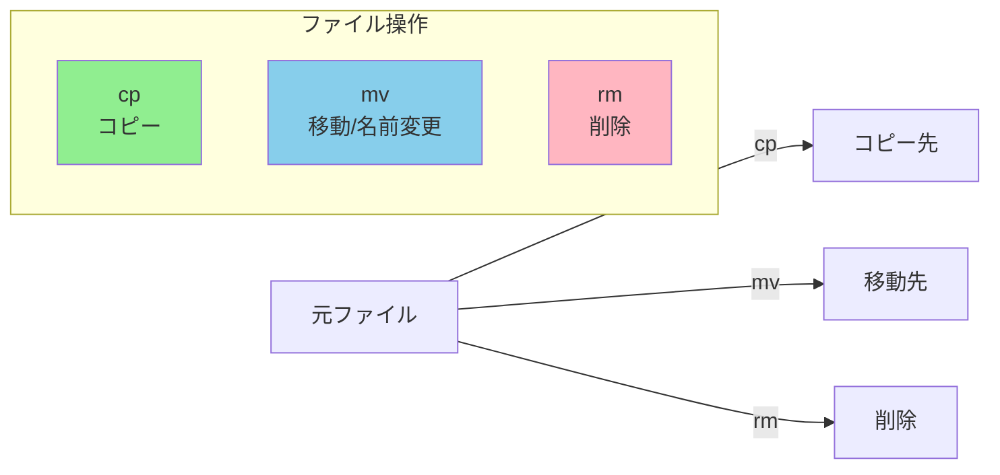

# Phase 1-2: ファイル操作の実践 ～ コピー・移動・削除をマスター ～

## 学習目標

この単元を終えると、以下ができるようになります：

- `cp`, `mv`, `rm` を使ってファイルを自在に操作できる
- `mkdir`, `rmdir`, `touch` でディレクトリやファイルを作成・削除できる
- ワイルドカード（`*`, `?`）を使って複数ファイルを一括操作できる
- 操作前に確認する安全な習慣を身につける

## 概念解説

### ファイル操作の基本 3 兄弟



**Windowsで例えると：**

| Linux | Windows | 操作 |
|-------|---------|------|
| `cp` | Ctrl+C → Ctrl+V | コピー＆ペースト |
| `mv` | Ctrl+X → Ctrl+V / F2 | 切り取り＆ペースト / 名前変更 |
| `rm` | Delete → ゴミ箱を空に | 削除（**ゴミ箱なし！**） |

**重要な違い：** Linuxの `rm` はゴミ箱に入らず**即座に完全削除**されます。

### ワイルドカード（グロブパターン）

複数のファイルを一度に指定するための「ジョーカー」です。

| パターン | 意味 | 例 |
|---------|------|-----|
| `*` | 0文字以上の任意の文字列 | `*.txt` → 全ての.txtファイル |
| `?` | 任意の1文字 | `file?.txt` → file1.txt, fileA.txt |
| `[abc]` | a, b, c のいずれか1文字 | `file[123].txt` → file1.txt, file2.txt, file3.txt |
| `[a-z]` | a〜zの範囲の1文字 | `file[a-c].txt` → filea.txt, fileb.txt, filec.txt |
| `[!abc]` | a, b, c **以外**の1文字 | `file[!0-9].txt` → 数字以外 |

## 基本コマンド

### cp (Copy)
ファイル・ディレクトリをコピー

```bash
cp 元 先                    # ファイルをコピー
cp -r 元ディレクトリ 先     # ディレクトリを再帰的にコピー（Recursive）
cp -i 元 先                 # 上書き前に確認（Interactive）
cp -p 元 先                 # 属性（日時、権限）を保持（Preserve）
cp -v 元 先                 # 処理内容を表示（Verbose）
```

### mv (Move)
ファイル・ディレクトリを移動または名前変更

```bash
mv 元 先                    # 移動
mv 旧名 新名                # 名前変更（同じディレクトリ内で）
mv -i 元 先                 # 上書き前に確認
mv -v 元 先                 # 処理内容を表示
```

### rm (Remove)
ファイル・ディレクトリを削除（**取り消し不可！**）

```bash
rm ファイル                 # ファイルを削除
rm -r ディレクトリ          # ディレクトリを再帰的に削除
rm -i ファイル              # 削除前に確認（推奨！）
rm -f ファイル              # 確認なしで強制削除（危険！）
rm -rf ディレクトリ         # 最も危険な組み合わせ
```

### mkdir (Make Directory)
ディレクトリを作成

```bash
mkdir 名前                  # ディレクトリ作成
mkdir -p a/b/c              # 親ディレクトリも一緒に作成（Parents）
mkdir -v 名前               # 作成を報告
```

### rmdir (Remove Directory)
空のディレクトリを削除

```bash
rmdir 名前                  # 空のディレクトリのみ削除可能
rmdir -p a/b/c              # 親ディレクトリも一緒に削除
```

### touch
空ファイルを作成 / タイムスタンプを更新

```bash
touch ファイル名            # ファイルがなければ作成、あれば更新日時を現在に
touch -t 202401181200 file  # 指定日時でタイムスタンプ設定
```

## ハンズオン

### 演習1: 基本的なファイル操作

```bash
cd ~/練習場/documents

# 1. ファイルの内容を確認
cat hello.txt

# 2. ファイルをコピー
cp hello.txt hello_backup.txt
ls

# 3. コピーされたか確認
cat hello_backup.txt

# 4. ファイル名を変更
mv hello_backup.txt greeting.txt
ls

# 5. ファイルを別ディレクトリに移動
mv greeting.txt ../logs/
ls ../logs/

# 6. ファイルを削除（確認付き）
rm -i ../logs/greeting.txt
# y を入力して削除
```

### 演習2: ディレクトリ操作

```bash
cd ~/練習場

# 1. 新しいディレクトリを作成
mkdir backup
ls

# 2. 入れ子のディレクトリを一気に作成
mkdir -p project/src/components
tree project

# 3. ディレクトリごとコピー（-r 必須！）
cp -r documents documents_backup
ls

# 4. 空のディレクトリを削除
mkdir empty_dir
rmdir empty_dir

# 5. 中身があるディレクトリを削除
rm -r documents_backup
ls

# 6. project も削除
rm -r project
```

### 演習3: ワイルドカードの威力

```bash
cd ~/練習場/documents

# テスト用ファイルを作成
touch file1.txt file2.txt file3.txt
touch data1.csv data2.csv
touch report.pdf

# 1. 全ての .txt ファイルを表示
ls *.txt

# 2. file で始まるファイルを表示
ls file*

# 3. file + 1文字 + .txt にマッチ
ls file?.txt

# 4. file1 か file2 にマッチ
ls file[12].txt

# 5. 数字以外で終わるファイル（応用）
ls file[!0-9].txt 2>/dev/null || echo "マッチなし"

# 6. 複数ファイルを一括コピー
mkdir ../backup
cp *.txt ../backup/
ls ../backup/

# クリーンアップ
rm file1.txt file2.txt file3.txt data1.csv data2.csv report.pdf
rm -r ../backup
```

### 演習4: 危険な操作を安全に

```bash
cd ~/練習場

# 1. -i オプションで確認癖をつける
touch test_delete.txt
rm -i test_delete.txt
# y で削除、n でキャンセル

# 2. コピー時も確認
touch original.txt copy.txt
cp -i original.txt copy.txt
# 上書きするか確認される

# 3. 移動時も確認
touch move_target.txt
mv -i original.txt move_target.txt
# 上書きするか確認される

# クリーンアップ
rm -f copy.txt move_target.txt
```

### 演習5: 実践シナリオ - バックアップ作成

```bash
cd ~/練習場

# シナリオ: ログファイルをバックアップして整理

# 1. バックアップディレクトリを作成
mkdir -p backup/logs_$(date +%Y%m%d)

# 2. ログをコピー（属性を保持）
cp -p logs/app.log backup/logs_$(date +%Y%m%d)/

# 3. 確認
ls -la backup/logs_*/

# 4. 元のログを空にする（内容をクリア）
> logs/app.log  # リダイレクトで空にする技

# 5. 空になったか確認
cat logs/app.log
# 何も表示されない

# 6. 練習用にログを復元
cp backup/logs_*/app.log logs/
```

## 試験のツボ

### cp と mv のオプションの違い

| オプション | cp | mv | 意味 |
|-----------|:--:|:--:|------|
| `-i` | ○ | ○ | 上書き確認 |
| `-r` | ○ | - | 再帰（ディレクトリ用）※mvは不要 |
| `-p` | ○ | - | 属性保持 |
| `-f` | ○ | ○ | 強制実行 |

**ひっかけ:** `mv` でディレクトリを移動するとき `-r` は**不要**（cpでは必須）

### rm -rf の恐怖

```bash
# 絶対にやってはいけない例
rm -rf /                    # システム全体削除
rm -rf ~                    # ホームディレクトリ全削除
rm -rf ./*                  # カレントディレクトリ全削除

# 安全な習慣
rm -ri ディレクトリ          # 確認付きで削除
ls ディレクトリ && rm -r ディレクトリ  # 先に内容確認
```

### mkdir -p vs mkdir

```bash
mkdir a/b/c                 # 親がないとエラー
mkdir -p a/b/c              # 親も一緒に作成（エラーにならない）

mkdir existing_dir          # 既存だとエラー
mkdir -p existing_dir       # 既存でもエラーにならない
```

### touch の本来の用途

`touch` は「ファイル作成」ではなく「タイムスタンプ更新」が本来の目的。
ファイルが存在しない場合に副作用として空ファイルが作成される。

## 理解度確認

### 問題

ディレクトリ `/home/user/project` を `/home/user/backup` にコピーするコマンドとして正しいものはどれか。

**A.** `cp /home/user/project /home/user/backup`

**B.** `cp -r /home/user/project /home/user/backup`

**C.** `mv -r /home/user/project /home/user/backup`

**D.** `copy /home/user/project /home/user/backup`

---

### 解答・解説

**正解: B**

- **A.** 誤り。ディレクトリをコピーするには `-r`（再帰）オプションが必須です。このコマンドはエラーになります。
- **B.** 正解。`cp -r` でディレクトリを再帰的にコピーできます。
- **C.** 誤り。`mv` コマンドに `-r` オプションは存在しません。`mv` は単独でディレクトリを移動できます（コピーではない）。
- **D.** 誤り。Linuxに `copy` コマンドはありません（Windowsのコマンドプロンプトにはあります）。

**実務Tips:** ディレクトリをコピーする際は `cp -rp`（属性も保持）を使うことが多いです。

---

## 次のステップ

ファイル操作の基本をマスターしたら、次はファイルの中身を調べる方法を学びましょう！

**次の単元**: [Phase 2-1: ファイルの中身を覗く ～ cat, less, head, tail ～](../phase2/01_ファイル閲覧.md)
