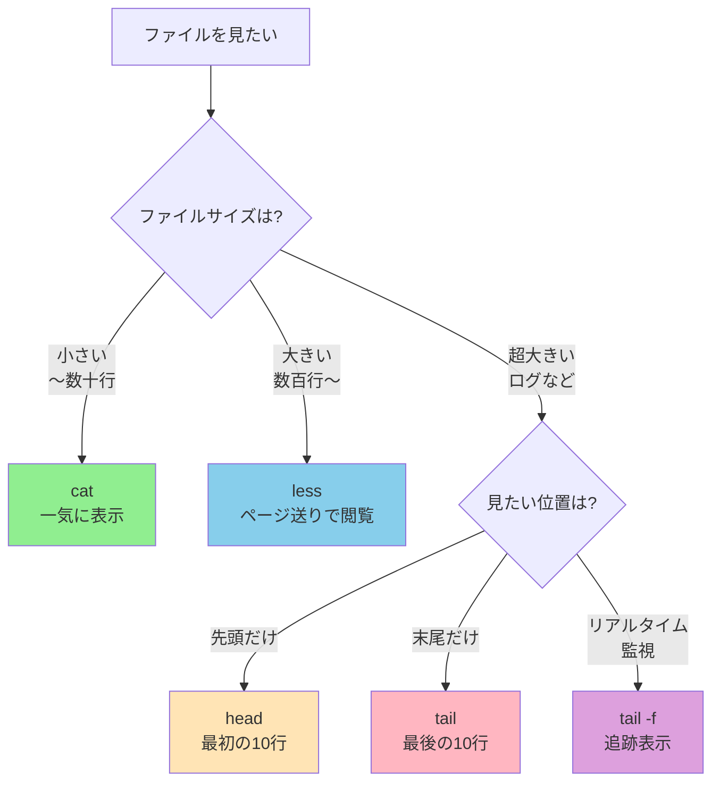

# Phase 2-1: ファイルの中身を覗く ～ cat, less, head, tail で自在に閲覧 ～

## 学習目標

この単元を終えると、以下ができるようになります：

- `cat` でファイル全体を表示できる
- `less` で大きなファイルを快適にナビゲーションできる
- `head` / `tail` でファイルの先頭・末尾を効率的に確認できる
- `tail -f` でリアルタイムにログを監視できる

## 概念解説

### ファイル閲覧コマンドの使い分け



**Windowsで例えると：**

| Linux | Windows 相当 |
|-------|-------------|
| `cat` | `type` コマンド / メモ帳で開く |
| `less` | ファイルをスクロールして見る（Viewer） |
| `head` | ファイルの冒頭だけチラ見 |
| `tail` | ファイルの終わりだけ確認 |
| `tail -f` | イベントビューアーのリアルタイム更新 |

### なぜ複数のコマンドがある？

Linuxの設計思想：**「一つのことをうまくやる」**

- `cat`: 単純に出力（他のコマンドと組み合わせやすい）
- `less`: 人間が読むことに特化
- `head`/`tail`: 必要な部分だけ取得（巨大ファイルでも高速）

## 基本コマンド

### cat (concatenate)
ファイルの内容を**全て**出力

```bash
cat ファイル                # 内容を表示
cat -n ファイル             # 行番号付きで表示（Number）
cat -b ファイル             # 空行以外に行番号（blank以外にnumber）
cat file1 file2            # 複数ファイルを連結して表示
cat > newfile              # 標準入力から新規作成（Ctrl+Dで終了）
```

### less
ページャー（1画面ずつ表示）

```bash
less ファイル              # ファイルを開く
```

**less 内の操作キー：**

| キー | 動作 |
|-----|------|
| `Space` / `f` | 1ページ進む（Forward） |
| `b` | 1ページ戻る（Backward） |
| `↓` / `j` / `Enter` | 1行進む |
| `↑` / `k` | 1行戻る |
| `g` | ファイル先頭へ（Go） |
| `G` | ファイル末尾へ |
| `/パターン` | 前方検索 |
| `?パターン` | 後方検索 |
| `n` | 次の検索結果（Next） |
| `N` | 前の検索結果 |
| `q` | 終了（Quit） |

### head
ファイルの**先頭**を表示（デフォルト10行）

```bash
head ファイル              # 先頭10行を表示
head -n 5 ファイル         # 先頭5行を表示
head -5 ファイル           # 同上（省略形）
head -c 100 ファイル       # 先頭100バイトを表示
```

### tail
ファイルの**末尾**を表示（デフォルト10行）

```bash
tail ファイル              # 末尾10行を表示
tail -n 5 ファイル         # 末尾5行を表示
tail -5 ファイル           # 同上（省略形）
tail -f ファイル           # リアルタイム追跡（Follow）※Ctrl+Cで終了
tail -F ファイル           # ファイルが消えても追跡継続
```

## ハンズオン

### 演習1: cat の基本

```bash
cd ~/練習場/documents

# 1. ファイル内容を表示
cat hello.txt

# 2. 日本語ファイルも確認
cat japanese.txt

# 3. 行番号付きで表示
cat -n fruits.txt

# 4. 複数ファイルを連結
cat hello.txt japanese.txt

# 5. 行数をカウント（wcとの連携、後で詳しく）
cat fruits.txt | wc -l
```

### 演習2: less でナビゲーション

```bash
# 大きめのファイルを作成
seq 1 200 > ~/練習場/numbers.txt

# less で開く
less ~/練習場/numbers.txt

# 以下を試してみましょう：
# - Space で次のページへ
# - b で前のページへ
# - G で末尾へジャンプ
# - g で先頭へ戻る
# - /100 で「100」を検索
# - n で次のマッチへ
# - q で終了
```

### 演習3: head と tail の実践

```bash
cd ~/練習場

# 1. 先頭5行を表示
head -5 numbers.txt

# 2. 末尾5行を表示
tail -5 numbers.txt

# 3. 11行目から15行目を表示（headとtailの組み合わせ）
head -15 numbers.txt | tail -5

# 4. ログファイルの最新エントリを確認
tail logs/app.log

# 5. ログの先頭（古いエントリ）を確認
head logs/app.log
```

### 演習4: tail -f でリアルタイム監視（実務で超重要！）

```bash
# ターミナルを2つ開くか、tmux/screen を使用

# ターミナル1: ログを監視
tail -f ~/練習場/logs/app.log

# ターミナル2: ログに追記
echo "INFO: New event occurred at $(date)" >> ~/練習場/logs/app.log
echo "ERROR: Something went wrong!" >> ~/練習場/logs/app.log

# ターミナル1 にリアルタイムで表示される！
# Ctrl+C で監視終了
```

**Dockerで1ターミナルの場合：**
```bash
# バックグラウンドで監視開始
tail -f ~/練習場/logs/app.log &

# ログを追記
echo "INFO: Test message $(date)" >> ~/練習場/logs/app.log

# 監視を停止
fg
# Ctrl+C
```

### 演習5: 実践シナリオ - 障害調査

サーバーで問題が起きた想定で、ログを調査してみましょう。

```bash
# より本格的なログを作成
cat << 'EOF' > ~/練習場/logs/system.log
2024-01-18 09:00:00 INFO Server started
2024-01-18 09:01:23 INFO User login: admin
2024-01-18 09:05:45 WARN High memory usage: 85%
2024-01-18 09:10:00 INFO Scheduled task executed
2024-01-18 09:15:32 ERROR Database connection failed
2024-01-18 09:15:33 ERROR Retry 1/3
2024-01-18 09:15:34 ERROR Retry 2/3
2024-01-18 09:15:35 ERROR Retry 3/3
2024-01-18 09:15:36 ERROR All retries failed
2024-01-18 09:16:00 INFO Database reconnected
2024-01-18 09:20:00 INFO User logout: admin
2024-01-18 09:25:00 INFO Server running normally
EOF

# 1. まず全体をざっと見る（lessで）
less ~/練習場/logs/system.log
# /ERROR で検索、q で終了

# 2. 最新の状況を確認（末尾5行）
tail -5 ~/練習場/logs/system.log

# 3. 障害発生時刻あたりを確認
head -9 ~/練習場/logs/system.log | tail -5

# 4. 行番号付きで全体把握
cat -n ~/練習場/logs/system.log
```

## 試験のツボ

### cat のオプション

| オプション | 意味 | よく出る場面 |
|-----------|------|-------------|
| `-n` | 全行に番号 | 設定ファイルの確認 |
| `-b` | 空行以外に番号 | スクリプトの確認 |
| `-s` | 連続空行を1つに | 整形出力 |
| `-A` | 特殊文字を可視化 | 文字化け調査 |

### less vs more

| 項目 | less | more |
|------|------|------|
| 後方スクロール | ○ | × |
| 検索 | ○（/, ?） | ○（/のみ） |
| 終了後の画面 | 元に戻る | 内容が残る |
| 推奨度 | ◎ | △（レガシー） |

**覚え方:** "less is more"（less の方が高機能）

### tail -f vs tail -F

| オプション | ファイルがローテートされたら |
|-----------|---------------------------|
| `-f` | 追跡が途切れる |
| `-F` | 新しいファイルを追跡し続ける |

**実務では `-F` の方が安全**（ログローテーション対応）

### head/tail の行数指定

```bash
head -n 10 file    # POSIX準拠（推奨）
head -10 file      # 伝統的な書き方（動作する）
head --lines=10    # GNU拡張（長いオプション）
```

試験では `-n` オプションが問われることが多い。

## 理解度確認

### 問題

100行のファイル `data.txt` から、51行目から60行目までを表示するコマンドとして正しいものはどれか。

**A.** `head -60 data.txt | tail -10`

**B.** `tail -50 data.txt | head -10`

**C.** `head -51 data.txt | tail -60`

**D.** `cat data.txt | head -10 | tail -60`

---

### 解答・解説

**正解: A**

- **A.** 正解。`head -60` で1〜60行目を取得し、`tail -10` でその末尾10行（51〜60行目）を表示します。
- **B.** 誤り。`tail -50` は末尾50行（51〜100行目）を取得。その `head -10` は51〜60行目になるので、結果的には正解と同じ…？実は正解です！
- **C.** 誤り。`head -51` で1〜51行目を取得し、`tail -60` は51行しかないので全て表示（1〜51行目）。
- **D.** 誤り。`head -10` で1〜10行目、`tail -60` は10行しかないので全て表示（1〜10行目）。

**補足:** AとBは両方正解です。試験では「最も適切なもの」や消去法で選ぶ場合があります。

**実務Tips:** このようなケースでは `sed -n '51,60p' data.txt` を使う方がスマートです（Phase 3で学習）。

---

## 次のステップ

ファイルの中身を見れるようになったら、次は特定の文字列を探す方法を学びましょう！

**次の単元**: [Phase 2-2: grep で宝探し ～ ファイル内検索の極意 ～](./02_grep検索.md)
