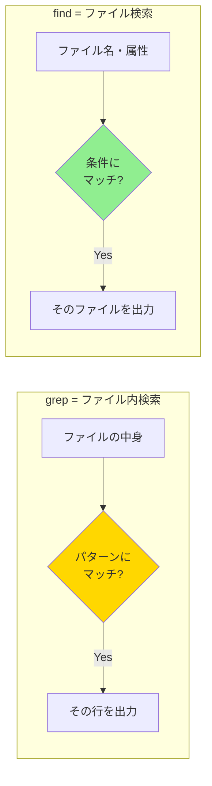

# Phase 2-3: find でファイルを狩る ～ ディスク中の宝探し ～

## 学習目標

この単元を終えると、以下ができるようになります：

- `find` で様々な条件を指定してファイルを検索できる
- 名前、サイズ、更新日時などを組み合わせた高度な検索ができる
- `-exec` を使って検索結果に対してコマンドを実行できる
- `locate` との使い分けができる

## 概念解説

### grep と find の違い



**簡単に言うと：**
- `grep`: 本の**中身**から「特定の単語」を探す
- `find`: 図書館で**本自体**を「タイトル」「サイズ」「出版日」で探す

**Windowsで例えると：**
エクスプローラーの検索機能（ファイル名、サイズ、更新日で絞り込み）

### find の基本構文

```
find [検索開始ディレクトリ] [検索条件] [アクション]
```

## 基本コマンド

### 検索条件（プライマリ）

```bash
# 名前で検索
-name 'パターン'         # 名前が一致（大文字小文字を区別）
-iname 'パターン'        # 名前が一致（大文字小文字を無視）

# タイプで検索
-type f                   # 通常ファイル（File）
-type d                   # ディレクトリ（Directory）
-type l                   # シンボリックリンク（Link）

# サイズで検索
-size +10M               # 10MBより大きい
-size -10M               # 10MBより小さい
-size 10M                # ちょうど10MB

# 時間で検索（日単位）
-mtime -7                # 7日以内に更新（Modified）
-mtime +30               # 30日より前に更新
-atime -1                # 1日以内にアクセス（Access）
-ctime -1                # 1日以内にメタデータ変更（Change）

# 時間で検索（分単位）
-mmin -60                # 60分以内に更新
-amin -30                # 30分以内にアクセス

# 所有者・権限で検索
-user ユーザー名          # 所有者で検索
-group グループ名         # グループで検索
-perm 644                # パーミッションが644
-perm -644               # 644のビットが全て立っている
```

### アクション

```bash
# 出力
-print                   # パスを表示（デフォルト）
-print0                  # NULL文字区切りで出力（xargsと併用）

# コマンド実行
-exec コマンド {} \;     # 各ファイルに対してコマンド実行
-exec コマンド {} +      # まとめてコマンド実行（効率的）
-ok コマンド {} \;       # 実行前に確認

# 削除
-delete                  # ファイルを削除（危険！）
```

### 論理演算

```bash
-and / -a                # かつ（デフォルト）
-or / -o                 # または
-not / !                 # 否定
\( ... \)               # グループ化
```

## ハンズオン

### 演習1: 基本的なファイル検索

```bash
cd ~

# 1. 名前で検索
find 練習場 -name '*.txt'

# 2. 大文字小文字を無視
find 練習場 -iname '*.TXT'

# 3. ディレクトリのみ検索
find 練習場 -type d

# 4. ファイルのみ検索
find 練習場 -type f

# 5. 名前とタイプを組み合わせ
find 練習場 -type f -name '*.log'
```

### 演習2: サイズと日時での検索

```bash
# テスト用に様々なサイズのファイルを作成
dd if=/dev/zero of=~/練習場/small.dat bs=1K count=10 2>/dev/null
dd if=/dev/zero of=~/練習場/medium.dat bs=1K count=500 2>/dev/null
dd if=/dev/zero of=~/練習場/large.dat bs=1M count=2 2>/dev/null

# 1. サイズが100KB以上のファイル
find ~/練習場 -type f -size +100k

# 2. サイズが1MB以上のファイル
find ~/練習場 -type f -size +1M

# 3. 今日更新されたファイル
find ~/練習場 -type f -mtime 0

# 4. 60分以内に更新されたファイル
find ~/練習場 -type f -mmin -60

# 5. 空のファイルを検索
find ~/練習場 -type f -empty

# クリーンアップ
rm ~/練習場/*.dat
```

### 演習3: 複数条件の組み合わせ

```bash
cd ~/練習場

# 1. .txt または .log ファイル
find . -type f \( -name '*.txt' -o -name '*.log' \)

# 2. .txt ファイルで1KB以上
find . -type f -name '*.txt' -size +1k

# 3. logs ディレクトリ以外のファイル
find . -type f -not -path './logs/*'

# 4. 空でないログファイル
find . -type f -name '*.log' -not -empty
```

### 演習4: -exec で一括処理

```bash
cd ~/練習場

# 1. 見つかったファイルの詳細を表示
find . -name '*.txt' -exec ls -l {} \;

# 2. 見つかったファイルの行数をカウント
find . -name '*.txt' -exec wc -l {} \;

# 3. 複数ファイルをまとめて処理（効率的）
find . -name '*.txt' -exec cat {} +

# 4. 見つかったファイルの中身からERRORを検索
find . -name '*.log' -exec grep -l 'ERROR' {} \;

# 5. 確認付きで削除（安全）
touch delete_me.tmp
find . -name '*.tmp' -ok rm {} \;
# y で削除、n でスキップ
```

### 演習5: 実践シナリオ - ディスク容量調査

```bash
# シナリオ: ディスク容量が逼迫！大きなファイルを探せ

# システム全体から10MB以上のファイルを探す（sudo権限推奨）
# Docker環境では権限の関係でエラーが出る場合あり
find /home -type f -size +1M 2>/dev/null | head -10

# ホームディレクトリ内で大きいファイルTOP5
find ~ -type f -exec ls -s {} \; 2>/dev/null | sort -rn | head -5

# 30日以上アクセスされていないログファイル
find ~/練習場 -type f -name '*.log' -atime +30

# 空のディレクトリを検索
find ~/練習場 -type d -empty
```

### 演習6: locate との比較

```bash
# locate はデータベースを検索（高速だが最新でない可能性）
# Docker環境ではlocateがインストールされていない場合あり

# locate の使い方（インストールされている場合）
# sudo updatedb    # データベース更新（要root）
# locate filename  # 高速検索

# find vs locate
# | 項目 | find | locate |
# |------|------|--------|
# | 速度 | 遅い（リアルタイム検索） | 速い（DB検索） |
# | 最新性 | 常に最新 | updatedb実行時点 |
# | 条件 | 多彩 | ファイル名のみ |
```

## 試験のツボ

### サイズの単位に注意！

```bash
-size 10      # 10 × 512バイト（ブロック）
-size 10c     # 10バイト（Character）
-size 10k     # 10KB（Kibibyte）
-size 10M     # 10MB（Mebibyte）
-size 10G     # 10GB（Gibibyte）
```

**ひっかけ:** 単位なしは「512バイトブロック」

### 時間のプラス・マイナス

```
-mtime -7   # 7日「以内」（より新しい）
-mtime +7   # 7日「より前」（より古い）
-mtime 7    # ちょうど7日前
```


### -exec の書き方

```bash
# {} はマッチしたファイル名に置換される
# \; は各ファイルごとに実行
# + はまとめて実行（効率的）

find . -name '*.txt' -exec rm {} \;     # 1ファイルずつ rm を呼び出し
find . -name '*.txt' -exec rm {} +      # rm file1.txt file2.txt ... と呼び出し
```

**ポイント:** `\;` のバックスラッシュを忘れるとエラー

### 論理演算の優先順位

```bash
# -and は -or より優先される
find . -name '*.txt' -o -name '*.log' -type f
# 意図と違う結果に！

# 正しくはグループ化
find . \( -name '*.txt' -o -name '*.log' \) -type f
```

## 理解度確認

### 問題

カレントディレクトリ以下から、7日以上更新されていない `.log` ファイルを検索するコマンドとして正しいものはどれか。

**A.** `find . -name '*.log' -mtime 7`

**B.** `find . -name '*.log' -mtime -7`

**C.** `find . -name '*.log' -mtime +7`

**D.** `find . -name '*.log' -mmin +7`

---

### 解答・解説

**正解: C**

- **A.** 誤り。`-mtime 7` は「ちょうど7日前」に更新されたファイルのみ。
- **B.** 誤り。`-mtime -7` は「7日以内」に更新されたファイル（新しいファイル）。
- **C.** 正解。`-mtime +7` は「7日より前」に更新されたファイル（古いファイル）。
- **D.** 誤り。`-mmin` は「分」単位。`+7`分前に更新されたファイルになってしまう。

**覚え方:**
- `-` (マイナス) = より新しい（今に近い）
- `+` (プラス) = より古い（今から遠い）

---

## 次のステップ

ファイルの検索をマスターしたら、次はコマンドを連結して強力なワークフローを作る「パイプ」を学びましょう！

**次の単元**: [Phase 2-4: パイプラインの魔法 ～ コマンドを連結して威力倍増 ～](./04_パイプ.md)
