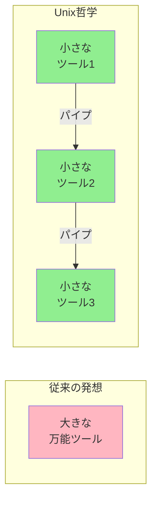
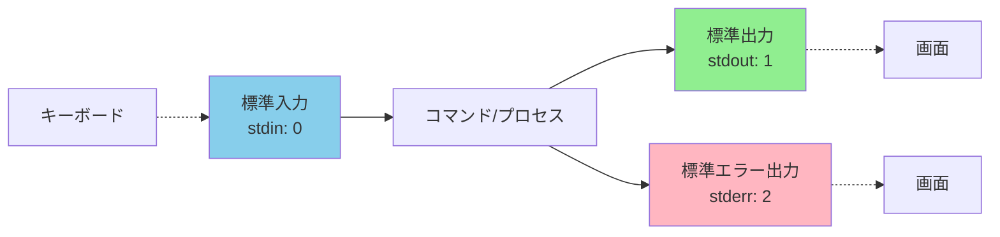

# Phase 2-4: パイプラインの魔法 ～ コマンドを連結して威力倍増 ～

## 学習目標

この単元を終えると、以下ができるようになります：

- パイプ（`|`）を使ってコマンドの出力を次のコマンドに渡せる
- リダイレクト（`>`, `>>`, `<`）でファイル入出力を操作できる
- よく使う組み合わせパターンを身につける
- 標準入力・標準出力・標準エラー出力の概念を理解できる

## 概念解説

### Unix哲学: 小さなツールを組み合わせる

Linuxの強みは「一つのことをうまくやる」小さなコマンドを**パイプライン**で連結できること。



**Windowsで例えると：**
- Windows: 1つのアプリで全部やる（Excel で集計、グラフ、印刷）
- Linux: 専門家チームのリレー（`grep` → `sort` → `uniq` → `wc`）

### 標準ストリーム



| ストリーム | ファイル記述子 | デフォルト | 用途 |
|-----------|--------------|-----------|------|
| 標準入力 (stdin) | 0 | キーボード | データの入力元 |
| 標準出力 (stdout) | 1 | 画面 | 正常な結果の出力先 |
| 標準エラー出力 (stderr) | 2 | 画面 | エラーメッセージの出力先 |

### パイプ vs リダイレクト

| 記号 | 名前 | 機能 |
|-----|------|------|
| `\|` | パイプ | コマンドの出力を次のコマンドの入力に |
| `>` | リダイレクト | 出力をファイルに書き込み（上書き） |
| `>>` | 追記リダイレクト | 出力をファイルに追記 |
| `<` | 入力リダイレクト | ファイルから入力を読み込み |
| `2>` | エラーリダイレクト | エラー出力をファイルに |
| `&>` | 全出力リダイレクト | 標準出力とエラー出力両方をファイルに |

## 基本コマンド（パイプでよく使う）

### wc (Word Count)
行数・単語数・バイト数をカウント

```bash
wc ファイル        # 行数 単語数 バイト数 を表示
wc -l ファイル     # 行数のみ（Lines）
wc -w ファイル     # 単語数のみ（Words）
wc -c ファイル     # バイト数のみ（Characters/bytes）
```

### sort
行をソート

```bash
sort ファイル           # アルファベット順
sort -n ファイル        # 数値として（Numeric）
sort -r ファイル        # 逆順（Reverse）
sort -k2 ファイル       # 2列目でソート（Key）
sort -t: -k3 ファイル   # 区切り文字を指定してソート
sort -u ファイル        # 重複を除去（Unique）
```

### uniq
連続する重複行を処理

```bash
uniq ファイル          # 連続する重複を1つに
uniq -c ファイル       # 重複回数をカウント（Count）
uniq -d ファイル       # 重複している行のみ表示（Duplicate）
uniq -u ファイル       # 重複していない行のみ（Unique）
```

**注意:** `uniq` は**連続する**重複のみ処理。事前に `sort` が必要！

### cut
列を切り出す

```bash
cut -d',' -f1 ファイル       # カンマ区切りの1列目
cut -d':' -f1,3 ファイル     # コロン区切りの1列目と3列目
cut -c1-10 ファイル          # 1〜10文字目
```

### tr (Translate)
文字を置換・削除

```bash
tr 'a-z' 'A-Z'        # 小文字→大文字
tr -d '0-9'           # 数字を削除（Delete）
tr -s ' '             # 連続するスペースを1つに（Squeeze）
```

## ハンズオン

### 演習1: パイプの基本

```bash
cd ~/練習場/documents

# 1. ファイルの行数をカウント
cat fruits.txt | wc -l

# 2. ソートして表示
cat fruits.txt | sort

# 3. 逆順でソート
cat fruits.txt | sort -r

# 4. フルーツの数を数える（3段パイプ）
cat fruits.txt | sort | wc -l
```

### 演習2: grep + パイプの組み合わせ

```bash
cd ~/練習場/logs

# 1. ERRORの行数をカウント
grep 'ERROR' system.log | wc -l

# 2. ERRORの行をソート
grep 'ERROR' system.log | sort

# 3. ユニークなエラーメッセージを抽出
grep 'ERROR' system.log | cut -d' ' -f4- | sort | uniq
```

### 演習3: sort と uniq のコンビ

```bash
# サンプルデータ作成
cat << 'EOF' > ~/練習場/access_ips.txt
192.168.1.100
192.168.1.101
192.168.1.100
10.0.0.50
192.168.1.100
192.168.1.102
10.0.0.50
192.168.1.100
EOF

# 1. IPアドレスをソート
sort ~/練習場/access_ips.txt

# 2. 重複を除去
sort ~/練習場/access_ips.txt | uniq

# 3. 各IPのアクセス回数をカウント
sort ~/練習場/access_ips.txt | uniq -c

# 4. アクセス回数でソート（多い順）
sort ~/練習場/access_ips.txt | uniq -c | sort -rn

# 5. 最もアクセスの多いIP
sort ~/練習場/access_ips.txt | uniq -c | sort -rn | head -1
```

### 演習4: リダイレクトの基本

```bash
cd ~/練習場

# 1. 出力をファイルに保存（上書き）
ls -la > file_list.txt
cat file_list.txt

# 2. 出力をファイルに追記
echo "--- Generated at $(date) ---" >> file_list.txt
cat file_list.txt

# 3. エラー出力を別ファイルに
ls /nonexistent 2> errors.txt
cat errors.txt

# 4. 標準出力とエラー出力を同じファイルに
ls -la /home /nonexistent &> all_output.txt 2>&1
cat all_output.txt

# 5. エラーを捨てる（/dev/null = ブラックホール）
ls /nonexistent 2>/dev/null
# エラーメッセージが表示されない
```

### 演習5: 実践パイプライン

```bash
cd ~/練習場/logs

# シナリオ1: アクセスログから上位クライアントIPを抽出
cat access.log | cut -d' ' -f1 | sort | uniq -c | sort -rn | head -3

# シナリオ2: HTTPステータスコードの分布
cat access.log | grep -oE '" [0-9]{3} ' | sort | uniq -c | sort -rn

# シナリオ3: 特定時間帯のエラーをファイルに保存
grep 'ERROR' system.log | grep '09:15' > errors_0915.txt
cat errors_0915.txt

# シナリオ4: ログの行数とERROR率
total=$(wc -l < system.log)
errors=$(grep -c 'ERROR' system.log)
echo "Total: $total, Errors: $errors"
```

### 演習6: 複合的なパイプライン

```bash
# /etc/passwd からユーザー情報を抽出
# フォーマット: ユーザー名:パスワード:UID:GID:コメント:ホーム:シェル

# 1. ユーザー名の一覧（1列目）
cat /etc/passwd | cut -d':' -f1

# 2. UID順にソート
cat /etc/passwd | sort -t':' -k3 -n

# 3. bash を使っているユーザー
grep '/bin/bash$' /etc/passwd | cut -d':' -f1

# 4. シェルの種類と使用ユーザー数
cat /etc/passwd | cut -d':' -f7 | sort | uniq -c | sort -rn

# 5. UID 1000以上のユーザー（一般ユーザー）
awk -F: '$3 >= 1000 {print $1}' /etc/passwd
```

## 試験のツボ

### パイプとリダイレクトの順序

```bash
# 正しい: コマンドの後にリダイレクト
grep 'ERROR' log.txt > errors.txt

# パイプは左から右に流れる
cat file | sort | uniq | wc -l
```

### 標準エラー出力のリダイレクト

```bash
# 標準エラーをファイルに
command 2> error.log

# 標準出力とエラーを同じファイルに（2通りの書き方）
command > output.txt 2>&1     # 伝統的
command &> output.txt         # bash拡張

# 順序が重要！
command 2>&1 > output.txt     # これは意図通りに動かない
```

### uniq の罠

```bash
# uniq は「連続する」重複のみ処理
echo -e "a\nb\na" | uniq
# a
# b
# a    ← 残る！

# 正しくは sort してから
echo -e "a\nb\na" | sort | uniq
# a
# b
```

### よく出る組み合わせ

```bash
# ファイル内の重複行を数えてランキング
sort file | uniq -c | sort -rn

# プロセス数の多いユーザーをランキング
ps aux | awk '{print $1}' | sort | uniq -c | sort -rn

# 特定の列でソート
sort -t',' -k2 -n file.csv   # CSVの2列目を数値でソート
```

### /dev/null（ビットバケット）

```bash
# 出力を捨てる
command > /dev/null

# エラーを捨てる
command 2>/dev/null

# 全て捨てる
command &>/dev/null
```

## 理解度確認

### 問題

ファイル `data.txt` に含まれる重複行を削除し、各行の出現回数を降順で表示するコマンドとして正しいものはどれか。

**A.** `cat data.txt | uniq -c | sort -rn`

**B.** `cat data.txt | sort | uniq -c | sort -rn`

**C.** `sort data.txt | uniq | wc -l`

**D.** `uniq -c data.txt | sort -rn`

---

### 解答・解説

**正解: B**

- **A.** 誤り。`uniq` の前に `sort` がないため、連続していない重複行は処理されません。
- **B.** 正解。まず `sort` で行をソートし、`uniq -c` で重複をカウントし、`sort -rn` で数値の降順にソートします。
- **C.** 誤り。`wc -l` は行数を数えるだけで、出現回数は表示されません。
- **D.** 誤り。`uniq` の前に `sort` がないため、正しくカウントされません。

**ポイント:** `uniq` は**必ず** `sort` の後に使う！

---

## Phase 2 まとめ

Phase 2 では以下をマスターしました：

1. **ファイル閲覧**: `cat`, `less`, `head`, `tail`
2. **内容検索**: `grep` と正規表現の基本
3. **ファイル検索**: `find` で条件を指定して検索
4. **パイプライン**: コマンドを連結して強力なワークフローを構築

これらを組み合わせることで、ログ解析やシステム調査が効率的にできるようになりました！

---

## 次のステップ

パイプラインをマスターしたら、次はテキスト処理の達人になりましょう！

**次の単元**: [Phase 3-1: テキスト処理入門 ～ cat, echo, リダイレクトの応用 ～](../phase3/01_テキスト処理入門.md)
