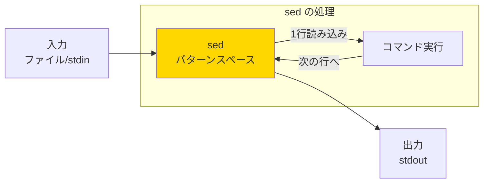

# Phase 3-1: sed でテキストを操る ～ ストリームエディタの魔術 ～

## 学習目標

この単元を終えると、以下ができるようになります：

- `sed` の基本的な置換操作ができる
- 特定の行を抽出・削除できる
- 正規表現を使った高度な置換ができる
- 設定ファイルの一括編集ができる

## 概念解説

### sed とは？

**S**tream **ED**itor の略。ファイルを**1行ずつ**読み込み、指定した処理を行って出力するツールです。



**Windowsで例えると：**
- メモ帳の「検索と置換」（Ctrl+H）をコマンドラインで実行
- ただし、**元のファイルを変更せず**結果を出力

### なぜ sed を使う？

| 方法 | メリット | デメリット |
|------|---------|-----------|
| エディタで編集 | 直感的 | 複数ファイル大変 |
| sed | 一括処理、スクリプト化可能 | 学習コスト |

**実務での用途：**
- 設定ファイルの一括変更
- ログの整形
- デプロイスクリプトでの変数展開

## 基本コマンド

### 基本構文

```bash
sed 'コマンド' ファイル
sed -e 'コマンド1' -e 'コマンド2' ファイル   # 複数コマンド
sed -f スクリプトファイル ファイル            # ファイルからコマンド読み込み
sed -i 'コマンド' ファイル                    # ファイルを直接編集（危険！）
sed -n 'コマンド' ファイル                    # 自動出力を抑制
```

### 主要コマンド

| コマンド | 説明 | 例 |
|---------|------|-----|
| `s/old/new/` | 置換（最初の1つ） | `s/foo/bar/` |
| `s/old/new/g` | 置換（全て） | `s/foo/bar/g` |
| `d` | 行を削除 | `3d` |
| `p` | 行を表示 | `3p` |
| `a\テキスト` | 行の後に追加 | `3a\newline` |
| `i\テキスト` | 行の前に挿入 | `3i\newline` |
| `c\テキスト` | 行を置換 | `3c\replaced` |

### アドレス指定（どの行に適用するか）

```bash
sed '3s/old/new/'       # 3行目のみ
sed '1,5s/old/new/'     # 1〜5行目
sed '/pattern/s/old/new/'  # patternを含む行
sed '1,/pattern/d'      # 1行目からpatternを含む行まで削除
sed '$d'                # 最終行を削除
```

## ハンズオン

### 演習1: 基本的な置換

```bash
cd ~/練習場

# テスト用ファイル作成
cat << 'EOF' > sample.txt
Hello World
Hello Linux
Hello sed
Goodbye Windows
EOF

# 1. 最初の Hello を Hi に置換
sed 's/Hello/Hi/' sample.txt

# 2. 全ての Hello を Hi に置換（g フラグ）
sed 's/Hello/Hi/g' sample.txt

# 3. 大文字小文字を無視して置換（i フラグ）
echo "HELLO hello Hello" | sed 's/hello/hi/gi'

# 4. 元のファイルは変更されていないことを確認
cat sample.txt
```

### 演習2: 行の操作

```bash
# 1. 特定の行を表示（-n と p の組み合わせ）
sed -n '2p' sample.txt        # 2行目のみ
sed -n '2,4p' sample.txt      # 2〜4行目

# 2. 特定の行を削除
sed '2d' sample.txt           # 2行目を削除
sed '2,3d' sample.txt         # 2〜3行目を削除

# 3. パターンマッチで削除
sed '/Windows/d' sample.txt   # Windows を含む行を削除

# 4. 空行を削除
echo -e "line1\n\nline2\n\nline3" | sed '/^$/d'

# 5. コメント行を削除（# で始まる行）
echo -e "# comment\ncode\n# another" | sed '/^#/d'
```

### 演習3: 正規表現を使った置換

```bash
# テストデータ
cat << 'EOF' > data.txt
Name: John Doe
Email: john@example.com
Phone: 123-456-7890
Name: Jane Smith
Email: jane@test.org
Phone: 098-765-4321
EOF

# 1. 行頭に文字を追加
sed 's/^/> /' data.txt

# 2. 行末に文字を追加
sed 's/$/ <--/' data.txt

# 3. 電話番号のハイフンをスペースに
sed 's/-/ /g' data.txt

# 4. Email アドレスをマスク
sed 's/@.*/@***/' data.txt

# 5. Name: の後を全て REDACTED に
sed 's/\(Name: \).*/\1REDACTED/' data.txt
```

### 演習4: 複数の操作を組み合わせ

```bash
# 1. 複数の置換を連続実行
sed -e 's/John/JOHN/g' -e 's/Jane/JANE/g' data.txt

# 2. セミコロンで区切る方法
sed 's/John/JOHN/g; s/Jane/JANE/g' data.txt

# 3. パイプで連結
cat data.txt | sed 's/Name:/氏名:/' | sed 's/Email:/メール:/'
```

### 演習5: 実践シナリオ - 設定ファイルの編集

```bash
# サンプル設定ファイル作成
cat << 'EOF' > ~/練習場/config.conf
# Server Configuration
server_name=localhost
server_port=8080
debug_mode=false
max_connections=100
# Database
db_host=localhost
db_port=3306
EOF

# 1. サーバー名を変更
sed 's/server_name=localhost/server_name=production.example.com/' config.conf

# 2. デバッグモードを有効化
sed 's/debug_mode=false/debug_mode=true/' config.conf

# 3. コメント行を除いて表示
sed '/^#/d' config.conf

# 4. 空でない行だけ表示（コメントも除く）
sed '/^#/d; /^$/d' config.conf

# 5. 特定のパラメータだけ抽出
sed -n '/^db_/p' config.conf
```

### 演習6: -i オプション（ファイル直接編集）

```bash
# 安全のためバックアップファイルを作成
cp ~/練習場/config.conf ~/練習場/config.conf.bak

# -i でファイルを直接編集（バックアップ作成）
sed -i.backup 's/8080/9090/' ~/練習場/config.conf

# 変更を確認
diff ~/練習場/config.conf ~/練習場/config.conf.backup

# 元に戻す
cp ~/練習場/config.conf.bak ~/練習場/config.conf
```

**警告:** `-i` オプションは元のファイルを直接変更します。必ずバックアップを！

## 試験のツボ

### s コマンドのフラグ

| フラグ | 意味 |
|-------|------|
| `g` | 全置換（Global）- 1行内の全てのマッチを置換 |
| `i` | 大文字小文字を無視（case Insensitive） |
| `p` | 置換した行を表示（Print） |
| `数字` | N番目のマッチを置換 |

```bash
echo "aaa" | sed 's/a/b/'    # baa（最初だけ）
echo "aaa" | sed 's/a/b/g'   # bbb（全部）
echo "aaa" | sed 's/a/b/2'   # aba（2番目だけ）
```

### 区切り文字の変更

```bash
# / を置換したい場合、区切り文字を変える
sed 's/\/home\/user/\/home\/admin/' file   # 見づらい
sed 's|/home/user|/home/admin|' file       # 見やすい
sed 's#/home/user#/home/admin#' file       # これも OK
```

### 後方参照

```bash
# \( \) でグループ化し、\1, \2 で参照
echo "hello world" | sed 's/\(hello\) \(world\)/\2 \1/'
# world hello

# 日付形式の変換
echo "2024-01-18" | sed 's/\([0-9]*\)-\([0-9]*\)-\([0-9]*\)/\3\/\2\/\1/'
# 18/01/2024
```

### -n と p の関係

```bash
# 通常: 全行出力 + p で二重出力
sed 'p' file    # 各行が2回表示される

# -n: 自動出力OFF + p で指定行のみ
sed -n 'p' file           # 全行1回ずつ
sed -n '1,5p' file        # 1〜5行目のみ
sed -n '/ERROR/p' file    # grep と同等
```

## 理解度確認

### 問題

ファイル内の全ての「http」を「https」に置換し、結果を画面に表示するコマンドとして正しいものはどれか。（元のファイルは変更しない）

**A.** `sed 's/http/https/' file`

**B.** `sed 's/http/https/g' file`

**C.** `sed -i 's/http/https/g' file`

**D.** `sed -n 's/http/https/g' file`

---

### 解答・解説

**正解: B**

- **A.** 部分的に正しいが不完全。`g` フラグがないため、各行の最初の「http」しか置換されません。1行に複数の URL がある場合に問題。
- **B.** 正解。`g` フラグで行内の全ての「http」を「https」に置換し、結果を標準出力に表示します。元のファイルは変更されません。
- **C.** 誤り。`-i` オプションは元のファイルを直接編集してしまいます。問題は「元のファイルは変更しない」条件。
- **D.** 誤り。`-n` は自動出力を抑制するため、`p` フラグがないと何も表示されません。

**実務Tips:** 本番環境では `sed 's/http/https/g' file > file.new && mv file.new file` のように、新しいファイルに出力してからリネームする方が安全です。

---

## 次のステップ

sed で行単位の処理をマスターしたら、次は列単位の処理に強い awk を学びましょう！

**次の単元**: [Phase 3-2: awk でデータを解析 ～ 構造化テキストの処理 ～](./02_awk入門.md)
