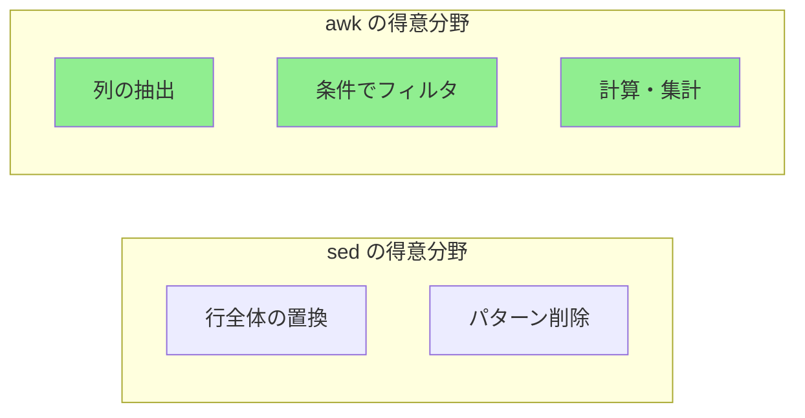
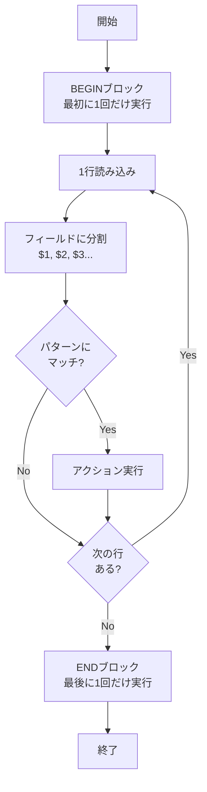

# Phase 3-2: awk でデータを解析 ～ 構造化テキストの処理 ～

## 学習目標

この単元を終えると、以下ができるようになります：

- `awk` で特定の列（フィールド）を抽出できる
- 条件に基づいたフィルタリングができる
- 簡単な集計処理（合計、平均など）ができる
- パターンとアクションの基本が理解できる

## 概念解説

### awk とは？

awk は「列指向」のテキスト処理ツール。表形式のデータを処理するのが得意です。



**Windowsで例えると：**
- Excel で列を選んで処理するイメージ
- CSV/TSV ファイルの処理に最適

### awk の動作原理



### フィールド変数

```
入力行: apple 100 red

$0 = "apple 100 red"   # 行全体
$1 = "apple"           # 1番目のフィールド
$2 = "100"             # 2番目のフィールド
$3 = "red"             # 3番目のフィールド
NF = 3                 # フィールド数
NR = (現在の行番号)
```

## 基本コマンド

### 基本構文

```bash
awk 'パターン { アクション }' ファイル
awk -F'区切り文字' 'パターン { アクション }' ファイル
```

### よく使う組み込み変数

| 変数 | 意味 |
|-----|------|
| `$0` | 行全体 |
| `$1`, `$2`... | 各フィールド |
| `NF` | フィールド数（Number of Fields） |
| `NR` | 現在の行番号（Number of Records） |
| `FS` | 入力フィールド区切り（Field Separator） |
| `OFS` | 出力フィールド区切り（Output Field Separator） |

### 基本パターン

```bash
# 特定の列を表示
awk '{print $1}' file          # 1列目
awk '{print $1, $3}' file      # 1列目と3列目
awk '{print $NF}' file         # 最後の列

# 条件でフィルタ
awk '$2 > 100' file            # 2列目が100より大きい行
awk '/pattern/' file           # パターンを含む行（grep相当）
awk '$1 == "apple"' file       # 1列目がappleの行

# 区切り文字を指定
awk -F':' '{print $1}' /etc/passwd    # コロン区切り
awk -F',' '{print $2}' data.csv       # カンマ区切り
```

## ハンズオン

### 演習1: 基本的なフィールド抽出

```bash
cd ~/練習場

# テストデータ作成
cat << 'EOF' > products.txt
apple 100 red
banana 80 yellow
cherry 200 red
date 150 brown
elderberry 300 purple
EOF

# 1. 1列目（商品名）を表示
awk '{print $1}' products.txt

# 2. 1列目と2列目を表示
awk '{print $1, $2}' products.txt

# 3. 列の順序を入れ替え
awk '{print $2, $1}' products.txt

# 4. 最後の列を表示
awk '{print $NF}' products.txt

# 5. 列数と行番号を表示
awk '{print NR, NF, $0}' products.txt
```

### 演習2: 条件でフィルタリング

```bash
# 1. 価格が100以上の商品
awk '$2 >= 100' products.txt

# 2. 赤い商品
awk '$3 == "red"' products.txt

# 3. 名前に 'a' を含む商品
awk '/a/' products.txt

# 4. 複合条件（AND）
awk '$2 >= 100 && $3 == "red"' products.txt

# 5. 複合条件（OR）
awk '$3 == "red" || $3 == "yellow"' products.txt

# 6. NOT条件
awk '$3 != "red"' products.txt
```

### 演習3: フォーマット出力

```bash
# 1. 区切り文字を変えて出力
awk '{print $1 ":" $2}' products.txt

# 2. printf で整形
awk '{printf "%-12s %5d円 [%s]\n", $1, $2, $3}' products.txt

# 3. 見出しを付ける（BEGIN）
awk 'BEGIN {print "商品名", "価格", "色"} {print $1, $2, $3}' products.txt

# 4. フッターを付ける（END）
awk '{print $1, $2} END {print "---END---"}' products.txt
```

### 演習4: 計算と集計

```bash
# 1. 各商品の価格を10%割引
awk '{print $1, $2 * 0.9}' products.txt

# 2. 合計を計算
awk '{sum += $2} END {print "合計:", sum}' products.txt

# 3. 平均を計算
awk '{sum += $2; count++} END {print "平均:", sum/count}' products.txt

# 4. 最大値を見つける
awk 'BEGIN {max=0} $2 > max {max=$2; item=$1} END {print "最高額:", item, max}' products.txt

# 5. 行数をカウント
awk 'END {print NR, "行"}' products.txt
```

### 演習5: /etc/passwd を解析

```bash
# /etc/passwd の構造
# ユーザー名:パスワード:UID:GID:コメント:ホーム:シェル

# 1. ユーザー名だけ表示
awk -F':' '{print $1}' /etc/passwd

# 2. ユーザー名とシェルを表示
awk -F':' '{print $1, $7}' /etc/passwd

# 3. UID が 1000 以上のユーザー
awk -F':' '$3 >= 1000 {print $1, $3}' /etc/passwd

# 4. bash を使っているユーザー
awk -F':' '$7 ~ /bash/ {print $1}' /etc/passwd

# 5. ユーザー数をカウント
awk -F':' 'END {print "ユーザー数:", NR}' /etc/passwd
```

### 演習6: 実践シナリオ - アクセスログ集計

```bash
# アクセスログを再利用
cat ~/練習場/logs/access.log

# 1. IPアドレスだけ抽出
awk '{print $1}' ~/練習場/logs/access.log

# 2. IPアドレスごとのアクセス数
awk '{count[$1]++} END {for (ip in count) print ip, count[ip]}' ~/練習場/logs/access.log

# 3. HTTPステータスコードの分布
awk '{gsub(/"/, "", $6); print $6}' ~/練習場/logs/access.log | sort | uniq -c

# 4. 404エラーのパス一覧
awk '$6 ~ /404/ {print $5}' ~/練習場/logs/access.log

# 5. 時間帯別アクセス数（シンプル版）
awk -F'[\\[:]' '{print $2}' ~/練習場/logs/access.log | sort | uniq -c
```

### 演習7: CSV データの処理

```bash
# CSVデータ作成
cat << 'EOF' > ~/練習場/sales.csv
date,product,quantity,price
2024-01-15,apple,10,100
2024-01-15,banana,20,80
2024-01-16,apple,15,100
2024-01-16,cherry,5,200
2024-01-17,banana,25,80
EOF

# 1. ヘッダー行をスキップして処理
awk -F',' 'NR > 1 {print $2, $3}' ~/練習場/sales.csv

# 2. 売上金額を計算
awk -F',' 'NR > 1 {print $2, $3 * $4}' ~/練習場/sales.csv

# 3. 商品別売上合計
awk -F',' 'NR > 1 {sales[$2] += $3 * $4} END {for (p in sales) print p, sales[p]}' ~/練習場/sales.csv

# 4. 総売上
awk -F',' 'NR > 1 {total += $3 * $4} END {print "総売上:", total}' ~/練習場/sales.csv
```

## 試験のツボ

### awk vs cut

| 項目 | awk | cut |
|-----|-----|-----|
| 区切り文字 | 柔軟（正規表現可） | 単一文字 |
| 空白処理 | 連続空白を1つと扱う | 1文字ずつ |
| 計算 | 可能 | 不可 |
| 条件 | 可能 | 不可 |

```bash
# cut では難しい処理
echo "apple    100" | cut -d' ' -f2   # 空文字列になる
echo "apple    100" | awk '{print $2}'  # 100 が取れる
```

### 正規表現マッチ

```bash
# ~ は「マッチする」
# !~ は「マッチしない」

awk '$1 ~ /^a/' file      # 1列目がaで始まる
awk '$0 !~ /error/' file  # errorを含まない行
```

### 複数の区切り文字

```bash
# -F に正規表現を指定
awk -F'[,:]' '{print $1}' file   # カンマまたはコロン
awk -F'[ \t]+' '{print $1}' file # 空白またはタブ
```

### BEGIN と END

```bash
# BEGIN: データ処理前に1回
# END: データ処理後に1回

awk 'BEGIN {FS=":"} {print $1}' /etc/passwd  # -F':' と同等
```

## 理解度確認

### 問題

スペース区切りのファイル `data.txt` から、2列目の値が50より大きい行の1列目と2列目を表示するコマンドはどれか。

**A.** `awk '$2 > 50 {print $1 $2}' data.txt`

**B.** `awk '$2 > 50 {print $1, $2}' data.txt`

**C.** `awk '{if ($2 > 50) print $1, $2}' data.txt`

**D.** `awk -F' ' '$2 > 50 {print $1, $2}' data.txt`

---

### 解答・解説

**正解: B（CとDも正解）**

- **A.** 部分的に正しいが、`$1 $2` はスペースなしで連結されます。`print $1, $2` とカンマで区切る必要があります。
- **B.** 正解。条件 `$2 > 50` でフィルタし、`print $1, $2` でスペース区切りで出力。
- **C.** 正解。B と同じ結果。`if` 文を使った明示的な書き方。
- **D.** 正解。`-F' '` は不要（デフォルトが空白区切り）ですが、結果は同じ。

**ポイント:**
- `print $1, $2` → スペース区切りで出力
- `print $1 $2` → 連結して出力

---

## Phase 3 まとめ

Phase 3 では以下をマスターしました：

1. **sed**: 行単位の置換・削除・抽出
2. **awk**: 列単位の抽出・フィルタ・集計

これらのツールを組み合わせることで、ログ解析やデータ加工が効率的にできます。

```bash
# 実践的な組み合わせ例
cat access.log | awk '{print $1}' | sort | uniq -c | sort -rn | head -10
# → アクセス数上位10のIPアドレス
```

---

## 次のステップ

テキスト処理をマスターしたら、次はファイルの権限管理を学びましょう！

**次の単元**: [Phase 4-1: パーミッション入門 ～ 誰が何をできるか ～](../phase4/01_パーミッション基礎.md)
