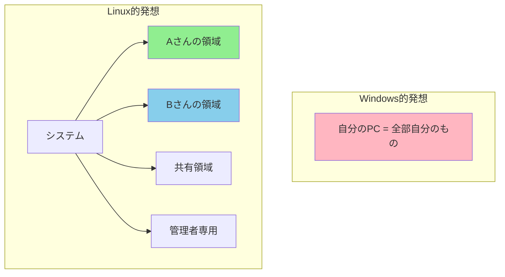

# Phase 4-1: パーミッション入門 ～ 誰が何をできるか ～

## 学習目標

この単元を終えると、以下ができるようになります：

- `ls -l` の出力からパーミッションを読み取れる
- `chmod` でパーミッションを変更できる
- 数値表記（755など）と記号表記（rwx）を相互変換できる
- ファイルとディレクトリでパーミッションの意味が違うことを理解できる

## 概念解説

### なぜパーミッションが必要？

Linux はマルチユーザーOS。複数の人が同じシステムを使うことを前提に設計されています。



**実務での重要性：**
- Webサーバーが読み取れるファイル範囲を制限
- 機密情報（パスワードファイルなど）を保護
- うっかりミスからシステムを守る

### パーミッションの3要素

```
-rwxr-xr-- 1 student student 1234 Jan 18 10:00 script.sh
│└┬┘└┬┘└┬┘
│ │  │  └── その他（Other）の権限
│ │  └───── グループ（Group）の権限
│ └──────── 所有者（User/Owner）の権限
└────────── ファイルタイプ
```

| 文字 | 権限 | ファイルでの意味 | ディレクトリでの意味 |
|-----|------|-----------------|-------------------|
| `r` | 読み取り（Read） | 内容を読める | 中身を一覧表示できる |
| `w` | 書き込み（Write） | 内容を変更できる | ファイルを作成・削除できる |
| `x` | 実行（eXecute） | プログラムとして実行できる | 中に入れる（cd できる） |
| `-` | 権限なし | - | - |

### 数値（8進数）表記

| 権限 | 2進数 | 8進数 |
|-----|-------|-------|
| `---` | 000 | 0 |
| `--x` | 001 | 1 |
| `-w-` | 010 | 2 |
| `-wx` | 011 | 3 |
| `r--` | 100 | 4 |
| `r-x` | 101 | 5 |
| `rw-` | 110 | 6 |
| `rwx` | 111 | 7 |

**覚え方:** r=4, w=2, x=1 を足し算

```
rwx = 4 + 2 + 1 = 7
rw- = 4 + 2 + 0 = 6
r-x = 4 + 0 + 1 = 5
r-- = 4 + 0 + 0 = 4
```

### よく使うパーミッション

| 数値 | 記号 | 用途 |
|-----|------|------|
| 755 | rwxr-xr-x | 実行ファイル、公開ディレクトリ |
| 644 | rw-r--r-- | 一般的なファイル |
| 600 | rw------- | 秘密ファイル（パスワードなど） |
| 700 | rwx------ | 個人用ディレクトリ |
| 777 | rwxrwxrwx | 全権限（危険！） |

## 基本コマンド

### chmod (Change Mode)
パーミッションを変更

```bash
# 数値表記
chmod 755 file       # rwxr-xr-x
chmod 644 file       # rw-r--r--
chmod 600 file       # rw-------

# 記号表記
chmod u+x file       # 所有者に実行権限を追加
chmod g-w file       # グループから書き込み権限を削除
chmod o=r file       # その他の権限をrのみに設定
chmod a+x file       # 全員に実行権限を追加

# 再帰的に変更
chmod -R 755 dir     # ディレクトリ以下すべて
```

**記号表記の文法:**
- 対象: `u`(user), `g`(group), `o`(other), `a`(all)
- 操作: `+`(追加), `-`(削除), `=`(設定)
- 権限: `r`, `w`, `x`

### chown (Change Owner)
所有者を変更

```bash
chown user file              # 所有者を変更
chown user:group file        # 所有者とグループを変更
chown :group file            # グループのみ変更
chown -R user:group dir      # 再帰的に変更
```

### chgrp (Change Group)
グループを変更

```bash
chgrp group file             # グループを変更
chgrp -R group dir           # 再帰的に変更
```

## ハンズオン

### 演習1: パーミッションの読み取り

```bash
cd ~/練習場

# ファイルのパーミッションを確認
ls -l documents/

# 出力例を読み解く
# -rw-r--r-- 1 student student 26 Jan 18 10:00 hello.txt
# │          │ │       │
# │          │ │       └── グループ
# │          │ └────────── 所有者
# │          └──────────── リンク数
# └─────────────────────── パーミッション

# ディレクトリのパーミッション
ls -ld documents/
# drwxr-xr-x ...
# d = ディレクトリ

# いろいろなファイルを確認
ls -l /etc/passwd     # システムファイル
ls -l /etc/shadow     # パスワードファイル（見えないかも）
ls -ld /tmp           # 一時ディレクトリ
```

### 演習2: 数値表記でパーミッション変更

```bash
cd ~/練習場

# テストファイル作成
touch test_perm.txt
ls -l test_perm.txt

# 1. 644 に設定（一般的なファイル）
chmod 644 test_perm.txt
ls -l test_perm.txt

# 2. 600 に設定（自分だけ読み書き）
chmod 600 test_perm.txt
ls -l test_perm.txt

# 3. 755 に設定（実行ファイル風）
chmod 755 test_perm.txt
ls -l test_perm.txt

# 4. 000 に設定（全権限なし）
chmod 000 test_perm.txt
ls -l test_perm.txt
cat test_perm.txt  # Permission denied!

# 元に戻す
chmod 644 test_perm.txt
```

### 演習3: 記号表記でパーミッション変更

```bash
# 基準となる状態に設定
chmod 644 test_perm.txt
ls -l test_perm.txt  # -rw-r--r--

# 1. 所有者に実行権限を追加
chmod u+x test_perm.txt
ls -l test_perm.txt  # -rwxr--r--

# 2. グループにも実行権限を追加
chmod g+x test_perm.txt
ls -l test_perm.txt  # -rwxr-xr--

# 3. その他から読み取り権限を削除
chmod o-r test_perm.txt
ls -l test_perm.txt  # -rwxr-x---

# 4. 全員に書き込み権限を追加（危険な例）
chmod a+w test_perm.txt
ls -l test_perm.txt  # -rwxrwx-w-

# 5. その他の権限を完全にリセット
chmod o= test_perm.txt
ls -l test_perm.txt  # -rwxrwx---

# 元に戻す
chmod 644 test_perm.txt
```

### 演習4: ディレクトリのパーミッション

```bash
# ディレクトリ作成
mkdir test_dir
ls -ld test_dir

# 1. 読み取り権限のみ（中に入れない）
chmod 444 test_dir
ls test_dir    # OK - 一覧は見える
cd test_dir    # NG - Permission denied（xがないと入れない）

# 2. 実行権限を追加（中に入れる）
chmod 544 test_dir
cd test_dir
pwd
cd ..

# 3. 書き込み権限を追加（ファイル作成可能）
chmod 755 test_dir
touch test_dir/new_file.txt
ls test_dir

# クリーンアップ
rm -r test_dir
```

### 演習5: 実践シナリオ - スクリプトの実行

```bash
cd ~/練習場

# シンプルなスクリプトを作成
cat << 'EOF' > myscript.sh
#!/bin/bash
echo "Hello from script!"
date
EOF

# 1. 作成直後の状態
ls -l myscript.sh  # -rw-r--r--（実行権限なし）

# 2. 実行しようとしてみる
./myscript.sh  # Permission denied

# 3. 実行権限を付与
chmod +x myscript.sh
ls -l myscript.sh  # -rwxr-xr-x

# 4. 実行
./myscript.sh

# クリーンアップ
rm myscript.sh
```

### 演習6: 所有者の確認（Docker環境での制限あり）

```bash
# 現在のユーザー確認
whoami
id

# ファイルの所有者確認
ls -l ~/練習場/documents/

# 注: chown はroot権限が必要
# Docker環境では sudo を使用
# sudo chown root:root test_file.txt
```

## 試験のツボ

### 数値と記号の変換（頻出！）

```
問題: 755 を記号表記で書け
答え: rwxr-xr-x

問題: rw-r----- を数値で書け
答え: 640 (6+4+0)
```

### ファイル vs ディレクトリの違い

| 権限 | ファイル | ディレクトリ |
|-----|---------|-------------|
| `r` | cat で読める | ls で一覧が見える |
| `w` | 編集できる | ファイルを作成・削除できる |
| `x` | 実行できる | cd で入れる |

**重要:** ディレクトリの `x` がないと、ファイルにアクセスできない！

```bash
# 例: ディレクトリが r-- でもファイルが読めない
# drw-r--r-- dir/
# cd dir/          # NG（xがない）
# cat dir/file     # NG（xがないとアクセス不可）
```

### デフォルトパーミッション（umask）

```bash
umask          # 現在の umask 値を表示
# 0022 など

# umask は「引く」値
# ファイル: 666 - 022 = 644
# ディレクトリ: 777 - 022 = 755
```

### chmod の特殊オプション

```bash
chmod --reference=file1 file2  # file1 と同じ権限に
chmod -c 755 file              # 変更があった場合のみ報告
```

## 理解度確認

### 問題

ファイルのパーミッションが `-rw-r-----` の場合、このファイルに対して正しい説明はどれか。

**A.** 所有者は読み取り・書き込み・実行ができる

**B.** グループメンバーは読み取りのみできる

**C.** その他のユーザーは読み取りができる

**D.** このパーミッションを数値で表すと 650 である

---

### 解答・解説

**正解: B**

パーミッションを分解：
- 所有者（user）: `rw-` = 読み取り + 書き込み（実行は×）
- グループ（group）: `r--` = 読み取りのみ
- その他（other）: `---` = 権限なし

- **A.** 誤り。所有者に `x`（実行権限）はありません。
- **B.** 正解。グループは `r--` なので読み取りのみ可能。
- **C.** 誤り。その他は `---` なので何もできません。
- **D.** 誤り。正しくは `640`（rw- = 6, r-- = 4, --- = 0）。

---

## 次のステップ

基本のパーミッションを理解したら、次は sudo と特殊なパーミッションを学びましょう！

**次の単元**: [Phase 4-2: sudo と特殊パーミッション ～ 管理者の力を借りる ～](./02_sudo特殊権限.md)
