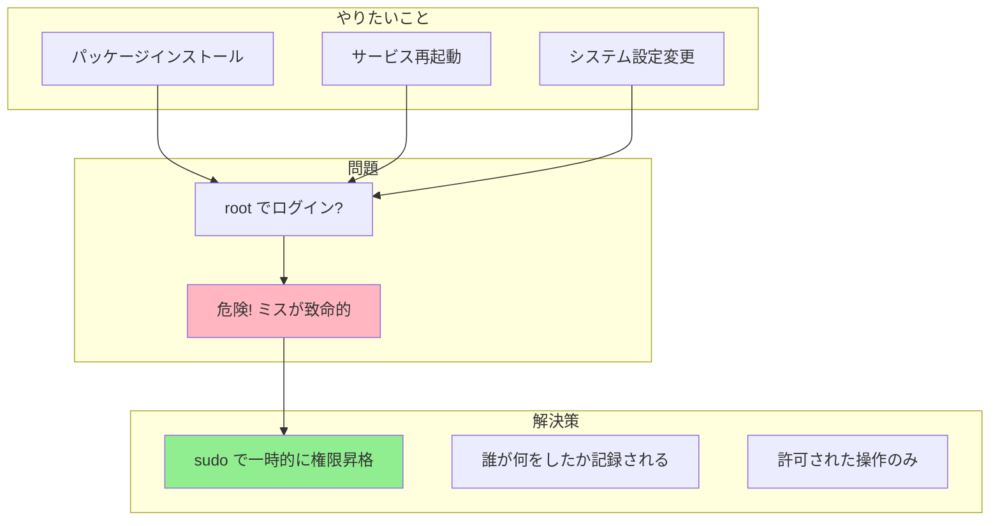

# Phase 4-2: sudo と特殊パーミッション ～ 管理者の力を借りる ～

## 学習目標

この単元を終えると、以下ができるようになります：

- `sudo` の仕組みと使い方を理解できる
- SUID, SGID, スティッキービットを説明できる
- `/etc/sudoers` の基本的な読み方がわかる
- セキュリティ上の注意点を理解できる

## 概念解説

### なぜ sudo が必要？



**Windowsで例えると：**
- UAC（ユーザーアカウント制御）の「管理者として実行」

### sudo vs su

| コマンド | 説明 | セキュリティ |
|---------|------|------------|
| `su` | ユーザーを切り替え（rootになりっぱなし） | 低 |
| `su -` | 環境変数もリセットしてユーザー切り替え | 中 |
| `sudo` | 一時的に権限昇格（コマンド単位） | 高 |
| `sudo -i` | rootシェルを起動（su - に近い） | 中 |

### 特殊パーミッション

通常の rwx に加えて、3つの特殊ビットがあります。

```
-rwsr-xr-x    # SUID（所有者の権限で実行）
-rwxr-sr-x    # SGID（グループの権限で実行）
drwxrwxrwt    # スティッキービット（削除制限）
```

| ビット | 数値 | 効果 |
|-------|------|------|
| SUID | 4000 | 実行時に所有者の権限で動作 |
| SGID | 2000 | 実行時にグループの権限で動作 |
| Sticky | 1000 | ディレクトリ内で自分のファイルしか削除できない |

## 基本コマンド

### sudo の使い方

```bash
sudo コマンド              # root権限で実行
sudo -u user コマンド      # 指定ユーザー権限で実行
sudo -i                    # rootシェルを起動
sudo -s                    # 現在の環境でrootシェル
sudo -l                    # 自分の sudo 権限を確認
sudo -k                    # パスワードのキャッシュをクリア
```

### su の使い方

```bash
su                         # rootに切り替え（環境維持）
su -                       # rootに切り替え（環境リセット）
su - username              # 他のユーザーに切り替え
su -c 'コマンド'           # 一時的にコマンド実行
```

### 特殊パーミッションの設定

```bash
# SUID
chmod u+s file             # SUID を設定
chmod 4755 file            # 数値で設定

# SGID
chmod g+s file             # SGID を設定
chmod 2755 dir             # ディレクトリに設定

# スティッキービット
chmod +t dir               # スティッキービットを設定
chmod 1777 dir             # 数値で設定
```

## ハンズオン

### 演習1: sudo の基本操作

```bash
# 1. 現在のユーザー確認
whoami
id

# 2. sudo で root として whoami
sudo whoami
# root と表示される

# 3. sudo の権限確認
sudo -l
# 許可されているコマンドが表示される

# 4. root 専用ファイルを確認
cat /etc/shadow        # Permission denied
sudo cat /etc/shadow   # OK（root権限で実行）

# 5. パッケージ情報の更新（Debian/Ubuntu）
sudo apt update
```

### 演習2: su と sudo -i の違い

```bash
# 1. sudo -s（環境を維持したままrootに）
sudo -s
whoami        # root
pwd           # 元のディレクトリのまま
echo $HOME    # /home/student（元のまま）
exit

# 2. sudo -i（ログインシェルとして）
sudo -i
whoami        # root
pwd           # /root
echo $HOME    # /root
exit

# sudo -i は su - と同様に、rootの環境を完全にロード
```

### 演習3: SUID の仕組みを理解

```bash
# passwd コマンドは SUID が設定されている典型例
ls -l /usr/bin/passwd
# -rwsr-xr-x 1 root root ... /usr/bin/passwd
#    ^-- s が SUID

# なぜ SUID が必要か？
# passwd は /etc/shadow（root所有）を更新する
# 一般ユーザーが自分のパスワードを変更できるように
# 実行時だけ root 権限で動作する

# SUID のあるファイルを探す
find /usr/bin -perm -4000 -ls 2>/dev/null
```

### 演習4: スティッキービットの動作

```bash
# /tmp はスティッキービットが設定されている
ls -ld /tmp
# drwxrwxrwt
#          ^-- t がスティッキービット

# スティッキービットの効果：
# - 誰でもファイルを作成できる（777）
# - でも他人のファイルは削除できない

# 動作確認（Docker環境での例）
cd ~/練習場
mkdir shared_dir
chmod 1777 shared_dir
ls -ld shared_dir
# drwxrwxrwt

# 自分のファイルは作成・削除可能
touch shared_dir/myfile.txt
rm shared_dir/myfile.txt
```

### 演習5: SGID ディレクトリの活用

```bash
cd ~/練習場

# チーム共有ディレクトリを想定
mkdir team_dir
ls -ld team_dir

# SGID を設定
chmod 2775 team_dir
ls -ld team_dir
# drwxrwsr-x
#       ^-- s が SGID

# SGID ディレクトリ内で作成されたファイルは
# 親ディレクトリのグループを継承する
# （チーム開発で便利）

# クリーンアップ
rm -r team_dir shared_dir
```

### 演習6: sudoers の確認（読み取りのみ）

```bash
# sudoers ファイルの確認（直接編集は visudo で！）
sudo cat /etc/sudoers

# 主な設定項目:
# root    ALL=(ALL:ALL) ALL
# │       │   │    │    └── 実行可能なコマンド
# │       │   │    └─────── 実行可能なグループ
# │       │   └──────────── 実行可能なユーザー
# │       └────────────────── 対象ホスト
# └────────────────────────── 設定対象のユーザー

# %sudo   ALL=(ALL:ALL) ALL
# ^-- % はグループを意味する

# student ユーザーの権限確認
sudo -l -U student
```

## 試験のツボ

### sudo の設定ファイル

| ファイル | 用途 |
|---------|------|
| `/etc/sudoers` | メイン設定（直接編集禁止！） |
| `/etc/sudoers.d/` | 追加設定用ディレクトリ |

**重要:** sudoers の編集は必ず `visudo` コマンドで！（構文チェックされる）

### SUID の危険性

```bash
# 危険な例（絶対にやらない！）
chmod u+s /bin/bash    # 誰でもrootになれてしまう

# SUID のあるファイルは定期的に監査すべき
find / -perm -4000 -type f 2>/dev/null
```

### 特殊パーミッションの表示

| 記号 | 意味 |
|-----|------|
| `s`（小文字） | SUID/SGID + 実行権限あり |
| `S`（大文字） | SUID/SGID のみ（実行権限なし = 無意味） |
| `t`（小文字） | スティッキー + 実行権限あり |
| `T`（大文字） | スティッキーのみ（実行権限なし） |

### 数値表記（4桁）

```
4755 = SUID + rwxr-xr-x
2755 = SGID + rwxr-xr-x
1777 = Sticky + rwxrwxrwx
6755 = SUID + SGID + rwxr-xr-x
```

## 理解度確認

### 問題

`/tmp` ディレクトリに設定されているスティッキービットの効果として正しいものはどれか。

**A.** ディレクトリ内のファイルを誰も削除できなくなる

**B.** ディレクトリ内のファイルは所有者または root のみ削除できる

**C.** ディレクトリに対する書き込み権限が無効になる

**D.** ディレクトリ内のファイルが自動的に暗号化される

---

### 解答・解説

**正解: B**

スティッキービット（`t`）がディレクトリに設定されると：
- 誰でもファイルを作成できる（パーミッションに依存）
- 自分が所有するファイルのみ削除できる
- 他人のファイルは削除できない（root は除く）

- **A.** 誤り。自分のファイルや root は削除できます。
- **B.** 正解。スティッキービットの効果です。
- **C.** 誤り。書き込み権限はそのまま有効です（ファイル作成は可能）。
- **D.** 誤り。暗号化とは無関係です。

**実務Tips:** `/tmp` や `/var/tmp` にはスティッキービットが設定されており、複数ユーザーが安全に一時ファイルを使えます。

---

## Phase 4 まとめ

Phase 4 では以下をマスターしました：

1. **基本パーミッション**: r, w, x の読み方と数値変換
2. **chmod/chown**: 権限と所有者の変更
3. **sudo**: 一時的な権限昇格
4. **特殊パーミッション**: SUID, SGID, スティッキービット

これらの知識は、セキュアなシステム運用の基礎となります。

---

## 次のステップ

権限管理をマスターしたら、次はプロセスの管理を学びましょう！

**次の単元**: [Phase 5-1: プロセスを見る ～ ps, top で動きを監視 ～](../phase5/01_プロセス監視.md)
