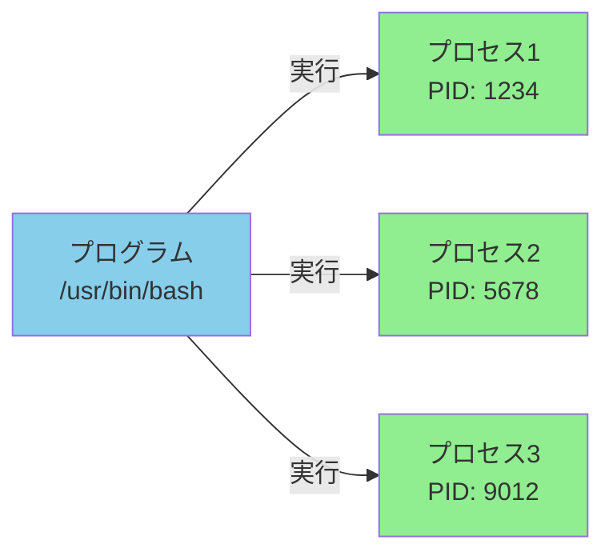
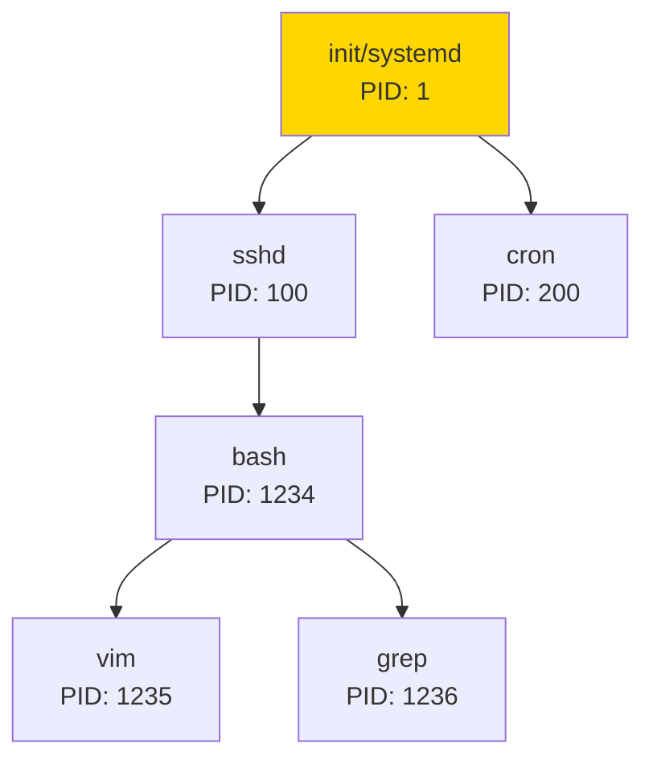

# Phase 5-1: プロセスを見る ～ ps, top で動きを監視 ～

## 学習目標

この単元を終えると、以下ができるようになります：

- `ps` コマンドでプロセス一覧を取得・解読できる
- `top` コマンドでリアルタイムにシステム状況を監視できる
- プロセスID（PID）、親プロセス（PPID）の関係を理解できる
- CPU やメモリの使用状況を把握できる

## 概念解説

### プロセスとは？

**プログラム** = ディスク上にある実行ファイル（静的）
**プロセス** = メモリ上で実行中のプログラム（動的）



**Windowsで例えると：**
- タスクマネージャーの「プロセス」タブ
- 同じアプリを複数起動すると、別々のプロセスになる

### プロセスの親子関係



- 全てのプロセスは PID 1（init または systemd）から始まる
- 親プロセス（PPID）が終了すると、子プロセスは「孤児」になる

### プロセスの状態

| 状態 | 記号 | 説明 |
|-----|------|------|
| 実行中 | R | Running - CPU を使用中 |
| スリープ | S | Sleeping - I/O 待ちなど |
| 停止 | T | sTopped - 一時停止中 |
| ゾンビ | Z | Zombie - 終了したが親が回収していない |
| 割り込み不可スリープ | D | Disk sleep - I/O 完了待ち |

## 基本コマンド

### ps (Process Status)

```bash
# 現在のターミナルのプロセス
ps

# 全ユーザーの全プロセス（BSD形式）
ps aux

# 全プロセス（UNIX形式）
ps -ef

# ツリー表示
ps axjf
ps -ef --forest

# 特定のプロセスを検索
ps aux | grep nginx
ps -ef | grep python

# 特定の列だけ表示
ps -eo pid,ppid,cmd,%cpu,%mem
```

### ps aux の出力解説

```
USER       PID %CPU %MEM    VSZ   RSS TTY      STAT START   TIME COMMAND
root         1  0.0  0.1 225912  9456 ?        Ss   Jan17   0:03 /sbin/init
│            │  │    │    │      │    │        │    │       │    │
│            │  │    │    │      │    │        │    │       │    実行コマンド
│            │  │    │    │      │    │        │    │       CPU時間
│            │  │    │    │      │    │        │    開始時刻
│            │  │    │    │      │    │        状態
│            │  │    │    │      │    端末
│            │  │    │    │      実メモリ(KB)
│            │  │    │    仮想メモリ(KB)
│            │  │    メモリ使用率
│            │  CPU使用率
│            プロセスID
ユーザー
```

### top

```bash
top                 # リアルタイム監視を開始
```

**top 内の操作キー:**

| キー | 動作 |
|-----|------|
| `q` | 終了 |
| `h` | ヘルプ |
| `M` | メモリ使用率でソート |
| `P` | CPU使用率でソート |
| `k` | プロセスを kill |
| `u` | ユーザーでフィルタ |
| `1` | CPU コアごとの表示を切り替え |
| `c` | コマンドライン全体を表示 |

### pgrep / pidof

```bash
pgrep プロセス名          # プロセス名から PID を検索
pgrep -l プロセス名       # PID と名前を表示
pgrep -u username        # 特定ユーザーのプロセス

pidof プログラム名        # 完全一致で PID を取得
```

## ハンズオン

### 演習1: ps の基本

```bash
# 1. 現在のシェルのプロセスを確認
ps
# PID TTY TIME CMD が表示される

# 2. 自分の全プロセスを表示
ps -u $(whoami)

# 3. 全プロセスを表示
ps aux | head -20

# 4. プロセス数をカウント
ps aux | wc -l

# 5. 現在のシェルの PID を確認
echo $$
ps -p $$
```

### 演習2: ps aux の詳細分析

```bash
# 1. CPU 使用率が高いプロセス TOP 5
ps aux --sort=-%cpu | head -6

# 2. メモリ使用率が高いプロセス TOP 5
ps aux --sort=-%mem | head -6

# 3. 特定のコマンドを探す
ps aux | grep bash
# 注: grep 自身も表示される

# 4. grep 自身を除外するテクニック
ps aux | grep [b]ash
# または
ps aux | grep bash | grep -v grep
```

### 演習3: プロセスの親子関係

```bash
# 1. ツリー形式で表示
ps -ef --forest | head -30

# 2. pstree コマンド（インストールされている場合）
pstree

# 3. 現在のシェルの親プロセスを追跡
echo "現在のPID: $$"
ps -ef | grep $$
# PPID を確認して、その親も見てみる

# 4. 特定のプロセスの親子を確認
ps -ef | awk '$2 == 1 || $3 == 1' | head -10
# PID=1 または PPID=1 のプロセス
```

### 演習4: top でリアルタイム監視

```bash
# 1. top を起動
top

# 以下を試してみましょう：
# - P を押す → CPU使用率でソート
# - M を押す → メモリ使用率でソート
# - 1 を押す → CPUコアごとの表示
# - c を押す → コマンドライン全体表示
# - q で終了

# 2. バッチモード（スクリプト用）
top -bn1 | head -20
# -b: バッチモード
# -n1: 1回だけ更新

# 3. 特定ユーザーのプロセスのみ
top -u $(whoami)
```

### 演習5: top の出力を読み解く

```bash
top -bn1 | head -10
```

```
top - 10:30:00 up 1 day, 2:30, 1 user, load average: 0.15, 0.10, 0.05
Tasks: 100 total,   1 running,  99 sleeping,   0 stopped,   0 zombie
%Cpu(s):  5.0 us,  2.0 sy,  0.0 ni, 92.0 id,  1.0 wa,  0.0 hi,  0.0 si
MiB Mem :   7976.0 total,   2048.0 free,   3000.0 used,   2928.0 buff/cache
MiB Swap:   2048.0 total,   2048.0 free,      0.0 used.   4500.0 avail Mem
```

| 項目 | 意味 |
|-----|------|
| load average | 1分、5分、15分平均の負荷 |
| us | User - ユーザープロセスのCPU使用率 |
| sy | System - カーネルのCPU使用率 |
| id | Idle - アイドル状態 |
| wa | Wait - I/O待ち |
| buff/cache | バッファとキャッシュ（解放可能） |

### 演習6: プロセスの検索

```bash
# 1. pgrep で検索
pgrep bash
pgrep -l bash
pgrep -la bash  # 引数も表示

# 2. 特定ユーザーのプロセス
pgrep -u root

# 3. 条件を組み合わせ
ps -ef | awk '$1 == "root" && $8 ~ /ssh/'
```

### 演習7: 実践シナリオ - 負荷調査

```bash
# 高負荷なプロセスを特定するワークフロー

# 1. まず全体状況を把握
uptime
# load average を確認

# 2. CPU を食っているプロセスを特定
ps aux --sort=-%cpu | head -5

# 3. メモリを食っているプロセスを特定
ps aux --sort=-%mem | head -5

# 4. top でリアルタイム監視
top -bn1 | head -15

# 5. 特定のプロセスの詳細情報
ps -p PID -o pid,ppid,cmd,%cpu,%mem,stat,start
```

## 試験のツボ

### ps のオプション形式

| 形式 | 例 | 特徴 |
|-----|-----|------|
| BSD形式 | `ps aux` | ハイフンなし |
| UNIX形式 | `ps -ef` | ハイフンあり |
| GNU拡張 | `ps --forest` | ロングオプション |

**混在可能だが、試験では別々に覚える**

### ps aux vs ps -ef

| 項目 | aux | -ef |
|-----|-----|-----|
| ユーザー | USER | UID |
| 親プロセス | なし | PPID |
| CPU/メモリ | あり | なし |
| 開始時刻 | START | STIME |

### 状態（STAT）の読み方

```
Ss   → S(スリープ) + s(セッションリーダー)
R+   → R(実行中) + +(フォアグラウンド)
Ssl  → S(スリープ) + s(セッションリーダー) + l(マルチスレッド)
```

| 記号 | 意味 |
|-----|------|
| `s` | セッションリーダー |
| `+` | フォアグラウンドプロセスグループ |
| `l` | マルチスレッド |
| `<` | 高優先度 |
| `N` | 低優先度 |

### load average の目安

- **1.0未満**: 余裕あり
- **CPUコア数程度**: 適正
- **CPUコア数の2倍以上**: 過負荷

例: 4コアCPUで load average が 4.0 なら適正、8.0 以上は過負荷

## 理解度確認

### 問題

`ps aux` コマンドの出力に含まれる情報として、**含まれないもの**はどれか。

**A.** プロセスID（PID）

**B.** 親プロセスID（PPID）

**C.** CPU使用率

**D.** メモリ使用率

---

### 解答・解説

**正解: B**

`ps aux` の出力列：
USER, PID, %CPU, %MEM, VSZ, RSS, TTY, STAT, START, TIME, COMMAND

- **A.** PID - 含まれます（2列目）
- **B.** PPID - **含まれません**。`ps -ef` では表示されます。
- **C.** %CPU - 含まれます（3列目）
- **D.** %MEM - 含まれます（4列目）

**使い分け:**
- 親子関係を見たい → `ps -ef`
- CPU/メモリ使用率を見たい → `ps aux`

---

## 次のステップ

プロセスを見れるようになったら、次はプロセスを制御する方法を学びましょう！

**次の単元**: [Phase 5-2: プロセスを操る ～ kill, バックグラウンド実行 ～](./02_プロセス制御.md)
