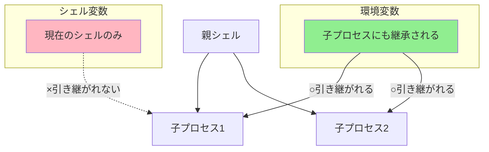

# Phase 6-1: シェル変数入門 ～ 変数で効率化 ～

## 学習目標

この単元を終えると、以下ができるようになります：

- シェル変数と環境変数の違いを理解できる
- 変数の定義・参照・削除ができる
- 重要な環境変数（PATH, HOME など）を説明できる
- `export` の使い方を理解できる

## 概念解説

### 変数とは？

データに名前を付けて保存する「箱」のこと。


### シェル変数 vs 環境変数



**Windowsで例えると：**
- 環境変数 = Windows の「システム環境変数」
- シェル変数 = バッチファイル内だけで使う変数

### 主要な環境変数

| 変数 | 説明 | 例 |
|-----|------|-----|
| `PATH` | コマンド検索パス | `/usr/bin:/bin` |
| `HOME` | ホームディレクトリ | `/home/student` |
| `USER` | 現在のユーザー名 | `student` |
| `SHELL` | 使用中のシェル | `/bin/bash` |
| `PWD` | 現在のディレクトリ | `/home/student` |
| `LANG` | 言語設定 | `ja_JP.UTF-8` |
| `PS1` | プロンプト文字列 | `\u@\h:\w\$` |

## 基本コマンド

### 変数の定義と参照

```bash
# 変数の定義（= の前後にスペース不可！）
NAME=value
NAME="value with spaces"

# 変数の参照
echo $NAME
echo ${NAME}
echo "Hello, ${NAME}!"

# 変数の削除
unset NAME
```

### 環境変数の操作

```bash
# 環境変数として定義
export NAME=value

# 既存の変数を環境変数に
NAME=value
export NAME

# 環境変数一覧
env
printenv
export -p
```

### 特殊な変数

```bash
# 特殊変数（読み取り専用）
$$        # 現在のシェルの PID
$?        # 直前のコマンドの終了ステータス
$!        # 直前のバックグラウンドプロセスの PID
$0        # スクリプト名
$1〜$9    # 引数（後述）
$#        # 引数の数
$@        # 全引数（個別）
$*        # 全引数（一括）
```

## ハンズオン

### 演習1: 変数の基本操作

```bash
# 1. 変数を定義
GREETING="Hello, World"
echo $GREETING

# 2. 変数を使った文字列
NAME="Linux"
echo "${GREETING} from ${NAME}!"

# 3. スペースなしの場合
COUNT=42
echo "Count is $COUNT"

# 4. 変数の削除
unset GREETING
echo $GREETING  # 何も表示されない

# 5. 未定義変数のデフォルト値
echo ${UNDEFINED:-"default value"}
```

### 演習2: 環境変数の確認

```bash
# 1. 主要な環境変数を確認
echo "HOME: $HOME"
echo "USER: $USER"
echo "SHELL: $SHELL"
echo "PATH: $PATH"
echo "PWD: $PWD"
echo "LANG: $LANG"

# 2. 環境変数一覧（一部）
env | head -20

# 3. 特定の環境変数を検索
env | grep -i path

# 4. printenv で特定の変数
printenv HOME
printenv USER
```

### 演習3: シェル変数 vs 環境変数

```bash
# 1. シェル変数を定義
LOCAL_VAR="I am local"

# 2. 環境変数を定義
export GLOBAL_VAR="I am global"

# 3. 現在のシェルでは両方見える
echo $LOCAL_VAR
echo $GLOBAL_VAR

# 4. 子プロセスでの確認
bash -c 'echo "LOCAL: $LOCAL_VAR"'   # 空
bash -c 'echo "GLOBAL: $GLOBAL_VAR"' # 表示される

# 5. export で環境変数に昇格
export LOCAL_VAR
bash -c 'echo "LOCAL: $LOCAL_VAR"'   # 今度は表示される
```

### 演習4: PATH の仕組み

```bash
# 1. 現在の PATH を確認
echo $PATH

# 2. コマンドがどこにあるか確認
which ls
which bash
which python3 2>/dev/null

# 3. PATH を一時的に変更
# 現在のディレクトリを PATH に追加
export PATH="$PATH:$(pwd)"
echo $PATH

# 4. 自作コマンドを作成
cat << 'EOF' > ~/練習場/mycommand
#!/bin/bash
echo "This is my custom command!"
EOF
chmod +x ~/練習場/mycommand

# 5. PATH に追加してコマンドとして実行
export PATH="$PATH:$HOME/練習場"
mycommand

# 6. 元に戻す（新しいシェルを起動するか、ログアウト）
# PATH の変更は現在のセッションのみ有効
```

### 演習5: 変数のスコープと永続化

```bash
# 1. 設定ファイルを確認
cat ~/.bashrc | head -20
cat ~/.profile 2>/dev/null | head -20

# 2. エイリアスと変数を .bashrc に追加する例
# （実際に追加する場合はバックアップを取る）
echo '# カスタム設定のサンプル'
echo 'export MY_VAR="custom value"'
echo 'alias ll="ls -la"'

# 3. 設定を反映
# source ~/.bashrc または . ~/.bashrc

# 4. 確認
# echo $MY_VAR
```

### 演習6: 特殊変数

```bash
# 1. 現在のシェルの PID
echo "Current PID: $$"

# 2. コマンドの終了ステータス
ls /
echo "Exit status: $?"  # 0 = 成功

ls /nonexistent 2>/dev/null
echo "Exit status: $?"  # 非0 = 失敗

# 3. 直前のバックグラウンドプロセス
sleep 10 &
echo "Background PID: $!"

# 4. 終了ステータスを活用
if ls /etc/passwd > /dev/null 2>&1; then
    echo "File exists"
else
    echo "File not found"
fi
```

### 演習7: 変数展開のテクニック

```bash
# テスト用変数
FILE="/home/student/documents/report.txt"

# 1. デフォルト値
echo ${UNDEFINED:-"default"}  # 未定義ならデフォルト
echo ${HOME:-"/tmp"}          # 定義済みならその値

# 2. 文字列操作（bash拡張）
echo "元の値: $FILE"
echo "ファイル名のみ: ${FILE##*/}"        # report.txt
echo "ディレクトリのみ: ${FILE%/*}"       # /home/student/documents
echo "拡張子を除去: ${FILE%.txt}"         # /home/student/documents/report
echo "拡張子のみ: ${FILE##*.}"            # txt

# 3. 文字列置換
TEXT="hello hello hello"
echo "最初だけ置換: ${TEXT/hello/hi}"     # hi hello hello
echo "全部置換: ${TEXT//hello/hi}"        # hi hi hi

# 4. 文字列の長さ
echo "長さ: ${#FILE}"
```

## 試験のツボ

### 変数定義の注意点

```bash
# ○ 正しい
VAR=value
VAR="value with spaces"

# × 間違い（スペースがある）
VAR = value     # エラー！
VAR= value      # 別のコマンドとして解釈される
```

### クォートの違い

```bash
NAME="world"

echo "Hello, $NAME"   # Hello, world（変数展開される）
echo 'Hello, $NAME'   # Hello, $NAME（展開されない）
echo Hello, $NAME     # Hello, world（展開される）
```

| クォート | 変数展開 | コマンド置換 |
|---------|---------|-------------|
| `"..."` | される | される |
| `'...'` | されない | されない |
| なし | される | される |

### export の効果

```bash
# export なし → 子プロセスに継承されない
VAR=value
bash -c 'echo $VAR'  # 空

# export あり → 子プロセスに継承される
export VAR=value
bash -c 'echo $VAR'  # value
```

### 設定ファイルの読み込み順序

1. `/etc/profile` - システム全体（ログイン時）
2. `~/.bash_profile` または `~/.profile` - ユーザー（ログイン時）
3. `~/.bashrc` - ユーザー（シェル起動時）

## 理解度確認

### 問題

以下のコマンドを実行した後、`bash -c 'echo $VAR'` の出力として正しいものはどれか。

```bash
VAR="hello"
```

**A.** hello

**B.** (空の出力)

**C.** $VAR

**D.** VAR

---

### 解答・解説

**正解: B**

`VAR="hello"` はシェル変数として定義されます。`export` していないため、子プロセス（`bash -c`）には継承されません。

- **A.** 誤り。`export VAR="hello"` の場合はこの出力になります。
- **B.** 正解。シェル変数は子プロセスに継承されないため、空になります。
- **C.** 誤り。シングルクォート `'$VAR'` の場合はこの出力になりますが、ダブルクォートなので変数展開されます。
- **D.** 誤り。このような出力にはなりません。

---

## 次のステップ

変数を理解したら、次はシェルスクリプトを書いてみましょう！

**次の単元**: [Phase 6-2: シェルスクリプト入門 ～ 自動化の第一歩 ～](./02_シェルスクリプト.md)
