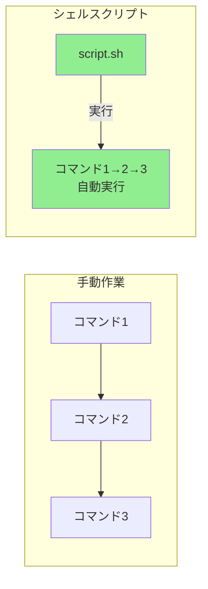
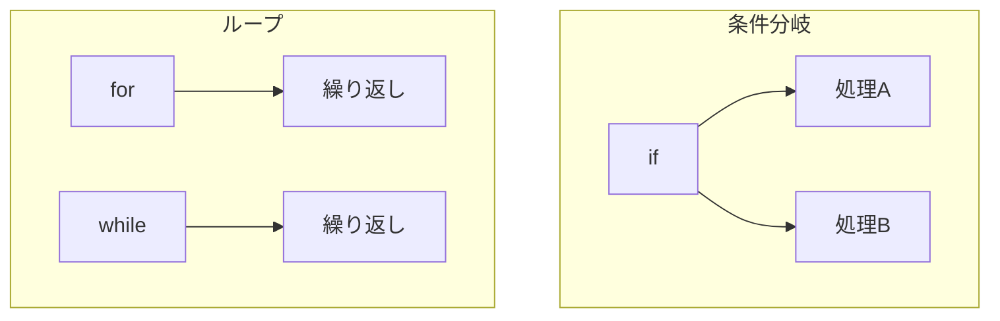

# Phase 6-2: シェルスクリプト入門 ～ 自動化の第一歩 ～

## 学習目標

この単元を終えると、以下ができるようになります：

- シェルスクリプトの基本構造を理解できる
- 条件分岐（if）とループ（for, while）を書ける
- 引数を受け取るスクリプトを作成できる
- 簡単な自動化スクリプトを作成できる

## 概念解説

### シェルスクリプトとは？

コマンドを順番に並べたテキストファイル。繰り返し作業を自動化できます。



**Windowsで例えると：**
- バッチファイル（.bat）と同じ概念
- PowerShell スクリプトに近い

### シェルスクリプトの基本構造

```bash
#!/bin/bash          # シバン（使用するシェルを指定）

# これはコメント

# 変数
NAME="World"

# コマンド実行
echo "Hello, $NAME!"

# 終了ステータス
exit 0               # 0 = 成功
```

### 制御構文



## 基本コマンド

### 条件分岐 (if)

```bash
if [ 条件 ]; then
    処理
elif [ 条件 ]; then
    処理
else
    処理
fi
```

### ループ (for)

```bash
# リストをループ
for item in item1 item2 item3; do
    echo $item
done

# 範囲をループ
for i in {1..5}; do
    echo $i
done

# C言語スタイル
for ((i=0; i<5; i++)); do
    echo $i
done
```

### ループ (while)

```bash
while [ 条件 ]; do
    処理
done

# ファイルを1行ずつ読む
while read line; do
    echo $line
done < file.txt
```

### 条件式（test コマンド）

```bash
# 文字列比較
[ "$a" = "$b" ]      # 等しい
[ "$a" != "$b" ]     # 等しくない
[ -z "$a" ]          # 空文字列
[ -n "$a" ]          # 空でない

# 数値比較
[ $a -eq $b ]        # equal
[ $a -ne $b ]        # not equal
[ $a -lt $b ]        # less than
[ $a -le $b ]        # less or equal
[ $a -gt $b ]        # greater than
[ $a -ge $b ]        # greater or equal

# ファイル判定
[ -e file ]          # 存在する
[ -f file ]          # 通常ファイル
[ -d file ]          # ディレクトリ
[ -r file ]          # 読み取り可能
[ -w file ]          # 書き込み可能
[ -x file ]          # 実行可能

# 論理演算
[ 条件1 ] && [ 条件2 ]   # AND
[ 条件1 ] || [ 条件2 ]   # OR
[ ! 条件 ]               # NOT
```

## ハンズオン

### 演習1: 最初のスクリプト

```bash
cd ~/練習場

# スクリプトを作成
cat << 'EOF' > hello.sh
#!/bin/bash
# 最初のシェルスクリプト

echo "Hello, World!"
echo "Today is $(date)"
echo "You are: $(whoami)"
echo "Current directory: $(pwd)"
EOF

# 実行権限を付与
chmod +x hello.sh

# 実行
./hello.sh
```

### 演習2: 引数を受け取る

```bash
cat << 'EOF' > greet.sh
#!/bin/bash
# 引数を受け取るスクリプト

# 引数チェック
if [ $# -eq 0 ]; then
    echo "Usage: $0 <name>"
    exit 1
fi

NAME=$1
echo "Hello, $NAME!"
echo "You passed $# argument(s)"
echo "All arguments: $@"
EOF

chmod +x greet.sh

# 実行
./greet.sh
./greet.sh Alice
./greet.sh Alice Bob Charlie
```

### 演習3: 条件分岐

```bash
cat << 'EOF' > check_file.sh
#!/bin/bash
# ファイルの種類を判定

if [ $# -eq 0 ]; then
    echo "Usage: $0 <path>"
    exit 1
fi

TARGET=$1

if [ ! -e "$TARGET" ]; then
    echo "$TARGET は存在しません"
elif [ -f "$TARGET" ]; then
    echo "$TARGET は通常ファイルです"
    if [ -r "$TARGET" ]; then
        echo "  - 読み取り可能"
    fi
    if [ -w "$TARGET" ]; then
        echo "  - 書き込み可能"
    fi
    if [ -x "$TARGET" ]; then
        echo "  - 実行可能"
    fi
elif [ -d "$TARGET" ]; then
    echo "$TARGET はディレクトリです"
    echo "  - 中身: $(ls -1 "$TARGET" | wc -l) 個"
else
    echo "$TARGET は特殊なファイルです"
fi
EOF

chmod +x check_file.sh

# テスト
./check_file.sh /etc/passwd
./check_file.sh /tmp
./check_file.sh /nonexistent
./check_file.sh ./check_file.sh
```

### 演習4: for ループ

```bash
cat << 'EOF' > loop_demo.sh
#!/bin/bash
# ループのデモ

echo "=== リストをループ ==="
for fruit in apple banana cherry; do
    echo "I like $fruit"
done

echo ""
echo "=== 範囲をループ ==="
for i in {1..5}; do
    echo "Count: $i"
done

echo ""
echo "=== ファイルをループ ==="
for file in *.sh; do
    echo "Script: $file"
done

echo ""
echo "=== C言語スタイル ==="
for ((i=0; i<3; i++)); do
    echo "Index: $i"
done
EOF

chmod +x loop_demo.sh
./loop_demo.sh
```

### 演習5: while ループ

```bash
cat << 'EOF' > countdown.sh
#!/bin/bash
# カウントダウン

COUNT=${1:-5}  # 引数なければデフォルト5

echo "Countdown from $COUNT"

while [ $COUNT -gt 0 ]; do
    echo $COUNT
    COUNT=$((COUNT - 1))
    sleep 1
done

echo "Blast off!"
EOF

chmod +x countdown.sh
./countdown.sh 3
```

### 演習6: ファイルを1行ずつ処理

```bash
cat << 'EOF' > process_file.sh
#!/bin/bash
# ファイルを1行ずつ処理

if [ $# -eq 0 ]; then
    echo "Usage: $0 <file>"
    exit 1
fi

FILE=$1

if [ ! -f "$FILE" ]; then
    echo "Error: $FILE is not a file"
    exit 1
fi

echo "Processing: $FILE"
echo "========================"

LINE_NUM=0
while IFS= read -r line; do
    LINE_NUM=$((LINE_NUM + 1))
    echo "$LINE_NUM: $line"
done < "$FILE"

echo "========================"
echo "Total lines: $LINE_NUM"
EOF

chmod +x process_file.sh
./process_file.sh documents/fruits.txt
```

### 演習7: 実践 - バックアップスクリプト

```bash
cat << 'EOF' > backup.sh
#!/bin/bash
# 簡単なバックアップスクリプト

# 設定
SOURCE=${1:-.}
BACKUP_DIR=${2:-./backup}
DATE=$(date +%Y%m%d_%H%M%S)

# バックアップ先ディレクトリ作成
if [ ! -d "$BACKUP_DIR" ]; then
    mkdir -p "$BACKUP_DIR"
    echo "Created backup directory: $BACKUP_DIR"
fi

# バックアップファイル名
BACKUP_FILE="$BACKUP_DIR/backup_${DATE}.tar.gz"

# バックアップ実行
echo "Backing up $SOURCE to $BACKUP_FILE..."

if tar -czf "$BACKUP_FILE" "$SOURCE" 2>/dev/null; then
    echo "Backup completed successfully!"
    echo "File: $BACKUP_FILE"
    echo "Size: $(ls -lh "$BACKUP_FILE" | awk '{print $5}')"
else
    echo "Backup failed!"
    exit 1
fi
EOF

chmod +x backup.sh

# テスト
./backup.sh documents
ls -la backup/
```

### 演習8: case 文

```bash
cat << 'EOF' > menu.sh
#!/bin/bash
# メニュー形式のスクリプト

echo "=== System Info Menu ==="
echo "1) Show date"
echo "2) Show disk usage"
echo "3) Show memory"
echo "4) Show logged in users"
echo "q) Quit"
echo ""
read -p "Select option: " choice

case $choice in
    1)
        date
        ;;
    2)
        df -h
        ;;
    3)
        free -h
        ;;
    4)
        who
        ;;
    q|Q)
        echo "Goodbye!"
        exit 0
        ;;
    *)
        echo "Invalid option: $choice"
        exit 1
        ;;
esac
EOF

chmod +x menu.sh
./menu.sh
```

## 試験のツボ

### シバン（#!）

```bash
#!/bin/bash      # bash を使用
#!/bin/sh        # POSIX 互換シェル
#!/usr/bin/env bash  # 環境から bash を探す（移植性高い）
```

### 終了ステータス

```bash
exit 0    # 成功
exit 1    # エラー（一般的）
exit 2    # 使用法エラー（引数不正など）
```

### 変数の参照

```bash
$1        # 1番目の引数
${10}     # 10番目の引数（2桁以上は{}必要）
$#        # 引数の数
$@        # 全引数（個別に展開）
$*        # 全引数（一つの文字列として）
$?        # 直前のコマンドの終了ステータス
$$        # スクリプト自身の PID
```

### test コマンドと [ ]

```bash
# 以下は同じ意味
test -f file
[ -f file ]

# 注意: [ ] の前後にスペース必要！
[ -f file ]    # ○
[-f file]      # ×
```

### 算術演算

```bash
# $(( )) を使う
result=$((1 + 2))
count=$((count + 1))

# let を使う（bash）
let count++
let "count = count + 1"
```

## 理解度確認

### 問題

以下のスクリプトを実行したとき、出力として正しいものはどれか。

```bash
#!/bin/bash
COUNT=3
while [ $COUNT -gt 0 ]; do
    echo $COUNT
    COUNT=$((COUNT - 1))
done
```

**A.** 1 2 3

**B.** 3 2 1

**C.** 3 2 1 0

**D.** 0 1 2 3

---

### 解答・解説

**正解: B**

- `COUNT=3` で初期化
- `[ $COUNT -gt 0 ]` は「COUNT > 0」の間ループ
- 各ループで COUNT を出力し、1 減らす
- COUNT が 0 になるとループ終了（0は出力されない）

実行の流れ：
1. COUNT=3 → 出力「3」→ COUNT=2
2. COUNT=2 → 出力「2」→ COUNT=1
3. COUNT=1 → 出力「1」→ COUNT=0
4. COUNT=0 → 条件不成立、ループ終了

---

## Phase 6 まとめ

Phase 6 では以下をマスターしました：

1. **シェル変数**: 変数の定義・参照・スコープ
2. **環境変数**: PATH, HOME などの重要な変数
3. **シェルスクリプト**: 条件分岐とループ
4. **自動化**: 実践的なスクリプト作成

これらのスキルで、日常の繰り返し作業を自動化できます。

---

## 次のステップ

シェルスクリプトをマスターしたら、次はネットワークの基礎を学びましょう！

**次の単元**: [Phase 7-1: ネットワーク基礎 ～ IPアドレスと接続確認 ～](../phase7/01_ネットワーク基礎.md)
