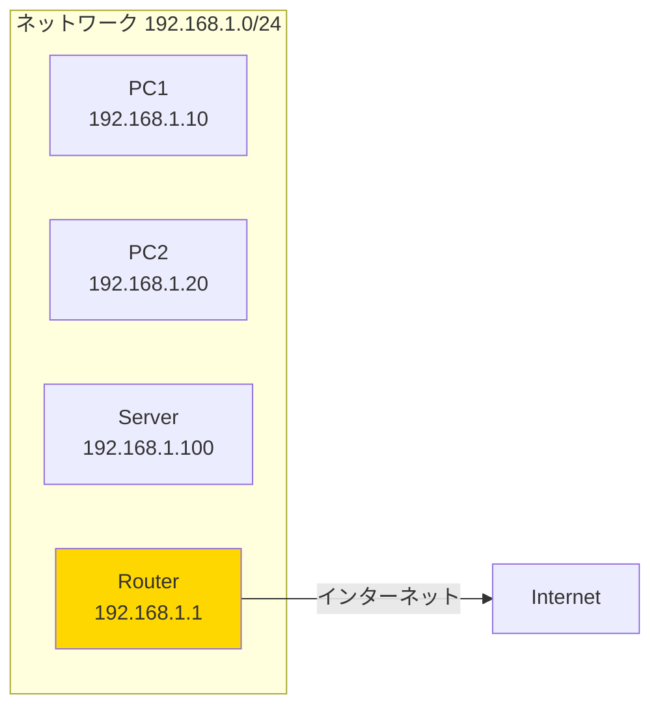

# Phase 7-1: ネットワーク基礎 ～ IPアドレスと接続確認 ～

## 学習目標

この単元を終えると、以下ができるようになります：

- `ip` コマンドでネットワーク設定を確認できる
- `ping` で疎通確認ができる
- IPアドレス、サブネットマスク、ゲートウェイの関係を理解できる
- 基本的なネットワークトラブルシューティングができる

## 概念解説

### IPアドレスとは？

ネットワーク上でコンピュータを識別する「住所」です。



**Windowsで例えると：**
- コマンドプロンプトで `ipconfig`
- Linux では `ip addr` または `ifconfig`

### IPv4アドレスの構造

```
192.168.1.100 / 24
│           │    └── サブネットマスク（ネットワーク部のビット数）
│           └── ホスト部
└── ネットワーク部

サブネットマスク /24 = 255.255.255.0
- ネットワーク部: 192.168.1
- ホスト部: 100
- 同じネットワーク: 192.168.1.1 〜 192.168.1.254
```

### 重要なネットワーク用語

| 用語 | 説明 | 例 |
|-----|------|-----|
| IPアドレス | ホストの識別番号 | 192.168.1.100 |
| サブネットマスク | ネットワーク範囲の定義 | 255.255.255.0 (/24) |
| デフォルトゲートウェイ | 外部ネットワークへの出口 | 192.168.1.1 |
| DNS | ドメイン名→IPアドレス変換 | 8.8.8.8 |
| ループバック | 自分自身を指す | 127.0.0.1 |

### プライベートIPアドレス

| クラス | 範囲 | よく使われる |
|-------|------|-------------|
| A | 10.0.0.0 〜 10.255.255.255 | 大規模ネットワーク |
| B | 172.16.0.0 〜 172.31.255.255 | 中規模 |
| C | 192.168.0.0 〜 192.168.255.255 | 家庭・小規模 |

## 基本コマンド

### ip コマンド（推奨）

```bash
# IPアドレス確認
ip addr                      # 全インターフェース
ip addr show eth0            # 特定のインターフェース
ip a                         # 省略形

# ルーティング確認
ip route                     # ルーティングテーブル
ip r                         # 省略形

# リンク状態確認
ip link                      # インターフェース状態
ip l                         # 省略形

# 近隣（ARP）テーブル
ip neigh                     # ARPキャッシュ
ip n                         # 省略形
```

### ifconfig（レガシー）

```bash
ifconfig                     # 全インターフェース
ifconfig eth0                # 特定のインターフェース
```

### ping

```bash
ping ホスト                   # 疎通確認（Ctrl+Cで停止）
ping -c 4 ホスト             # 4回で停止
ping -c 4 -i 0.5 ホスト      # 0.5秒間隔
```

### その他のコマンド

```bash
# ルーティング経路確認
traceroute ホスト            # パケットの経路を表示
tracepath ホスト             # root不要版

# DNS確認
host ドメイン                # 簡易的なDNS検索
nslookup ドメイン            # DNS検索
dig ドメイン                 # 詳細なDNS検索

# 接続確認
ss -tuln                     # 開いているポート
netstat -tuln                # 同上（レガシー）
```

## ハンズオン

### 演習1: IPアドレスの確認

```bash
# 1. 全てのネットワークインターフェースを確認
ip addr

# 出力例の読み方:
# 2: eth0: <BROADCAST,MULTICAST,UP,LOWER_UP>
#     link/ether 02:42:ac:11:00:02 brd ff:ff:ff:ff:ff:ff
#     inet 172.17.0.2/16 brd 172.17.255.255 scope global eth0
#          │           │
#          │           └── サブネットマスク（/16 = 255.255.0.0）
#          └── IPアドレス

# 2. 特定のインターフェース
ip addr show eth0 2>/dev/null || ip addr show en0 2>/dev/null

# 3. IPv4アドレスだけ抽出
ip -4 addr

# 4. ループバックアドレス
ip addr show lo
```

### 演習2: ルーティングの確認

```bash
# 1. ルーティングテーブル
ip route

# 出力例:
# default via 172.17.0.1 dev eth0
#         │          └── デフォルトゲートウェイ
#         └── 「default」は全ての宛先

# 172.17.0.0/16 dev eth0 proto kernel scope link src 172.17.0.2
#     │                                              └── 送信元IP
#     └── このネットワーク宛は eth0 を使用

# 2. デフォルトゲートウェイの確認
ip route | grep default
```

### 演習3: ping で疎通確認

```bash
# 1. ローカルホスト（自分自身）
ping -c 3 127.0.0.1

# 2. ゲートウェイ（ルーター）への疎通
GATEWAY=$(ip route | grep default | awk '{print $3}')
echo "Gateway: $GATEWAY"
ping -c 3 $GATEWAY 2>/dev/null || echo "Gateway not reachable"

# 3. 外部ホスト（Google DNS）
ping -c 3 8.8.8.8

# 4. ドメイン名で ping（DNS解決も確認）
ping -c 3 google.com

# 5. 疎通できない場合の確認
ping -c 3 192.168.255.255  # 存在しないホスト
```

### 演習4: DNS の確認

```bash
# 1. 設定されているDNSサーバー確認
cat /etc/resolv.conf

# 2. ドメイン名からIPアドレスを引く
host google.com

# 3. nslookup（対話式も可能）
nslookup google.com

# 4. dig（詳細情報）
dig google.com

# 5. 逆引き（IPからドメイン）
host 8.8.8.8
```

### 演習5: ポートと接続状態

```bash
# 1. リッスン中のポート確認
ss -tuln
# -t: TCP
# -u: UDP
# -l: LISTEN状態
# -n: 数値表示

# 2. 全ての接続を表示
ss -tun

# 3. プロセス情報も表示（要root）
sudo ss -tulnp

# 4. 特定のポートを確認
ss -tuln | grep :22   # SSH
ss -tuln | grep :80   # HTTP
ss -tuln | grep :443  # HTTPS
```

### 演習6: ネットワークトラブルシューティング

```bash
# 問題: インターネットに繋がらない！

# Step 1: 自分のIPを確認
ip addr | grep inet

# Step 2: ゲートウェイに到達できるか
ip route | grep default
ping -c 2 $(ip route | grep default | awk '{print $3}')

# Step 3: 外部に到達できるか（IPアドレス直接）
ping -c 2 8.8.8.8

# Step 4: DNS が動いているか（名前解決）
ping -c 2 google.com

# トラブルの切り分け:
# - Step 2 失敗 → ローカルネットワーク問題
# - Step 3 失敗 → ルーター/ISP問題
# - Step 4 失敗 → DNS問題
```

### 演習7: curl でHTTP接続

```bash
# 1. Webページを取得
curl -I https://www.google.com
# -I: ヘッダーのみ

# 2. 内容を取得
curl -s https://httpbin.org/ip
# -s: サイレントモード

# 3. HTTPステータスコードだけ
curl -s -o /dev/null -w "%{http_code}" https://www.google.com
echo ""

# 4. タイムアウト設定
curl --connect-timeout 5 -s https://www.google.com > /dev/null && echo "OK" || echo "Failed"
```

## 試験のツボ

### ip vs ifconfig

| 項目 | ip | ifconfig |
|-----|-----|---------|
| 推奨度 | ◎（現代的） | △（レガシー） |
| インストール | iproute2 | net-tools |
| IPv6 | ○ | △ |
| 機能 | 豊富 | 基本的 |

**試験でも実務でも `ip` を使う**

### よく使う ip サブコマンド

```bash
ip addr     # IPアドレス
ip route    # ルーティング
ip link     # インターフェース状態
ip neigh    # ARPテーブル
```

### サブネットマスクの変換

| CIDR | サブネットマスク | ホスト数 |
|------|-----------------|---------|
| /8 | 255.0.0.0 | 約1677万 |
| /16 | 255.255.0.0 | 65534 |
| /24 | 255.255.255.0 | 254 |
| /25 | 255.255.255.128 | 126 |
| /26 | 255.255.255.192 | 62 |

### 重要なポート番号

| ポート | サービス |
|-------|---------|
| 20, 21 | FTP |
| 22 | SSH |
| 23 | Telnet |
| 25 | SMTP |
| 53 | DNS |
| 80 | HTTP |
| 443 | HTTPS |

## 理解度確認

### 問題

LinuxシステムでデフォルトゲートウェイのIPアドレスを確認するコマンドとして正しいものはどれか。

**A.** `ip addr`

**B.** `ip route`

**C.** `ip link`

**D.** `ip neigh`

---

### 解答・解説

**正解: B**

- **A.** `ip addr` - IPアドレスとサブネットマスクを表示。ゲートウェイは表示されない。
- **B.** `ip route` - 正解。ルーティングテーブルを表示し、`default via X.X.X.X` の形式でデフォルトゲートウェイが確認できる。
- **C.** `ip link` - インターフェースの状態（UP/DOWN、MACアドレスなど）を表示。
- **D.** `ip neigh` - ARPテーブル（近隣キャッシュ）を表示。

**覚え方:** 「ルート（経路）を知りたければ route」

---

## 次のステップ

ネットワークの基礎を理解したら、次はシステム管理の基本を学びましょう！

**次の単元**: [Phase 8-1: サービス管理 ～ systemctl でサービスを操る ～](../phase8/01_サービス管理.md)
