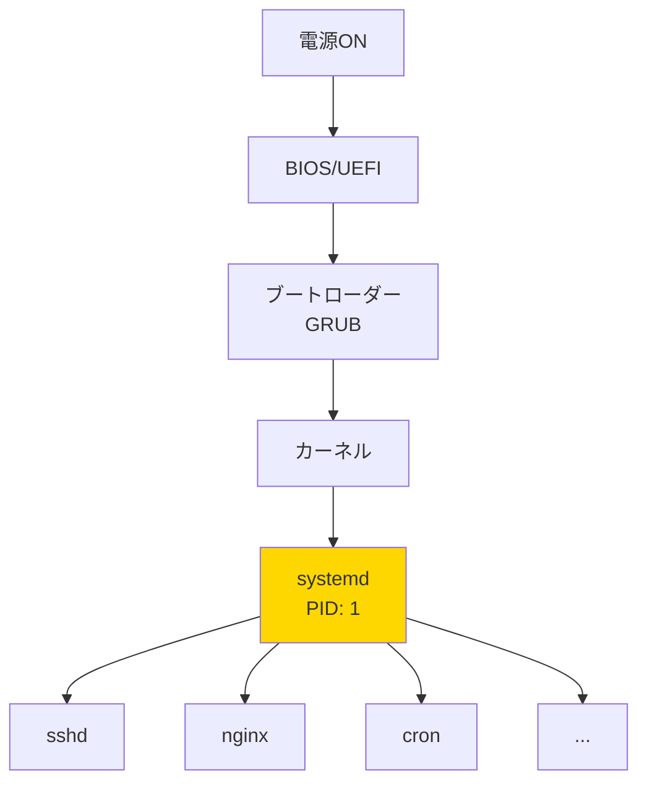
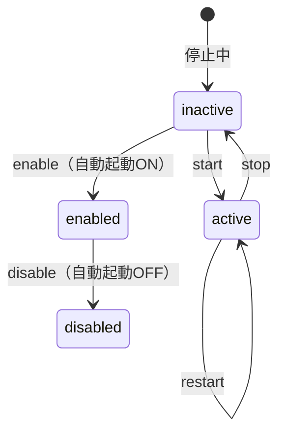

# Phase 8-1: サービス管理 ～ systemctl でサービスを操る ～

## 学習目標

この単元を終えると、以下ができるようになります：

- `systemctl` でサービスの状態確認・起動・停止ができる
- サービスの自動起動設定ができる
- `journalctl` でログを確認できる
- systemd の基本概念を理解できる

## 概念解説

### systemd とは？

Linux の起動処理とサービス管理を担当する「司令塔」です。



**Windowsで例えると：**
- Windows サービス（services.msc）
- systemctl ≒ サービス管理コンソール

### Unit とは？

systemd が管理する「単位」のこと。サービスだけでなく、様々な種類があります。

| Unit タイプ | 拡張子 | 用途 |
|-----------|--------|------|
| service | .service | サービス（デーモン） |
| socket | .socket | ソケット接続待ち |
| target | .target | 複数Unit のグループ |
| timer | .timer | 定期実行（cron の代替） |
| mount | .mount | マウントポイント |

### サービスの状態



## 基本コマンド

### systemctl

```bash
# サービス状態確認
systemctl status サービス名
systemctl is-active サービス名
systemctl is-enabled サービス名

# サービス制御
systemctl start サービス名     # 起動
systemctl stop サービス名      # 停止
systemctl restart サービス名   # 再起動
systemctl reload サービス名    # 設定再読み込み

# 自動起動設定
systemctl enable サービス名    # 自動起動ON
systemctl disable サービス名   # 自動起動OFF
systemctl enable --now サービス名  # 有効化 + 即時起動

# 一覧表示
systemctl list-units              # 読み込み済みUnit
systemctl list-unit-files         # 全Unit ファイル
systemctl list-units --type=service  # サービスのみ
```

### journalctl

```bash
# ログ表示
journalctl                        # 全ログ
journalctl -u サービス名          # 特定サービスのログ
journalctl -f                     # リアルタイム追跡（tail -f 相当）
journalctl -b                     # 今回の起動以降
journalctl -b -1                  # 前回起動時
journalctl --since "1 hour ago"   # 時間指定
journalctl -p err                 # エラー以上
journalctl -n 50                  # 最新50行
```

## ハンズオン

### 演習1: サービス状態の確認

```bash
# 注: Docker環境では systemd が動いていない場合があります
# その場合は出力例を参考に概念を理解してください

# 1. 全サービスの一覧（実行中のみ）
systemctl list-units --type=service --state=running 2>/dev/null | head -20

# 2. 特定のサービスの状態
systemctl status sshd 2>/dev/null || echo "sshd not available in this environment"
systemctl status cron 2>/dev/null || echo "cron not available"

# 3. サービスが動いているか確認
systemctl is-active sshd 2>/dev/null || echo "unknown"

# 4. 自動起動が有効か確認
systemctl is-enabled sshd 2>/dev/null || echo "unknown"
```

### 演習2: サービスの起動・停止（要sudo）

```bash
# 注: Docker環境では実行できない場合があります
# 以下は一般的な Linux サーバーでの操作例です

# 1. サービスを停止
# sudo systemctl stop cron

# 2. 状態確認
# systemctl status cron

# 3. サービスを起動
# sudo systemctl start cron

# 4. 再起動
# sudo systemctl restart cron

# 5. 設定の再読み込み（停止せずに反映）
# sudo systemctl reload cron
```

### 演習3: 自動起動の設定

```bash
# 1. 現在の自動起動状態を確認
systemctl is-enabled ssh 2>/dev/null || echo "not available"

# 2. 自動起動を有効化
# sudo systemctl enable ssh

# 3. 自動起動を無効化
# sudo systemctl disable ssh

# 4. 有効化 + 即時起動（よく使う）
# sudo systemctl enable --now nginx

# 5. 自動起動設定の一覧
systemctl list-unit-files --type=service | grep enabled | head -10
```

### 演習4: journalctl でログ確認

```bash
# 1. 全ログ（最新から）
journalctl -n 20 2>/dev/null || echo "journalctl not available"

# 2. 特定サービスのログ
journalctl -u sshd -n 10 2>/dev/null

# 3. エラーログのみ
journalctl -p err -n 10 2>/dev/null

# 4. 今日のログ
journalctl --since today -n 10 2>/dev/null

# 5. リアルタイム追跡
# journalctl -f  # Ctrl+C で終了
```

### 演習5: Unit ファイルの確認

```bash
# 1. Unit ファイルの場所を確認
systemctl show sshd -p FragmentPath 2>/dev/null

# 2. Unit ファイルの中身を見る
# systemctl cat sshd

# 3. Unit ファイルの一般的な構造
cat << 'EOF'
[Unit]
Description=サービスの説明
After=network.target      # この Unit の後に起動

[Service]
Type=simple               # サービスのタイプ
ExecStart=/usr/bin/xxx    # 起動コマンド
ExecReload=/bin/kill -HUP $MAINPID  # reload 時のコマンド
Restart=always            # 異常終了時に自動再起動

[Install]
WantedBy=multi-user.target  # どの target で起動するか
EOF
```

### 演習6: 従来の init との比較

```bash
# systemd 以前（SysVinit）との対応
echo "=== コマンド対応表 ==="
cat << 'EOF'
| 操作 | SysVinit | systemd |
|------|----------|---------|
| 起動 | service xxx start | systemctl start xxx |
| 停止 | service xxx stop | systemctl stop xxx |
| 再起動 | service xxx restart | systemctl restart xxx |
| 状態 | service xxx status | systemctl status xxx |
| 自動起動ON | chkconfig xxx on | systemctl enable xxx |
| 自動起動OFF | chkconfig xxx off | systemctl disable xxx |
EOF

# 一部の Linux では service コマンドも使える（互換性のため）
# service sshd status  # 内部で systemctl を呼ぶ
```

### 演習7: ターゲット（ランレベル）

```bash
# 1. 現在のターゲット（ランレベル）を確認
systemctl get-default 2>/dev/null || echo "not available"

# 2. ターゲットの種類
cat << 'EOF'
| ターゲット | 旧ランレベル | 説明 |
|-----------|-------------|------|
| poweroff.target | 0 | シャットダウン |
| rescue.target | 1 | シングルユーザーモード |
| multi-user.target | 3 | マルチユーザー（CUI） |
| graphical.target | 5 | GUI |
| reboot.target | 6 | 再起動 |
EOF

# 3. デフォルトターゲットの変更
# sudo systemctl set-default multi-user.target

# 4. 一時的にターゲットを変更
# sudo systemctl isolate rescue.target
```

## 試験のツボ

### systemctl のサブコマンド

| サブコマンド | 機能 |
|-------------|------|
| start | 起動 |
| stop | 停止 |
| restart | 再起動 |
| reload | 設定再読み込み |
| status | 状態表示 |
| enable | 自動起動ON |
| disable | 自動起動OFF |
| is-active | 動作中か確認 |
| is-enabled | 自動起動か確認 |

### Unit ファイルのセクション

| セクション | 内容 |
|-----------|------|
| [Unit] | 依存関係、説明 |
| [Service] | 実行方法、再起動設定 |
| [Install] | enable 時の設定 |

### journalctl のオプション

| オプション | 説明 |
|-----------|------|
| -u | Unit 指定 |
| -f | リアルタイム追跡 |
| -b | 今回の起動以降 |
| -p | 優先度（err, warning など） |
| -n | 行数指定 |
| --since | 開始時刻 |
| --until | 終了時刻 |

### ランレベルとターゲットの対応

```
0 = poweroff.target
1 = rescue.target
2,3,4 = multi-user.target
5 = graphical.target
6 = reboot.target
```

## 理解度確認

### 問題

systemd でサービス「nginx」を起動時に自動的に開始するように設定し、同時にサービスを今すぐ起動するコマンドはどれか。

**A.** `systemctl start nginx && systemctl enable nginx`

**B.** `systemctl enable --now nginx`

**C.** `systemctl enable nginx --start`

**D.** `systemctl autostart nginx`

---

### 解答・解説

**正解: B**

- **A.** 動作はするが、2つのコマンドを実行する必要がある。
- **B.** 正解。`--now` オプションで「enable + start」を同時に実行できる。
- **C.** 誤り。`--start` というオプションは存在しない。
- **D.** 誤り。`autostart` というサブコマンドは存在しない。

**実務Tips:** `systemctl enable --now` は新しいサービスを導入するときによく使うパターンです。

---

## 次のステップ

サービス管理をマスターしたら、次はログ管理と定期実行を学びましょう！

**次の単元**: [Phase 8-2: ログと定期実行 ～ syslog と cron ～](./02_ログとcron.md)
