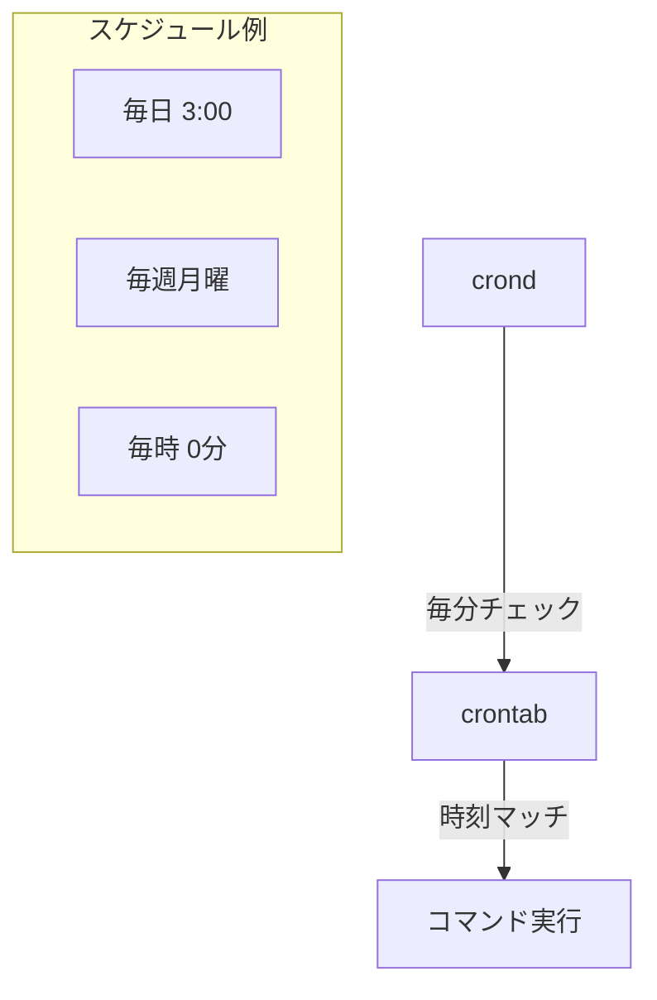

# Phase 8-2: ログと定期実行 ～ syslog と cron ～

## 学習目標

この単元を終えると、以下ができるようになります：

- システムログの場所と種類を理解できる
- `cron` で定期的なタスクをスケジュールできる
- crontab の書式をマスターできる
- ログローテーションの概念を理解できる

## 概念解説

### システムログの仕組み

```mermaid
graph LR
    App1[アプリケーション] --> Syslog[rsyslog/syslog-ng]
    App2[カーネル] --> Syslog
    App3[systemd] --> Syslog

    Syslog --> Log1[/var/log/messages]
    Syslog --> Log2[/var/log/auth.log]
    Syslog --> Log3[/var/log/syslog]

    Syslog --> Journald[journald]
    Journald --> Binary[バイナリログ]

    style Syslog fill:#FFD700
```

### 主要なログファイル

| ファイル | 内容 |
|---------|------|
| /var/log/syslog | 一般的なシステムログ（Debian系） |
| /var/log/messages | 一般的なシステムログ（RedHat系） |
| /var/log/auth.log | 認証関連 |
| /var/log/kern.log | カーネルメッセージ |
| /var/log/dmesg | 起動時のメッセージ |
| /var/log/apt/ | パッケージ管理（Debian） |
| /var/log/nginx/ | nginx のログ |

### cron とは？

定期的にコマンドを自動実行する仕組み。



**Windowsで例えると：**
- タスクスケジューラ

### crontab の書式

```
分 時 日 月 曜日 コマンド
│  │  │  │  │
│  │  │  │  └── 曜日 (0-7, 0と7は日曜)
│  │  │  └───── 月 (1-12)
│  │  └──────── 日 (1-31)
│  └─────────── 時 (0-23)
└────────────── 分 (0-59)
```

## 基本コマンド

### ログ関連

```bash
# ログファイルの閲覧
less /var/log/syslog
tail -f /var/log/syslog        # リアルタイム追跡
grep ERROR /var/log/syslog     # エラーを検索

# journalctl（systemd）
journalctl -u service_name     # 特定サービス
journalctl -f                  # リアルタイム
journalctl --since "1 hour ago"

# dmesg（カーネルメッセージ）
dmesg
dmesg | tail -20
dmesg -T                       # タイムスタンプを読みやすく
```

### cron 関連

```bash
# crontab 操作
crontab -e                     # 編集
crontab -l                     # 一覧表示
crontab -r                     # 削除（注意！）
crontab -u user -e             # 他ユーザーの編集（要root）

# システム cron
/etc/crontab                   # システム crontab
/etc/cron.d/                   # 追加の cron 設定
/etc/cron.daily/               # 毎日実行
/etc/cron.weekly/              # 毎週実行
/etc/cron.monthly/             # 毎月実行
/etc/cron.hourly/              # 毎時実行
```

## ハンズオン

### 演習1: ログファイルの探索

```bash
# 1. /var/log の中身を確認
ls -la /var/log/

# 2. 主要なログファイルを確認
ls -la /var/log/*.log 2>/dev/null

# 3. syslog または messages を確認
if [ -f /var/log/syslog ]; then
    tail -20 /var/log/syslog
elif [ -f /var/log/messages ]; then
    tail -20 /var/log/messages
else
    echo "Standard syslog not found"
fi

# 4. 認証ログを確認
sudo cat /var/log/auth.log 2>/dev/null | tail -10 || echo "auth.log not accessible"

# 5. dmesg でカーネルメッセージ
dmesg | tail -10
```

### 演習2: ログの検索と分析

```bash
# 1. エラーを検索
grep -i error /var/log/syslog 2>/dev/null | tail -5

# 2. 特定の時間帯を抽出
grep "$(date +%b\ %d)" /var/log/syslog 2>/dev/null | head -10

# 3. 認証失敗を検索
grep -i "failed\|failure" /var/log/auth.log 2>/dev/null | tail -5

# 4. ログの行数をカウント
wc -l /var/log/*.log 2>/dev/null | tail -5
```

### 演習3: crontab の基本

```bash
# 1. 現在の crontab を確認
crontab -l 2>/dev/null || echo "No crontab for current user"

# 2. システム crontab を確認
cat /etc/crontab 2>/dev/null || echo "/etc/crontab not available"

# 3. cron.d ディレクトリの内容
ls -la /etc/cron.d/ 2>/dev/null

# 4. daily/weekly/monthly の内容
ls /etc/cron.daily/ 2>/dev/null
```

### 演習4: crontab の書き方練習

```bash
# crontab の書式を練習（実際には登録しない）
echo "=== crontab 書式例 ==="
cat << 'EOF'
# 分 時 日 月 曜日 コマンド

# 毎分実行
* * * * * /path/to/command

# 毎時0分に実行
0 * * * * /path/to/command

# 毎日 3:00 に実行
0 3 * * * /path/to/command

# 毎週月曜 9:00 に実行
0 9 * * 1 /path/to/command

# 毎月1日 0:00 に実行
0 0 1 * * /path/to/command

# 平日の 9:00 に実行（月〜金）
0 9 * * 1-5 /path/to/command

# 5分ごとに実行
*/5 * * * * /path/to/command

# 9時〜17時の間、毎時実行
0 9-17 * * * /path/to/command

# 複数の時刻（8時、12時、18時）
0 8,12,18 * * * /path/to/command
EOF
```

### 演習5: 実際に cron を設定

```bash
cd ~/練習場

# 1. 簡単なスクリプトを作成
cat << 'EOF' > cron_test.sh
#!/bin/bash
echo "$(date): Cron job executed" >> ~/練習場/cron_log.txt
EOF
chmod +x cron_test.sh

# 2. crontab に追加（毎分実行でテスト）
# 注意: これは実際に登録されます
echo "# Test cron job - remove after testing
* * * * * $HOME/練習場/cron_test.sh" | crontab -

# 3. 確認
crontab -l

# 4. 1-2分待ってログを確認
# sleep 120
# cat ~/練習場/cron_log.txt

# 5. テスト終了後は crontab を削除
# crontab -r
# または crontab -e で該当行を削除
```

### 演習6: ログローテーション

```bash
# 1. logrotate の設定を確認
cat /etc/logrotate.conf 2>/dev/null | head -30

# 2. 個別設定を確認
ls /etc/logrotate.d/

# 3. 特定のログ設定を見る
cat /etc/logrotate.d/rsyslog 2>/dev/null || cat /etc/logrotate.d/syslog 2>/dev/null

# 4. ローテーションされたログを確認
ls -la /var/log/syslog* 2>/dev/null || ls -la /var/log/messages* 2>/dev/null

# ローテーションの設定例
cat << 'EOF'
# /etc/logrotate.d/myapp
/var/log/myapp/*.log {
    daily           # 毎日ローテート
    rotate 7        # 7世代保持
    compress        # 古いログを圧縮
    delaycompress   # 1世代目は圧縮しない
    missingok       # ログがなくてもエラーにしない
    notifempty      # 空のログはローテートしない
    create 640 root root  # 新しいログファイルのパーミッション
}
EOF
```

### 演習7: at コマンド（1回だけの実行）

```bash
# at は1回だけ実行するスケジューラ

# 1. at がインストールされているか確認
which at 2>/dev/null || echo "at is not installed"

# 2. at の使い方例（実行しない）
cat << 'EOF'
# 5分後に実行
echo "/path/to/script.sh" | at now + 5 minutes

# 今日の 23:00 に実行
echo "/path/to/script.sh" | at 23:00

# 明日の 9:00 に実行
echo "/path/to/script.sh" | at 9:00 tomorrow

# 予約済みジョブの確認
atq

# ジョブの削除
atrm ジョブ番号
EOF
```

## 試験のツボ

### crontab の特殊文字

| 記号 | 意味 | 例 |
|-----|------|-----|
| `*` | 全て | `* * * * *` = 毎分 |
| `,` | 複数指定 | `0,30 * * * *` = 0分と30分 |
| `-` | 範囲 | `9-17 * * * *` = 9〜17時 |
| `/` | 間隔 | `*/5 * * * *` = 5分ごと |

### 曜日の指定

```
0 = 日曜日
1 = 月曜日
2 = 火曜日
...
6 = 土曜日
7 = 日曜日（0と同じ）
```

### cron の特殊な書き方

```bash
@reboot     # 起動時に1回
@yearly     # 毎年1月1日 0:00（= 0 0 1 1 *）
@monthly    # 毎月1日 0:00（= 0 0 1 * *）
@weekly     # 毎週日曜 0:00（= 0 0 * * 0）
@daily      # 毎日 0:00（= 0 0 * * *）
@hourly     # 毎時 0分（= 0 * * * *）
```

### ログの優先度（ファシリティとプライオリティ）

| プライオリティ | 説明 |
|--------------|------|
| emerg | 緊急（システム使用不可） |
| alert | 即座に対処が必要 |
| crit | 危険な状態 |
| err | エラー |
| warning | 警告 |
| notice | 通知 |
| info | 情報 |
| debug | デバッグ |

## 理解度確認

### 問題

crontab で「毎週月曜日の午前 9 時 30 分」に実行する設定として正しいものはどれか。

**A.** `30 9 * * 1 /path/to/command`

**B.** `9 30 * * 1 /path/to/command`

**C.** `30 9 1 * * /path/to/command`

**D.** `30 9 * * 7 /path/to/command`

---

### 解答・解説

**正解: A**

crontab の書式: `分 時 日 月 曜日`

- **A.** 正解。30分、9時、日は任意、月は任意、曜日1（月曜日）
- **B.** 誤り。分と時が逆。これは「9分、30時」だが30時は無効。
- **C.** 誤り。これは「毎月1日の 9:30」。曜日ではなく日を指定している。
- **D.** 誤り。曜日7は日曜日（0と同じ）。月曜日ではない。

---

## Phase 8 まとめ

Phase 8 では以下をマスターしました：

1. **systemctl**: サービスの起動・停止・自動起動設定
2. **journalctl**: systemd のログ確認
3. **ログファイル**: /var/log/ 以下の主要なログ
4. **cron**: 定期実行のスケジュール設定

これらは日々のシステム運用に欠かせないスキルです。

---

## 次のステップ

システム管理の基本をマスターしたら、最後は総仕上げで知識を定着させましょう！

**次の単元**: [Phase 9: 総仕上げ ～ 模擬問題と弱点補強 ～](../phase9/01_総仕上げ.md)
