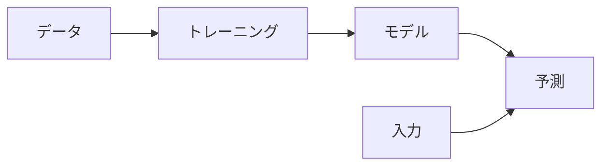
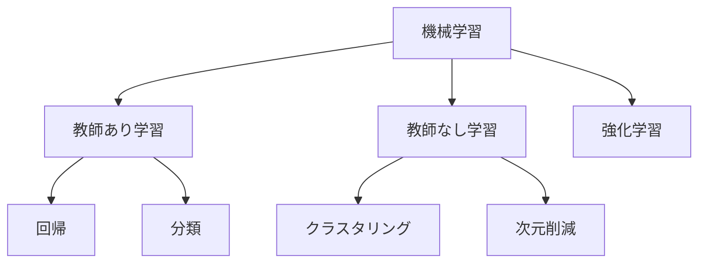

# Phase 1-1: 機械学習入門

## 学習目標

この単元を終えると、以下ができるようになります：

- 機械学習の基本概念を説明できる
- 教師あり学習と教師なし学習を区別できる
- 機械学習プロジェクトの流れを理解できる

## 機械学習とは



### 従来のプログラミング vs 機械学習

| 従来 | 機械学習 |
|------|---------|
| ルールを人が書く | ルールをデータから学習 |
| if文の羅列 | 数学的なモデル |
| 変更は手動 | 再学習で更新 |

## 機械学習の種類



### 教師あり学習

```python
# 例: 住宅価格予測
X = [[面積, 築年数, 駅距離], ...]  # 特徴量
y = [価格, ...]                     # 正解ラベル

model.fit(X, y)                      # 学習
price = model.predict([[80, 5, 10]]) # 予測
```

### 教師なし学習

```python
# 例: 顧客セグメンテーション
X = [[購入額, 頻度, 最終購入], ...]

model.fit(X)
clusters = model.predict(X)  # グループ分け
```

## AWS との関連

あなたが使っている AWS サービスと機械学習の対応：

| AWS サービス | 機械学習タスク |
|-------------|--------------|
| **Rekognition** | 画像分類、物体検出 |
| **SageMaker** | カスタムモデル構築 |
| **Comprehend** | 自然言語処理 |
| **Forecast** | 時系列予測 |

## ハンズオン

### 演習1: 最初の機械学習モデル

```python
# first_ml.py
from sklearn.datasets import load_iris
from sklearn.model_selection import train_test_split
from sklearn.tree import DecisionTreeClassifier
from sklearn.metrics import accuracy_score

# 1. データ読み込み
iris = load_iris()
X, y = iris.data, iris.target
print(f'データ形状: {X.shape}')  # (150, 4)
print(f'クラス: {iris.target_names}')  # ['setosa', 'versicolor', 'virginica']

# 2. データ分割
X_train, X_test, y_train, y_test = train_test_split(
    X, y, test_size=0.2, random_state=42
)
print(f'訓練データ: {len(X_train)}, テストデータ: {len(X_test)}')

# 3. モデル学習
model = DecisionTreeClassifier(random_state=42)
model.fit(X_train, y_train)

# 4. 予測
y_pred = model.predict(X_test)

# 5. 評価
accuracy = accuracy_score(y_test, y_pred)
print(f'正解率: {accuracy:.2%}')  # 100.00%
```

### 演習2: 回帰問題

```python
# regression_intro.py
from sklearn.datasets import fetch_california_housing
from sklearn.model_selection import train_test_split
from sklearn.linear_model import LinearRegression
from sklearn.metrics import mean_squared_error, r2_score
import numpy as np

# 1. データ読み込み
housing = fetch_california_housing()
X, y = housing.data, housing.target
print(f'特徴量: {housing.feature_names}')

# 2. 分割
X_train, X_test, y_train, y_test = train_test_split(
    X, y, test_size=0.2, random_state=42
)

# 3. 学習
model = LinearRegression()
model.fit(X_train, y_train)

# 4. 予測
y_pred = model.predict(X_test)

# 5. 評価
mse = mean_squared_error(y_test, y_pred)
rmse = np.sqrt(mse)
r2 = r2_score(y_test, y_pred)

print(f'RMSE: {rmse:.4f}')
print(f'R²スコア: {r2:.4f}')
```

### 演習3: 教師なし学習（クラスタリング）

```python
# clustering_intro.py
from sklearn.datasets import make_blobs
from sklearn.cluster import KMeans
import matplotlib.pyplot as plt

# 1. データ生成
X, y_true = make_blobs(n_samples=300, centers=3, random_state=42)

# 2. クラスタリング
kmeans = KMeans(n_clusters=3, random_state=42)
y_pred = kmeans.fit_predict(X)

# 3. 可視化
plt.figure(figsize=(10, 4))

plt.subplot(1, 2, 1)
plt.scatter(X[:, 0], X[:, 1], c=y_true)
plt.title('True Labels')

plt.subplot(1, 2, 2)
plt.scatter(X[:, 0], X[:, 1], c=y_pred)
plt.scatter(kmeans.cluster_centers_[:, 0], kmeans.cluster_centers_[:, 1], 
            c='red', marker='x', s=200)
plt.title('KMeans Clustering')

plt.tight_layout()
plt.savefig('clustering.png')
```

## 理解度確認

### 問題

顧客の購買データから顧客をグループ分けするタスクは、どの種類の機械学習か。

**A.** 教師あり学習（回帰）

**B.** 教師あり学習（分類）

**C.** 教師なし学習（クラスタリング）

**D.** 強化学習

---

### 解答・解説

**正解: C**

正解ラベルがなく、データの類似性に基づいてグループ分けするタスクは教師なし学習のクラスタリングです。

---

## 次のステップ

機械学習入門を学びました。次はデータ前処理を学びましょう。

**次の単元**: [Phase 1-2: データ前処理](./02_データ前処理.md)
