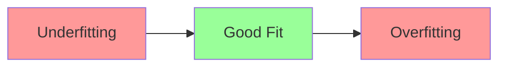
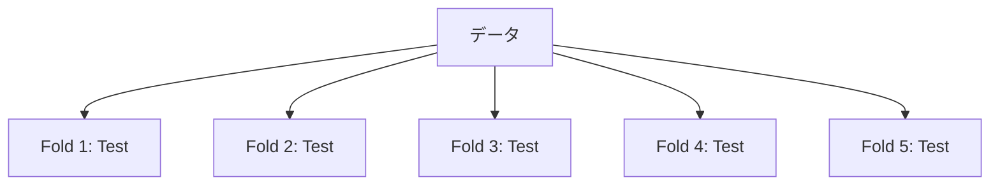

# Phase 3-1: モデル評価

## 学習目標

この単元を終えると、以下ができるようになります：

- 交差検証を実装できる
- 過学習を検出・防止できる
- ハイパーパラメータチューニングができる

## 過学習と汎化



| 状態 | 訓練誤差 | テスト誤差 | 対策 |
|------|---------|----------|------|
| 過学習 | 低 | 高 | 正則化、データ増加 |
| 未学習 | 高 | 高 | より複雑なモデル |
| 適切 | 低 | 低 | - |

## 交差検証



## ハンズオン

### 演習1: 交差検証

```python
# cross_validation.py
from sklearn.datasets import load_iris
from sklearn.model_selection import cross_val_score, KFold, StratifiedKFold
from sklearn.tree import DecisionTreeClassifier
import numpy as np

# データ
iris = load_iris()
X, y = iris.data, iris.target

model = DecisionTreeClassifier(random_state=42)

# 単純な K-Fold
kfold = KFold(n_splits=5, shuffle=True, random_state=42)
scores_kfold = cross_val_score(model, X, y, cv=kfold)
print(f'K-Fold CV: {scores_kfold.mean():.4f} ± {scores_kfold.std():.4f}')

# 層化 K-Fold（クラス比率を維持）
skfold = StratifiedKFold(n_splits=5, shuffle=True, random_state=42)
scores_skfold = cross_val_score(model, X, y, cv=skfold)
print(f'Stratified K-Fold CV: {scores_skfold.mean():.4f} ± {scores_skfold.std():.4f}')

# 複数の評価指標
from sklearn.model_selection import cross_validate

cv_results = cross_validate(
    model, X, y, cv=5,
    scoring=['accuracy', 'precision_macro', 'recall_macro', 'f1_macro']
)

print('\n複数指標での評価:')
for metric, scores in cv_results.items():
    if metric.startswith('test_'):
        print(f'  {metric}: {scores.mean():.4f} ± {scores.std():.4f}')
```

### 演習2: 過学習の検出

```python
# overfitting_detection.py
import numpy as np
import matplotlib.pyplot as plt
from sklearn.tree import DecisionTreeClassifier
from sklearn.model_selection import learning_curve

# データ
from sklearn.datasets import make_classification
X, y = make_classification(n_samples=1000, n_features=20, random_state=42)

# 学習曲線
def plot_learning_curve(model, X, y, title):
    train_sizes, train_scores, val_scores = learning_curve(
        model, X, y, cv=5,
        train_sizes=np.linspace(0.1, 1.0, 10),
        n_jobs=-1
    )
    
    train_mean = train_scores.mean(axis=1)
    train_std = train_scores.std(axis=1)
    val_mean = val_scores.mean(axis=1)
    val_std = val_scores.std(axis=1)
    
    plt.plot(train_sizes, train_mean, label='Training')
    plt.fill_between(train_sizes, train_mean - train_std, train_mean + train_std, alpha=0.1)
    plt.plot(train_sizes, val_mean, label='Validation')
    plt.fill_between(train_sizes, val_mean - val_std, val_mean + val_std, alpha=0.1)
    plt.xlabel('Training Set Size')
    plt.ylabel('Score')
    plt.title(title)
    plt.legend()

plt.figure(figsize=(12, 4))

# 過学習するモデル
plt.subplot(1, 2, 1)
plot_learning_curve(
    DecisionTreeClassifier(max_depth=None), X, y,
    'Overfitting (max_depth=None)'
)

# 適切なモデル
plt.subplot(1, 2, 2)
plot_learning_curve(
    DecisionTreeClassifier(max_depth=5), X, y,
    'Better Fit (max_depth=5)'
)

plt.tight_layout()
plt.savefig('learning_curves.png')
```

### 演習3: グリッドサーチ

```python
# grid_search.py
from sklearn.datasets import load_iris
from sklearn.model_selection import GridSearchCV, RandomizedSearchCV
from sklearn.ensemble import RandomForestClassifier
import numpy as np

# データ
iris = load_iris()
X, y = iris.data, iris.target

# グリッドサーチ
param_grid = {
    'n_estimators': [10, 50, 100],
    'max_depth': [3, 5, 10, None],
    'min_samples_split': [2, 5, 10]
}

grid_search = GridSearchCV(
    RandomForestClassifier(random_state=42),
    param_grid,
    cv=5,
    scoring='accuracy',
    n_jobs=-1,
    verbose=1
)

grid_search.fit(X, y)

print('Best parameters:', grid_search.best_params_)
print('Best score:', grid_search.best_score_)

# ランダムサーチ（より広い探索）
from scipy.stats import randint, uniform

param_distributions = {
    'n_estimators': randint(10, 200),
    'max_depth': randint(1, 20),
    'min_samples_split': randint(2, 20),
    'min_samples_leaf': randint(1, 10)
}

random_search = RandomizedSearchCV(
    RandomForestClassifier(random_state=42),
    param_distributions,
    n_iter=50,  # 50回サンプリング
    cv=5,
    scoring='accuracy',
    n_jobs=-1,
    random_state=42
)

random_search.fit(X, y)

print('\nRandomized Search:')
print('Best parameters:', random_search.best_params_)
print('Best score:', random_search.best_score_)
```

### 演習4: Optuna

```python
# optuna_tuning.py
import optuna
from sklearn.datasets import load_iris
from sklearn.model_selection import cross_val_score
from sklearn.ensemble import RandomForestClassifier

iris = load_iris()
X, y = iris.data, iris.target

def objective(trial):
    # パラメータの探索範囲を定義
    params = {
        'n_estimators': trial.suggest_int('n_estimators', 10, 200),
        'max_depth': trial.suggest_int('max_depth', 1, 20),
        'min_samples_split': trial.suggest_int('min_samples_split', 2, 20),
        'min_samples_leaf': trial.suggest_int('min_samples_leaf', 1, 10),
    }
    
    model = RandomForestClassifier(**params, random_state=42)
    scores = cross_val_score(model, X, y, cv=5)
    
    return scores.mean()

# 最適化実行
study = optuna.create_study(direction='maximize')
study.optimize(objective, n_trials=100, show_progress_bar=True)

print('Best trial:')
print(f'  Value: {study.best_trial.value:.4f}')
print(f'  Params: {study.best_trial.params}')

# 重要度
print('\nParameter importance:')
for key, value in optuna.importance.get_param_importances(study).items():
    print(f'  {key}: {value:.4f}')
```

## 理解度確認

### 問題

5-Fold 交差検証でモデルを評価する場合、1回の学習で使用されるデータの割合はいくつか。

**A.** 20%

**B.** 50%

**C.** 80%

**D.** 100%

---

### 解答・解説

**正解: C**

5-Fold 交差検証では、データを5分割し、4分割（80%）を訓練に、1分割（20%）を検証に使います。これを5回繰り返して各フォールドが1回ずつ検証に使われます。

---

## 次のステップ

モデル評価を学びました。次はアンサンブル学習を学びましょう。

**次の単元**: [Phase 3-2: アンサンブル学習](./02_アンサンブル学習.md)
