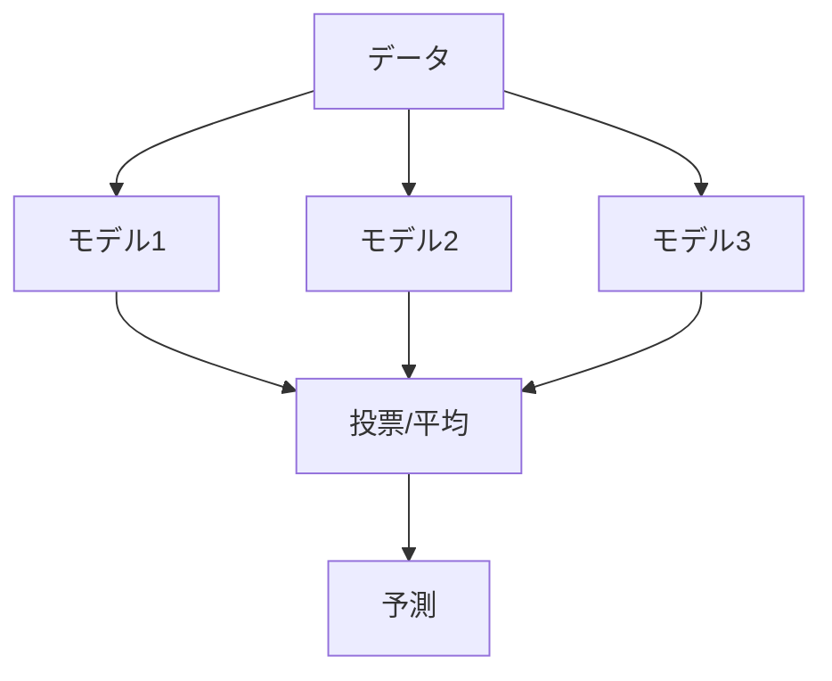

# Phase 3-2: アンサンブル学習

## 学習目標

この単元を終えると、以下ができるようになります：

- アンサンブル学習の種類を説明できる
- Random Forest を実装できる
- XGBoost / LightGBM を使える

## アンサンブル学習とは



**「三人寄れば文殊の知恵」** - 複数のモデルを組み合わせて精度向上

## 種類

| 手法 | 説明 | 代表例 |
|------|------|-------|
| **Bagging** | 並列学習、投票 | Random Forest |
| **Boosting** | 逐次学習、誤り修正 | XGBoost, LightGBM |
| **Stacking** | メタモデルで統合 | - |

## ハンズオン

### 演習1: Random Forest

```python
# random_forest.py
from sklearn.datasets import load_iris
from sklearn.model_selection import train_test_split
from sklearn.ensemble import RandomForestClassifier
from sklearn.tree import DecisionTreeClassifier
import numpy as np

# データ
iris = load_iris()
X, y = iris.data, iris.target
X_train, X_test, y_train, y_test = train_test_split(X, y, test_size=0.2, random_state=42)

# 単一の決定木
dt = DecisionTreeClassifier(random_state=42)
dt.fit(X_train, y_train)
print(f'Decision Tree: {dt.score(X_test, y_test):.4f}')

# Random Forest
rf = RandomForestClassifier(n_estimators=100, random_state=42)
rf.fit(X_train, y_train)
print(f'Random Forest: {rf.score(X_test, y_test):.4f}')

# 特徴量重要度
print('\n特徴量重要度:')
for name, importance in zip(iris.feature_names, rf.feature_importances_):
    print(f'  {name}: {importance:.4f}')

# OOB (Out-of-Bag) スコア
rf_oob = RandomForestClassifier(n_estimators=100, oob_score=True, random_state=42)
rf_oob.fit(X_train, y_train)
print(f'\nOOB Score: {rf_oob.oob_score_:.4f}')
```

### 演習2: Gradient Boosting

```python
# gradient_boosting.py
from sklearn.ensemble import GradientBoostingClassifier
from sklearn.datasets import make_classification
from sklearn.model_selection import train_test_split
import matplotlib.pyplot as plt

# データ
X, y = make_classification(n_samples=1000, n_features=20, random_state=42)
X_train, X_test, y_train, y_test = train_test_split(X, y, test_size=0.2, random_state=42)

# Gradient Boosting
gb = GradientBoostingClassifier(
    n_estimators=100,
    learning_rate=0.1,
    max_depth=3,
    random_state=42
)

gb.fit(X_train, y_train)
print(f'Gradient Boosting: {gb.score(X_test, y_test):.4f}')

# ステージごとのスコア
train_scores = []
test_scores = []

for i, y_pred in enumerate(gb.staged_predict(X_train)):
    train_scores.append((y_pred == y_train).mean())

for i, y_pred in enumerate(gb.staged_predict(X_test)):
    test_scores.append((y_pred == y_test).mean())

plt.figure(figsize=(8, 5))
plt.plot(train_scores, label='Train')
plt.plot(test_scores, label='Test')
plt.xlabel('Number of Trees')
plt.ylabel('Accuracy')
plt.legend()
plt.title('Gradient Boosting: Learning Curve')
plt.savefig('gradient_boosting.png')
```

### 演習3: XGBoost

```python
# xgboost_example.py
import xgboost as xgb
from sklearn.datasets import load_breast_cancer
from sklearn.model_selection import train_test_split, cross_val_score
import matplotlib.pyplot as plt

# データ
cancer = load_breast_cancer()
X, y = cancer.data, cancer.target
X_train, X_test, y_train, y_test = train_test_split(X, y, test_size=0.2, random_state=42)

# XGBoost
model = xgb.XGBClassifier(
    n_estimators=100,
    max_depth=3,
    learning_rate=0.1,
    objective='binary:logistic',
    random_state=42,
    eval_metric='logloss'
)

# 学習（評価セット指定）
model.fit(
    X_train, y_train,
    eval_set=[(X_train, y_train), (X_test, y_test)],
    verbose=False
)

print(f'XGBoost Accuracy: {model.score(X_test, y_test):.4f}')

# 学習曲線
results = model.evals_result()
plt.figure(figsize=(8, 5))
plt.plot(results['validation_0']['logloss'], label='Train')
plt.plot(results['validation_1']['logloss'], label='Test')
plt.xlabel('Iteration')
plt.ylabel('Log Loss')
plt.legend()
plt.title('XGBoost Learning Curve')
plt.savefig('xgboost_learning.png')

# 特徴量重要度
xgb.plot_importance(model, max_num_features=10)
plt.tight_layout()
plt.savefig('xgboost_importance.png')
```

### 演習4: LightGBM

```python
# lightgbm_example.py
import lightgbm as lgb
from sklearn.datasets import load_breast_cancer
from sklearn.model_selection import train_test_split

# データ
cancer = load_breast_cancer()
X, y = cancer.data, cancer.target
X_train, X_test, y_train, y_test = train_test_split(X, y, test_size=0.2, random_state=42)

# LightGBM Dataset
train_data = lgb.Dataset(X_train, label=y_train)
test_data = lgb.Dataset(X_test, label=y_test, reference=train_data)

# パラメータ
params = {
    'objective': 'binary',
    'metric': 'binary_logloss',
    'num_leaves': 31,
    'learning_rate': 0.1,
    'verbose': -1
}

# 学習（Early Stopping）
model = lgb.train(
    params,
    train_data,
    num_boost_round=1000,
    valid_sets=[test_data],
    callbacks=[lgb.early_stopping(stopping_rounds=10)]
)

# 予測
y_pred = model.predict(X_test)
y_pred_binary = (y_pred > 0.5).astype(int)
accuracy = (y_pred_binary == y_test).mean()

print(f'LightGBM Accuracy: {accuracy:.4f}')
print(f'Best iteration: {model.best_iteration}')

# Scikit-learn API
from lightgbm import LGBMClassifier

lgb_clf = LGBMClassifier(n_estimators=100, random_state=42, verbose=-1)
lgb_clf.fit(X_train, y_train)
print(f'LGBMClassifier Accuracy: {lgb_clf.score(X_test, y_test):.4f}')
```

### 演習5: スタッキング

```python
# stacking.py
from sklearn.ensemble import StackingClassifier, RandomForestClassifier, GradientBoostingClassifier
from sklearn.linear_model import LogisticRegression
from sklearn.svm import SVC
from sklearn.datasets import load_breast_cancer
from sklearn.model_selection import train_test_split

# データ
cancer = load_breast_cancer()
X, y = cancer.data, cancer.target
X_train, X_test, y_train, y_test = train_test_split(X, y, test_size=0.2, random_state=42)

# ベースモデル
estimators = [
    ('rf', RandomForestClassifier(n_estimators=50, random_state=42)),
    ('gb', GradientBoostingClassifier(n_estimators=50, random_state=42)),
    ('svc', SVC(probability=True, random_state=42))
]

# スタッキング
stacking = StackingClassifier(
    estimators=estimators,
    final_estimator=LogisticRegression(),
    cv=5
)

stacking.fit(X_train, y_train)

print(f'Stacking Accuracy: {stacking.score(X_test, y_test):.4f}')

# 個別モデルと比較
for name, model in estimators:
    model.fit(X_train, y_train)
    print(f'{name}: {model.score(X_test, y_test):.4f}')
```

## 理解度確認

### 問題

Boosting と Bagging の主な違いは何か。

**A.** Boosting は並列、Bagging は逐次

**B.** Boosting は逐次、Bagging は並列

**C.** Boosting は回帰のみ、Bagging は分類のみ

**D.** 違いはない

---

### 解答・解説

**正解: B**

Boosting は前のモデルの誤りを修正するように逐次的に学習します。Bagging は独立したモデルを並列に学習して結果を統合します。

---

## 次のステップ

アンサンブル学習を学びました。次はディープラーニングを学びましょう。

**次の単元**: [Phase 4-1: ディープラーニング入門](../phase4/01_ディープラーニング入門.md)
