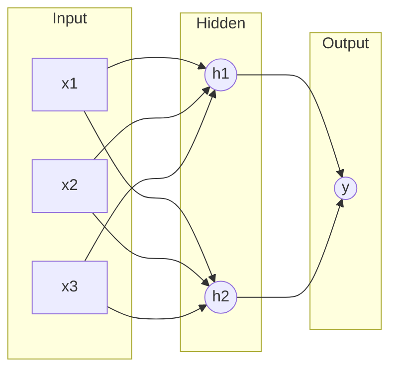

# Phase 4-1: ディープラーニング入門

## 学習目標

この単元を終えると、以下ができるようになります：

- ニューラルネットワークの基礎を理解できる
- PyTorch でモデルを構築できる
- 訓練ループを実装できる

## ニューラルネットワーク



### 重要な概念

| 概念 | 説明 |
|------|------|
| **順伝播** | 入力から出力への計算 |
| **逆伝播** | 勾配を計算して重みを更新 |
| **活性化関数** | 非線形性を導入（ReLU, Sigmoid等） |
| **損失関数** | 予測と正解の差 |

## ハンズオン

### 演習1: PyTorch 基礎

```python
# pytorch_basics.py
import torch
import torch.nn as nn

# テンソル
x = torch.tensor([1.0, 2.0, 3.0])
print(f'Tensor: {x}')
print(f'Shape: {x.shape}')
print(f'Device: {x.device}')

# GPU に移動（可能な場合）
device = torch.device('cuda' if torch.cuda.is_available() else 'cpu')
print(f'Using device: {device}')
x = x.to(device)

# 勾配
x = torch.tensor([1.0, 2.0, 3.0], requires_grad=True)
y = x.sum() ** 2
y.backward()
print(f'Gradients: {x.grad}')

# 線形層
linear = nn.Linear(3, 2)
input_tensor = torch.randn(1, 3)
output = linear(input_tensor)
print(f'Input shape: {input_tensor.shape}')
print(f'Output shape: {output.shape}')
```

### 演習2: 最初のニューラルネットワーク

```python
# first_nn.py
import torch
import torch.nn as nn
import torch.optim as optim
from sklearn.datasets import make_classification
from sklearn.model_selection import train_test_split
import numpy as np

# データ準備
X, y = make_classification(n_samples=1000, n_features=20, random_state=42)
X_train, X_test, y_train, y_test = train_test_split(X, y, test_size=0.2, random_state=42)

# PyTorch テンソルに変換
X_train = torch.FloatTensor(X_train)
X_test = torch.FloatTensor(X_test)
y_train = torch.FloatTensor(y_train)
y_test = torch.FloatTensor(y_test)

# モデル定義
class SimpleNN(nn.Module):
    def __init__(self, input_size, hidden_size, output_size):
        super().__init__()
        self.layer1 = nn.Linear(input_size, hidden_size)
        self.relu = nn.ReLU()
        self.layer2 = nn.Linear(hidden_size, output_size)
        self.sigmoid = nn.Sigmoid()
    
    def forward(self, x):
        x = self.layer1(x)
        x = self.relu(x)
        x = self.layer2(x)
        x = self.sigmoid(x)
        return x

model = SimpleNN(20, 64, 1)
print(model)

# 損失関数とオプティマイザ
criterion = nn.BCELoss()
optimizer = optim.Adam(model.parameters(), lr=0.001)

# 訓練ループ
epochs = 100
for epoch in range(epochs):
    # 順伝播
    outputs = model(X_train).squeeze()
    loss = criterion(outputs, y_train)
    
    # 逆伝播
    optimizer.zero_grad()
    loss.backward()
    optimizer.step()
    
    if (epoch + 1) % 20 == 0:
        print(f'Epoch [{epoch+1}/{epochs}], Loss: {loss.item():.4f}')

# 評価
with torch.no_grad():
    y_pred = model(X_test).squeeze()
    y_pred = (y_pred > 0.5).float()
    accuracy = (y_pred == y_test).float().mean()
    print(f'Test Accuracy: {accuracy:.4f}')
```

### 演習3: DataLoader

```python
# dataloader.py
import torch
from torch.utils.data import Dataset, DataLoader
import torch.nn as nn
import torch.optim as optim

# カスタムデータセット
class CustomDataset(Dataset):
    def __init__(self, X, y):
        self.X = torch.FloatTensor(X)
        self.y = torch.FloatTensor(y)
    
    def __len__(self):
        return len(self.X)
    
    def __getitem__(self, idx):
        return self.X[idx], self.y[idx]

# データ生成
from sklearn.datasets import make_classification
X, y = make_classification(n_samples=1000, n_features=20, random_state=42)

# DataLoader
dataset = CustomDataset(X, y)
train_loader = DataLoader(dataset, batch_size=32, shuffle=True)

# モデル
model = nn.Sequential(
    nn.Linear(20, 64),
    nn.ReLU(),
    nn.Dropout(0.2),
    nn.Linear(64, 32),
    nn.ReLU(),
    nn.Dropout(0.2),
    nn.Linear(32, 1),
    nn.Sigmoid()
)

criterion = nn.BCELoss()
optimizer = optim.Adam(model.parameters(), lr=0.001)

# 訓練
epochs = 10
for epoch in range(epochs):
    total_loss = 0
    for batch_X, batch_y in train_loader:
        outputs = model(batch_X).squeeze()
        loss = criterion(outputs, batch_y)
        
        optimizer.zero_grad()
        loss.backward()
        optimizer.step()
        
        total_loss += loss.item()
    
    avg_loss = total_loss / len(train_loader)
    print(f'Epoch [{epoch+1}/{epochs}], Loss: {avg_loss:.4f}')
```

### 演習4: 多クラス分類

```python
# multiclass_nn.py
import torch
import torch.nn as nn
import torch.optim as optim
from sklearn.datasets import load_digits
from sklearn.model_selection import train_test_split
from torch.utils.data import DataLoader, TensorDataset

# データ
digits = load_digits()
X, y = digits.data, digits.target

X_train, X_test, y_train, y_test = train_test_split(X, y, test_size=0.2, random_state=42)

# テンソル化
X_train = torch.FloatTensor(X_train)
X_test = torch.FloatTensor(X_test)
y_train = torch.LongTensor(y_train)
y_test = torch.LongTensor(y_test)

train_dataset = TensorDataset(X_train, y_train)
train_loader = DataLoader(train_dataset, batch_size=32, shuffle=True)

# モデル
class DigitClassifier(nn.Module):
    def __init__(self):
        super().__init__()
        self.layers = nn.Sequential(
            nn.Linear(64, 128),
            nn.ReLU(),
            nn.BatchNorm1d(128),
            nn.Dropout(0.3),
            nn.Linear(128, 64),
            nn.ReLU(),
            nn.BatchNorm1d(64),
            nn.Dropout(0.3),
            nn.Linear(64, 10)  # 10クラス
        )
    
    def forward(self, x):
        return self.layers(x)

model = DigitClassifier()
criterion = nn.CrossEntropyLoss()
optimizer = optim.Adam(model.parameters(), lr=0.001)

# 訓練
epochs = 50
for epoch in range(epochs):
    model.train()
    for batch_X, batch_y in train_loader:
        outputs = model(batch_X)
        loss = criterion(outputs, batch_y)
        
        optimizer.zero_grad()
        loss.backward()
        optimizer.step()
    
    # 評価
    if (epoch + 1) % 10 == 0:
        model.eval()
        with torch.no_grad():
            outputs = model(X_test)
            _, predicted = torch.max(outputs, 1)
            accuracy = (predicted == y_test).float().mean()
            print(f'Epoch [{epoch+1}/{epochs}], Accuracy: {accuracy:.4f}')
```

## 理解度確認

### 問題

PyTorch で勾配計算を無効にするコンテキストマネージャはどれか。

**A.** torch.no_grad()

**B.** torch.disable_grad()

**C.** torch.eval()

**D.** torch.inference()

---

### 解答・解説

**正解: A**

`torch.no_grad()` を使うと勾配計算が無効になり、メモリ使用量が削減されます。評価時に使用します。

```python
with torch.no_grad():
    outputs = model(X_test)
```

---

## 次のステップ

ディープラーニング入門を学びました。次は画像認識を学びましょう。

**次の単元**: [Phase 4-2: 画像認識](./02_画像認識.md)
