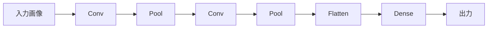

# Phase 4-2: 画像認識

## 学習目標

この単元を終えると、以下ができるようになります：

- CNN の構造を理解できる
- 画像分類モデルを構築できる
- 転移学習を実装できる

## CNN (Convolutional Neural Network)



### 重要な概念

| 層 | 説明 |
|----|------|
| **畳み込み層** | フィルタで特徴抽出 |
| **プーリング層** | サイズ縮小 |
| **全結合層** | 分類 |

## AWS との関連

あなたが使う **Rekognition** は CNN ベースのモデルが裏側で動いています。自分でモデルを作ることで、カスタム要件に対応できます。

## ハンズオン

### 演習1: 基本的な CNN

```python
# basic_cnn.py
import torch
import torch.nn as nn
import torch.optim as optim
from torchvision import datasets, transforms
from torch.utils.data import DataLoader

# データ変換
transform = transforms.Compose([
    transforms.ToTensor(),
    transforms.Normalize((0.5,), (0.5,))
])

# MNIST データセット
train_dataset = datasets.MNIST(root='./data', train=True, download=True, transform=transform)
test_dataset = datasets.MNIST(root='./data', train=False, download=True, transform=transform)

train_loader = DataLoader(train_dataset, batch_size=64, shuffle=True)
test_loader = DataLoader(test_dataset, batch_size=64, shuffle=False)

# CNN モデル
class CNN(nn.Module):
    def __init__(self):
        super().__init__()
        self.conv_layers = nn.Sequential(
            # 1x28x28 -> 32x26x26
            nn.Conv2d(1, 32, kernel_size=3),
            nn.ReLU(),
            # 32x26x26 -> 32x13x13
            nn.MaxPool2d(2),
            
            # 32x13x13 -> 64x11x11
            nn.Conv2d(32, 64, kernel_size=3),
            nn.ReLU(),
            # 64x11x11 -> 64x5x5
            nn.MaxPool2d(2)
        )
        
        self.fc_layers = nn.Sequential(
            nn.Flatten(),
            nn.Linear(64 * 5 * 5, 128),
            nn.ReLU(),
            nn.Dropout(0.5),
            nn.Linear(128, 10)
        )
    
    def forward(self, x):
        x = self.conv_layers(x)
        x = self.fc_layers(x)
        return x

model = CNN()
print(model)

# 訓練
device = torch.device('cuda' if torch.cuda.is_available() else 'cpu')
model = model.to(device)
criterion = nn.CrossEntropyLoss()
optimizer = optim.Adam(model.parameters(), lr=0.001)

epochs = 5
for epoch in range(epochs):
    model.train()
    total_loss = 0
    
    for images, labels in train_loader:
        images, labels = images.to(device), labels.to(device)
        
        outputs = model(images)
        loss = criterion(outputs, labels)
        
        optimizer.zero_grad()
        loss.backward()
        optimizer.step()
        
        total_loss += loss.item()
    
    # 評価
    model.eval()
    correct = 0
    total = 0
    
    with torch.no_grad():
        for images, labels in test_loader:
            images, labels = images.to(device), labels.to(device)
            outputs = model(images)
            _, predicted = torch.max(outputs, 1)
            total += labels.size(0)
            correct += (predicted == labels).sum().item()
    
    accuracy = correct / total
    print(f'Epoch [{epoch+1}/{epochs}], Loss: {total_loss/len(train_loader):.4f}, Accuracy: {accuracy:.4f}')
```

### 演習2: データ拡張

```python
# data_augmentation.py
from torchvision import transforms

# 訓練用（拡張あり）
train_transform = transforms.Compose([
    transforms.RandomRotation(10),
    transforms.RandomAffine(0, translate=(0.1, 0.1)),
    transforms.RandomHorizontalFlip(),
    transforms.ColorJitter(brightness=0.2, contrast=0.2),
    transforms.ToTensor(),
    transforms.Normalize((0.5,), (0.5,))
])

# テスト用（拡張なし）
test_transform = transforms.Compose([
    transforms.ToTensor(),
    transforms.Normalize((0.5,), (0.5,))
])

# 使用例
train_dataset = datasets.CIFAR10(
    root='./data',
    train=True,
    download=True,
    transform=train_transform
)
```

### 演習3: 転移学習

```python
# transfer_learning.py
import torch
import torch.nn as nn
import torch.optim as optim
from torchvision import datasets, transforms, models
from torch.utils.data import DataLoader

# 事前学習済みモデル用の変換
transform = transforms.Compose([
    transforms.Resize(224),
    transforms.CenterCrop(224),
    transforms.ToTensor(),
    transforms.Normalize(
        mean=[0.485, 0.456, 0.406],
        std=[0.229, 0.224, 0.225]
    )
])

# CIFAR-10 でテスト
train_dataset = datasets.CIFAR10(root='./data', train=True, download=True, transform=transform)
test_dataset = datasets.CIFAR10(root='./data', train=False, download=True, transform=transform)

train_loader = DataLoader(train_dataset, batch_size=32, shuffle=True)
test_loader = DataLoader(test_dataset, batch_size=32, shuffle=False)

# 事前学習済み ResNet18
model = models.resnet18(pretrained=True)

# 最終層を置き換え
num_features = model.fc.in_features
model.fc = nn.Linear(num_features, 10)  # CIFAR-10 は 10 クラス

# 特徴抽出層を凍結（オプション）
for param in model.parameters():
    param.requires_grad = False

# 最終層のみ学習可能に
for param in model.fc.parameters():
    param.requires_grad = True

device = torch.device('cuda' if torch.cuda.is_available() else 'cpu')
model = model.to(device)

criterion = nn.CrossEntropyLoss()
optimizer = optim.Adam(model.fc.parameters(), lr=0.001)

# 訓練
epochs = 5
for epoch in range(epochs):
    model.train()
    total_loss = 0
    
    for images, labels in train_loader:
        images, labels = images.to(device), labels.to(device)
        
        outputs = model(images)
        loss = criterion(outputs, labels)
        
        optimizer.zero_grad()
        loss.backward()
        optimizer.step()
        
        total_loss += loss.item()
    
    print(f'Epoch [{epoch+1}/{epochs}], Loss: {total_loss/len(train_loader):.4f}')

# 評価
model.eval()
correct = 0
total = 0

with torch.no_grad():
    for images, labels in test_loader:
        images, labels = images.to(device), labels.to(device)
        outputs = model(images)
        _, predicted = torch.max(outputs, 1)
        total += labels.size(0)
        correct += (predicted == labels).sum().item()

print(f'Test Accuracy: {correct/total:.4f}')
```

### 演習4: モデル保存

```python
# model_save_load.py
import torch

# モデル全体を保存
torch.save(model, 'model_complete.pth')

# 重みのみ保存（推奨）
torch.save(model.state_dict(), 'model_weights.pth')

# 読み込み
model = CNN()
model.load_state_dict(torch.load('model_weights.pth'))
model.eval()

# チェックポイント保存
checkpoint = {
    'epoch': epoch,
    'model_state_dict': model.state_dict(),
    'optimizer_state_dict': optimizer.state_dict(),
    'loss': loss
}
torch.save(checkpoint, 'checkpoint.pth')

# チェックポイント読み込み
checkpoint = torch.load('checkpoint.pth')
model.load_state_dict(checkpoint['model_state_dict'])
optimizer.load_state_dict(checkpoint['optimizer_state_dict'])
```

## 理解度確認

### 問題

転移学習の主な利点は何か。

**A.** モデルが大きくなる

**B.** 少ないデータで高精度を達成できる

**C.** 訓練時間が長くなる

**D.** 新しいアーキテクチャを作成できる

---

### 解答・解説

**正解: B**

転移学習では、大規模データで学習済みのモデルを利用することで、少ないデータでも高い精度を達成できます。ImageNet で学習した特徴抽出能力を活用できます。

---

## 次のステップ

画像認識を学びました。次は ML パイプラインを学びましょう。

**次の単元**: [Phase 5-1: ML パイプライン](../phase5/01_MLパイプライン.md)
