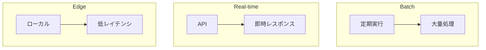

# Phase 5-2: モデルデプロイ

## 学習目標

この単元を終えると、以下ができるようになります：

- モデルを API としてデプロイできる
- SageMaker でデプロイできる
- モデルの監視ができる

## デプロイ方式



## ハンズオン

### 演習1: FastAPI でデプロイ

```python
# model_api.py
from fastapi import FastAPI, HTTPException
from pydantic import BaseModel
import joblib
import numpy as np

app = FastAPI(title='ML Model API')

# モデル読み込み
model = joblib.load('model.joblib')

class PredictionInput(BaseModel):
    features: list[float]
    
    class Config:
        json_schema_extra = {
            'example': {
                'features': [5.1, 3.5, 1.4, 0.2]
            }
        }

class PredictionOutput(BaseModel):
    prediction: int
    probability: list[float]

@app.get('/health')
def health():
    return {'status': 'healthy'}

@app.post('/predict', response_model=PredictionOutput)
def predict(input_data: PredictionInput):
    try:
        features = np.array(input_data.features).reshape(1, -1)
        prediction = model.predict(features)[0]
        probability = model.predict_proba(features)[0].tolist()
        
        return PredictionOutput(
            prediction=int(prediction),
            probability=probability
        )
    except Exception as e:
        raise HTTPException(status_code=500, detail=str(e))

@app.post('/predict/batch')
def predict_batch(inputs: list[PredictionInput]):
    features = np.array([inp.features for inp in inputs])
    predictions = model.predict(features).tolist()
    probabilities = model.predict_proba(features).tolist()
    
    return [
        {'prediction': p, 'probability': prob}
        for p, prob in zip(predictions, probabilities)
    ]
```

### 演習2: Docker 化

```dockerfile
# Dockerfile
FROM python:3.11-slim

WORKDIR /app

COPY requirements.txt .
RUN pip install --no-cache-dir -r requirements.txt

COPY model.joblib .
COPY model_api.py .

EXPOSE 8000

CMD ["uvicorn", "model_api:app", "--host", "0.0.0.0", "--port", "8000"]
```

```txt
# requirements.txt
fastapi==0.109.0
uvicorn==0.27.0
scikit-learn==1.4.0
joblib==1.3.2
numpy==1.26.3
```

```bash
# ビルド & 実行
docker build -t ml-api .
docker run -p 8000:8000 ml-api
```

### 演習3: AWS SageMaker

あなたは SageMaker を使った経験があるので、復習として：

```python
# sagemaker_deploy.py
import sagemaker
from sagemaker.sklearn import SKLearnModel
import boto3

# セッション
sagemaker_session = sagemaker.Session()
role = sagemaker.get_execution_role()

# モデルアーティファクト（S3 にアップロード済み）
model_data = 's3://your-bucket/models/model.tar.gz'

# SKLearn モデル
sklearn_model = SKLearnModel(
    model_data=model_data,
    role=role,
    entry_point='inference.py',
    framework_version='1.2-1'
)

# エンドポイントデプロイ
predictor = sklearn_model.deploy(
    instance_type='ml.t2.medium',
    initial_instance_count=1
)

# 予測
result = predictor.predict([[5.1, 3.5, 1.4, 0.2]])
print(result)

# クリーンアップ
predictor.delete_endpoint()
```

### 演習4: Lambda + API Gateway

```python
# lambda_handler.py
import json
import boto3
import pickle
import os

# S3 からモデル読み込み（初回のみ）
model = None

def load_model():
    global model
    if model is None:
        s3 = boto3.client('s3')
        response = s3.get_object(
            Bucket=os.environ['MODEL_BUCKET'],
            Key=os.environ['MODEL_KEY']
        )
        model = pickle.loads(response['Body'].read())
    return model

def lambda_handler(event, context):
    try:
        # リクエストパース
        body = json.loads(event['body'])
        features = body['features']
        
        # 予測
        model = load_model()
        prediction = model.predict([features])[0]
        
        return {
            'statusCode': 200,
            'body': json.dumps({
                'prediction': int(prediction)
            })
        }
    
    except Exception as e:
        return {
            'statusCode': 500,
            'body': json.dumps({'error': str(e)})
        }
```

### 演習5: モデル監視

```python
# model_monitoring.py
import numpy as np
from scipy import stats
import json
from datetime import datetime

class ModelMonitor:
    def __init__(self, reference_data: np.ndarray):
        self.reference_data = reference_data
        self.reference_stats = self._compute_stats(reference_data)
        self.alerts = []
    
    def _compute_stats(self, data: np.ndarray) -> dict:
        return {
            'mean': np.mean(data, axis=0),
            'std': np.std(data, axis=0),
            'min': np.min(data, axis=0),
            'max': np.max(data, axis=0)
        }
    
    def check_data_drift(self, new_data: np.ndarray, threshold: float = 0.05) -> dict:
        """KS検定でデータドリフトを検出"""
        results = []
        
        for i in range(new_data.shape[1]):
            stat, p_value = stats.ks_2samp(
                self.reference_data[:, i],
                new_data[:, i]
            )
            
            drift_detected = p_value < threshold
            
            results.append({
                'feature_index': i,
                'ks_statistic': stat,
                'p_value': p_value,
                'drift_detected': drift_detected
            })
            
            if drift_detected:
                self.alerts.append({
                    'type': 'data_drift',
                    'feature_index': i,
                    'p_value': p_value,
                    'timestamp': datetime.now().isoformat()
                })
        
        return results
    
    def check_prediction_drift(
        self,
        reference_predictions: np.ndarray,
        new_predictions: np.ndarray,
        threshold: float = 0.05
    ) -> dict:
        """予測分布の変化を検出"""
        stat, p_value = stats.ks_2samp(
            reference_predictions,
            new_predictions
        )
        
        drift_detected = p_value < threshold
        
        if drift_detected:
            self.alerts.append({
                'type': 'prediction_drift',
                'p_value': p_value,
                'timestamp': datetime.now().isoformat()
            })
        
        return {
            'ks_statistic': stat,
            'p_value': p_value,
            'drift_detected': drift_detected
        }
    
    def get_alerts(self) -> list:
        return self.alerts

# 使用例
reference = np.random.randn(1000, 4)
monitor = ModelMonitor(reference)

# 新しいデータ（少しずれている）
new_data = np.random.randn(500, 4) + 0.5

results = monitor.check_data_drift(new_data)
for r in results:
    if r['drift_detected']:
        print(f"Feature {r['feature_index']}: Drift detected (p={r['p_value']:.4f})")
```

## 理解度確認

### 問題

ML モデルの本番運用で「データドリフト」とは何を指すか。

**A.** モデルの重みが変化すること

**B.** 入力データの分布が訓練時から変化すること

**C.** API のレスポンス時間が長くなること

**D.** モデルのメモリ使用量が増えること

---

### 解答・解説

**正解: B**

データドリフトは、本番環境の入力データが訓練時のデータ分布から変化することです。これによりモデルの予測精度が低下する可能性があります。定期的な監視と再訓練が必要です。

---

## 次のステップ

モデルデプロイを学びました。次は総仕上げです。

**次の単元**: [Phase 6-1: 総仕上げ](../phase6/01_総仕上げ.md)
