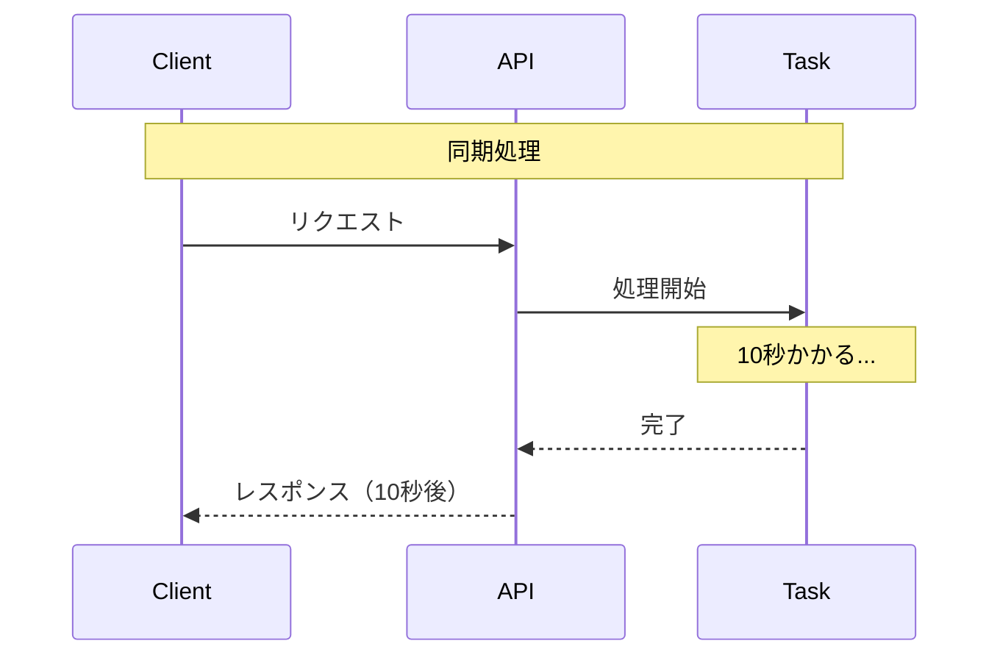
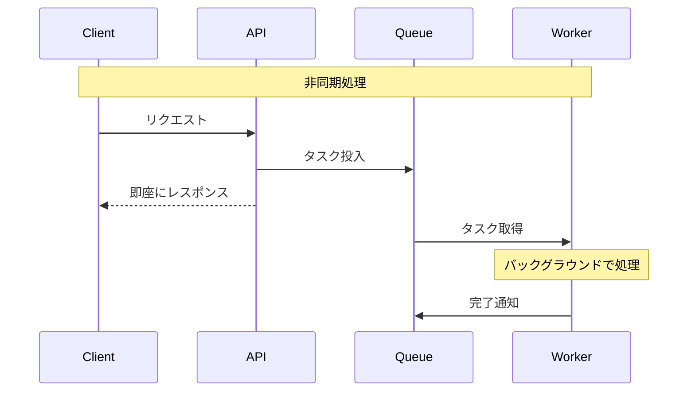
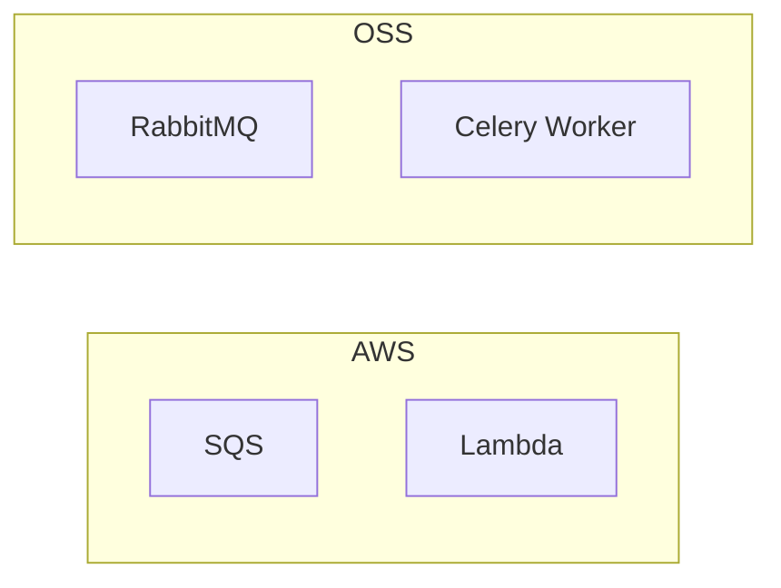
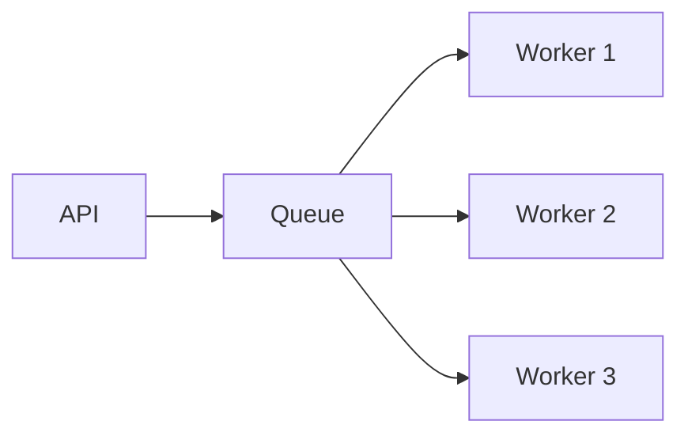

# Phase 1-1: 非同期処理とは

## 学習目標

この単元を終えると、以下ができるようになります：

- 同期処理と非同期処理の違いを説明できる
- 非同期処理のユースケースを挙げられる
- キューの基本概念を理解できる

## 概念解説

### 同期処理 vs 非同期処理





### 比較

| 観点 | 同期処理 | 非同期処理 |
|------|---------|----------|
| レスポンス | 処理完了後 | 即座 |
| ユーザー体験 | 待たされる | スムーズ |
| スケーラビリティ | 限定的 | 高い |
| 複雑さ | シンプル | 複雑 |

### 非同期処理のユースケース

| ユースケース | 説明 |
|-------------|------|
| メール送信 | ユーザーを待たせない |
| 画像/動画処理 | 重い処理をバックグラウンドで |
| レポート生成 | 大量データの処理 |
| 外部API連携 | 遅い外部サービスとの連携 |
| 通知送信 | プッシュ通知、Slack通知 |
| データ同期 | バッチ処理 |

## AWS との比較



| 機能 | AWS | OSS |
|------|-----|-----|
| メッセージキュー | SQS | RabbitMQ, Redis |
| ワーカー | Lambda | Celery |
| イベント駆動 | EventBridge | Celery Beat |

あなたが使っている **AWS Lambda + SQS** の構成と概念は同じです。

## Python での非同期処理

### 方法1: スレッド

```python
import threading
import time

def heavy_task():
    time.sleep(5)
    print("Task completed!")

# メインスレッドをブロックしない
thread = threading.Thread(target=heavy_task)
thread.start()
print("Task started in background")
```

### 方法2: asyncio

```python
import asyncio

async def heavy_task():
    await asyncio.sleep(5)
    print("Task completed!")

async def main():
    task = asyncio.create_task(heavy_task())
    print("Task started")
    await task

asyncio.run(main())
```

### 方法3: メッセージキュー（推奨）

```python
# Producer
from celery import Celery

app = Celery('tasks', broker='redis://localhost:6379')

@app.task
def heavy_task():
    time.sleep(5)
    return "completed"

# 呼び出し側
result = heavy_task.delay()  # 即座に返る
```

## なぜメッセージキューを使うか

| メリット | 説明 |
|---------|------|
| 疎結合 | Producer と Consumer が独立 |
| スケーラビリティ | Worker を増やして並列処理 |
| 信頼性 | メッセージが失われない |
| バッファリング | 負荷のピークを平準化 |
| リトライ | 失敗時の自動再試行 |



## 理解度確認

### 問題

非同期処理が適切なユースケースはどれか。

**A.** ユーザーログイン

**B.** 商品一覧の表示

**C.** 大量メール送信

**D.** フォームのバリデーション

---

### 解答・解説

**正解: C**

大量メール送信は：
- 時間がかかる
- ユーザーを待たせる必要がない
- バックグラウンドで処理可能

A/B/D は即座にレスポンスが必要なため、同期処理が適切です。

---

## 次のステップ

非同期処理の概念を学びました。次はメッセージキューの詳細を学びましょう。

**次の単元**: [Phase 1-2: メッセージキュー基礎](./02_メッセージキュー基礎.md)
