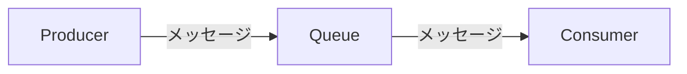
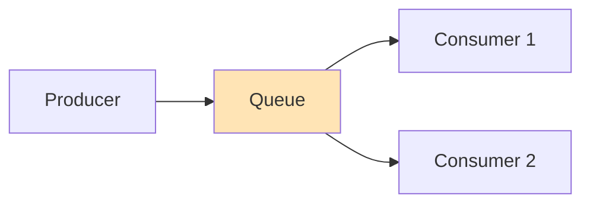
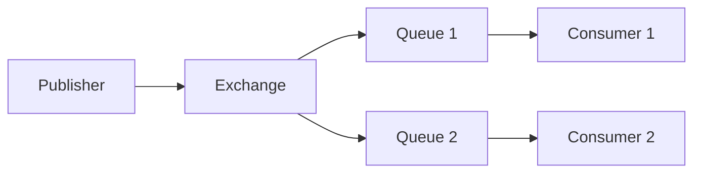
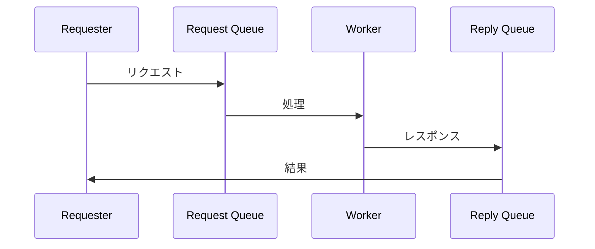
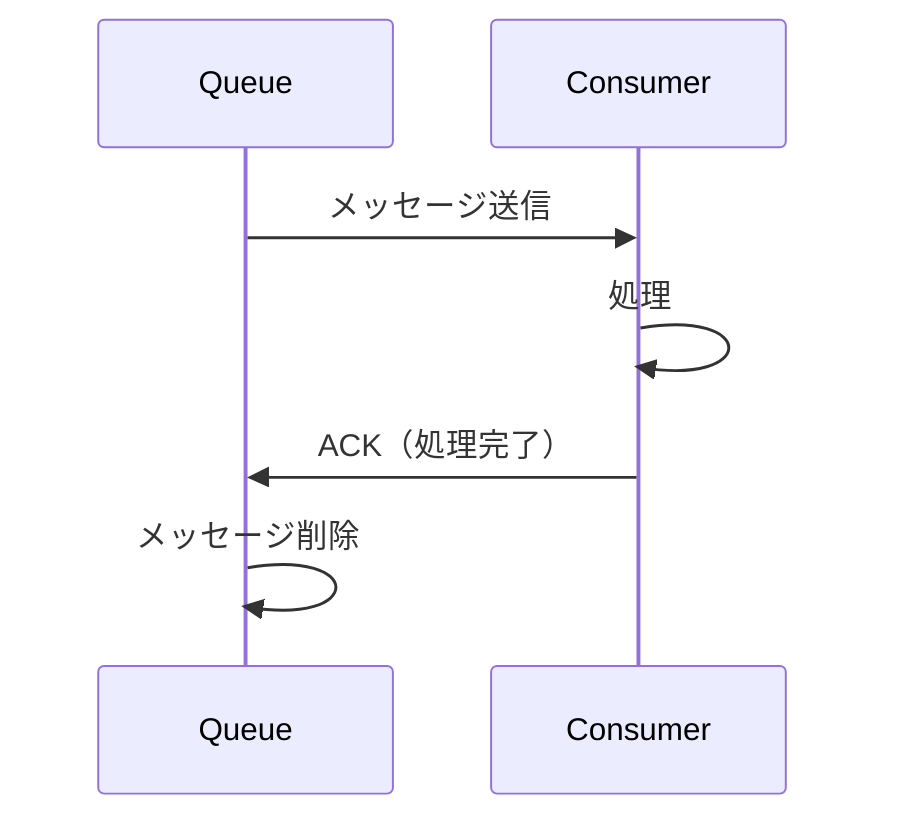
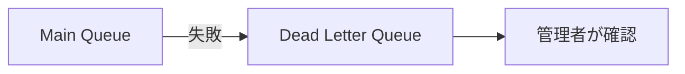

# Phase 1-2: メッセージキュー基礎

## 学習目標

この単元を終えると、以下ができるようになります：

- メッセージキューの仕組みを説明できる
- 主要なメッセージングパターンを理解できる
- 適切なキューシステムを選択できる

## 概念解説

### メッセージキューとは



**メッセージキュー** = Producer と Consumer の間に入るバッファ

### 構成要素

| 要素 | 説明 |
|------|------|
| Producer | メッセージを送信する側 |
| Consumer | メッセージを受信する側 |
| Queue | メッセージを保持するバッファ |
| Broker | キューを管理するサービス |
| Message | やり取りするデータ |

## メッセージングパターン

### 1. Point-to-Point



- 1つのメッセージは1つの Consumer のみが処理
- タスク分散に使用

### 2. Publish/Subscribe



- 1つのメッセージを複数の Consumer が受信
- 通知、イベント配信に使用

### 3. Request/Reply



- 非同期 RPC パターン
- 結果を受け取りたい場合

## 主要なメッセージキューシステム

| システム | 特徴 | ユースケース |
|---------|------|-------------|
| RabbitMQ | 高機能、AMQP | 汎用 |
| Redis | シンプル、高速 | キャッシュ兼用 |
| Kafka | 大規模ストリーム | ログ収集、分析 |
| AWS SQS | フルマネージド | AWSインフラ |

### 選択基準

| 要件 | 推奨 |
|------|------|
| シンプルなタスクキュー | Redis |
| 複雑なルーティング | RabbitMQ |
| 大規模ストリーム処理 | Kafka |
| AWSで完結 | SQS |

## 信頼性の仕組み

### メッセージの永続化

```python
# RabbitMQ での永続化
channel.queue_declare(queue='task_queue', durable=True)

channel.basic_publish(
    exchange='',
    routing_key='task_queue',
    body=message,
    properties=pika.BasicProperties(
        delivery_mode=2,  # メッセージを永続化
    )
)
```

### Acknowledgement



| 方式 | 説明 |
|------|------|
| Auto ACK | 受信時に自動で ACK |
| Manual ACK | 処理完了後に明示的に ACK |
| NACK | 処理失敗を通知 |

### Dead Letter Queue（DLQ）



処理に失敗したメッセージを退避する場所

## AWS SQS との対応

| 概念 | RabbitMQ | AWS SQS |
|------|----------|---------|
| キュー | Queue | Queue |
| メッセージ確認 | ACK | DeleteMessage |
| 失敗時 | NACK/Reject | Visibility Timeout |
| DLQ | Dead Letter Exchange | Dead-letter queue |
| Pub/Sub | Exchange | SNS + SQS |

## 理解度確認

### 問題

1つのメッセージを複数の Consumer に配信するパターンはどれか。

**A.** Point-to-Point

**B.** Publish/Subscribe

**C.** Request/Reply

**D.** Round Robin

---

### 解答・解説

**正解: B**

- **Point-to-Point**: 1メッセージ→1Consumer
- **Publish/Subscribe**: 1メッセージ→複数Consumer
- **Request/Reply**: 双方向通信

---

## 次のステップ

メッセージキュー基礎を学びました。次は RabbitMQ を学びましょう。

**次の単元**: [Phase 2-1: RabbitMQ 入門](../phase2/01_RabbitMQ入門.md)
