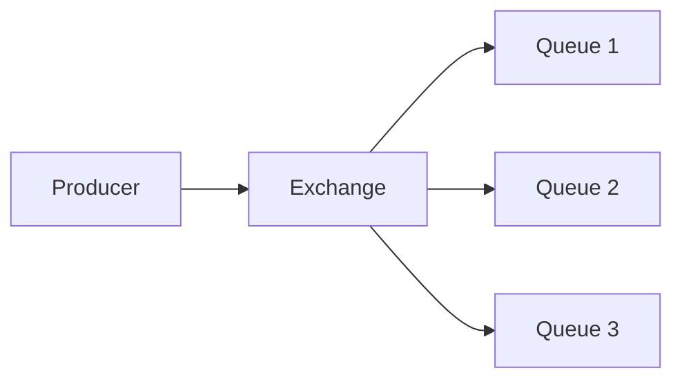

# Phase 2-2: RabbitMQ 実践

## 学習目標

この単元を終えると、以下ができるようになります：

- Exchange の種類を使い分けられる
- ルーティングを設定できる
- Pub/Sub パターンを実装できる

## Exchange の種類



| タイプ | ルーティング |
|--------|------------|
| direct | routing_key が完全一致 |
| topic | パターンマッチ |
| fanout | 全てのキューに配信 |
| headers | ヘッダーでマッチ |

## ハンズオン

### 演習1: Fanout Exchange（ブロードキャスト）

```python
# fanout_producer.py
import pika
import sys

connection = pika.BlockingConnection(
    pika.ConnectionParameters('localhost')
)
channel = connection.channel()

# Fanout Exchange を宣言
channel.exchange_declare(exchange='logs', exchange_type='fanout')

message = ' '.join(sys.argv[1:]) or "Hello all!"

channel.basic_publish(
    exchange='logs',
    routing_key='',  # fanout では無視される
    body=message
)

print(f" [x] Sent '{message}'")
connection.close()
```

```python
# fanout_consumer.py
import pika

connection = pika.BlockingConnection(
    pika.ConnectionParameters('localhost')
)
channel = connection.channel()

channel.exchange_declare(exchange='logs', exchange_type='fanout')

# 一時的なキューを作成
result = channel.queue_declare(queue='', exclusive=True)
queue_name = result.method.queue

# Exchange にバインド
channel.queue_bind(exchange='logs', queue=queue_name)

def callback(ch, method, properties, body):
    print(f" [x] {body.decode()}")

channel.basic_consume(
    queue=queue_name,
    on_message_callback=callback,
    auto_ack=True
)

print(' [*] Waiting for logs. To exit press CTRL+C')
channel.start_consuming()
```

### 演習2: Direct Exchange（ログレベル振り分け）

```python
# direct_producer.py
import pika
import sys

connection = pika.BlockingConnection(
    pika.ConnectionParameters('localhost')
)
channel = connection.channel()

channel.exchange_declare(exchange='direct_logs', exchange_type='direct')

severity = sys.argv[1] if len(sys.argv) > 1 else 'info'
message = ' '.join(sys.argv[2:]) or 'Hello World!'

channel.basic_publish(
    exchange='direct_logs',
    routing_key=severity,
    body=message
)

print(f" [x] Sent {severity}:{message}")
connection.close()
```

```python
# direct_consumer.py
import pika
import sys

connection = pika.BlockingConnection(
    pika.ConnectionParameters('localhost')
)
channel = connection.channel()

channel.exchange_declare(exchange='direct_logs', exchange_type='direct')

result = channel.queue_declare(queue='', exclusive=True)
queue_name = result.method.queue

# コマンドライン引数で受け取るログレベル
severities = sys.argv[1:]
if not severities:
    sys.stderr.write("Usage: python direct_consumer.py [info] [warning] [error]\n")
    sys.exit(1)

for severity in severities:
    channel.queue_bind(
        exchange='direct_logs',
        queue=queue_name,
        routing_key=severity
    )

def callback(ch, method, properties, body):
    print(f" [x] {method.routing_key}:{body.decode()}")

channel.basic_consume(
    queue=queue_name,
    on_message_callback=callback,
    auto_ack=True
)

print(f' [*] Waiting for logs: {severities}')
channel.start_consuming()
```

```bash
# ターミナル1: error のみ受信
python direct_consumer.py error

# ターミナル2: 全て受信
python direct_consumer.py info warning error

# ターミナル3: 送信
python direct_producer.py info "Info message"
python direct_producer.py warning "Warning message"
python direct_producer.py error "Error message"
```

### 演習3: Topic Exchange（パターンマッチ）

```python
# topic_producer.py
import pika
import sys

connection = pika.BlockingConnection(
    pika.ConnectionParameters('localhost')
)
channel = connection.channel()

channel.exchange_declare(exchange='topic_logs', exchange_type='topic')

# routing_key: <facility>.<severity>
# 例: app.error, db.warning, auth.info
routing_key = sys.argv[1] if len(sys.argv) > 2 else 'anonymous.info'
message = ' '.join(sys.argv[2:]) or 'Hello World!'

channel.basic_publish(
    exchange='topic_logs',
    routing_key=routing_key,
    body=message
)

print(f" [x] Sent {routing_key}:{message}")
connection.close()
```

```python
# topic_consumer.py
import pika
import sys

connection = pika.BlockingConnection(
    pika.ConnectionParameters('localhost')
)
channel = connection.channel()

channel.exchange_declare(exchange='topic_logs', exchange_type='topic')

result = channel.queue_declare(queue='', exclusive=True)
queue_name = result.method.queue

# パターン: * は1単語、# は0以上の単語
binding_keys = sys.argv[1:]
if not binding_keys:
    sys.stderr.write("Usage: python topic_consumer.py [binding_key]...\n")
    sys.stderr.write("Examples:\n")
    sys.stderr.write("  python topic_consumer.py '#'          # 全て\n")
    sys.stderr.write("  python topic_consumer.py 'auth.*'     # authの全て\n")
    sys.stderr.write("  python topic_consumer.py '*.error'    # 全エラー\n")
    sys.exit(1)

for binding_key in binding_keys:
    channel.queue_bind(
        exchange='topic_logs',
        queue=queue_name,
        routing_key=binding_key
    )

def callback(ch, method, properties, body):
    print(f" [x] {method.routing_key}:{body.decode()}")

channel.basic_consume(
    queue=queue_name,
    on_message_callback=callback,
    auto_ack=True
)

print(f' [*] Waiting for logs matching: {binding_keys}')
channel.start_consuming()
```

```bash
# ターミナル1: 全エラーを受信
python topic_consumer.py "*.error"

# ターミナル2: auth関連を全て受信
python topic_consumer.py "auth.*"

# ターミナル3: 送信
python topic_producer.py auth.info "User logged in"
python topic_producer.py auth.error "Login failed"
python topic_producer.py db.error "Connection failed"
```

### 演習4: RPC パターン

```python
# rpc_server.py
import pika

connection = pika.BlockingConnection(
    pika.ConnectionParameters('localhost')
)
channel = connection.channel()

channel.queue_declare(queue='rpc_queue')

def fib(n):
    if n == 0:
        return 0
    elif n == 1:
        return 1
    else:
        return fib(n - 1) + fib(n - 2)

def on_request(ch, method, props, body):
    n = int(body)
    print(f" [.] fib({n})")
    result = fib(n)
    
    # 結果を返信
    ch.basic_publish(
        exchange='',
        routing_key=props.reply_to,
        properties=pika.BasicProperties(
            correlation_id=props.correlation_id
        ),
        body=str(result)
    )
    ch.basic_ack(delivery_tag=method.delivery_tag)

channel.basic_qos(prefetch_count=1)
channel.basic_consume(queue='rpc_queue', on_message_callback=on_request)

print(" [x] Awaiting RPC requests")
channel.start_consuming()
```

```python
# rpc_client.py
import pika
import uuid

class FibonacciRpcClient:
    def __init__(self):
        self.connection = pika.BlockingConnection(
            pika.ConnectionParameters('localhost')
        )
        self.channel = self.connection.channel()
        
        # 応答用キュー
        result = self.channel.queue_declare(queue='', exclusive=True)
        self.callback_queue = result.method.queue
        
        self.channel.basic_consume(
            queue=self.callback_queue,
            on_message_callback=self.on_response,
            auto_ack=True
        )
        
        self.response = None
        self.corr_id = None
    
    def on_response(self, ch, method, props, body):
        if self.corr_id == props.correlation_id:
            self.response = body
    
    def call(self, n):
        self.response = None
        self.corr_id = str(uuid.uuid4())
        
        self.channel.basic_publish(
            exchange='',
            routing_key='rpc_queue',
            properties=pika.BasicProperties(
                reply_to=self.callback_queue,
                correlation_id=self.corr_id,
            ),
            body=str(n)
        )
        
        while self.response is None:
            self.connection.process_data_events()
        
        return int(self.response)

client = FibonacciRpcClient()
print(" [x] Requesting fib(30)")
response = client.call(30)
print(f" [.] Got {response}")
```

## 理解度確認

### 問題

RabbitMQ で `*.error` のようなパターンマッチングを使うには、どの Exchange タイプを使用するか。

**A.** direct

**B.** fanout

**C.** topic

**D.** headers

---

### 解答・解説

**正解: C**

topic Exchange のパターン：
- `*` - 1単語にマッチ
- `#` - 0以上の単語にマッチ

例：`app.*.error` は `app.user.error` にマッチ

---

## 次のステップ

RabbitMQ 実践を学びました。次は Celery を学びましょう。

**次の単元**: [Phase 3-1: Celery 入門](../phase3/01_Celery入門.md)
