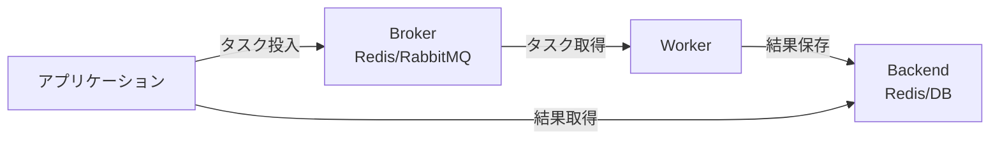

# Phase 3-1: Celery 入門

## 学習目標

この単元を終えると、以下ができるようになります：

- Celery の仕組みを説明できる
- 非同期タスクを定義・実行できる
- タスクの結果を取得できる

## 概念解説

### Celery とは



**Celery** = Python の分散タスクキュー

### AWS Lambda との比較

| 機能 | Celery | AWS Lambda |
|------|--------|------------|
| トリガー | キュー、スケジュール | SQS、イベント |
| スケーリング | Worker 増減 | 自動 |
| 実行時間 | 無制限 | 15分 |
| インフラ | 自己管理 | フルマネージド |

## 環境構築

```yaml
# docker-compose.yml
services:
  redis:
    image: redis:7
    ports:
      - "6379:6379"
```

```bash
docker-compose up -d
pip install celery[redis]
```

## ハンズオン

### 演習1: 最初のタスク

```python
# tasks.py
from celery import Celery

app = Celery(
    'tasks',
    broker='redis://localhost:6379/0',
    backend='redis://localhost:6379/0'
)

@app.task
def add(x, y):
    return x + y

@app.task
def multiply(x, y):
    return x * y
```

```bash
# Worker 起動
celery -A tasks worker --loglevel=info
```

```python
# client.py
from tasks import add, multiply

# 非同期実行
result = add.delay(4, 4)
print(f"Task ID: {result.id}")
print(f"Task state: {result.state}")

# 結果を待つ
value = result.get(timeout=10)
print(f"Result: {value}")
```

### 演習2: タスクオプション

```python
# tasks.py
from celery import Celery
import time

app = Celery(
    'tasks',
    broker='redis://localhost:6379/0',
    backend='redis://localhost:6379/0'
)

# リトライ設定
@app.task(
    bind=True,
    max_retries=3,
    default_retry_delay=5
)
def fetch_url(self, url):
    try:
        import requests
        response = requests.get(url, timeout=10)
        return response.status_code
    except Exception as exc:
        raise self.retry(exc=exc)

# タイムアウト設定
@app.task(time_limit=30, soft_time_limit=25)
def long_running_task():
    time.sleep(20)
    return "completed"

# キュー指定
@app.task(queue='high_priority')
def urgent_task():
    return "urgent done"

# レート制限
@app.task(rate_limit='10/m')  # 1分間に10回まで
def rate_limited_task():
    return "done"
```

### 演習3: タスクの状態管理

```python
# client.py
from tasks import add
from celery.result import AsyncResult

# タスク実行
result = add.delay(4, 4)

# 状態確認
print(f"State: {result.state}")  # PENDING, STARTED, SUCCESS, FAILURE

# 完了確認
print(f"Ready: {result.ready()}")

# 成功確認
print(f"Successful: {result.successful()}")

# 失敗時
print(f"Failed: {result.failed()}")

# タスクIDから結果を取得
task_id = result.id
later_result = AsyncResult(task_id)
print(f"Result: {later_result.get()}")
```

### 演習4: カスタムタスククラス

```python
# tasks.py
from celery import Celery, Task
import logging

app = Celery('tasks', broker='redis://localhost:6379/0')
logger = logging.getLogger(__name__)

class LoggingTask(Task):
    def on_success(self, retval, task_id, args, kwargs):
        logger.info(f"Task {task_id} succeeded: {retval}")
    
    def on_failure(self, exc, task_id, args, kwargs, einfo):
        logger.error(f"Task {task_id} failed: {exc}")
    
    def on_retry(self, exc, task_id, args, kwargs, einfo):
        logger.warning(f"Task {task_id} retrying: {exc}")

@app.task(base=LoggingTask, bind=True, max_retries=3)
def process_data(self, data):
    try:
        # 処理
        return f"Processed: {data}"
    except Exception as exc:
        raise self.retry(exc=exc, countdown=5)
```

### 演習5: 設定ファイル

```python
# celeryconfig.py
broker_url = 'redis://localhost:6379/0'
result_backend = 'redis://localhost:6379/0'

# タスク設定
task_serializer = 'json'
result_serializer = 'json'
accept_content = ['json']
timezone = 'Asia/Tokyo'

# リトライ設定
task_acks_late = True
task_reject_on_worker_lost = True

# 結果の有効期限
result_expires = 3600  # 1時間

# Worker 設定
worker_prefetch_multiplier = 1
worker_concurrency = 4

# キュー設定
task_queues = {
    'default': {'exchange': 'default', 'routing_key': 'default'},
    'high_priority': {'exchange': 'high', 'routing_key': 'high'},
    'low_priority': {'exchange': 'low', 'routing_key': 'low'},
}

task_default_queue = 'default'
```

```python
# tasks.py
from celery import Celery

app = Celery('tasks')
app.config_from_object('celeryconfig')

@app.task
def my_task():
    pass
```

### 演習6: FastAPI との統合

```python
# tasks.py
from celery import Celery

celery_app = Celery(
    'tasks',
    broker='redis://localhost:6379/0',
    backend='redis://localhost:6379/0'
)

@celery_app.task
def send_email(to: str, subject: str, body: str):
    import time
    time.sleep(5)  # メール送信をシミュレート
    return f"Email sent to {to}"
```

```python
# main.py
from fastapi import FastAPI, BackgroundTasks
from celery.result import AsyncResult
from tasks import send_email, celery_app

app = FastAPI()

@app.post("/send-email")
def send_email_endpoint(to: str, subject: str, body: str):
    # 非同期でタスク実行
    task = send_email.delay(to, subject, body)
    return {"task_id": task.id, "status": "queued"}

@app.get("/task/{task_id}")
def get_task_status(task_id: str):
    result = AsyncResult(task_id, app=celery_app)
    
    if result.ready():
        return {
            "task_id": task_id,
            "status": result.state,
            "result": result.get()
        }
    else:
        return {
            "task_id": task_id,
            "status": result.state
        }
```

## 理解度確認

### 問題

Celery タスクを非同期で実行するメソッドはどれか。

**A.** `task.run()`

**B.** `task.delay()`

**C.** `task.execute()`

**D.** `task.async()`

---

### 解答・解説

**正解: B**

```python
# 非同期実行
result = my_task.delay(arg1, arg2)

# または
result = my_task.apply_async(args=[arg1, arg2])
```

`delay()` は `apply_async()` のショートカットです。

---

## 次のステップ

Celery 入門を学びました。次はタスクチェーンとエラー処理を学びましょう。

**次の単元**: [Phase 3-2: Celery 実践](./02_Celery実践.md)
