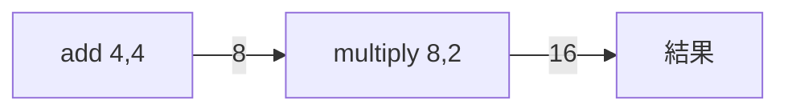
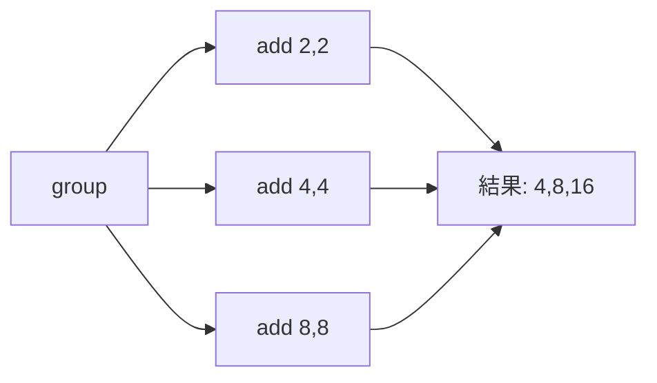

# Phase 3-2: Celery 実践

## 学習目標

この単元を終えると、以下ができるようになります：

- タスクチェーン・グループを使える
- 定期実行（Beat）を設定できる
- エラーハンドリングを実装できる

## タスクの組み合わせ

### chain（連続実行）

```python
from celery import chain
from tasks import add, multiply

# 4 + 4 = 8, 8 * 2 = 16
result = chain(add.s(4, 4), multiply.s(2))()
print(result.get())  # 16

# または
workflow = add.s(4, 4) | multiply.s(2)
result = workflow()
```



### group（並列実行）

```python
from celery import group

# 並列でタスク実行
job = group([
    add.s(2, 2),
    add.s(4, 4),
    add.s(8, 8),
])
result = job()
print(result.get())  # [4, 8, 16]
```



### chord（並列実行後にコールバック）

```python
from celery import chord

@app.task
def sum_results(values):
    return sum(values)

# 並列実行後、結果を集約
result = chord([
    add.s(2, 2),
    add.s(4, 4),
    add.s(8, 8),
])(sum_results.s())

print(result.get())  # 28 (4 + 8 + 16)
```

## ハンズオン

### 演習1: 実践的なワークフロー

```python
# tasks.py
from celery import Celery, chain, group, chord

app = Celery('tasks', broker='redis://localhost:6379/0', backend='redis://localhost:6379/0')

@app.task
def download_image(url):
    import time
    time.sleep(1)
    return f"downloaded_{url}"

@app.task
def resize_image(image_path, size):
    import time
    time.sleep(1)
    return f"resized_{image_path}_{size}"

@app.task
def upload_image(image_path, destination):
    import time
    time.sleep(1)
    return f"uploaded_{image_path}_to_{destination}"

@app.task
def notify_completion(results):
    return f"All done: {results}"
```

```python
# workflow.py
from tasks import download_image, resize_image, upload_image, notify_completion
from celery import chain, group, chord

# 単一画像の処理パイプライン
single_image_workflow = chain(
    download_image.s("https://example.com/image.jpg"),
    resize_image.s("800x600"),
    upload_image.s("s3://bucket/images/")
)

# 複数画像を並列処理後に通知
urls = [
    "https://example.com/image1.jpg",
    "https://example.com/image2.jpg",
    "https://example.com/image3.jpg",
]

multi_image_workflow = chord(
    [
        chain(
            download_image.s(url),
            resize_image.s("800x600"),
            upload_image.s("s3://bucket/images/")
        )
        for url in urls
    ],
    notify_completion.s()
)

result = multi_image_workflow()
print(result.get())
```

### 演習2: 定期実行（Celery Beat）

```python
# celeryconfig.py
from celery.schedules import crontab

beat_schedule = {
    # 毎分実行
    'every-minute': {
        'task': 'tasks.periodic_task',
        'schedule': 60.0,  # 秒
    },
    
    # 毎時0分に実行
    'hourly': {
        'task': 'tasks.hourly_task',
        'schedule': crontab(minute=0),
    },
    
    # 毎日午前9時に実行
    'daily-morning': {
        'task': 'tasks.daily_report',
        'schedule': crontab(hour=9, minute=0),
    },
    
    # 平日の午前9時に実行
    'weekday-morning': {
        'task': 'tasks.weekday_task',
        'schedule': crontab(hour=9, minute=0, day_of_week='1-5'),
    },
    
    # 毎月1日の午前0時に実行
    'monthly': {
        'task': 'tasks.monthly_cleanup',
        'schedule': crontab(hour=0, minute=0, day_of_month=1),
    },
    
    # 引数付き
    'with-args': {
        'task': 'tasks.parameterized_task',
        'schedule': 30.0,
        'args': ('arg1', 'arg2'),
        'kwargs': {'key': 'value'},
    },
}

timezone = 'Asia/Tokyo'
```

```python
# tasks.py
@app.task
def periodic_task():
    print("Running every minute!")

@app.task
def daily_report():
    # レポート生成
    pass

@app.task
def monthly_cleanup():
    # 古いデータ削除
    pass
```

```bash
# Worker 起動
celery -A tasks worker --loglevel=info

# Beat 起動（別ターミナル）
celery -A tasks beat --loglevel=info
```

### 演習3: エラーハンドリング

```python
# tasks.py
from celery import Celery
from celery.exceptions import MaxRetriesExceededError
import logging

app = Celery('tasks', broker='redis://localhost:6379/0')
logger = logging.getLogger(__name__)

class TaskError(Exception):
    pass

@app.task(
    bind=True,
    max_retries=3,
    autoretry_for=(TaskError,),
    retry_backoff=True,  # Exponential backoff
    retry_backoff_max=600,  # 最大10分
    retry_jitter=True,  # ランダム遅延
)
def resilient_task(self, data):
    try:
        # 処理
        if some_condition:
            raise TaskError("Something went wrong")
        return "success"
    
    except MaxRetriesExceededError:
        logger.error(f"Task {self.request.id} failed after max retries")
        # フォールバック処理
        send_alert_to_admin()
        raise

@app.task(bind=True)
def manual_retry_task(self, data):
    try:
        result = process_data(data)
        return result
    except TransientError as exc:
        # 一時的なエラー → リトライ
        raise self.retry(
            exc=exc,
            countdown=60,  # 60秒後にリトライ
            max_retries=5
        )
    except PermanentError as exc:
        # 永続的なエラー → 失敗として記録
        logger.error(f"Permanent error: {exc}")
        raise
```

### 演習4: Dead Letter Queue

```python
# tasks.py
from celery import Celery
from celery.signals import task_failure

app = Celery('tasks', broker='redis://localhost:6379/0')

@task_failure.connect
def handle_task_failure(sender=None, task_id=None, exception=None, 
                         args=None, kwargs=None, traceback=None, **kw):
    """タスク失敗時のハンドラー"""
    from datetime import datetime
    
    # 失敗情報を記録
    failed_task = {
        'task_id': task_id,
        'task_name': sender.name,
        'args': args,
        'kwargs': kwargs,
        'exception': str(exception),
        'failed_at': datetime.now().isoformat(),
    }
    
    # Redis にDLQとして保存
    import redis
    r = redis.Redis()
    r.lpush('dead_letter_queue', json.dumps(failed_task))
    
    # アラート送信
    send_slack_alert(f"Task failed: {sender.name}")
```

### 演習5: モニタリング

```python
# tasks.py
from celery import Celery
from celery.signals import task_prerun, task_postrun

app = Celery('tasks', broker='redis://localhost:6379/0')

task_start_times = {}

@task_prerun.connect
def task_prerun_handler(task_id, task, *args, **kwargs):
    import time
    task_start_times[task_id] = time.time()

@task_postrun.connect
def task_postrun_handler(task_id, task, *args, retval=None, state=None, **kwargs):
    import time
    start_time = task_start_times.pop(task_id, None)
    
    if start_time:
        duration = time.time() - start_time
        print(f"Task {task.name} completed in {duration:.2f}s")
        
        # メトリクスを送信
        # statsd.timing(f'celery.task.{task.name}.duration', duration)
```

```bash
# Flower（Web モニタリング）
pip install flower
celery -A tasks flower --port=5555

# http://localhost:5555
```

## 本番運用のベストプラクティス

| 項目 | 推奨 |
|------|------|
| Broker | RabbitMQ（信頼性）、Redis（シンプル） |
| Backend | Redis（高速）、PostgreSQL（永続性） |
| リトライ | Exponential backoff + jitter |
| タイムアウト | 必ず設定 |
| モニタリング | Flower + アラート |

## 理解度確認

### 問題

Celery で複数のタスクを並列実行し、全ての結果を集約するプリミティブはどれか。

**A.** chain

**B.** group

**C.** chord

**D.** map

---

### 解答・解説

**正解: C**

- **chain**: 連続実行
- **group**: 並列実行（結果をリストで返す）
- **chord**: 並列実行 + コールバック（結果を集約）

```python
chord([task1.s(), task2.s()])(aggregate.s())
```

---

## 次のステップ

Celery 実践を学びました。次は総仕上げです。

**次の単元**: [Phase 4-1: 総仕上げ](../phase4/01_総仕上げ.md)
